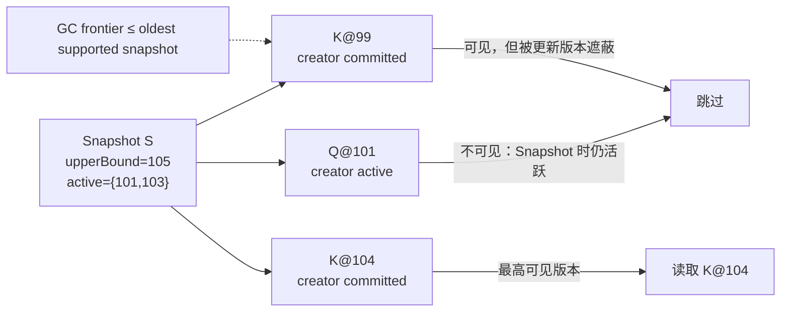

“读不阻塞写、写不阻塞读”是对 MVCC 最常见的介绍，却不是一份足以实现数据库的规格。只要继续追问几步，真正的问题就会浮现：一个版本由什么身份标识？Snapshot 记录的是墙钟时间、提交序号，还是仍在运行的事务集合？更新后的旧版本什么时候可以删除？崩溃后，谁来证明某个版本的创建事务确实提交过？

本文的中心论点是：**MVCC 不是“多留几份数据”，而是一份由版本身份、事务裁决、Snapshot 可见性和回收前沿共同组成的并发协议；它只有与隔离级别、WAL 恢复和历史保留分别对齐，才形成完整的数据库契约。**

上一篇 [B+Tree](/signal-grid-blog/posts/b-plus-tree-page-splits-latches-copy-on-write-range-scans/) 刻意只证明键空间可达，不替事务决定同一逻辑键的哪个版本可见；本篇从这里接过 Snapshot 与回收问题，并继续沿用[存储引擎全景](/signal-grid-blog/posts/storage-engine-pages-buffer-pool-wal-manifest-recovery-boundaries/)对数据页、WAL 和恢复边界的划分。通用模型不绑定某个产品；PostgreSQL 18 只作为一个可核查的具体实现。它的 Heap Tuple、`xmin/xmax`、HOT、Visibility Map 和 Vacuum 不能被当成所有 MVCC 引擎的统一内部布局。基于 Undo Log、Append-only Segment 或全局提交时间戳的引擎会采用不同版本链和回收前沿，但仍须回答同一组正确性问题。

## 1. MVCC、隔离级别与持久性是三份不同契约

先拆开三个经常被混为一谈的概念：

| 契约           | 回答的问题                                     | 典型机制                                                   | 单独不能证明什么                              |
| -------------- | ---------------------------------------------- | ---------------------------------------------------------- | --------------------------------------------- |
| MVCC 并发控制  | 一次读取应该选择哪个物理版本，写写冲突如何裁决 | 版本元数据、Snapshot、可见性谓词、行锁或冲突检测           | 不自动排除 write skew，也不保证崩溃后版本仍在 |
| 事务隔离       | 一组并发事务允许形成什么可观察历史             | Read Committed、Snapshot Isolation、SSI、2PL、可串行化验证 | 不等于日志已经落到稳定介质                    |
| 原子性与持久性 | 崩溃后哪些事务必须存在，半完成事务如何处理     | WAL、commit record、checkpoint、redo/undo 或提交状态重建   | 不定义活跃事务在运行时看哪个版本              |

PostgreSQL 的 [MVCC 引言](https://www.postgresql.org/docs/18/mvcc-intro.html)说明，每条语句看到的是某个数据库版本的 Snapshot；但它的[事务隔离文档](https://www.postgresql.org/docs/18/transaction-iso.html)同时明确：Repeatable Read 使用 Snapshot Isolation，仍可能出现 serialization anomaly，而 Serializable 还需要 SSI 检测危险的读写依赖并中止某个事务。由此可见，**能够稳定地读一个 Snapshot，不等于该 Snapshot 所在的并发历史可串行化。**

持久性又是另一维。一个引擎可以在内存里正确执行 MVCC，却在未同步 WAL 时掉电丢失已确认事务；也可以把每次提交可靠写盘，却只提供 Read Committed。评审设计时应分别写出：

```text
VisibilityContract(snapshot, version) -> visible | invisible | conflict
IsolationContract(history)            -> allowed | abort
DurabilityContract(ack, failure)       -> must_survive | may_lose
```

只有三个判定都有明确输入、权威顺序和失败语义，调用方才知道“我读到了什么”“这段并发结果是否合法”以及“成功返回后能否抗崩溃”。

## 2. Snapshot 必须引用版本顺序，不能引用模糊的“过去”

MVCC 的第一份权威状态不是行值，而是**版本身份与事务裁决**。一个教学化模型可以把物理版本写成：

```text
Version {
  logicalKey
  versionId
  creatorTxn
  retireTxn?       // 更新或删除旧版本的事务
  payload | tombstone
  previousVersion?
}

TxnStatus[txnId] = IN_PROGRESS | COMMITTED(commitOrder) | ABORTED
```

`versionId` 必须在一个明确的历史域里唯一；`commitOrder` 必须来自数据库的权威顺序，而不是应用服务器墙钟。墙钟会回拨、不同节点会偏斜，事务开始时间也不等于提交顺序。若引擎使用有限宽度事务 ID，还必须给比较定义 epoch、冻结或等价的防环绕规则。

不同引擎存放“前一版本”的方式并不相同：

- Append-only 引擎可以把同一逻辑键的多个版本直接编码为 `(userKey, descendingSequence)`；
- Undo-based 引擎可以让当前记录通过 Undo 链重建旧图像；
- PostgreSQL Heap Update 通常创建新 Tuple，并让旧 Tuple 的元数据记录更新/删除者；HOT 在满足条件时可把同页版本串联起来，避免为未变化的索引键创建普通的新索引项。

因此，“版本链”是一种逻辑关系，不应被误解为所有产品里都有同样的 `prev` 指针。外部系统也不应把物理页号、Tuple ID 或会冻结/环绕的事务 ID 当作永久业务版本号。

### Snapshot 是一个切面，不只是一个数字

若版本顺序是在提交时分配、并且 `sequence <= 800` 精确等价于“已经进入该读视图”，Snapshot 可以简化成 `visibleThrough = 800`。但 PostgreSQL 一类实现使用的是较早分配的事务身份：事务 98 尚未完成时，99 已经提交，事务号集合便存在空洞。只记“最大已见事务号 99”会错误地让 98 的未提交版本可见。**事务 ID 分配顺序与 Commit Order 是两个域**；采用标量还是 `upperBound + active set`，取决于版本可见性到底绑定哪一个域。

一个通用 Snapshot 至少要能区分：

```text
Snapshot {
  historyGeneration
  txnIdUpperBound
  inProgressTxnIds
  ownTxn
  ownCommandOrder
}
```

`historyGeneration` 防止把故障转移或 PITR 后分叉历史中的编号误当成原历史；`txnIdUpperBound + inProgressTxnIds` 表达取 Snapshot 时的已分配前沿和空洞；`ownCommandOrder` 决定事务是否看得到自己的先前写入。若引擎使用提交时分配的 Timestamp/Sequence，它可以采用不同且更紧凑的 Snapshot 表示，不能机械复制这组字段。

PostgreSQL 的 `pg_snapshot` 是这一模型的一个实例：`xmin` 是 Snapshot 时仍活跃的最低事务 ID，`xmax` 是最高已完成事务 ID 的后一位，因此所有 `XID >= xmax` 当时都尚未完成、不可见；`xip_list` 列出 `[xmin, xmax)` 内仍在执行的顶层事务。这里的 `xmin` 不是“所有更早版本都能立刻删除”的通用 GC 水位，也不是提交时间戳；实际可见性还要查询创建/删除事务的提交状态，并处理子事务、MultiXact、冻结 Tuple 和当前命令等实现细节。[Snapshot 信息函数](https://www.postgresql.org/docs/18/functions-info.html#FUNCTIONS-PG-SNAPSHOT)公开了这三个字段的含义，[`heapam_visibility.c`](https://github.com/postgres/postgres/blob/master/src/backend/access/heap/heapam_visibility.c)则展示了不同用途的可见性函数并不共用一个粗糙布尔判断。



图中的编号只是教学事务身份。`K@99` 与 `K@104` 属于同一逻辑键的更新链；`Q@101` 是另一个键，用来暴露“较小事务仍活跃、较大事务已经提交”的空洞，而不是暗示同一行可以绕过写写冲突形成两个任意后继。真实可见性不能只比较大小：还要同时判断创建事务是否提交、删除事务在该 Snapshot 中是否生效，以及更年轻版本是否真的替代同一逻辑键。

## 3. Insert、Update、Delete 先改变版本，再由提交裁决发布

正常路径可以用同一组状态转移解释：

1. `INSERT(K,V1)` 创建一个由事务 `T10` 拥有的新版本；其他事务在 `T10` 提交前不能把它当成已提交事实。
2. `UPDATE(K,V2)` 不是在所有读者眼前原地覆盖 `V1`，而是创建 `V2`，并记录 `V1` 被 `T11` 退休。旧 Snapshot 仍可能读取 `V1`。
3. `DELETE(K)` 不是立即擦除全部字节，而是发布一个“从某个版本顺序起不存在”的负面事实，或在旧版本上记录删除事务。
4. `COMMIT(T11)` 把该事务产生的一组版本变化从候选状态转为可见状态；`ABORT(T11)` 使其永远不应对其他事务可见。

一份简化的可见性谓词是：

```text
visible(version, snapshot) =
    creatorVisible(version.creatorTxn, snapshot)
    && !retireVisible(version.retireTxn, snapshot)
```

其中 `creatorVisible` 不是“事务号更小”这么简单，而是“已提交，并且提交/事务身份位于 Snapshot 允许的切面，或属于当前事务已经完成的命令”；`retireVisible` 也要区分未提交、已中止、在 Snapshot 之后提交和当前事务自己的删除。实现可以缓存 commit hint，但缓存必须能从权威事务状态重建，不能反过来成为唯一提交事实。

### MVCC 减少读写冲突，不会消灭写写冲突

两个事务同时更新同一逻辑行时，引擎仍须选出唯一合法后继。常见做法是行锁、Intent、CAS、First-committer-wins 或提交时验证。如果 `T20` 和 `T21` 都基于 `K@7` 构造后继，不能让两个版本都悄悄成为“当前值”。

对不同逻辑行的约束，问题更隐蔽。设两名医生至少一人必须值班：`T1` 与 `T2` 从同一 Snapshot 分别看到两人都值班，然后各自把自己改为休息。两者没有写同一行，Snapshot Isolation 可以允许二者提交，最终却无人值班。这是 write skew。版本选择完全正确，业务不变量仍被破坏；Serializable、显式锁或带冲突域的应用协议才负责阻止它。

### Snapshot 取得时机决定隔离体验

PostgreSQL 18 的 Read Committed 通常为每条命令取得新 Snapshot；Repeatable Read 和 Serializable 在首条合适语句处固定事务 Snapshot。[`SET TRANSACTION`](https://www.postgresql.org/docs/18/sql-set-transaction.html)还允许 Repeatable Read/Serializable 事务导入一个导出的 Snapshot。这些是产品契约，不是“MVCC 天然只能这样”。

同一个存储版本机制可以服务不同隔离级别。实现必须把 Snapshot 生命周期放在事务层明确管理，不能由 Buffer Pool 某次读页时临时猜测。

## 4. Vacuum 的安全条件是“再无合法观察者”，不是“版本足够旧”

更新和删除留下旧版本，是为了兑现仍存活的 Snapshot。Vacuum/GC 的任务不是“删除被标记的行”，而是证明某个版本对所有受支持的观察路径都已无意义。

对版本 `v`，一个保守的回收谓词可以写成：

```text
SafeToReclaim(v) =
    RetiredByDurableDecision(v)
    && NoSupportedSnapshotCanSee(v)
    && NoIteratorOrReplicaPinsRequiredBytes(v)
    && IndexAndVersionReferencesCanBeRemoved(v)
    && RecoveryNoLongerNeedsPreRetirementState(v)
```

每一项都在阻止一种数据复活或旧读失败：

- **退休决定已持久**：若删除/更新只在内存里，先清旧值后崩溃会丢失唯一可恢复值；
- **没有 Snapshot 可见**：最老活跃读者仍可能把新版本视为“未来”；
- **没有物理 Pin**：长迭代器、备份或文件级 Snapshot 可能仍在读取包含旧版本的页/文件；
- **索引协同清理**：索引项若仍指向被重用的槽位，可能读到无关记录；
- **恢复链已覆盖**：checkpoint、WAL、Undo 或基线必须足以在崩溃后恢复到受承诺的状态。

PostgreSQL 的普通 `VACUUM` 会回收不再对任何事务可见的 Dead Tuple，并维护索引与 Visibility Map；它通常把空间留在关系文件内部复用，而不是立即把文件缩回操作系统。[`VACUUM` 命令文档](https://www.postgresql.org/docs/18/sql-vacuum.html)明确指出，更新或删除淘汰的 Tuple 在 Vacuum 前仍物理存在。

### “最老 Snapshot”只是回收前沿的一部分

设当前所有合法观察者的需求前沿为：

```text
reclaimBefore = min(
  oldestLocalSnapshot,
  oldestExportedSnapshot,
  standbyFeedbackHorizon,
  logicalSlotDataHorizon,
  backupOrTimeTravelHorizon
)
```

这只是表达依赖关系的伪公式：不同项可能处于 XID、LSN、Sequence 或对象 Generation 等不同坐标系，不能未经映射直接取数值最小值。正确实现应保留每个域的 Frontier，并由 Manifest/Checkpoint 记录它们之间可验证的对应关系。

PostgreSQL 还需要处理 32 位 XID 环绕。足够老、对所有未来事务都可见的 Tuple 会被 Freeze，使后续可见性不再依赖会环绕的普通 XID。[Routine Vacuuming](https://www.postgresql.org/docs/18/routine-vacuuming.html)说明，防环绕 Vacuum 是安全机制，不是可有可无的空间优化；系统接近危险线时会拒绝分配新 XID，而不是继续运行并让“过去”被误判为“未来”。

## 5. 长事务、旧 Snapshot 与复制槽把逻辑时间变成物理债务

长事务本身未必持续读写大量数据，却可能长期固定一个很老的可见性切面。此后发生的每次更新都会制造它仍可能需要的旧版本。结果不是抽象的“GC 慢一点”，而是一条放大链：

```text
旧 Snapshot
  -> Dead Tuple 不能回收
  -> Heap / Undo / Version Segment 膨胀
  -> 索引与缓存容纳更多过期入口
  -> 扫描和 Vacuum 读取更多页
  -> I/O 与尾延迟上升
  -> 后台清理更追不上前台更新
```

会固定前沿的主体不只是一条正在执行查询的事务：

| Pin 来源                       | 它要求保留什么                        | 失控后的主要代价                    |
| ------------------------------ | ------------------------------------- | ----------------------------------- |
| 长事务或 `idle in transaction` | 事务 Snapshot 可能看到的旧 Tuple/Undo | 表与索引膨胀，Freeze 前沿停滞       |
| 导出的 Snapshot                | 导入者需要相同数据库切面              | 导出事务结束前无法释放对应历史      |
| Prepared Transaction           | 未裁决事务身份与所持资源              | XID 年龄、锁和清理受阻              |
| Hot Standby Feedback           | Standby 查询仍可能看到的行版本        | Primary 清理推迟并膨胀              |
| Logical Replication Slot       | 解码仍需的行/系统目录版本与 WAL       | Heap/Catalog 与 `pg_wal` 可分别增长 |
| 产品级 Time Travel             | 对外承诺的历史窗口                    | 存储、索引和 Compaction 受窗口约束  |

“连接处于长事务或 `idle in transaction`”也不是跨产品的充分判据。它是否真的阻塞 Tuple 回收，取决于该会话是否已经取得并仍持有 Snapshot、分配了事务 ID、持有锁或注册了其他 Horizon；运维上应观测实际 backend/slot frontier，而不是仅凭连接状态猜测 Vacuum 一定被谁阻塞。

PostgreSQL 的 [`pg_replication_slots`](https://www.postgresql.org/docs/18/view-pg-replication-slots.html)恰好展示了两个不能混淆的前沿：`xmin/catalog_xmin` 约束 Vacuum 能否删除 Tuple 或 Catalog Tuple，`restart_lsn` 约束哪些 WAL 仍可能被消费者需要。推进其中一个不自动推进另一个。Hot Standby 则面临“取消旧查询”与“通过 feedback 推迟 Primary 清理”之间的选择；[Hot Standby 冲突说明](https://www.postgresql.org/docs/18/hot-standby.html#HOT-STANDBY-CONFLICT)明确提醒，避免 cleanup conflict 可能换来 Primary bloat。

因此，长读必须有显式产品语义，而不是无限期善意等待：

- 在线事务应有时长、Snapshot age 和版本债务预算；超限时取消查询是一种公开降级，不应伪装成成功；
- 分析任务可读取物理快照、只读副本或导出数据，把在线 GC 前沿与小时级扫描解耦；
- 复制槽要绑定 owner、心跳、最大保留量和重建路径；删除失联 Slot 可能要求从新基线重建消费者；
- 若产品允许 Snapshot 过期，旧 Token 必须返回明确的 `SNAPSHOT_EXPIRED`，不能悄悄切换到较新的视图。

这是一项容量与正确性共同参与的 Admission Control：系统在“继续保留所有旧版本直至磁盘耗尽”和“破坏一个仍被承诺的 Snapshot”之间，必须提前选择可解释的拒绝与重建策略。

## 6. 崩溃恢复先重建事务事实，再重新计算可见性

MVCC 页面里可能同时存在已提交、未提交和已中止事务留下的版本。崩溃恢复不一定要立刻把未提交版本从每个页中物理擦掉；但恢复完成后，它们必须对正常读者不可见，并且最终可被安全回收。

这要求恢复材料至少共同回答：

1. 哪些数据页或版本记录已经落盘，哪些要从 WAL/Undo 重做；
2. 每个影响可见性的事务最终是 Committed、Aborted，还是因崩溃被判为未提交；
3. Index、Heap/Version Store、事务状态与可见性摘要属于哪个一致恢复点；
4. 恢复后的新事务顺序从哪里继续，是否进入了新的 Timeline/Generation；
5. 哪些旧 Snapshot、导出 Token 或复制 Cursor 在新历史中仍然有效。

[PostgreSQL WAL 文档](https://www.postgresql.org/docs/18/wal-intro.html)说明，WAL 让未落盘的数据页变化能够通过 Redo 恢复；[Hot Standby 文档](https://www.postgresql.org/docs/18/hot-standby.html)进一步指出，在 Standby 重放某事务的 Commit Record 之后，其变化才会对新的 Snapshot 可见。物理变化先被重放，不代表事务已经越过可见性发布点。

这也解释了为何不能把 Snapshot Token 设计成裸事务号。PITR 停在旧 LSN 后再晋升会形成新的历史分支；编号相同或大小可比，不代表 Token 对应的事务集合仍存在。对外可恢复的 Token 应绑定：

```text
SnapshotToken = {
  clusterId,
  historyGeneration,
  schemaVersion,
  snapshotFrontier,
  issuedAt,
  retentionClass
}
```

其中 `issuedAt` 只服务过期策略与审计，不参与事务先后裁决。恢复时若 Generation 不匹配，应拒绝 Token 或走明确的重新物化流程。

### 恢复期间的 Vacuum 也必须被约束

若重放线程正在恢复旧页面，而清理线程依据新前沿重用同一槽位，两套历史会互相破坏。实际引擎会在恢复阶段限制清理、建立 Recovery Snapshot，或通过 WAL 中的 cleanup record 协调 Standby 查询。进入“可接受读请求”状态必须以一致恢复点已建立为条件，而不能仅以进程端口已监听为条件。

## 7. 参考模型要同时攻击可见性、回收与崩溃边界

只跑并发压测，很容易证明“没有崩”，却证明不了旧 Snapshot 是否读错了版本。一个小而慢的参考模型更有价值：它把所有事务和版本保存在内存中，用清晰规则解释每次读取，再与真实引擎在相同历史上的结果比较。

```text
State {
  txns: txnId -> status
  versions: key -> [Version]
  snapshots: snapshotId -> Snapshot
  durableWalPrefix
  installedCheckpoint
  reclaimedVersionIds
}

Event = Begin | Read | Insert | Update | Delete
      | Commit | Abort | TakeSnapshot | ReleaseSnapshot
      | Vacuum | Checkpoint | Crash | Recover
```

生成器不应只产生独立键。它要故意制造：同键并发更新、跨键 write skew、事务号空洞、删除后旧读、导出 Snapshot、长时间不释放的读者，以及 Vacuum 与 Crash 交错。

### 可见性与隔离的判据必须分开

以下不变量证明 MVCC 版本选择：

```text
NoDirtyRead:
  snapshot never returns a version created by another uncommitted txn

StableSnapshot:
  absent own writes, repeated reads under the same snapshot return
  the same logical version despite later commits

SingleVisibleVersion:
  for one key and snapshot, at most one non-tombstone version is current

NoResurrectionAfterGC:
  compaction/vacuum never makes a value visible after a visible delete
```

但它们不证明 Serializable。应另外把已提交事务抽成读写依赖图，检查是否存在无法序列化的环；对声称 Snapshot Isolation 的实现，则把医生值班一类 write-skew 历史保留为“允许出现的反例”，防止测试错误地把更强语义强加给产品。

### 回收证明必须覆盖每一个 Pin

固定一个旧 Snapshot `S1`，持续更新和删除同一组键，再反复触发 Vacuum。通过条件不是“Dead Tuple 数下降”，而是：

- `S1` 在释放前始终得到相同结果；
- 新 Snapshot 看见最新提交结果；
- 释放 `S1` 后，旧版本最终可以回收；
- Slot、Standby Feedback 或备份 Pin 存在时，相关前沿不能越过它；
- 强制解除 Pin 后，旧消费者得到显式失效/重建信号，而不是继续读残缺历史。

### Failpoint 要围绕发布顺序布置

在“版本写入前后、WAL Sync 前后、Commit Record 前后、Checkpoint 安装前后、Vacuum 标记与槽位重用之间”逐点崩溃。每次恢复后，把真实引擎状态与参考模型的某个合法 Durable Prefix 比较。验收条件是：

```text
RecoveredState == Apply(committed durable prefix)
UncommittedVersions are invisible
No live snapshot references reclaimed bytes
NextTxnOrVersionId does not collide with recovered history
```

若页面缺失、事务状态损坏或索引指向不可能的版本，应 Fail Closed 并进入修复流程；返回空结果不是一种合法容错。生产证据还应持续观测 oldest snapshot age、dead/live version ratio、Vacuum debt、Slot 的 `xmin/restart_lsn` 年龄、Standby cleanup conflict，以及 Freeze/环绕距离。指标只暴露风险，参考历史与故障注入才证明协议。

## 8. MVCC 的边界在回收前沿处闭合

MVCC 能保证的是：在给定事务裁决和 Snapshot 规则下，读者从多个物理版本中选择一个合法视图，并让旧读与新写在很多场景下并行。它不自动提供 Serializable，不负责把 Commit 写入稳定介质，也不能让旧版本在仍有合法观察者时凭空消失。

可信实现依靠四条闭环：版本身份不使用模糊墙钟；Snapshot 表达顺序空洞与历史代际；Vacuum 只越过所有读者和恢复路径都批准的前沿；崩溃恢复先重建事务事实，再开放可见性。长事务之所以危险，正是因为它在逻辑上持有一个 Snapshot，却在物理上累积整个系统的版本债务。

下一篇[LSM Tree：MemTable、SSTable、Compaction 与 Tombstone](/signal-grid-blog/posts/lsm-tree-memtable-sstable-compaction-tombstones/)会把同一问题换到不可变 Sorted Run 上：当版本分散在内存表和多层 SSTable 中，Compaction 如何在不破坏 Snapshot、Delete 与恢复边界的前提下重写物理布局。

### 一手论文与官方实现资料

- PostgreSQL 18：[MVCC Introduction](https://www.postgresql.org/docs/18/mvcc-intro.html)与[Transaction Isolation](https://www.postgresql.org/docs/18/transaction-iso.html)，Snapshot、Snapshot Isolation、SSI 与序列化失败边界。
- PostgreSQL 18：[Transaction ID and Snapshot Information Functions](https://www.postgresql.org/docs/18/functions-info.html#FUNCTIONS-PG-SNAPSHOT)与[Snapshot Synchronization Functions](https://www.postgresql.org/docs/18/functions-admin.html#FUNCTIONS-SNAPSHOT-SYNCHRONIZATION)，`xmin/xmax/xip_list` 及 Snapshot 导入导出契约。
- PostgreSQL 源码：[`heapam_visibility.c`](https://github.com/postgres/postgres/blob/master/src/backend/access/heap/heapam_visibility.c)，Heap Tuple 的 MVCC、Update 与 Vacuum 可见性判定。
- PostgreSQL 18：[`VACUUM`](https://www.postgresql.org/docs/18/sql-vacuum.html)与[Routine Vacuuming](https://www.postgresql.org/docs/18/routine-vacuuming.html)，Dead Tuple、Freeze、长事务与 XID 环绕。
- PostgreSQL 18：[`pg_replication_slots`](https://www.postgresql.org/docs/18/view-pg-replication-slots.html)与[Hot Standby](https://www.postgresql.org/docs/18/hot-standby.html)，数据清理前沿、WAL 保留前沿及 Standby 查询冲突。
- PostgreSQL 18：[Write-Ahead Logging](https://www.postgresql.org/docs/18/wal-intro.html)，MVCC 版本与崩溃恢复之间的持久化边界。
- Michael J. Cahill、Uwe Röhm、Alan D. Fekete：[Serializable Isolation for Snapshot Databases](https://dl.acm.org/doi/10.1145/1376616.1376690)，Snapshot Isolation 异常与 Serializable Snapshot Isolation 的原始研究。
