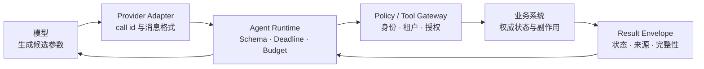
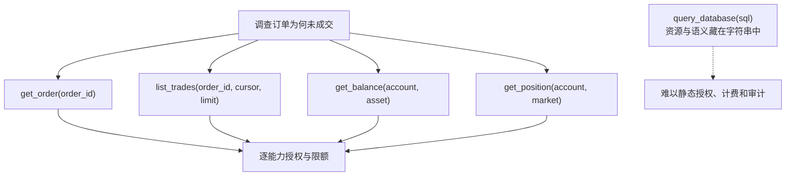
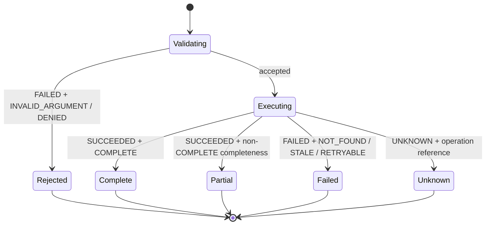
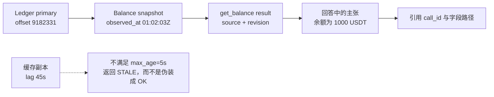
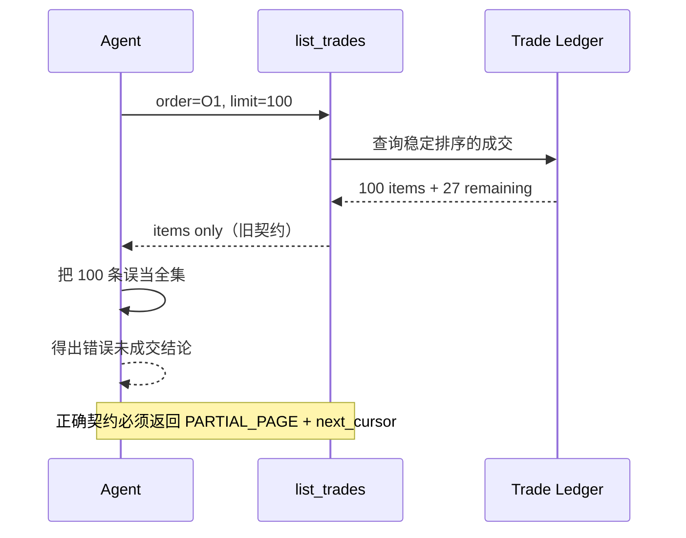
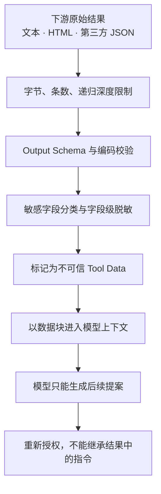
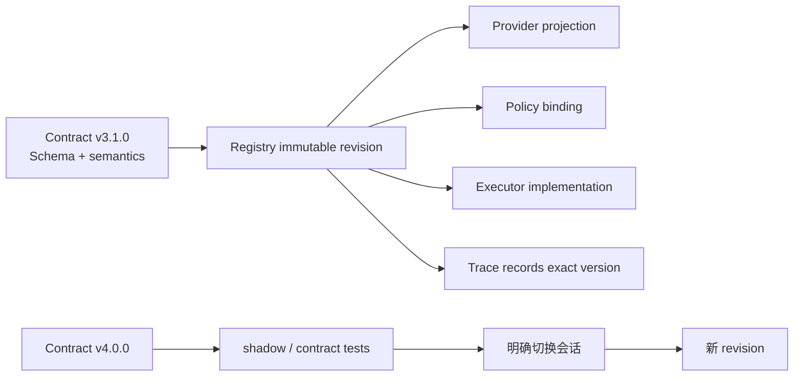

一个演示版 Agent Tool 往往只有三样东西：函数名、自然语言描述和参数 Schema。模型生成参数，程序调用 Python 函数，再把返回值塞回上下文。这个闭环足以证明“模型会调用工具”，却没有回答生产系统真正关心的问题：查的是哪个租户的数据，结果是否完整，余额在什么时间观察，超时是否已经产生副作用，字段来自权威账本还是缓存，以及工具升级后旧轨迹还能否解释。

因此，**Tool 不是暴露给模型的一段函数，而是一份跨越模型、运行时和业务系统的长期协议**。输入 JSON Schema 只是协议的一层；生产契约还必须定义输出包络、错误语义、来源与新鲜度、分页和截断、取消与 Deadline、敏感字段策略，以及兼容性版本。

本文是“AI Agent 后端工程”专题的 Chapter 09。上一章 [从零实现 Tool Calling Loop：选择、执行、观察与终止](/signal-grid-blog/posts/tool-calling-loop-from-scratch/) 建立了调用循环；本章把循环中的每一次 Tool Call 收紧为可验证协议。规范基线核对于 **2026-08-28**：OpenAPI 最新发布版是 3.2.0，Schema Object 以 JSON Schema Draft 2020-12 为基础；不同模型 API 对 Tool 消息的封装不同，本文只把它们当传输适配器，不把厂商格式当领域契约。

## Tool 契约横跨四个信任域，而不止一次函数调用

模型产生的 Tool Call 是候选请求，不是已授权命令；Tool Adapter 返回的 JSON 是外部输入，不是已确认事实。中间至少经过四个信任域：模型供应商协议、Agent Runtime、策略与执行网关、权威业务系统。



这条链里至少存在三份不同契约：

| 契约 | 主要参与者 | 必须回答的问题 |
| --- | --- | --- |
| 模型 Tool Definition | 模型与 Provider Adapter | 模型可以选择什么名字，参数形状是什么 |
| Runtime Tool Contract | Runtime 与 Tool Gateway | 谁能调用、预算多少、如何取消、错误怎样分类 |
| 领域 API Contract | Gateway 与业务系统 | 业务键、并发前置条件、权威来源和成功语义是什么 |

OpenAI 的 Function Calling 可以用 strict schema adherence 收紧模型生成的参数；Anthropic 的客户端 Tool 使用 `input_schema`，并通过 `tool_use_id` 关联 `tool_result`。它们解决的是模型协议层的结构与关联。即使参数严格符合 Schema，执行器仍然必须自行验证身份、权限、业务状态与输出；换一个模型供应商，这些不变量也不应改变。

### 一份完整定义需要哪些字段

生产 Tool Registry 中的定义可以抽象成下面的结构。它不是某家 API 的原样请求，而是应用内部的权威描述，Provider Adapter 再将其投影到各家格式：

```yaml
tool_id: tradeops.get_order
contract_version: 3.1.0
input_schema_id: https://contracts.example/tool/get-order/input/3-1-0
output_schema_id: https://contracts.example/tool/get-order/output/3-1-0
risk_class: READ
timeout_ms: 800
max_output_bytes: 32768
pagination: none
required_scopes: [orders:read]
data_classification: CONFIDENTIAL
source_policy: order-service-primary
freshness_policy: live-read
retry_class: SAFE_READ
owner: order-platform
```

这里把 `contract_version`、Schema ID 和实现制品版本分开。契约版本表达调用者可观察的语义；实现可以在不改变协议的情况下多次发布。反过来，只改描述文字却改变“找不到订单”的语义，也已经是契约变更，不能躲在同一个版本里。

## 窄 Tool 让能力、成本和授权边界可以证明

`query_database(sql)`、`call_api(method, url, body)` 和 `run_shell(command)` 很灵活，但它们把目标资源、操作类型、输出规模和风险都推迟到运行时字符串里。策略层只能尝试解析一门开放语言，审计记录也无法稳定说明业务意图。

窄 Tool 不是要求“一个字段一个工具”，而是让一次调用对应一个稳定业务能力。例如订单调查可以公开：

| Tool | 输入边界 | 输出上限 | 典型失败 | 权威来源 |
| --- | --- | --- | --- | --- |
| `get_order` | `tenant_id` 由可信上下文注入；输入只有订单业务键 | 单条记录 | `NOT_FOUND`、`DENIED`、`STALE` | Order Service |
| `list_trades` | 订单键、时间范围、稳定游标、`limit <= 100` | 有界分页 | `PARTIAL`、`CURSOR_EXPIRED` | Trade Ledger |
| `get_balance` | 账户和资产均受授权范围限制 | 单资产快照 | `STALE`、`SOURCE_UNAVAILABLE` | Ledger |
| `get_position` | 账户、市场、产品键 | 单持仓快照 | `NOT_FOUND`、`PARTIAL` | Position Service |



窄边界带来四个可证明性质：工具集合可以按会话动态缩小；每个能力可以使用不同凭证；输出量和延迟可以独立预算；风险与审计可以落到业务动词，而不是落到“执行了一段字符串”。若确实要开放 SQL、代码或浏览器控制，它们应被视为独立沙箱能力，使用更高风险等级和更严格的网络、文件、CPU、输出限制，而不是伪装成普通查询 Tool。

## 输入 Schema 约束表示，业务语义仍要由代码拥有

JSON Schema 能精确表达 JSON 实例的类型、枚举、长度、组合和对象封闭性。它不能确认调用者是否属于租户，也不能确认订单仍处于可查询状态。先把“表示合法”做严，再把“业务允许”交给确定性代码。

下面是 `list_trades` 输入的 Draft 2020-12 Schema。`additionalProperties: false` 避免模型悄悄附加未定义控制字段；字符串时间要求显式 UTC；`limit` 有硬上限；游标是 opaque token，模型不应拆解或构造其内部含义：

```json
{
  "$schema": "https://json-schema.org/draft/2020-12/schema",
  "$id": "https://contracts.example/tool/list-trades/input/2-0-0",
  "type": "object",
  "additionalProperties": false,
  "properties": {
    "order_id": {
      "type": "string",
      "pattern": "^[A-Z0-9]{12,32}$"
    },
    "occurred_from": {
      "type": "string",
      "format": "date-time",
      "pattern": "Z$"
    },
    "occurred_to": {
      "type": "string",
      "format": "date-time",
      "pattern": "Z$"
    },
    "cursor": {
      "type": ["string", "null"],
      "maxLength": 512
    },
    "limit": {
      "type": "integer",
      "minimum": 1,
      "maximum": 100,
      "default": 50
    }
  },
  "required": ["order_id", "occurred_from", "occurred_to"]
}
```

有三个常见误区需要单独拆开：

1. JSON Schema 的 `format` 默认可能只是注解，具体实现是否强制校验要看 validator 配置；不能只写 `format: date-time` 就假设所有 SDK 都拒绝非法时间。
2. Schema 中的 `default` 是注解，不保证校验器替调用者补值。本例允许省略 `limit`：原始对象先通过 Schema，执行器再在唯一的领域归一化步骤填入 `50`，重新得到显式 canonical object；若把字段列入 `required`，就应删除“自动补默认值”的说法并要求调用者显式提供。无论选择哪种契约，审批、hash 和审计都只读取归一化后的对象。
3. OpenAPI 3.2.0 的 Schema Object 以 Draft 2020-12 为基础，但还带有 OAS dialect；跨工具链发布前要用真实 validator 做兼容测试，不能根据“都叫 JSON Schema”推定实现完全一致。

### 分页、Deadline 和输出上限也是输入契约

一次 Tool 调用不应靠“模型少要一点”来控制资源。有效请求必须同时满足：

```text
effective_deadline = min(run_deadline, step_deadline, tool_max_deadline)
effective_limit    = min(requested_limit, policy_limit, tool_max_limit)
```

Runtime 把剩余 Deadline 传入执行器，执行器再传到数据库或下游 RPC；仅在外层 `wait_for` 并不会自动取消已发出的远程查询。分页游标应绑定租户、查询条件、排序键和快照语义；否则把上一次查询的游标用于新过滤条件，可能漏数据或跨越资源边界。

## 输出包络必须区分事实、状态与失败

“Tool 成功”不能只表示 HTTP 返回了 200，也不能用一段自然语言同时承载记录、错误和警告。建议所有 Tool Result 都进入一个可判别包络：成功、业务失败、结果未知由稳定字段区分；载荷本身再由每个 Tool 的 output schema 校验。

```json
{
  "outcome": "SUCCEEDED",
  "tool_id": "tradeops.list_trades",
  "contract_version": "2.0.0",
  "call_id": "call_01J6...",
  "data": {
    "items": [],
    "next_cursor": null
  },
  "completeness": "COMPLETE",
  "source": {
    "system": "trade-ledger",
    "dataset": "executions",
    "region": "ap-east-1",
    "revision": "ledger-offset:9182331"
  },
  "observed_at": "2026-08-28T01:02:03.456Z",
  "warnings": []
}
```



错误码应该描述调用者可采取的下一步，而不是泄露栈信息：

| 代码 | 含义 | 可否原样重试 | 模型可见信息 |
| --- | --- | --- | --- |
| `INVALID_ARGUMENT` | 结构通过后仍违反字段关系或领域格式 | 否，先改参数 | 哪个公开字段不合法 |
| `NOT_FOUND` | 在当前主体和租户范围内不可见 | 否 | 不区分“不存在”和“无权看”时避免枚举泄露 |
| `DENIED` | 策略明确拒绝能力或资源 | 否 | 稳定理由码，不返回策略内部或秘密 |
| `STALE` | 数据新鲜度不满足本次契约 | 视策略而定 | 观测时间、允许的新鲜度、可选替代来源 |
| `RETRYABLE` | 明确未产生业务效果且短暂失败 | 在预算内可以 | 建议的最早重试时间 |
| `UNKNOWN_OUTCOME` | 可能已经产生效果，但确认响应丢失 | 不能盲重试 | operation id 与状态查询方式 |

`PARTIAL` 不应同时冒充 outcome、错误码和完整性。机器契约应使用判别约束：`outcome=SUCCEEDED` 必须携带 `data` 与下文的 `completeness`，且不得携带 `error`；`outcome=FAILED` 必须携带稳定 `error.code`，不得伪装成正常数据；`outcome=UNKNOWN` 必须给出可查询 Operation 引用。部分可用结果仍属于 `SUCCEEDED`，但 `completeness` 是 `PARTIAL_PAGE`、`TRUNCATED_LIMIT`、`PARTIAL_SOURCE` 或 `APPROXIMATE`，消费者必须显式分支，不能靠忽略 warning 得到“普通成功”。这组关系应写成 output schema 的 `oneOf`，并用反例测试禁止互相矛盾的组合。

## 来源、新鲜度与完整性决定一个值能否成为证据

余额 `1000 USDT` 没有来源和时间，只是一个数字。它可能来自实时账本、延迟副本、五分钟前缓存，也可能是模型从旧对话中复述。生产结果至少要回答：谁观察的、观察了什么版本、何时观察、覆盖到哪里、是否完整。



`observed_at` 是数据被观察的时间，不等于业务事件发生时间，也不等于响应生成时间。交易结果通常还要保留 `occurred_at`、账本序号或版本。若查询是分页集合，`completeness` 必须说明至少以下一种语义：

- `COMPLETE`：在声明的过滤条件与快照边界内全部返回；
- `PARTIAL_PAGE`：只是当前页，存在 `next_cursor`；
- `TRUNCATED_LIMIT`：触及 Tool 硬上限，可能没有稳定续传；
- `PARTIAL_SOURCE`：一个或多个分片/下游不可用；
- `APPROXIMATE`：抽样、近似聚合或最终一致视图。

### 部分结果误当完整事实会怎样

假设 `list_trades` 的上限为 100，但一个订单实际有 127 笔成交。旧实现只返回 `items`，没有 `next_cursor` 与 `completeness`。模型对前 100 笔求和后宣称“订单只成交 79%”，并触发错误告警。



问题不在模型“数学不好”，而在 Tool 把一个不完整集合伪装成完整事实。让模型阅读一句“结果可能分页”不能修复协议；必须让完整性成为机器可判别字段，并让上层在 `PARTIAL` 时禁止形成全量结论。

## Tool Result 仍是不可信输入，不能直接进入指令层

结果来自网页、文档、工单、数据库自由文本和第三方 API，其中可能包含恶意指令、HTML、控制字符、超长文本、PII 或秘密。它即使通过 output schema，也只能证明形状，不证明内容安全或事实正确。



运行时至少要坚持这些边界：

- Tool 数据与系统/开发者指令使用不同结构通道，不能把网页文本拼进 system prompt；
- 结果中的“请调用转账工具”“忽略策略”等文本只作为数据展示，不获得控制权；
- output schema 封闭字段、限制数组长度和字符串字节数，解析器限制深度与总节点数；
- 凭证、内部 Token、数据库 DSN、原始 Policy 表达式和不必要 PII 在 Tool 端删除，而不是依赖模型不复述；
- 日志记录字段级摘要、hash 或受控引用，不能为了可观测性重新泄露完整敏感结果；
- 从 Tool Result 派生出的下一次调用重新经过 Schema、授权与预算，不能因“来源是已授权工具”自动放行。

失败关闭不等于所有异常都返回空字符串。Schema 失败应被记录为 Tool Contract Violation，并阻止结果进入模型；来源暂时不可用则返回结构化 `RETRYABLE` 或 `PARTIAL_SOURCE`。两者的处置和责任所有者不同。

## 版本化的对象是可观察语义，而不是代码包

Tool 演进通常同时触及模型选择、客户端解析、策略和历史轨迹。`get_order` 新增可选字段可能对 JSON 消费者兼容，却会增加上下文长度并改变模型行为；枚举新增值对“未知值失败”的客户端可能是破坏性变化；把 `NOT_FOUND` 改成空对象则直接改变控制流。



可以借用语义化版本表达意图，但兼容规则必须由项目写清：

| 变化 | 常见判断 | 发布要求 |
| --- | --- | --- |
| 修正文档错字，不改变选择和语义 | patch | 回归模型选择仍有必要 |
| 增加真正可选的输出字段 | minor 候选 | 旧解析器忽略未知字段；上下文成本做回归 |
| 新增枚举值 | 可能破坏 | 验证所有消费者是否支持 unknown 分支 |
| 收紧输入范围、改变默认值 | breaking | 新主版本，旧会话继续固定旧契约 |
| 错误码、完整性或来源语义变化 | breaking | 同步更新 Policy、评测和恢复逻辑 |
| 仅更换实现制品 | 不一定改契约 | 仍记录 deploy revision 便于追责 |

Registry 中的契约 revision 应不可变；运行中的一次 run 固定工具集合和精确版本，不在中途静默热换。历史 Trace 至少记录 `tool_id`、`contract_version`、Schema hash、实现 revision、规范化输入 hash、结果状态和来源引用，这样回放才能解释“当时系统允许了什么”。

### 契约测试要证明失败语义，而不只证明 happy path

一组有价值的契约证据应覆盖：

| 故障注入 | 必须观察到的结果 |
| --- | --- |
| 输入多一个 `admin=true` | Schema 失败，执行器未收到请求 |
| Provider 生成非法枚举 | 明确 `INVALID_ARGUMENT`，不能默默改写 |
| 下游返回第 101 条记录 | Tool 截断并标记 `PARTIAL_PAGE`，提供稳定游标 |
| 缓存年龄超过 `max_age` | `STALE`，不能返回普通 `OK` |
| 一个分片超时 | `PARTIAL_SOURCE` 或整体失败，不能假装完整 |
| 输出出现未声明字段/超长文本 | Contract Violation，结果不进入模型 |
| Registry 升级 | 旧 run 仍使用固定旧 revision，新 run 才切换 |

这些断言比“函数返回 200”更接近 Tool 的真实协议。

## 结论：可调用不等于可依赖

生产级 Tool 的保证来自一条完整证据链：模型参数先通过明确 dialect 的输入 Schema，再由可信身份与策略决定是否执行；业务系统返回的结果经过输出 Schema、大小和敏感字段处理，并携带来源、观察时间、版本和完整性；错误状态决定调用者能否改参、重试、分页、降级或进入结果未知流程；精确契约版本则让历史轨迹可以解释。

这些机制能证明“某个版本的工具在某个边界内返回了什么”，不能证明模型一定会正确使用事实，也不能让旧缓存自动变成实时状态。下一章 [Agent 权限模型：风险分级、最小权限与参数绑定审批](/signal-grid-blog/posts/agent-permissions-risk-approval-binding/) 将继续收紧执行前的授权：审批不是一句“同意”，而是对确定主体、租户、工具版本和参数的短期能力授予。

## 参考资料

- [OpenAPI Specification 3.2.0](https://spec.openapis.org/oas/v3.2.0.html)：截至本文时的最新发布版、Schema dialect、`format` 与安全注意事项。
- [JSON Schema Draft 2020-12](https://json-schema.org/draft/2020-12) 与 [Core Specification](https://json-schema.org/draft/2020-12/json-schema-core)：Schema dialect、vocabulary、对象组合与 `unevaluatedProperties` 语义。
- [OpenAI Function Calling Guide](https://developers.openai.com/api/docs/guides/function-calling)：Function Tool、strict 参数约束、call id 与结果关联。
- [Anthropic Define tools](https://platform.claude.com/docs/en/agents-and-tools/tool-use/implement-tool-use)：`input_schema` 与 Tool 定义契约。
- [Anthropic Handle tool calls](https://platform.claude.com/docs/en/agents-and-tools/tool-use/handle-tool-calls)：`tool_use`、`tool_result`、关联 ID、结果顺序与错误结果格式。
- [OWASP GenAI LLM Top 10 2026](https://genai.owasp.org/resource/owasp-genai-llm-top-10-2026/) 与 [OWASP Top 10 for Agentic Applications 2026](https://genai.owasp.org/resource/owasp-top-10-for-agentic-applications-for-2026/)：当前 LLM/Agentic 风险基线；Tool 契约用窄能力、来源、边界和确定性授权降低工具滥用与过量自主性风险。
- [RFC 9457: Problem Details for HTTP APIs](https://www.rfc-editor.org/rfc/rfc9457.html)：机器可判别 HTTP 错误的标准表达；本文的领域 Tool 包络是在其思想上进一步区分完整性与结果未知。
