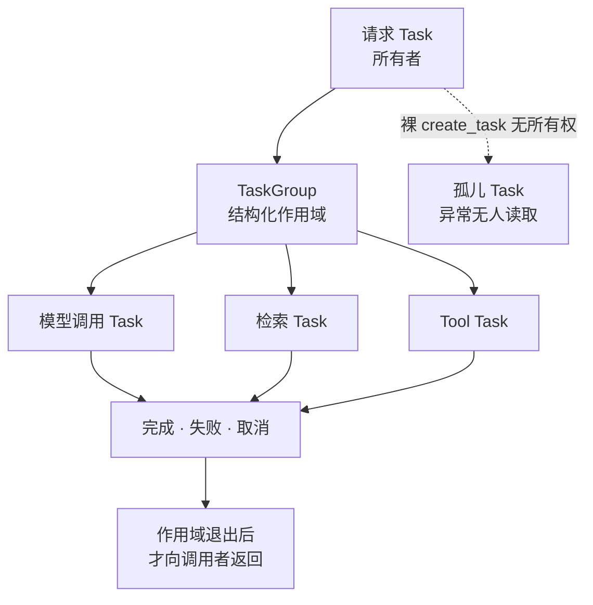
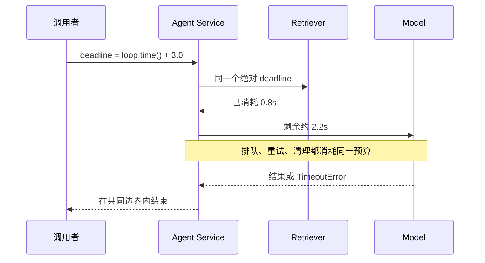
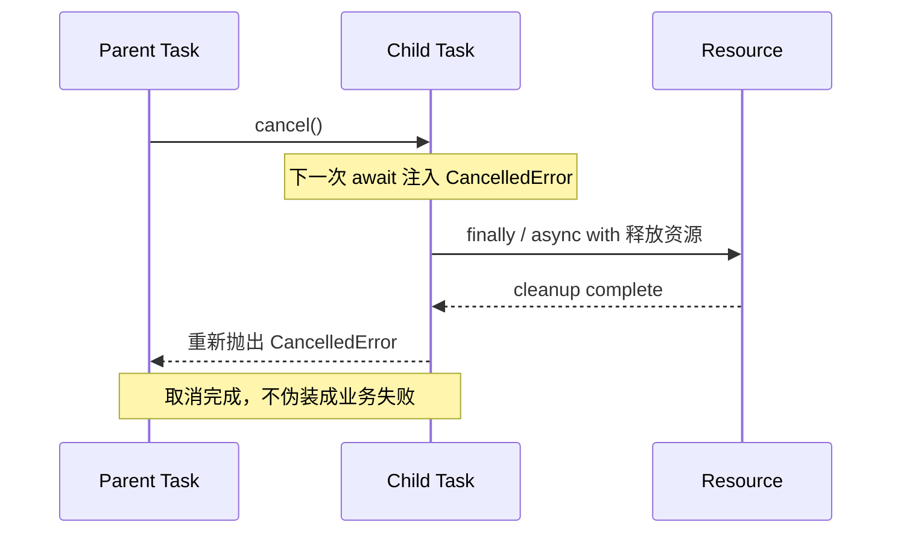
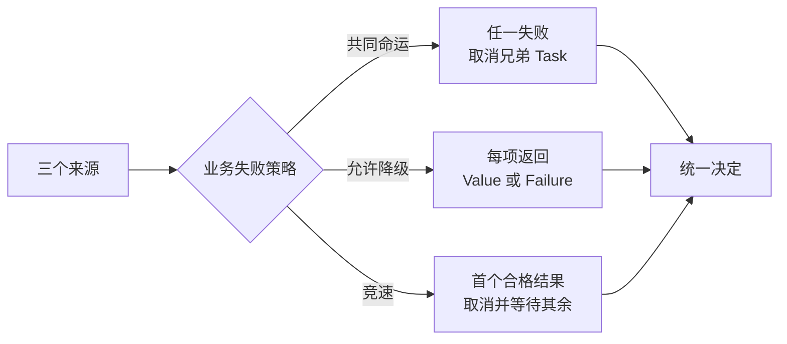
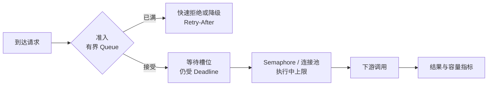
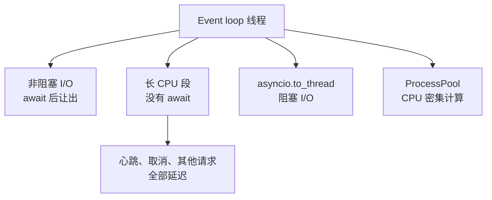
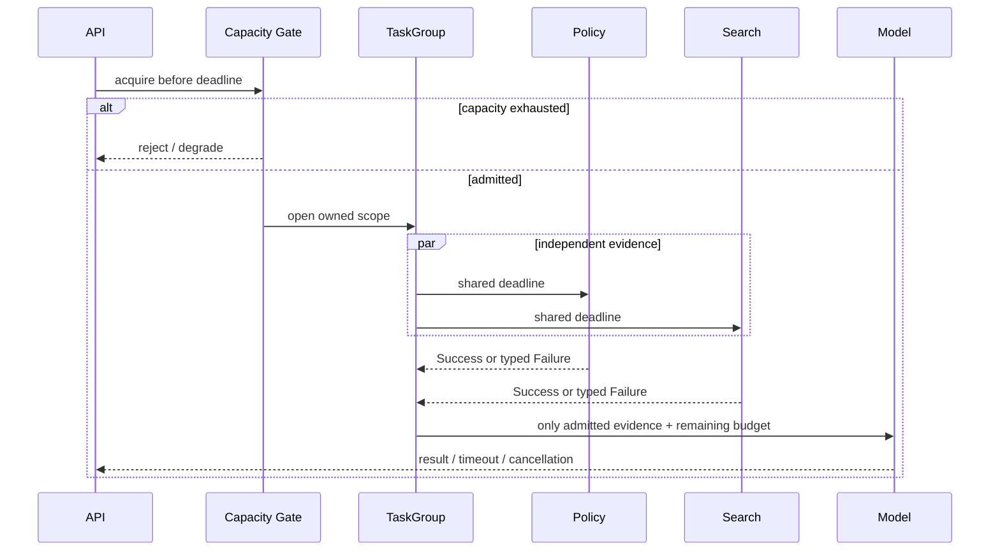

一个 Agent Run 往往会同时查询模型、检索服务和多个 Tool。把三次调用塞进 `asyncio.gather()` 并不难，困难的是回答失败后的问题：请求已经超时，子任务还在不在运行？连接是否归还？排队是否继续增长？已经成功的结果要不要保留？

可靠异步的核心不是“多写几个 `await`”，而是给并发建立一份可证明的控制协议：**每个 Task 都有所有者，每条调用链共享端到端 Deadline，取消沿所有权树传播，容量在接收工作之前就被限制，而部分失败必须由业务语义明确选择。**

本文是“AI Agent 后端工程”专题的 Chapter 03。上一章 [Python AI 后端：类型、Pydantic、精确数值与可复现工程](/signal-grid-blog/posts/python-ai-backend-typing-pydantic/) 建立了同步数据边界；本章讨论这些边界进入并发、超时和取消后怎样继续成立。

版本基线核对于 **2026-08-28**：示例使用当前稳定的 [Python 3.14.7](https://www.python.org/downloads/release/python-3147/) 及其标准库。`TaskGroup` 和 `asyncio.timeout()` 自 3.11 引入；3.13 改进了同时发生的内外部取消并保留取消计数，3.14 又让 `TaskGroup.create_task()` 把所有关键字参数传给事件循环。因此旧版本教程描述的边缘行为不能直接替代 3.14 文档。

## Coroutine 只是可暂停计算，Task 才引入并发生命周期

调用 `async def` 只会得到 coroutine object；直接 `await` 它时，调用者仍按一条控制流等待。`asyncio.create_task()` 才把 coroutine 调度成独立 Task，使它可以和调用者并发推进。

这个区别决定了可靠性的第一条边界：**创建 Task 就是在创建一个需要被拥有、等待和结束的生命周期。**



`asyncio.TaskGroup` 把这条规则编码进语法：进入上下文后创建子任务，退出上下文前等待全部子任务结束；某个子任务以非 `CancelledError` 异常失败时，TaskGroup 会取消其余子任务，等待它们清理，再用 `ExceptionGroup` 汇总异常。

```python
import asyncio


async def load_context(query: str) -> tuple[str, str]:
    async with asyncio.TaskGroup() as group:
        model_task = group.create_task(call_router(query), name="model-router")
        search_task = group.create_task(search_docs(query), name="search")

    # 离开作用域意味着两个任务都已终止；result() 不会读取半成品。
    return model_task.result(), search_task.result()
```

这里的 `call_router()` 和 `search_docs()` 是应用端口，具体实现可以是 HTTP client、数据库或测试 Fake。TaskGroup 证明的是生命周期收敛，不证明远端副作用已经回滚。

### “保存 Task 引用”仍不等于拥有它

事件循环只对 Task 保留弱引用；标准库要求为“fire-and-forget”任务保存强引用，并在完成后清理集合。但这只防止 Task 在执行中消失，不会自动处理它的异常、关机次序和业务恢复。

长期工作若真的要脱离 HTTP 请求，应该进入持久化 Run/Job 模型，由 Worker、租约和恢复协议拥有。裸 `create_task()` 适合进程内、可丢弃且有统一 shutdown 管理的辅助工作，不适合充当可靠任务队列。下一章会把这条边界落实为 FastAPI 长任务接口。

## Timeout 限制一段等待，Deadline 约束整条调用链

下面这段代码看似给每层都设置了 2 秒超时：

```python
async def bad_pipeline() -> str:
    profile = await asyncio.wait_for(load_profile(), timeout=2)
    evidence = await asyncio.wait_for(load_evidence(), timeout=2)
    return await asyncio.wait_for(call_model(profile, evidence), timeout=2)
```

它实际允许正常路径运行接近 6 秒；重试或排队还会继续扩大总时间。单跳 timeout 每到一层就“重新充值”，无法表达调用者真正承诺的响应时间。

端到端 Deadline 是绝对截止时刻。异步超时必须基于事件循环的**单调时钟** `loop.time()`，而不是可能被 NTP 或人工校时拨动的墙上时钟。每层只消费剩余预算，不能创建新预算。



可以把 Deadline 建模为一个只保存绝对时刻的值对象：

```python
import asyncio
from dataclasses import dataclass


class DeadlineExceeded(Exception):
    pass


@dataclass(frozen=True, slots=True)
class Deadline:
    when: float

    @classmethod
    def after(cls, seconds: float) -> "Deadline":
        if seconds <= 0:
            raise ValueError("deadline budget must be positive")
        return cls(asyncio.get_running_loop().time() + seconds)

    def remaining(self) -> float:
        return max(0.0, self.when - asyncio.get_running_loop().time())

    def require_remaining(self) -> float:
        remaining = self.remaining()
        if remaining <= 0:
            raise DeadlineExceeded("deadline already expired")
        return remaining


async def retrieve(deadline: Deadline, query: str) -> list[str]:
    deadline.require_remaining()
    try:
        async with asyncio.timeout_at(deadline.when):
            return await remote_search(query)
    except TimeoutError as exc:
        raise DeadlineExceeded("retrieval exceeded run deadline") from exc
```

`asyncio.timeout_at()` 接受与事件循环相同时间基准的绝对时刻。超时上下文会取消当前 Task，并且只有在**上下文外部**把内部 `CancelledError` 转换成内置 `TimeoutError`。因此不要在上下文内部把 `CancelledError` 当普通错误吞掉。

它也不是同步的“过期即拒绝”守卫：若 `when` 已经过期，取消会在事件循环的下一轮调度；上下文里一个不发生挂起的 coroutine、一次未满队列的 `put()`，仍可能先完成。于是每个**准入、出队、不可逆副作用和最终模型调用**之前都要先执行 `require_remaining()`，再用 `timeout_at()` 约束后续等待。这个检查仍不能抢占一段已经开始运行的同步代码；真正的副作用还需要下游 Deadline、幂等键和状态查询共同保护。

Deadline 也不是“到点立刻杀死代码”的硬中断。取消只能在协程下一次让出控制权时注入；清理逻辑需要时间；`asyncio.wait_for()` 还会等待被取消对象真正结束，所以实际返回可能晚于 timeout。运营上应同时观察 deadline 超限量和取消清理耗时，而不是把配置值当成测得的上界。

## 取消是一种控制流请求，不是普通业务错误

调用 `task.cancel()` 会安排在下一个可取消点向协程抛出 `asyncio.CancelledError`。它直接继承 `BaseException`，普通 `except Exception` 不会捕获。这是有意设计：取消应穿过大多数业务错误处理，沿 Task 所有权树向外传播。



正确的资源清理依赖 `async with` 或 `try/finally`，而不是捕获取消后返回一个假结果：

```python
async def use_connection(pool: Pool) -> Result:
    connection = await pool.acquire()
    try:
        return await connection.execute()
    finally:
        # 正常返回、异常和取消都走到这里。
        await pool.release(connection)
```

如果必须记录取消，记录后仍应 `raise`：

```python
async def observed_call() -> Result:
    try:
        return await remote_call()
    except asyncio.CancelledError:
        metrics.increment("remote_call.cancelled")
        raise
```

标准库明确警告：TaskGroup 和 `asyncio.timeout()` 自己就是用取消实现的，吞掉 `CancelledError` 可能破坏结构化并发。`Task.uncancel()` 主要是底层构件使用的工具，不是“修复取消异常”的常规按钮。

### `shield()` 只改变取消传播，不创造事务

`asyncio.shield(task)` 使**调用者被取消时**不把这次取消转发给内部 Task；调用者的 `await` 仍会收到 `CancelledError`。内部 Task 自己失败或被其他来源取消，shield 也救不了它。

它只适合很窄的边界，例如已经进入不可逆提交段、必须在有限时间内取得确定结果：

```python
async def finish_commit(operation_id: str, deadline: Deadline) -> CommitResult:
    async def bounded_commit() -> CommitResult:
        deadline.require_remaining()
        async with asyncio.timeout_at(deadline.when):
            return await commit_with_idempotency_key(operation_id)

    async def settle_commit() -> tuple[CommitResult | None, Exception | None]:
        # shield 的内部 Future 若在外层已取消后抛普通异常，事件循环会告警；
        # 因此先把普通完成异常收敛成值，再由拥有者决定如何传播。
        try:
            return await bounded_commit(), None
        except Exception as error:
            return None, error

    deadline.require_remaining()
    commit_task = asyncio.create_task(settle_commit(), name=f"commit:{operation_id}")
    try:
        result, error = await asyncio.shield(commit_task)
    except asyncio.CancelledError:
        # 延迟响应取消，先收敛已经开始的提交结果，再保留原取消信号。
        try:
            _, completion_error = await commit_task
        except BaseException as commit_error:
            audit_commit_completion_error(operation_id, commit_error)
        else:
            if completion_error is not None:
                audit_commit_completion_error(operation_id, completion_error)
        raise

    if error is not None:
        raise error
    assert result is not None
    return result
```

这个模式有三个前提：内部操作有独立 Deadline；`operation_id` 可以查询或幂等重试；调用者接受取消响应会被短暂延迟。`settle_commit()` 先把普通完成异常收敛成值，避免外层 shield 已取消后留下“exception was never retrieved”类告警；正常路径再重抛它。若调用者取消，示例把完成异常写入审计，再用外层 `raise` 重抛原来的 `CancelledError`，不能让一次 `TimeoutError` 覆盖调用者已经观察到的取消。若远端在收到请求后失联，本地 shield 仍无法判断副作用是否发生，结果必须进入“未知”状态并通过查询或对账解决。

## TaskGroup 的失败语义适合共同命运，部分结果需要显式建模

并发不是一种统一业务语义。三个子调用可能属于同一个原子判断，也可能是三个互不依赖的候选证据：

| 关系 | 一个子任务失败时 | 合适表达 |
| --- | --- | --- |
| 共同命运 | 其余结果失去意义，应尽快取消 | `TaskGroup` 让异常逃出子任务 |
| 可降级聚合 | 保留成功项，把失败项变成带来源的结果 | 子任务内部捕获普通异常并返回 `Outcome` |
| 竞速取首个 | 接受第一个合格结果，显式取消并等待其余任务 | `asyncio.wait(..., FIRST_COMPLETED)` 加清理 |
| 独立后台 Run | 请求结束不应控制它 | 持久化队列与独立 Worker，不是裸 Task |



`asyncio.gather()` 默认会把第一个异常传播给等待者，却不会因此取消其他已提交 awaitable；这与 TaskGroup 的 fail-fast 结构不同。`gather(..., return_exceptions=True)` 又会把异常混进结果列表，容易让调用者忘记检查。需要部分结果时，最好定义不会与正常值混淆的联合类型：

```python
import asyncio
from dataclasses import dataclass
from typing import Generic, TypeVar

T = TypeVar("T")


@dataclass(frozen=True, slots=True)
class Success(Generic[T]):
    source: str
    value: T


@dataclass(frozen=True, slots=True)
class Failure:
    source: str
    code: str
    retryable: bool


type Outcome[T] = Success[T] | Failure


async def capture(source: str, call, deadline: Deadline) -> Outcome[str]:
    try:
        deadline.require_remaining()
        async with asyncio.timeout_at(deadline.when):
            return Success(source, await call())
    except (DeadlineExceeded, TimeoutError):
        return Failure(source, "deadline_exceeded", retryable=True)
    except DependencyRejected:
        return Failure(source, "dependency_rejected", retryable=False)
    # CancelledError 不属于 Exception，会继续传播并取消整个聚合。


async def collect_evidence(deadline: Deadline) -> list[Outcome[str]]:
    async with asyncio.TaskGroup() as group:
        tasks = [
            group.create_task(capture("policy", query_policy, deadline)),
            group.create_task(capture("search", query_search, deadline)),
            group.create_task(capture("profile", query_profile, deadline)),
        ]
    return [task.result() for task in tasks]
```

这里故意只捕获已经进入错误契约的依赖失败。程序缺陷、序列化错误和父任务取消仍会使组失败，避免系统把内部 bug 降级成“少了一份证据”。

## Semaphore 限制执行中数量，Queue 才限制等待中的工作

`asyncio.Semaphore(20)` 能把同时进入临界段的调用限制在 20 个，却不会阻止十万个调用者在 Semaphore 外排队。无界 backlog 仍会占用 Task、请求对象、Trace、内存和客户端连接，并把过期工作带进未来。

真正的容量模型至少有三道门：



一个最小 Worker Pool 可以用 `asyncio.Queue(maxsize=...)` 表达有界 backlog：

```python
import asyncio
from dataclasses import dataclass


@dataclass(slots=True)
class WorkItem:
    operation_id: str
    deadline: Deadline
    payload: bytes


class WorkerPool:
    def __init__(self, workers: int, backlog: int) -> None:
        self._queue: asyncio.Queue[WorkItem] = asyncio.Queue(maxsize=backlog)
        self._workers = workers

    async def submit(self, item: WorkItem) -> None:
        # 排队本身也消耗调用者的端到端预算。
        item.deadline.require_remaining()
        async with asyncio.timeout_at(item.deadline.when):
            await self._queue.put(item)

    async def worker(self) -> None:
        while True:
            item = await self._queue.get()
            try:
                item.deadline.require_remaining()
                async with asyncio.timeout_at(item.deadline.when):
                    await process(item)
            except (DeadlineExceeded, TimeoutError):
                await mark_expired(item.operation_id)
            finally:
                self._queue.task_done()
```

生产实现还要定义进程关闭行为。Python 3.13 起 `Queue.shutdown()` 可以阻止继续增长，并让被阻塞的 `put()` 以 `QueueShutDown` 退出；正常模式配合 `join()` 排空已接受工作，立即模式会破坏“每个 put 都被处理”的通常不变量，只有明确接受丢弃时才能使用。

容量值不能凭感觉设置。它受到下游连接池、对方配额、单请求内存、目标延迟和 CPU 的共同约束。至少记录：queue depth、queue wait、in-flight、拒绝数、Deadline 到达位置和下游 429/503；否则“Semaphore=20”只是没有证据的常量。

## 异步 I/O 不会自动把 CPU 工作变成并行

事件循环采用协作式调度：一个 Task 运行 Python 代码，直到它 `await` 一个尚未完成的对象，其他 Task 才有机会推进。把同步 PDF 解析、巨大 JSON 编码或本地推理直接写进 `async def`，会阻塞同一循环上的所有请求。



选择边界时要看工作本质：

- 原生异步 HTTP/数据库客户端留在事件循环；
- 没有异步 API 的短阻塞 I/O 可用 `asyncio.to_thread()`，同时限制线程并发；
- 纯 Python CPU 密集工作通常放到 `ProcessPoolExecutor` 或独立 Worker；标准 CPython 构建仍受 GIL 影响；
- 会释放 GIL 的扩展，以及 Python 3.14 已正式支持但需要单独选择的 free-threaded 构建，要按真实部署制品测量，不能只看语言版本号推断并行度。

跨线程函数无法被 Task 取消机制强行终止。等待 `to_thread()` 的协程被取消，不等于线程里的阻塞系统调用停止；跨进程任务也要定义终止和孤儿回收。因此应优先给底层 client 设置自己的连接、读取和总 Deadline，并让操作可以幂等重试或查询。

## 一次可靠 fan-out 必须同时收敛时间、容量和结果语义

把前面的规则放在一起，一个 Agent 上下文聚合器应先取得容量，再在共同 Deadline 下创建结构化子任务，最后按显式降级策略解释结果：



下面这个骨架刻意把 `CapacityGate`、`EvidenceSource` 和结果策略留成端口，而不是绑定某个 Agent 框架：

```python
from collections.abc import Awaitable, Callable


async def build_answer(
    query: str,
    *,
    deadline: Deadline,
    gate: "CapacityGate",
    sources: dict[str, Callable[[], Awaitable[str]]],
) -> str:
    async with gate.acquire(deadline):
        async with asyncio.TaskGroup() as group:
            tasks = {
                name: group.create_task(capture(name, call, deadline), name=name)
                for name, call in sources.items()
            }

        outcomes = [task.result() for task in tasks.values()]
        evidence = [item.value for item in outcomes if isinstance(item, Success)]
        if not evidence:
            raise EvidenceUnavailable(outcomes)

        deadline.require_remaining()
        async with asyncio.timeout_at(deadline.when):
            return await answer_with_evidence(query, evidence)
```

这段代码能证明：本调用不会越过 gate 进入无界执行；所有子任务在作用域退出前结束；父取消不会被当作部分失败吞掉；模型只拿到明确成功的证据；各执行边界不会把**进入前已经过期**的 Deadline 只交给下一轮取消处理。它不能硬中断不让出事件循环的同步代码，也不能证明远端副作用恰好一次或容量参数正确——副作用需要下游 Deadline、幂等、状态查询和恢复协议，容量则需要负载测量。

### 应该用故障注入证明哪些性质

可靠性测试不应只断言正常结果。对一个并发聚合器，故障矩阵至少要能判定这些不变量：

| 注入点 | 预期证据 |
| --- | --- |
| 父请求在任意 `await` 处取消 | 所有 owned child 最终结束，连接归还，无“Task exception was never retrieved” |
| 一个共同命运子任务失败 | 兄弟任务被取消并完成清理，`ExceptionGroup` 保留根因 |
| 一个可降级来源超时 | 其他结果保留，Outcome 带来源和稳定错误码 |
| Queue 已满 | 新工作快速拒绝或在自身 Deadline 内退出，backlog 不继续增长 |
| 远端收到请求后连接断开 | 状态为结果未知，不把重试等同于首次执行 |
| CPU 工作意外进入事件循环 | event-loop lag 或心跳延迟测试失败，而不是只看总吞吐 |

测试里的时间最好通过短但有余量的真实单调时钟边界验证集成语义；大规模调度与重试则注入 Clock/Sleeper，用确定性虚拟时间避免慢且抖动的测试。不要 monkey-patch `loop.time()` 破坏事件循环自身调度。

## 结论：并发正确性首先是所有权和预算问题

`asyncio` 提供了高效 I/O 并发，但不会替应用选择失败语义。可靠边界来自几条因果关系：

1. Task 一旦被创建就需要所有者；TaskGroup 让相关子任务在一个作用域内共同结束；
2. 每层 timeout 会重新充值，绝对 Deadline 才能把排队、重试、调用和清理纳入同一预算；
3. 取消通过 `CancelledError` 表达控制流，清理后应继续传播；shield 只延迟传播，不提供事务保证；
4. Semaphore 只限制执行中数量，有界 Queue 和准入拒绝才阻止 backlog 无限增长；
5. 共同命运、可降级聚合和持久后台 Run 是三种不同协议，不能用一个 `gather()` 参数代替业务设计。

下一章 [FastAPI 长任务接口：SSE、生命周期与可测试边界](/signal-grid-blog/posts/fastapi-long-running-tasks-sse-testing/) 会把这些规则放进 HTTP：请求只负责创建和观察 Run，长期执行由可恢复 Worker 拥有，SSE 只是事件日志的流式视图。

## 参考资料

- [Python 3.14.7](https://www.python.org/downloads/release/python-3147/)：本文解释器稳定版本基线。
- [Coroutines and Tasks](https://docs.python.org/3.14/library/asyncio-task.html)：Task、TaskGroup、取消、shield、timeout、wait 与 `to_thread()` 的权威语义。
- [Asyncio Queues](https://docs.python.org/3.14/library/asyncio-queue.html)：`maxsize`、`join()`、`task_done()` 与 3.13 起的 `shutdown()` 行为。
- [Asyncio Synchronization Primitives](https://docs.python.org/3.14/library/asyncio-sync.html)：Lock、Event、Condition、Semaphore 和 Barrier 的协程同步边界。
- [Event Loop](https://docs.python.org/3.14/library/asyncio-eventloop.html)：单调时钟、Executor、任务工厂与调度接口。
- [Concurrent Execution](https://docs.python.org/3.14/library/concurrent.futures.html)：线程池、进程池、InterpreterPool 与 Future 语义。
