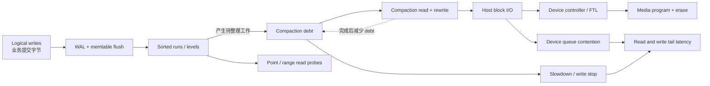
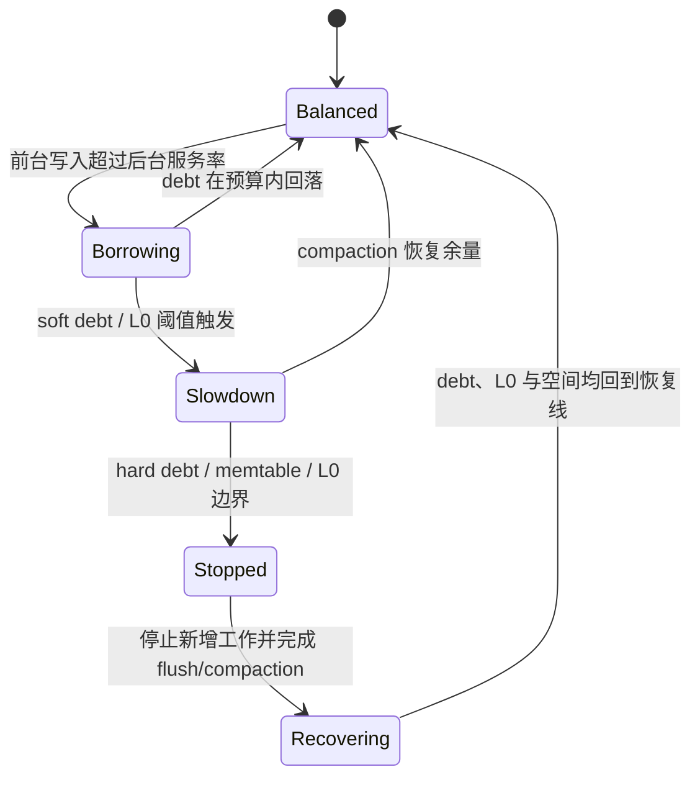

“写放大从 18 降到了 8，所以延迟一定更好。”这句话把成本比率、资源竞争和用户可见结果混成了一个结论。降低写放大可能释放设备带宽，也可能以更多 sorted runs、更多读探测和更高临时空间换取；一次看似平稳的平均吞吐，还可能依赖不断累积的 compaction debt，把代价推迟到测试结束以后。

本文的中心论点是：**Read、Write、Space Amplification 是解释资源需求的模型，Compaction Stall 和读写尾延迟才是用户可见结果；只有在相同语义、相同作用域和完整负载周期内把两者连起来，放大率才有决策意义。**

上一篇 [LSM Tree](/signal-grid-blog/posts/lsm-tree-memtable-sstable-compaction-tombstones/) 把 Compaction 定义成保持 Snapshot 语义的物理重写；本篇继续追问这份重写怎样消耗资源、累积债务并传导到前台尾延迟。测量方法也适用于 copy-on-write、分层索引和其他带后台重写的数据系统。RocksDB 只作为可观察实现，不作为参数百科；具体阈值和统计字段应以目标版本为准。

## 先写出要证明的主张，而不是先调 Compaction 参数

一次有效实验必须先给出可证伪主张。例如：

> 在 1.5 TiB 稳态数据集、70% point read、25% overwrite、5% range scan、每值 1 KiB 的负载下，候选策略把 30 分钟滚动窗口内“应用提交字节到主机块写入字节”的写放大从 14 降到 9；在 1.4 倍持续 10 分钟的写突发后，compaction debt 于 20 分钟内回落到基线，写入 p99.9 不超过 12 ms、读取 p99.9 不超过 4 ms，峰值已分配空间不超过设备可用容量的 78%，且不改变 WAL 同步与确认语义。

这个主张同时约束了：

- 业务负载与数据规模；
- 放大的具体口径；
- 稳态、突发和排债阶段；
- 读写尾延迟与失败结果；
- 临时空间和恢复余量；
- 持久性语义。

如果实验只说“运行 `db_bench` 30 分钟，吞吐更高”，它可能在停止时留下更大的 L0、更多 tombstone 和尚未执行的重写。那不是更高容量，而是把工作记成了未来负债。



这张图的关键不是“Compaction 很慢”，而是存在多个计量边界。业务字节、引擎写出的文件字节、块设备看到的主机字节和介质实际 program 的字节都可能不同；不标边界的单个 `WAF` 没有可比性。

## 三种放大必须固定分子、分母与观察边界

放大率不是某个存储引擎自带的常数。它随 key/value 大小、更新分布、删除、压缩、快照、缓存和观察窗口变化。报告时至少给出下面的量。

### Write Amplification 有三层不同事实

在同一时间窗 `[t0, t1]` 内，可以定义：

```text
WA_engine
  = engineBytesWritten(WAL + flush + compaction + blob + metadata)
    / logicalCommittedInputBytes

WA_host
  = blockDeviceHostWriteBytesAttributedToWorkload
    / logicalCommittedInputBytes

WA_device
  = mediaProgramBytes
    / hostWriteBytesAcceptedByDevice
```

`logicalCommittedInputBytes` 必须采用一套固定的提交输入编码：每个已确定提交的逻辑操作只计一次，明确是否包含 key、value、操作类型、delete/range tombstone、timestamp 与 batch framing，并说明按压缩前还是压缩后计量。只数 value payload 会让小 value、长 key 和 delete-heavy workload 的分母失真；具有同一幂等身份的超时重试不能既按原请求又按重试结果重复计数。若重试没有幂等身份且被当成独立写实际接受，则必须作为另一操作计数，并把由此产生的重复业务语义单独报告。

`WA_engine` 的各项必须来自互斥计数域；若某个总写入 counter 已包含 Blob 或 Metadata，就不能再次相加。它解释引擎自身的重写；`WA_host` 还可能混入文件系统元数据、日志、其他进程和测量设备上的共享 I/O；`WA_device` 才是设备控制器的垃圾回收、wear leveling 与 FTL 映射造成的内部放大。最后一项通常依赖厂商遥测或实验设备，不能用 Linux 块层写扇区反推。`WA_engine` 与 `WA_host` 是两个替代观察边界，不是可相乘的串联级数；Page Cache 延迟写回和时间窗切边还会让它们短窗内不呈包含关系。

只有逻辑输入属于同一请求 cohort，Host 与 Media 计数器指向同一目标设备、覆盖同一时间窗且没有遗漏流量时，才可以讨论近似乘积：

```text
applicationToMediaAmplification ≈ WA_host × WA_device
```

即使如此，也应报告原始累计字节和 counter reset/rollover 规则，而不是只留下一个比率。一次 crash recovery 重放、checkpoint 或备份是否计入，也要在实验合同中写明。

### Read Amplification 不能被 Cache Hit“洗掉”

对 point lookup，可分别记录：

```text
logicalReadAmplification
  = data/index/filter blocks examined per successful lookup

physicalReadAmplification
  = device read operations or bytes attributable to lookup
```

Bloom filter 和 index 可以减少不必要的数据块读取；block cache 或页缓存则可能把逻辑探测变成内存访问。此时 physical amplification 降低了，logical amplification 仍消耗 CPU、cache bandwidth 和锁/引用计数成本。Range scan 的分母也不能沿用“每次查询”：更合理的是每个返回字节、每个返回 key 或每个扫描区间的物理/逻辑读取量。

未命中查询尤其需要单独分桶。它可能检查更多层和更多 filter，却不返回任何 value；把它和命中查询平均，会掩盖对不存在 key 的最坏路径。

### Space Amplification 要同时看稳态与瞬时峰值

“空间放大”存在两种常见记法，报告时必须写出公式而不是只写 `SA=2`：

```text
SA_ratio_steady = steadyStateAllocatedBytes / logicalLiveBytes
SA_ratio_peak   = peakAllocatedBytesDuringMaintenance / logicalLiveBytesAtThatTime

SA_overhead = (allocatedBytes - logicalLiveBytes) / logicalLiveBytes
            = SA_ratio - 1
```

前一种把“无额外开销”写作 `1.0x`，后一种写作 `0%`；RocksDB 某些 Universal Compaction 选项使用的是额外空间百分比，不能直接和总占用比相减比较。`logicalLiveBytes` 通常指当前逻辑状态中可见 key/value 的声明编码，tombstone、过期版本和只因内部 Snapshot Pin 而保留的版本属于额外占用；如果产品把历史 Snapshot 作为对外可查询的数据集，则应另外报告 `logicalRetainedHistoryBytes` 口径。`allocatedBytes` 也要区分文件逻辑长度、文件系统已分配块、快照/reflink 引用、临时 compaction 输出、WAL、MANIFEST 与预留空间。

只报告测试结束后的目录大小，会漏掉 compaction 同时保留输入和输出时的瞬时峰值。真正导致事故的往往是 `SA_ratio_peak`：空间不足使 compaction 不能完成，compaction 不能完成又让旧版本和 tombstone 无法回收，形成正反馈。

## Compaction Debt 是放大传导到 Stall 的中间状态

LSM 写入先进入 WAL 和 memtable，flush 形成新的 sorted run；compaction 再读取、归并并重写这些 run，以限制重叠、回收旧版本并恢复目标层级形状。前台写入到达得比后台重写服务能力更快时，尚待完成的工作就形成 debt。

可以用一个教学模型表达：

```text
debt(t + Δt)
  = max(0,
        debt(t)
        + generatedCompactionBytes(t, Δt)
        - completedCompactionBytes(t, Δt))
```

其中 generated 与 completed 必须使用同一种“待写输出工作量”口径；不能一边累计 compaction 输入读取量，一边扣减输出写入量。

真实引擎的 pending compaction bytes 是调度估计，不是精确债务会计；但它与 L0 file count、compaction score、immutable memtable 数量、pending flush bytes 和预计完成时间一起，能描述系统是在排债还是继续借债。



RocksDB 的公开文档明确区分 slowdown 与 stop，并说明某个 column family 的条件可能使整个 DB 的写入 stall。阈值只是安全阀，不创造 compaction 带宽。把 hard limit 调大，可能只是让系统晚一点、在更高 debt 和更少剩余空间处停下。

Debt 还会影响读尾延迟：

- 更多 L0 或 sorted runs 增加 point lookup 与 range merge 的候选集合；
- compaction 读取和写入与前台请求争用 device queue、CPU、内存带宽和 cache；
- 大量后台输出会驱逐 block/page cache，增加后续物理读；
- 空间逼近满盘时，文件分配、设备内部回收和错误恢复余量同时恶化；
- stall 会把等待传播到上游队列，若客户端只统计引擎返回后的样本，就会丢掉真正的排队尾部。

因此，Compaction Stall 不是单一“写入暂停事件”，而是前台生成维护工作、后台服务率与保护阈值在当前窗口内不匹配的显式结果。原因可能是设备/CPU 预算不足，也可能是 Flush/Compaction 调度、限速或配置边界；只看到 Stall 不能单独证明硬件容量不足。正确优化目标是让债务在给定突发后可界定地排清，而不是让 stall counter 永远为零。

## 可复现实验必须经历预置、稳态、突发与排债

存储实验的工作量不是一串 QPS。它至少由以下分布共同定义：

| 维度     | 必须固定的事实                           | 为什么影响放大                               |
| -------- | ---------------------------------------- | -------------------------------------------- |
| 数据规模 | live set、初始层级形状、设备占用率       | 小于 cache 的数据库不会暴露真实 read I/O     |
| Key 分布 | uniform、Zipf、顺序或热点迁移            | 决定重叠范围、cache hit 与 compaction 局部性 |
| 写语义   | insert/overwrite/delete 比例、batch 大小 | 决定旧版本、tombstone 与 WAL 开销            |
| Value    | 大小分布、压缩率、可否分离存储           | 改变每次重写的字节成本                       |
| 读语义   | hit/miss、point/range、snapshot age      | 决定需检查的 run 与可回收版本                |
| 持久性   | WAL、group commit、sync/fsync 规则       | 直接改变延迟和主机写入量                     |
| 后台策略 | compaction/flush 并发与速率              | 决定服务率、前台争用和 debt 斜率             |

一个可重复周期包括：

1. **设备预置**：记录型号、固件、容量占用和 discard/secure erase 策略；将设备置于可重复的已写入状态，而不是每次都从全新盘开始。
2. **数据装载**：生成目标 live set 和 key 分布；装载完成后不立即测量，等待层级、cache 和设备进入声明状态。
3. **稳态窗口**：保持 offered rate，直到 live bytes、层级大小、debt 与后台吞吐在可接受区间波动。
4. **突发窗口**：施加事先定义的幅度和持续时间；不能用闭环客户端因响应变慢而自动降载，除非真实入口本来就是闭环。
5. **排债窗口**：恢复基线负载并持续到 debt、L0、cache hit 和空间回到恢复线；若测试在这里之前结束，应判为未完成而非胜利。
6. **恢复试验**：在 flush、compaction 输出、MANIFEST 更新和 fsync 周围注入崩溃，确认候选优化没有改变已承诺数据的恢复语义。

开放与闭环实验回答不同问题。固定并发的闭环客户端只有在前一请求完成后才继续发出；系统变慢时 offered rate 会自动下降，因此它可以模拟有限用户并发，却不能独自证明固定到达率下的 Admission Capacity。开放到达实验则应按独立计划产生请求，记录 scheduled start 到最终结果的端到端延迟；若负载发生器来不及发出，必须把 `generatorMissedBeforeOffer` 计入结果，不能让这些最坏时段从分母消失。两类结果不能仅凭“线程数相同”或“平均 QPS 接近”直接比较。

对已经发出的请求，还要把 rejected、caller timeout、stall 和 late completion 分开。Caller Timeout 只是某时刻的客户端观察，之后可能成为已知失败、已知成功或结果未知，不能同时作为一个互斥终态重复计数。这正是避免协调遗漏和生存者偏差所需的账目。JMH 不适合证明整台存储引擎的 compaction tail；关于开放负载、直方图和生产证据的通用方法，参见 [Java 低延迟测量](/signal-grid-blog/posts/java-low-latency-measurement/)。

## Fsync、Cache、GC 与 Trim 是必须拆开的混杂因素

放大与尾延迟相关，不等于它们之间已经建立因果。下面这些变量常在一次“参数优化”中同时改变。

### WAL 与 fsync 改变的是持久性边界

异步写、每请求同步、group commit 和周期性 fsync 不是同一种服务。关闭 WAL 或把 sync write 改成只写 page cache，几乎一定会改善延迟和 host bytes，却同时降低崩溃后的保证。实验必须保持 durability contract 相同，并报告 fsync 次数、group size、sync latency 和超时后的结果未知。

后台 compaction 的 `fdatasync`、目录同步和 manifest 更新也可能形成短时队列。只看数据文件 bytes 不能解释这些 barrier 的尾部。

### 两层 Cache 会改变“读放大”的表现形态

RocksDB block cache 与 OS page cache 可能同时存在。warm-cache、cold-cache 和 cache churn 是三种实验；用上一轮候选留下的 cache 测下一轮，会产生顺序偏差。Direct I/O 可以改变页缓存参与方式，但也改变 I/O 合并、预读和对齐，不能被当作纯粹的“关闭缓存”开关。

### Runtime pause 与后台线程会制造同形症状

Java 包装层的 GC、allocator pause、CPU frequency、NUMA 远端访问、备份、scrub 和相邻租户 I/O 都可能使 compaction 进度下降或请求排队。需要在同一时间轴记录 runtime pause、CPU throttling、run queue、block I/O 和引擎事件。否则只能证明“尾延迟发生时 compaction 也在运行”，不能证明 compaction 是唯一原因。

### Trim/discard 与设备 GC 不能从一个开关推断

Discard 告诉设备哪些逻辑块不再使用，但同步 discard、批量 `fstrim`、固件回收策略和当前 over-provisioning 会产生不同延迟。设备内部 program/erase、thermal throttling 和 wear leveling 通常不能由主机 I/O 完整观察。实验要记录 discard 方式、设备填充历史、温度和厂商计数器；无法取得 media bytes 时，就明确报告 `WA_device = unknown`，不要用 `iostat` 冒充。

处理混杂因素的方法不是把生产环境清空，而是先在受控实验中一次改变一个机制，再在灰度中验证适用性。灰度只能说明真实效果是否存在，仍需事件时间线和反事实对照解释原因。

## 证据必须把用户结果、引擎状态与设备状态对齐

最小证据面包含三层，并使用单调时钟或已校准的时间关系：

| 层级        | 原始证据                                                                                                | 能回答的问题                         |
| ----------- | ------------------------------------------------------------------------------------------------------- | ------------------------------------ |
| 用户/调用方 | scheduled、generator miss、offered、accepted、rejected、terminal outcome、timeout、p50–p99.99、队列等待 | 用户是否真的遭遇 tail 或丢失结果     |
| 引擎        | logical bytes、WAL/flush/compaction bytes、L0、debt、stall reason、cache hit、每查询 block probes       | 放大和债务在哪个阶段产生             |
| OS/设备     | block bytes/IOPS、queue depth、await、util、discard、fsync latency、设备温度与厂商 media counters       | 资源是否饱和，主机与介质边界是否一致 |

不要只画两个累计 counter 的相关图。更强的证据来自可重复干预：在相同随机种子和数据快照上改变 compaction policy 或后台预算，观察 debt 斜率、stall 原因、device queue 和 read tail 是否按预测共同变化；再交换运行顺序，排除 cache 与设备预置偏差。

每轮报告至少保留：配置内容摘要、引擎和内核版本、数据生成 seed、初始文件布局、设备状态、原始 histogram、累计 counter 起止值、事件日志和排债完成位置。只有汇总图而没有原始 counter，就无法审计分母是否在中途 reset。

可用下面的不变量检查测量自身：

```text
scheduled = generatorMissedBeforeOffer + offered
offered = rejectedBeforeAcceptance + accepted
accepted = knownSuccess + knownFailure + stillUnknown
completed = knownSuccess + knownFailure

logicalCommittedInputBytes
  = sum(canonicalEncodedSize(op) for each known committed logical op)

counterDelta
  = sum(end_i - start_i + rolloverCorrection_i)
    for every uninterrupted counter epoch i

testComplete
  => debt <= recoveryThreshold
     AND l0Files <= recoveryThreshold
     AND allocatedBytes <= steadyStateBand
```

这些等式必须针对同一个请求 cohort；`knownSuccess`、`knownFailure` 与 `stillUnknown` 互斥，Caller Timeout 作为观察标签另行统计。引擎、块层和设备 counter 则必须给出各自的 scope map，不能假设压缩、value separation、Page Cache、共享设备与跨窗口延迟之后仍存在普遍的大小不等式。**不变量的作用是暴露遗漏和重复计数，而不是强迫所有引擎服从同一个物理比例。**

## 决策规则应形成容量信封，而不是选一个最快点

系统可持续工作的基本条件是后台服务能力在目标窗口内覆盖产生的维护工作：

```text
generatedMaintenanceRate(workload, policy)
  < sustainableBackgroundServiceRate(device, cpu, ioBudget)

peakForegroundIO + peakBackgroundIO + safetyReserve
  <= sustainableDeviceEnvelope
```

这里用 sustainable 而不是设备宣传的峰值带宽，因为长期随机写、混合读写、设备填充和温度会改变可用能力。容量信封至少是 offered write rate、read mix、live set、burst duration、剩余空间和后台 I/O budget 的函数，不是单一 QPS。

上面的不等式要按同一时间片、同一资源维度分别计算，例如读写带宽、IOPS、队列槽、CPU 与临时空间；不能把不同时刻出现的两个独立峰值相加后声称是实测并发峰值，也不能把 IOPS 与 bytes/s 塞进同一个标量。

候选策略只有同时满足以下判据才可进入灰度：

| 判据       | 通过证据                                  | 拒绝条件                    |
| ---------- | ----------------------------------------- | --------------------------- |
| 持久性等价 | 相同 WAL/sync/恢复断言                    | 通过弱化确认语义获得性能    |
| 稳态可持续 | debt 无长期正斜率                         | 仅在测试结束前未触发 stall  |
| 突发可恢复 | 在截止时间内回到恢复线                    | 排债时间无界或挤占前台 SLO  |
| 读写尾部   | 完整结果集的目标分位数和失败率            | 丢弃、超时样本被排除        |
| 空间安全   | `SA_ratio_peak` 加恢复/快照余量低于硬上限 | compaction 峰值可能耗尽空间 |
| 设备余量   | 混合负载下仍有 I/O 与温度 headroom        | 依赖短时缓存或全新设备状态  |

调参只是改变这个信封的手段。Leveled 与 tiered compaction 在读、写和空间放大之间做不同交换；提高后台并发也许排债更快，却可能扩大前台读尾部。没有同时满足尾延迟、债务、空间和恢复语义的“最优 WAF”。

## 放大率解释成本，容量信封决定能否承诺延迟

Read、Write、Space Amplification 分别描述查询需要检查多少、一次业务写导致多少重写、live data 需要多少稳态和临时空间。它们可以解释资源为何被消耗，却不能单独证明用户尾延迟。

Compaction debt 把当前前台速度与未来必须偿还的工作连接起来。一次实验只有覆盖稳态、突发和排债，且把用户结果、引擎状态和设备计数器对齐，才有资格宣称某个策略扩大了可持续容量。

容量之外还有另一条独立轴：字节能读出，不代表字节仍然正确；后台 compaction、复制和格式升级还会改变损坏的传播与修复边界。下一章进入[存储完整性：Checksum、Scrubbing、Repair 与格式演进](/signal-grid-blog/posts/storage-integrity-checksum-scrubbing-repair-format-evolution/)。

### 一手论文与官方实现资料

- [RocksDB：Compaction](https://github.com/facebook/rocksdb/wiki/Compaction)——leveled、tiered 与 read/write/space amplification 的交换关系。
- [RocksDB：Write Stalls](https://github.com/facebook/rocksdb/wiki/Write-Stalls)——slowdown、stop、pending compaction bytes 与 column family/DB 作用域。
- [RocksDB：Compaction Stats and DB Status](https://github.com/facebook/rocksdb/wiki/Compaction-Stats-and-DB-Status)——flush、compaction、stall 与累计字节字段定义。
- [RocksDB：Tuning Guide](https://github.com/facebook/rocksdb/wiki/RocksDB-Tuning-Guide)——放大率口径、系统瓶颈和 cache/compaction 诊断入口。
- [Linux Kernel：Block layer statistics](https://docs.kernel.org/admin-guide/iostats.html)——块设备累计 I/O 计数器的字段和边界。
- [fio 官方文档](https://fio.readthedocs.io/en/latest/fio_doc.html)——可重复 I/O workload、direct I/O、fsync 与延迟统计的配置语义。
- [Schroeder、Wierman、Harchol-Balter：Open Versus Closed](https://www.usenix.org/legacy/event/nsdi06/tech/full_papers/schroeder/schroeder.pdf)——开放与闭环 workload generator 在响应时间和容量实验中的不同含义。
- [O'Neil et al.：The Log-Structured Merge-Tree](https://doi.org/10.1007/s002360050048)——LSM-tree 的原始论文。
- [Dayan et al.：Dostoevsky: Better Space-Time Trade-Offs for LSM-Tree Based Key-Value Stores](https://www.usenix.org/conference/fast18/presentation/dayan)——LSM read/write/space trade-off 的系统研究与实验。
