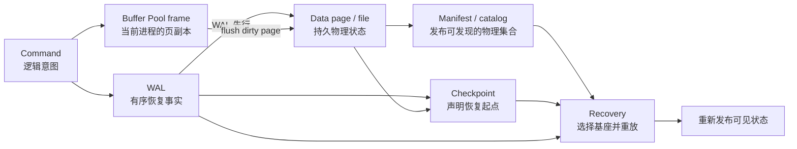
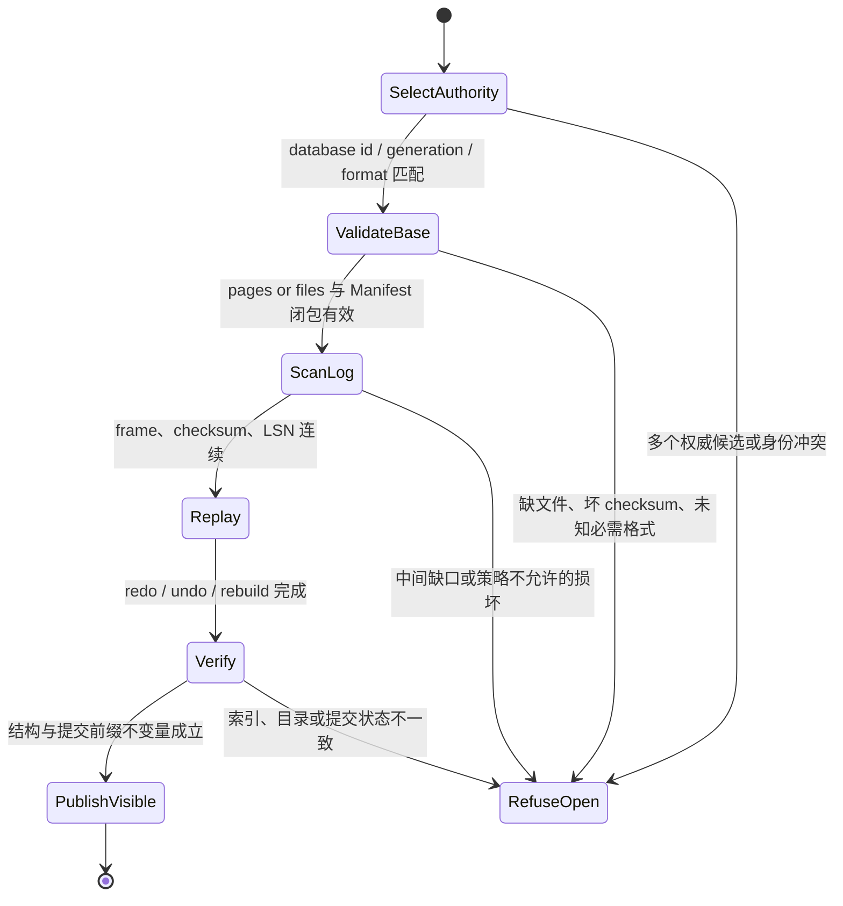

“数据库把数据写进文件”是一个几乎没有解释力的描述。一次更新可能先改变内存中的逻辑记录，再生成日志记录、污染 Buffer Pool 中的页、异步写回数据文件，最后由 Checkpoint 或 Manifest 宣布某一组物理对象构成新的恢复基座。进程此刻能读到、设备断电后仍保留、重启程序能够重新发现并解释，是三件不同的事。

本文的中心论点是：**存储引擎的正确性不来自 Page、Buffer Pool、WAL、Manifest 这些名词是否齐全，而来自它们之间可证明的权威关系、持久化顺序和原子发布边界。** 同一套逻辑键值可以由原地更新的页式引擎、不可变文件组成的 LSM 引擎，或 Copy-on-Write 树承载；它们的物理协议不同，但都必须回答同一组问题：什么状态对读者权威，什么 ACK 可以跨崩溃，恢复从哪一代开始，旧历史何时才不再需要。

这是“存储引擎与数据库内核”专题的第一篇。它只建立系统地图和恢复合同，不在一篇文章里压缩后续所有索引与版本算法。WAL 的文件与设备语义可先参考 [《WAL 到底保证什么》](/signal-grid-blog/posts/write-ahead-log-durability-and-crash-recovery/)；下一篇将进入 [《B+Tree：页分裂、Latch、Copy-on-Write 与范围扫描》](/signal-grid-blog/posts/b-plus-tree-page-splits-latches-copy-on-write-range-scans/)。

## 正确性合同先于文件布局

存储引擎对上层暴露的不是“若干文件”，而是一段 history。客户端提交 `Put(k, v)` 后，至少有四种边界可能被误写成同一个“成功”：

| 边界        | 精确定义                                                       | 它不能单独证明什么                     |
| ----------- | -------------------------------------------------------------- | -------------------------------------- |
| Accepted    | 命令已进入进程内的队列、MemTable 或 Buffer Pool                | 进程崩溃后仍存在                       |
| Visible     | 某个被定义的读视图已经允许观察该结果                           | 结果已经跨过设备持久化屏障             |
| Durable     | 在声明的故障模型下，恢复所需的字节已进入稳定存储               | 重启程序一定能找到、解析并组成一致状态 |
| Recoverable | 有完整的基座、元数据闭包与连续日志，可恢复到一个合法的提交前缀 | 当前实例已经完成恢复并重新向读者发布   |

同步提交通常要求 `ACK_durable(t) -> commitLSN(t) <= durableWAL`。异步提交可以先让事务 Visible 再跨越 Durable，但这必须成为公开的丢失窗口，而不能继续使用相同的“已持久提交”措辞。反过来，一份 SST 文件即使每个字节都已落盘，若权威 Manifest 从未引用它，它仍只是孤立物；一份 WAL 即使完整，若恢复缺少比较器、Schema 或文件集版本，也未必可解释。

因此，一份最小正确性合同应先固定：

- **读语义**：读者依据哪个提交序号、快照或 root generation 判断 Visible；
- **确认语义**：普通成功、异步成功与 durable success 分别跨过哪条持久前沿；
- **故障模型**：只覆盖进程崩溃、内核崩溃、整机断电，还是还覆盖介质永久损坏；
- **恢复目标**：恢复到最新合法提交前缀、指定时间点，还是某个已发布快照；
- **格式闭包**：解释数据所需的 Schema、Comparator、Codec、加密密钥和版本来自哪里。

没有这些前提，讨论页大小、缓存命中率或 `fsync` 次数只是性能讨论，尚未形成数据库承诺。

## 五类状态共同组成一条恢复链

下图使用“原地页更新 + WAL”的常见路径展示职责。它不是所有引擎都必须采用的模板：LSM 通常把新数据写成不可变 SST，并用 Manifest 发布文件集；Copy-on-Write 树则可能通过发布新 root generation 取代页级 REDO。但任何实现都需要等价的权威状态与恢复入口。



这五类对象的职责不能互相顶替：

- **Page** 是固定粒度的地址、校验、局部更新与 I/O 单元。它可以承载表记录、索引节点、空闲空间或系统目录，但“固定 8 KiB”“slotted page”都只是实现选择。
- **Buffer Pool** 管理 Page 在内存中的 frame、pin、latch、dirty 状态、淘汰和写回。它是缓存与并发协调层，不是崩溃后的事实来源。
- **WAL** 为尚未安全进入数据文件的变更保留有序恢复事实，并约束提交 ACK 和脏页写回。记录可以是物理、逻辑或 physiological；“有 WAL”并不说明采用哪一种。
- **Manifest** 在不可变文件引擎中常指物理文件集的版本日志；更一般地，存储引擎需要某种权威元数据发布点，说明哪些文件、root 或 generation 属于当前状态。
- **Checkpoint** 声明一个可验证的恢复起点或恢复摘要，缩短需要扫描的历史。它不等于“所有业务事务在这里提交”，也不天然等于备份。

不同引擎会把这些职责组合成不同的持久化形状：

| 设计家族              | 正常写路径                                           | 物理发布点                              | 崩溃恢复的主要输入                                    |
| --------------------- | ---------------------------------------------------- | --------------------------------------- | ----------------------------------------------------- |
| 原地页更新 + WAL      | 修改 Buffer Pool 中的页，后台覆盖数据文件            | WAL commit 与 Checkpoint/control record | 稳定数据页、Checkpoint 摘要、后续 WAL                 |
| MemTable + 不可变文件 | 写 MemTable/WAL，Flush 生成 SST，Compaction 换文件集 | Manifest Version 与 current pointer     | 已发布 SST 集合、仍必需的 WAL、格式元数据             |
| Copy-on-Write Tree    | 复制受影响页面或 delta，保留旧 generation            | 新 root generation 或等价 Manifest      | 最新权威发布的完整 root、其可达页面闭包、可选增量日志 |

表中名称描述的是设计族而非互斥产品标签：一个系统可以在不同层混合它们，例如表数据使用页式 WAL，二级结构使用不可变文件，快照再采用 CoW。混合不会免除证明，反而要求每一层的提交位置被同一个恢复 Manifest 或事务边界绑定。

这里还要区分两种常被都叫作“catalog”的东西。SQL Schema Catalog 描述表、列和索引等逻辑对象，通常本身也受事务保护；RocksDB 一类系统的 MANIFEST 描述 SST、WAL 等**物理存储集合**。两者都可能是恢复闭包的一部分，但不能用一个术语掩盖各自的发布协议。

## 一次写入跨越的是多个有序前沿

考虑页式引擎中的事务 `T7`：它把页 `P42` 上的键 `k` 从 `v1` 改成 `v2`，日志记录位于 `LSN=105`，提交记录位于 `LSN=112`。一种典型但非唯一的执行链是：

1. 在持有页 latch 时读取 `P42`，验证页代际与记录位置；
2. 生成描述更新的 WAL record，并为它分配全局单调的 LSN；
3. 在 Buffer Pool frame 中更新记录，把 `pageLSN(P42)` 推进到 `105`，标记 dirty；
4. 写入 `T7 COMMIT@112`；
5. 只有当 WAL 已稳定到至少 `112`，才返回 durable ACK；
6. 后台线程可以在稍后写回 `P42`，但写回前必须保证 WAL 已稳定到至少该页的 `pageLSN`；
7. Checkpoint 再把恢复起点和必要摘要持久发布。

把前沿显式化，错误就不再是模糊的“磁盘慢”：

```text
writtenWAL    = 已交给内核或设备栈的最大 LSN
durableWAL    = 已跨过承诺持久化屏障的最大 LSN
dirtyPage[p]  = 内存页尚未写入稳定数据文件的最早相关 LSN
stablePage[p] = 稳定数据页声明的 pageLSN
visibleCommit = 当前读语义允许观察的最大提交位置
recoveryStart = 已发布 Checkpoint 证明可以开始恢复的位置
```

对采用 steal/no-force 与 WAL 的页式引擎，关键不变量至少包括：

```text
I1  flush(page p) 之前，durableWAL >= pageLSN(p)
I2  durableAck(txn t) 之前，durableWAL >= commitLSN(t)
I3  重做一条已在 pageLSN 覆盖范围内的记录不会重复改变逻辑结果
I4  Checkpoint 声明完整恢复闭包：未进入稳定基座的状态都能由连续日志与摘要从 recoveryStart 重建
```

`I1` 是 Write-Ahead Rule，不是“代码先调用 append”的弱顺序；它要求日志真正跨过协议声明的稳定边界。`I2` 约束客户端承诺。`I3` 使恢复能够根据 pageLSN 跳过已应用更新。`I4` 才允许裁剪更早的恢复历史。采用不可变文件或 CoW 的引擎会换一组不变量，但仍然必须给出等价证明，而不是宣布“没有原地覆盖，所以不会坏”。

### 结果未知不是存储损坏

若 `COMMIT@112` 已稳定，进程却在 ACK 到达客户端前崩溃，恢复后 `T7` 可以合法地存在。客户端看到的是 `Unknown`，不是“数据库随机提交”。协议必须用事务 ID 或幂等键查询裁决，不能因为本次 RPC 超时就重放一个不同身份的写入。

这也说明 Visible、Durable 与客户端 Known 是三条不同轴：结果可以 Durable 但客户端 Unknown；可以 Visible 但按异步策略尚未 Durable；恢复期间也可以 Durable 且 Recoverable，但服务还没重新开放读取。

## Page 与 Buffer Pool 只在明确的所有权下协作

一个常见 Page 会包含页 ID、格式版本、校验值、最近更新的 LSN、slot 目录、自由空间边界和访问方法私有区。PostgreSQL 的[页布局文档](https://www.postgresql.org/docs/current/storage-page-layout.html)展示了一种具体 slotted-page：页头保存 `pd_lsn` 与 checksum，item identifier 把稳定的槽位号和可移动的记录字节分开，B-tree sibling link 则放在 access-method 专属区域。这个实例说明页内间接层的价值，但不意味着所有数据库都使用相同字段或页大小。

Buffer Pool 中的每个 frame 还需要区分三种完全不同的控制：

| 控制             | 保护什么                                  | 常见误解                       |
| ---------------- | ----------------------------------------- | ------------------------------ |
| Pin / reference  | frame 在使用期间不能被淘汰、复用          | pin 不保证页内容不会被并发修改 |
| Page latch       | 线程读取或改变页内物理结构时的短临界区    | latch 不是事务隔离锁           |
| Transaction lock | 键、记录或谓词在事务 history 中的并发语义 | lock 通常不负责 frame 生命周期 |

一次安全写回不是简单的 `write(frame)`。Flusher 必须取得该页可写的一致镜像或遵循 copy-before-write 协议，验证 frame 仍对应预期 `(pageId, generation)`，先推进 WAL 持久前沿，再写页、校验结果，最后只在 frame 未被更新到更高 pageLSN 时清除 dirty 标记。否则，旧 I/O completion 可能把仍有新修改的页误标为 clean。

缓存策略同样不能改变事实来源。InnoDB 的[官方 Buffer Pool 文档](https://dev.mysql.com/doc/refman/8.4/en/innodb-buffer-pool.html)使用 LRU 变体管理页；其他引擎可能使用 CLOCK、分片队列、直接 I/O 或 `mmap`。这些差异影响命中率和争用，却都不能让一个 dirty frame 自动成为 durable state。进程重启后，Buffer Pool 通常可以丢弃并重新预热；真正不可丢的是恢复它所依赖的持久数据与顺序证据。

### Torn page 需要额外的故障协议

WAL 先行只说明有足够的 REDO/UNDO 证据，不保证一次多扇区页写不会留下新旧字节混合。引擎可能使用 full-page image、doublewrite、原子写能力、CoW page 或校验失败后从副本修复。选择哪一种取决于设备原子写粒度与恢复算法；只有 checksum 而没有冗余时，通常只能检测损坏，不能凭空恢复正确字节。

## WAL 与 Manifest 记录的是两种不同历史

WAL 通常回答：“哪些逻辑或页级更新必须在崩溃后重放、撤销或忽略？” Manifest/physical catalog 则回答：“当前数据库由哪些持久对象组成，打开时应采用哪一代物理布局？” 二者有时共用同一套事务日志，有时是两个独立 journal；正确性取决于它们之间的发布顺序，而不是文件名。

RocksDB 的官方文档明确区分了 [WAL 与 MANIFEST 两类 journal](https://github.com/facebook/rocksdb/wiki/Journal)：WAL 用于恢复尚在内存中的更新，MANIFEST 以 Version Edit 记录在磁盘上的文件集合；`CURRENT` 再指向当前 Manifest。这个设计是 LSM 的具体实例，不应反推所有数据库都必须创建名为 `MANIFEST` 的文件。

对于“生成新文件再发布”的引擎，可以把安全发布写成闭包不变量：

```text
I5  publishedManifest(g) 引用的每个必需文件都已完成写入、同步并通过身份与校验验证
I6  CURRENT = g 只有在 Manifest(g) 自身稳定后才能原子切换并稳定
I7  Recovery(g) 所需的 WAL 范围连续存在，或 Manifest 已证明相应状态进入不可变文件
I8  未被任何已发布 generation 引用的新文件只是 orphan，不得影响可见状态
```

创建 SST 成功后、Manifest 发布前崩溃，留下 orphan 通常是可回收的空间泄漏；Manifest 已引用 SST、SST 却尚未稳定，则是可恢复性破坏。两种故障在文件列表里都表现为“有一个文件”，但风险完全相反。

原地页引擎也有等价问题。根页、空闲页图、关系目录或表空间元数据可能通过 WAL 和系统事务一起更新，而不是单独 Manifest 文件。工程评审应寻找**谁原子发布当前物理世界**，而不是机械搜索某个文件名。

## Checkpoint 发布恢复基座，不替事务提交

Checkpoint 的核心作用是缩短恢复必须重新解释的 history，并为日志保留提供下界。它不能把尚未 durable 的事务变成 durable，也不能只凭一个时间戳证明所有页都已安全。

不同引擎的 Checkpoint 语义差异很大：

- sharp checkpoint 可以暂停或收敛写入，将约定范围的 dirty state 全部稳定后发布起点；
- fuzzy checkpoint 允许事务继续运行，记录 dirty-page、active-transaction 或文件集摘要，恢复仍可能从更早位置 REDO；
- LSM flush/checkpoint 可能把 MemTable 变成 SST，并通过 Manifest 宣布哪些 WAL 已不再是本地恢复必需；
- CoW 树可能把一个完整可达的新 root generation 作为 Checkpoint 式发布点。

ARIES 在恢复时执行 Analysis、Redo、Undo，并利用 dirty-page table 的 `recLSN` 缩小 REDO 起点；这是一套经典的 steal/no-force 页式恢复方法，不是 Checkpoint 一词的唯一含义。PostgreSQL 的 [WAL 配置文档](https://www.postgresql.org/docs/current/wal-configuration.html)说明其 Checkpoint 如何写回脏页并给出 REDO 起点；InnoDB 的[模糊检查点文档](https://dev.mysql.com/doc/refman/8.4/en/innodb-checkpoints.html)则明确描述小批写页和从 checkpoint LSN 前向扫描。两者足以说明：名字相同，状态摘要和 I/O 协议仍须逐实现阅读。

一条通用的 Checkpoint 发布链可以表达为：

1. 选定候选切点 `c`，冻结或记录解释 `c` 所需的状态向量；
2. 将 Checkpoint **宣称已进入基座**的数据页、不可变文件和格式元数据写稳；对仍 dirty/active 的状态，记录足以从更早日志重建的摘要与起点；
3. 验证校验值、对象身份、日志连续性与 generation；
4. 持久化 Checkpoint/Manifest record；
5. 原子发布 current pointer 或恢复控制记录；
6. 只有全部 reader、replica、backup 与 PITR 依赖也越过旧历史后，才推进回收前沿。

第 6 步不能由 Checkpoint 独自证明。日志是否可删还受副本、备份、长读者与去重窗口约束，完整回收协议见 [《历史什么时候可以删除》](/signal-grid-blog/posts/history-retention-recovery-frontier-log-truncation-dedup-gc/)。

## 恢复必须先选择权威世界，再开始重放

重启时最危险的做法，是扫描目录后把“文件名最大”“修改时间最新”的对象拼成一个数据库。可靠恢复应先选择唯一的数据库身份与已发布 generation，再验证其依赖闭包：



日志尾部的部分 frame 可以在格式明确规定时截断；日志**中间**缺口通常不能被解释成同一种无害尾部。未知的必需格式字段也不能默认忽略，除非编码契约明确标记它是 forward-compatible optional field。恢复的安全默认值应是 fail closed，而不是尽量打开一个无法证明的状态。

下面的故障矩阵把每个 crash cut 对应到可验证结果，而不是泛泛要求“做故障注入”：

| Crash cut                                   | 合法恢复结果                                       | 必须拒绝的结果                                |
| ------------------------------------------- | -------------------------------------------------- | --------------------------------------------- |
| WAL frame 只写了一部分，尚未 durable ACK    | 按 frame 长度与 checksum 截去无效尾部；事务不承诺  | 把残缺 payload 当成一条完整更新               |
| Commit record 已稳定，ACK 丢失              | 恢复事务；客户端按同一事务 ID 查询到 Committed     | 因客户端超时而自动回滚已持久提交              |
| dirty page 写回前 WAL 未稳定                | 协议应阻止该 I/O；测试命中即判实现失败             | 用“恢复大概率能工作”接受违反 Write-Ahead Rule |
| 新 SST 稳定，Manifest 尚未引用              | 继续使用旧 generation；新文件作为 orphan 隔离      | 按文件名自动纳入当前状态                      |
| Manifest 已发布但必需文件缺失或 checksum 错 | 拒绝打开，或从有权威证明的副本/备份修复            | 静默跳过该文件并返回不完整数据                |
| 数据已写回，Checkpoint record 尚未稳定      | 从旧 Checkpoint 开始，多做 REDO 但得到同一合法前缀 | 猜测新起点并提前删除旧 WAL                    |
| Checkpoint 已发布，回收依赖仍停在旧位置     | 保留旧日志或让落后参与者重新建基线                 | 仅因本地恢复不再需要就删除全局仍依赖的历史    |
| 恢复完成，索引与主数据摘要不一致            | 保持不可服务，重建派生索引或执行权威修复           | 先开放流量、把错误交给后台“慢慢修”            |

## 证明要覆盖逻辑前缀、物理闭包与每一个 crash cut

单元测试“写完再打开能读到”只覆盖了最友好的路径。存储引擎至少需要三层相互独立的证据。

第一层是**状态模型**。用一个简单、较慢的 reference model 保存提交事务的逻辑 map，把引擎在任意操作前缀后的可见结果与它比较。模型必须包含 Abort、重复命令、事务结果未知和恢复，而不只是 `put/get`。

第二层是**结构不变量**。页式 WAL 引擎检查 `stablePageLSN <= durableWAL`、页 ID/代际、free-space 边界、checksum 和索引可达性；不可变文件引擎检查 Manifest 引用闭包、key-range 元数据、文件 checksum 与 WAL 连续范围。恢复后还应从权威主数据重建派生索引，并与持久索引做全量或采样摘要比对。

第三层是**持久化状态机测试**。将 `append`、`force`、data-page write、Manifest sync、current-pointer publish、目录同步和 ACK 分别设为 failpoint；对同一随机 workload 枚举或系统采样 crash cut，重新打开数据库并验证：

```text
RecoveredState == 某个被合同允许的 committed prefix
DurableAckedTransactions subset-of RecoveredState
AbortedTransactions disjoint-from RecoveredState
PublishedGeneration has complete durable dependency closure
RepeatedRecovery(RecoveredState) == RecoveredState
```

最后一条证明恢复自身可以再次崩溃并安全重来。若测试只在“恢复完成后”验证，而没有在 Analysis/Redo/Undo、Manifest rotation 或 root publication 中间再次杀进程，仍遗漏了最棘手的递归故障。

性能证据也必须与正确性证据分开。Buffer Pool 命中率、WAL group commit、Checkpoint 写速率和恢复时间可以指导容量选择，却不能证明提交前缀合法。相反，reference model 证明语义，也不代表 Checkpoint 不会把前台写入拖入秒级尾延迟。后续的放大与尾延迟章节会专门讨论这条性能链。

## 边界清楚后，组件才成为一个引擎

Page 给物理状态划分可校验的更新单元，Buffer Pool 管理当前进程里的副本与写回，WAL 保存尚未进入稳定数据面的有序事实，Manifest 或等价 catalog 发布可发现的物理世界，Checkpoint 再为恢复和历史保留建立经过验证的切点。它们组合后的保证是：在声明的故障模型内，系统能从一个权威基座和连续历史恢复到合法提交前缀。

这条保证不自动覆盖介质永久丢失、静默损坏修复、跨节点共识、长时间 PITR 或事务外副作用；它也不允许用 Visible、Durable、Recoverable 和客户端 Known 互相替换。真正可靠的设计会为每条边界保留可查询前沿，并让 crash-cut 测试验证发布顺序。

下一篇 [《B+Tree：页分裂、Latch、Copy-on-Write 与范围扫描》](/signal-grid-blog/posts/b-plus-tree-page-splits-latches-copy-on-write-range-scans/) 将把这套合同落到一种有序页结构：父节点可以暂时落后，物理页可以分裂或换代，但逻辑键空间仍必须可达、可扫描并可恢复。

### 一手资料与实现文档

- C. Mohan 等，[ARIES 原论文与 IBM Research 说明](https://research.ibm.com/publications/aries-a-transaction-recovery-method-supporting-fine-granularity-locking-and-partial-rollbacks-using-write-ahead-logging)
- PostgreSQL，[Write-Ahead Logging](https://www.postgresql.org/docs/current/wal-intro.html)、[Database Page Layout](https://www.postgresql.org/docs/current/storage-page-layout.html) 与 [WAL Configuration](https://www.postgresql.org/docs/current/wal-configuration.html)
- MySQL 8.4，[InnoDB Buffer Pool](https://dev.mysql.com/doc/refman/8.4/en/innodb-buffer-pool.html)、[Redo Log](https://dev.mysql.com/doc/refman/8.4/en/innodb-redo-log.html) 与 [InnoDB Checkpoints](https://dev.mysql.com/doc/refman/8.4/en/innodb-checkpoints.html)
- RocksDB，[Journal](https://github.com/facebook/rocksdb/wiki/Journal)、[MANIFEST](https://github.com/facebook/rocksdb/wiki/MANIFEST) 与 [Track WAL in MANIFEST](https://github.com/facebook/rocksdb/wiki/Track-WAL-in-MANIFEST)
- SQLite，[Atomic Commit](https://www.sqlite.org/atomiccommit.html) 与 [Database File Format](https://www.sqlite.org/fileformat.html)
