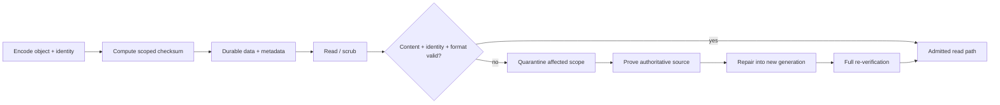
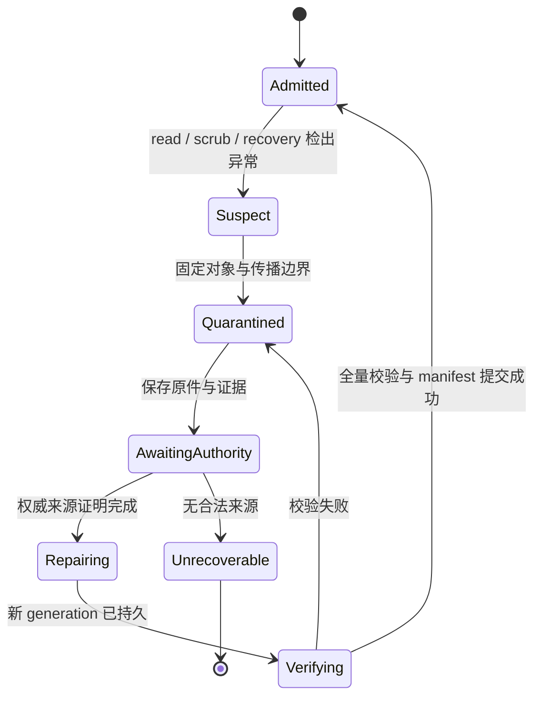
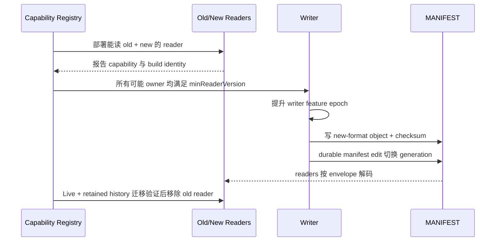

“文件可以打开，查询也返回了结果”不能证明数据正确；“checksum mismatch 已修复”也不能证明修复后的字节来自正确历史。静默 bit rot、torn write、错误 DMA、内存翻转、软件 bug、误复制和格式误读，可能分别破坏 payload、索引、WAL、MANIFEST 或解释这些字节的 schema。

本文的中心论点是：**Checksum 只提供某个作用域内的不一致证据；完整性保证必须继续完成定位、隔离、权威来源证明、可追溯修复、重新验证与显式准入，并让格式演进始终保留可判定的读写兼容和回滚边界。**

上一篇[放大与尾延迟](/signal-grid-blog/posts/storage-amplification-tail-latency-compaction-stalls/)证明了后台重写的成本边界；本篇转向这些长期读写与重写之后，字节是否仍然可信。范围聚焦一个存储引擎内部的文件、page/block、WAL、metadata/manifest 和格式生命周期。副本之间怎样选择权威历史、怎样阻止坏副本污染 quorum、怎样执行 anti-entropy，属于 Availability 的[静默数据损坏专题](/signal-grid-blog/posts/silent-data-corruption-checksum-scrubbing-isolation-authoritative-repair/)；本文会把本地证据交给那套协议，但不会重复其复制层裁决。

## 完整性合同要同时约束内容、身份和可解释性

最窄的完整性定义是“读出的字节和写入时相同”。生产存储还必须回答另外两件事：这些字节是不是**本来应该出现在这个位置的对象**，以及当前 reader 是否能按**正确格式版本**解释它们。

可以把一次可接受读取写成：

```text
Readable(object, generation, reader)
  = ContentValid(bytes, checksumScope)
    AND IdentityValid(objectId, generation, manifest)
    AND FormatSupported(readerCapabilities, formatEnvelope)
    AND ObjectAdmitted(objectId, generation)
```

四项缺一不可：

- block checksum 正确，不代表目录里放的是所需 SST；误复制的另一个完整文件也可能所有 block 都自洽；
- 文件名和大小正确，不代表 payload 没有发生局部翻转；
- payload 与身份正确，旧 reader 仍可能把新编码误解成合法旧值；
- 修复文件通过校验，若尚未完成 provenance 与重新准入，也不能重新进入 compaction、备份或查询路径。

完整性故障也要和可用性、持久性分开：副本在线只说明能够响应；fsync 成功只说明某个写入边界被声明持久；checksum 通过只说明覆盖范围内的 bytes 与校验值一致。软件在计算 checksum 之前就写错业务值时，三者都可能“成功”。业务 invariant、账本对账与副本协议仍是更高层证据。



这条链路的安全目标不是“任何损坏都能自动恢复”，而是：不能把未检测、未证明或未验证的字节重新标记为健康。

## Checksum 的强度首先取决于覆盖范围

校验算法很重要，但“对什么计算、校验值存在哪里、身份如何绑定”通常更先决定盲区。

| 作用域                    | 能检测的典型问题                              | 仍然看不到什么                                       |
| ------------------------- | --------------------------------------------- | ---------------------------------------------------- |
| Record / key-value        | 单条记录内的 payload 或内存翻转               | 记录丢失、顺序错误、整个合法记录被替换               |
| Page / block              | 局部 torn/corrupt block、已存压缩字节损坏     | 完整 block 被放到错误对象或 offset、校验后的内存损坏 |
| Full file                 | 复制、传输或静态存储中的文件级变化            | 错文件与期望文件的身份关系                           |
| Manifest entry            | 文件号、generation、size、checksum 与层级映射 | manifest 自身缺失、回滚或被错误版本解释              |
| Dataset / backup manifest | 文件集合的缺失、重复与错误组合                | 未被 manifest 纳入的外部业务事实                     |

一个可迁移的 checksum envelope 至少包含：

```text
IntegrityEnvelope {
  objectId,
  generation,
  logicalOffsetOrKeyRange,
  payloadLength,
  checksumAlgorithm,
  checksumVersion,
  checksumValue,
  formatVersion,
  creationEpoch,
  producerBuildId
}
```

将 object identity、generation、offset/range 和长度纳入校验上下文，可以减少“内容没变但被放错位置”的盲区。RocksDB 同时使用 block checksum、full-file checksum，并把文件 checksum 与算法名作为 FileMetadata 持久到 MANIFEST；这说明 block 内容校验与文件身份/生命周期需要不同层次的证据。

CRC32C 适合检测非恶意随机错误，硬件支持下成本较低；更宽的 hash 可以进一步降低偶然碰撞概率。它们都不自动提供来源认证：能够改写 payload 的攻击者也可能重算未加密 checksum。面对对抗性篡改，需要把 MAC、签名、密钥版本和访问控制纳入 threat model，不能仅把 CRC 换成 SHA 后就宣称“防篡改”。

校验值与数据处于同一 sector、同一 page 或同一错误域时，也可能一起损坏。没有一种布局消除所有共同故障；需要用 WAL/manifest、冗余副本、备份清单和业务 invariant 建立独立证据。算法名和版本必须随值保存，否则 checksum 算法升级后无法判断旧值该怎样验证。

## Read Verification 与 Scrubbing 覆盖不同温度的数据

读时校验能快速发现热数据损坏：用户查询、compaction、备份或恢复触达 block 时立即验证。它无法保护多年不读的冷对象；如果坏数据先被备份、复制或参与 compaction，损坏可能在被发现前扩大。

Scrubbing 是主动遍历已声明对象集合并验证内容、身份与格式。一次可审计 scrub 不是“后台任务跑过”，而应产生：

```text
ScrubRun {
  scrubId,
  manifestGeneration,
  objectSetDigest,
  cursor,
  startedAt,
  completedAt,
  verifiedBytes,
  skippedObjectsAndReasons,
  corruptObjects,
  verifierBuildAndAlgorithms,
  ioBudget
}
```

`objectSetDigest` 与 manifest generation 固定本轮应该覆盖的集合。在线系统在 scrub 期间会创建和删除文件，所以不能拿结束时的目录列表反推覆盖率；新 generation 由下一轮或增量队列负责，旧 generation 即使已不再服务，也要按保留协议判断是否仍需验证备份或快照引用。

OpenZFS 的官方 `zpool scrub` 文档区分两件事：普通 scrub 遍历池中全部数据并验证每个 block 的 checksum，在 mirror、RAIDZ 或 dRAID 有可信冗余时还会自动修复发现的损坏；resilver 只检查 ZFS 已知已经过期的数据，例如替换或重新接入设备后需要补齐的范围。这种区分很重要：**修复已知缺口不等于主动发现未知冷损坏；遍历发现 mismatch 也不等于系统一定拥有可用于修复的健康副本。**

### Torn write 与 bit rot 需要不同故障注入

Torn write 发生在更新单位没有原子完成时：page 的一部分来自新版本，另一部分仍是旧版本，或者 data 已写而 checksum/metadata 未同步。bit rot 则是已经持久的内容在之后发生翻转。两者可能都表现为 checksum mismatch，但恢复证据不同：

- torn write 要结合 WAL、page LSN/sequence、double-write 或 copy-on-write 提交边界判断旧/新版本；
- bit rot 要从另一个经权威证明的副本、备份或可重算源取得内容；
- 如果 checksum 与 payload 一起回到一个自洽旧版本，只做内容校验可能发现不了 rollback，需要 generation/manifest 单调性；
- metadata torn write 可能使正确数据失去引用，也可能引用尚未持久的输出，不能只 scrub data blocks。

SQLite 的 atomic commit 文档明确列出 sector 非原子、写重排与 fsync 假设，并以 journal/提交点构造崩溃原子性。这里的工程启示不是照搬 SQLite 文件格式，而是把硬件原子性假设、data/metadata 顺序和崩溃点写进测试模型。

Scrub 自身会消耗大量顺序读、CPU 校验和 cache。它必须有 I/O budget、可持久 cursor 与最大数据年龄目标；但“业务繁忙”不能无限延期，否则 cold-data detection latency 无上界。暂停和重启后的 cursor 要绑定原 object generation，不能把“扫描过旧文件号”当成“扫描过后来复用的文件”。

## 发现异常后的第一动作是隔离，不是原地覆盖

checksum mismatch、无法解析 footer、manifest 缺项、generation 回退和 unsupported format 都应进入同一完整性状态机，但保留不同 reason code。



`Quarantined` 至少意味着：

- 被隔离作用域不再为普通查询提供成功结果；
- 不作为 compaction、复制、备份增量或新副本的健康输入；
- 原始 bytes、checksum、路径、offset、发现调用和读取错误被保留；
- 对同一对象的并发 reader 获得一致的 corruption/隔离结果，而不是部分返回旧 cache；
- 监控记录影响的 key range、snapshot、tenant 和恢复依赖。

Checksum 的计算作用域不自动等于隔离作用域。若只有一个 data block 失败，而文件索引、对象身份、相邻 block 边界和缓存来源都仍可信，并且引擎能在查询、Compaction、复制与备份的每条路径上强制同一范围 Fence，才可以隔离该 block 对应的 key range；否则至少扩大到整个文件。若 footer/index、文件身份或 full-file checksum 失败，就应隔离整个文件；若 MANIFEST 的 generation 或引用关系不可判定，则要隔离整个 Version/数据集，必要时停止该副本对外服务。选择原则是**最小但足以封闭传播路径的可证明作用域**：宁可在证据不足时扩大隔离，也不能为保持可用性假设相邻对象天然健康。

若另一个 cache entry 仍有一份通过 checksum 的内容，也不能立即覆盖磁盘原件。cache 可能来自同一错误读取或属于不同 generation；先把候选内容与 manifest、sequence 和 authoritative source 绑定，再决定修复。

原地覆盖会同时销毁法证证据和回滚点。更安全的做法是写出新的 immutable generation，完成 checksum 与持久化，再用一次原子 manifest edit 切换引用；旧坏 generation 按保留策略隔离，直到修复被证明和审计窗口关闭。

## Repair 的核心是权威证明和 Provenance

Repair 不是“找一份 checksum 正确的 bytes”。候选来源可能是：同一复制组的已提交副本、带 manifest 的备份、不可变对象存储、parity 重建结果、WAL 重放或从更高层业务事实重新物化。每一种来源都要回答：

1. 它对应哪个 object/generation/key range？
2. 它的提交或快照位置是什么？
3. 谁证明它属于当前权威历史，而不是旧快照或分叉？
4. 它的内容、格式与 checksum 怎样验证？
5. 修复会不会覆盖故障后已经合法提交的新数据？

这些答案形成 repair certificate：

```text
RepairCertificate {
  repairId,
  damagedObjectAndGeneration,
  detectionEvidence,
  authorityProof,
  sourceLocationAndDigest,
  sourceCommitOrSnapshotPosition,
  targetGeneration,
  decoderAndFormatVersion,
  writerBuildId,
  manifestEditId,
  postRepairScrubId,
  approvedBy
}
```

Availability 层的 committed index、term/epoch、quorum certificate 或 snapshot manifest 可以成为 `authorityProof`；本地存储层只消费并保存这份证明，不能因为来源节点当前是 Leader、文件 mtime 更新或 checksum 与多数相同就自行裁决真相。

RocksDB 的 `RepairDB` 官方描述是“recover as much data as possible”。这是一种 salvage 工具，不是复制协议意义上的权威 repair：它可能丢弃无法恢复的内容并创建新的 MANIFEST。生产系统必须把“尽量打开数据库”和“无损恢复已承诺前缀”作为两个不同结果。

Repair 还必须幂等。相同 `repairId` 重试应返回既有 target generation；在新文件写完但 manifest 未切换时崩溃，恢复后只能删除未引用输出或继续同一 edit，不能同时把两份 generation 都宣告 active。manifest 切换完成后，旧 reader 与旧进程必须被 generation/epoch fencing，避免继续发布基于坏对象的结果。

## 故障矩阵必须证明坏数据不会重新流入服务

只在文件上随机翻一个 bit、看到报警，不足以证明恢复协议。故障应覆盖 data、checksum、metadata、缓存、修复来源和格式边界，并给出明确通过条件。

| 故障注入                                 | 预期检测                                 | 必须证明的隔离/恢复结果                                      |
| ---------------------------------------- | ---------------------------------------- | ------------------------------------------------------------ |
| SST/page payload 单 bit 翻转             | read 或 scrub checksum mismatch          | 受影响 generation 不再返回成功，也不进入 compaction/backup   |
| payload 与 checksum 跨 sector torn write | checksum、长度或 sequence 失败           | WAL/旧 generation 恢复到合法提交边界，不拼接新旧 page        |
| 完整合法文件被放错文件号                 | manifest identity/range/digest 不符      | block checksum 通过也拒绝准入                                |
| CURRENT/MANIFEST 尾部截断                | 原子 edit 或 log record 校验失败         | 只应用完整 edit 前缀，不引用未持久输出                       |
| checksum 值自身损坏                      | envelope/footer 校验失败                 | 不把 payload 自动判坏或自动重算后放行，保留证据并求权威来源  |
| block cache 中内容翻转                   | memory/key-value protection 或重读不一致 | 驱逐坏 entry，磁盘对象状态按独立验证决定                     |
| repair 写完、manifest 切换前崩溃         | 未引用 target generation                 | 重启后同 repairId 继续或安全清理，不出现双 active generation |
| manifest 切换后旧进程恢复                | generation/owner epoch 过期              | 最终 reader/writer 拒绝旧进程结果                            |
| 新格式文件交给旧 reader                  | capability/format gate 拒绝              | 不按旧布局返回“看似合法”数据                                 |
| scrub 被暂停并跨过文件复用               | cursor generation 不匹配                 | 不虚报覆盖率，从正确 object set 继续                         |

通过条件应同时检查：查询结果、错误作用域、隔离状态、复制/备份出口、manifest 活跃集合、repair certificate、post-repair scrub 和业务 invariant。只检查进程没有崩溃，可能恰好证明系统会静默返回坏值。

恢复测试还要包含负证据：当所有候选来源都无法证明权威时，系统必须保持 `Unrecoverable` 或降级只读，而不是为了恢复可用性选择“最新 mtime”。Fail closed 在这里不是永远停机，而是把不可证明的数据风险暴露给上层恢复决策。

## 格式演进是一条能力与字节同时迁移的协议

存储格式不只是一个 `version=3` 字段。一个完整 envelope 应让 reader 在读取可变 payload 前先验证固定前导：

```text
FormatEnvelope {
  magic,
  envelopeVersion,
  payloadFormatVersion,
  requiredFeatureBits,
  minReaderVersion,
  writerVersion,
  objectIdentity,
  payloadLength,
  checksumAlgorithmAndValue,
  headerChecksum
}
```

未知 magic、未知 required feature、超长 length、header checksum 失败或不支持的 format 必须显式拒绝。把未知字段跳过只在格式规范声明其可忽略、长度有界且不影响 invariant 时才安全。

### Mixed-version 期间先扩 Reader，再启用 Writer

安全顺序是：



部署了新 reader 不等于可以写新格式。必须先证明所有可能读到该对象的在线、备用、恢复和运维工具都具备能力，再通过 feature gate/epoch 允许 writer 产生新字节。无法报告能力的离线 owner 必须先被 epoch/fencing 排除；它重新加入时只能先升级、验证或从兼容基线重建，不能带着旧 reader/writer 身份直接恢复服务。gate/epoch 必须由最终接受新文件和 MANIFEST edit 的存储 owner 校验；旧 writer 在 gate 提升后也要被 fencing，否则它可能用旧规则覆盖新 generation。

在 mixed-version 窗口：

- 新 reader 应能读取所有仍被保留的旧格式和新格式；
- writer 是否继续写旧格式、双写两种格式或只写新格式，由明确 feature epoch 决定；
- compaction/repair/backup/restore 也是 writer 或 reader，不能漏出 capability 集合；
- checksum 算法迁移可暂时保存 old+new 两个算法及覆盖范围；只有每个保留对象都已携带并验证新 checksum，或仍明确绑定可用的旧 verifier，才可退役旧算法，单纯 scrub 一遍不会自动改写 checksum metadata；
- manifest edit 要绑定 output format、checksum 和 required features，不能先发布引用、后异步补元数据。

移除旧格式 reader capability 的门槛比“当前 Live SST 已经回写完成”更高：所有受支持 Snapshot、Checkpoint、Backup、PITR 基线和离线修复材料都必须已经迁移，或继续绑定可执行的旧 decoder。否则在线集群看似升级完成，第一次历史恢复才会发现最关键的备份不可读。

RocksDB 的 table footer 通过 magic、format version、checksum type 和固定布局判定 reader 能力；MANIFEST 以 Version Edit 恢复已知一致状态。具体格式属于具体实现，但通用原则相同：payload 的解释版本和“哪些文件构成当前数据库”的元数据版本必须一起可恢复。

### Rollback Boundary 由已经写出的权威字节决定

在启用新 writer 之前，应用二进制通常还能直接回滚；第一份 new-only object 被 manifest 宣告 active 后，旧二进制若不能读取它，就已经越过 binary-only rollback boundary。安全回滚只剩三种选择：

1. 旧版本实际上具备 forward reader capability；
2. 保持新 reader，关闭新写入，把所有 active object 重写回旧格式，并验证没有新语义无法降级；
3. 从启用新格式前的快照恢复，并明确处理此后已承诺写入——这通常是数据回退，不是透明回滚。

因此，迁移计划要记录 `lastOldReadableGeneration`、feature enable epoch、第一份 new-only manifest edit 和降级可逆性。新增的字段若承载旧格式无法表达的业务 invariant，即使可以机械转码，也不能安全回滚。

备份同样要保存 format manifest、decoder/build 制品、checksum 算法和密钥/字典等依赖。只有 bytes 而没有可执行 reader 的长期备份，不具备可证明恢复能力。

## 专题终点不是“永不损坏”，而是损坏始终可判定

Checksum 把无声错误变成某个明确作用域内的异常；Scrubbing 把检测从热数据扩展到冷数据；隔离阻止被判坏的作用域进入读取、compaction、复制和备份；Repair certificate 则证明替换内容来自哪条权威历史。格式演进只有先迁 reader capability、再启用 writer，并记录 new-only bytes 的回滚边界，才能在滚动升级和恢复工具之间保持可判定性。

这些机制不保证所有损坏都有健康副本，也不证明软件计算出的业务值本来就正确。它们保证的是：**未经验证的对象不能伪装成健康，未经证明的来源不能伪装成修复，未知格式不能伪装成可读。**

至此，存储专题从数据布局、写入与恢复、索引/缓存和 compaction 成本，走到了内容完整性与格式寿命的终点。跨副本的静默损坏隔离、权威选择和服务恢复，继续交给 Availability 的[《副本都在线，数据却已经错了》](/signal-grid-blog/posts/silent-data-corruption-checksum-scrubbing-isolation-authoritative-repair/)。

### 一手论文与官方实现资料

- [RocksDB：Full File Checksum and Checksum Handoff](https://github.com/facebook/rocksdb/wiki/Full-File-Checksum-and-Checksum-Handoff)——block/file checksum、MANIFEST metadata 与跨存储层 checksum handoff。
- [RocksDB：Online Verification](https://github.com/facebook/rocksdb/wiki/Online-Verification)——write batch、memtable 与 block cache 中的 key-value protection。
- [RocksDB：MANIFEST](https://github.com/facebook/rocksdb/wiki/MANIFEST)——Version Edit、CURRENT 与原子组恢复语义。
- [RocksDB：Basic Operations / Checksums](https://github.com/facebook/rocksdb/wiki/Basic-Operations#checksums)——读时校验、`VerifyChecksum()` 与 `RepairDB` 的产品边界。
- [RocksDB 源码：table/format.cc](https://github.com/facebook/rocksdb/blob/main/table/format.cc)——table magic、footer format version、checksum type 与 reader validation。
- [SQLite：Atomic Commit](https://www.sqlite.org/atomiccommit.html)——sector、write reorder、fsync 与 torn/incomplete commit 的硬件假设和恢复设计。
- [PostgreSQL 18：Data Checksums](https://www.postgresql.org/docs/18/checksums.html) 与 [`pg_checksums`](https://www.postgresql.org/docs/18/app-pgchecksums.html)——page checksum 的验证时点、离线全量扫描与集群一致配置边界。
- [OpenZFS：zpool-scrub](https://openzfs.github.io/openzfs-docs/man/master/8/zpool-scrub.8.html)——scrub、resilver、校验覆盖和修复的官方语义。
