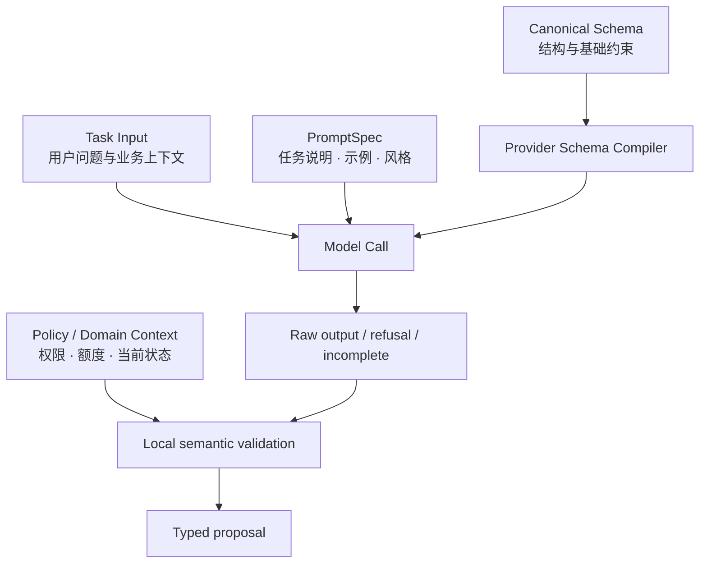
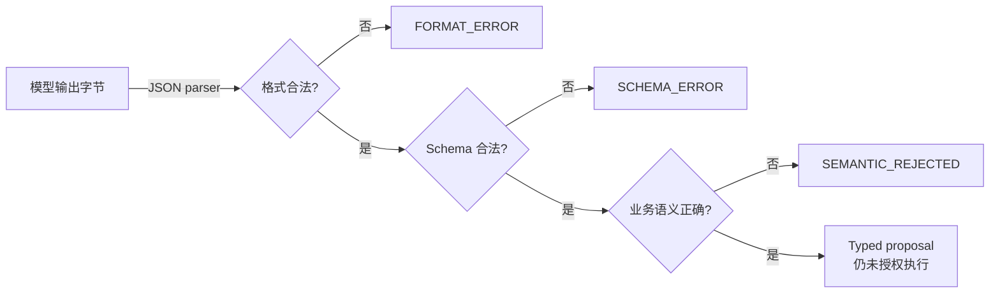
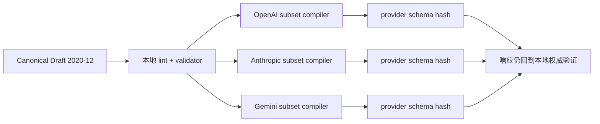
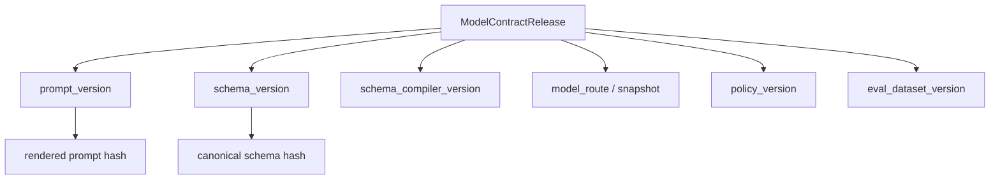
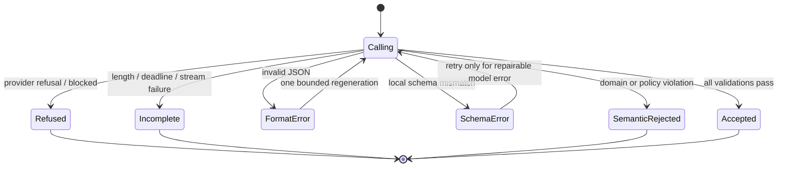
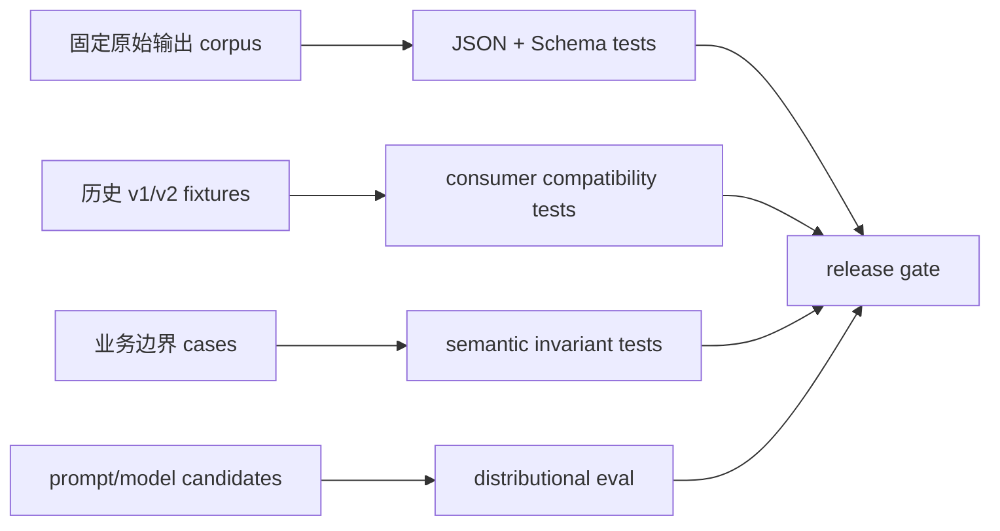

“请严格返回下面格式的 JSON”看起来像接口定义，实际只是自然语言愿望。模型可能加 Markdown 围栏、漏字段、把数值写成说明文字，也可能生成完全符合 JSON Schema、却在金额币种、证据时点和账户权限上都错的对象。

Structured Output 改善了其中一层：在受支持的模型与 Schema 子集内，供应商可以约束输出形状。但**格式合法、Schema 合法和业务语义正确仍是三次不同的判定**。Prompt 负责描述任务，Schema 负责数据形状，确定性代码负责业务事实；任何一层都不能冒充下一层。

本文是“AI Agent 后端工程”专题的 Chapter 07。上一篇 [Model Gateway：流式事件、限流、预算与可替换模型](/signal-grid-blog/posts/model-gateway-streaming-rate-limits-fake-model/) 已经建立供应商中立的调用边界；本章在这个边界上定义可演进的输出协议。下一章才让模型用 Tool Call 请求外部操作，这里所有 `ActionDraft` 都只是没有执行权的草案。

资料核对于 **2026-08-28**：OpenAI、Anthropic 与 Gemini 当前都提供 Schema 约束输出，但接受的 JSON Schema 只是各自支持的子集，参数位置、拒绝/截断表示和流式事件也不同。Anthropic 当前原生请求使用 `output_config.format`，旧 `output_format` 处于迁移兼容期；Gemini 当前 Interactions API 使用 JSON response format；OpenAI Responses 使用 `text.format` 一类结构化配置。正文不把任何一家当前字段当作跨供应商标准。

## Prompt 描述任务，但它不拥有输出契约

一个生产调用至少包含四类相互独立的输入：



- **Prompt** 解释模型要完成什么任务以及如何使用上下文；
- **Canonical Schema** 定义应用愿意接收的数据形状；
- **Provider Schema Compiler** 把 Canonical Schema 降到目标端点实际支持的子集；
- **Policy/Domain Context** 用调用发生时的权威事实判断对象能否被业务接受。

这四者应分别版本化。只记录一段最终 Prompt 文本，无法回答生产事故里的关键问题：当时使用哪个 Schema？哪个模型路由？哪些权限和金额规则？供应商 Adapter 是否把可选字段改写成了 `null` 联合？

### 消息角色也是 Provider 契约，不是通用真理

应用可以内部区分：平台不变量、任务指令、用户数据、助手输出和 Tool 结果。但不同 API 的角色与优先级不完全相同，而且仍在演进。Gateway 应把内部 `PromptSpec` 编译到当前 Provider 协议，而不是在全系统散播 `system`、`developer` 等供应商字段。

尤其不能把检索文档、网页或 Tool Result 拼进高优先级指令。它们是**不可信数据**，即使其中出现“忽略上文”也不能改变应用 Policy。角色能帮助模型理解边界，却不是授权机制；真正的权限检查仍在模型之外。

## 合法 JSON、Schema 匹配与语义正确是三道不同的门

考虑这个输出：

```json
{
  "schema_version": "2.0",
  "incident_id": "inc-2048",
  "evidence": [],
  "hypotheses": [],
  "action": {
    "kind": "hold_funds",
    "account_id": "acct-other-tenant",
    "amount": "10.00",
    "currency": "BTC"
  }
}
```

它是合法 JSON，也可能完全匹配一个过于宽松的 Schema，但仍可能在业务上错误：当前租户没有这个账户，冻结工具只接受结算币种，金额超出授权额度，而且没有证据支持动作。



三层的责任不能合并：

| 层次 | 典型机制 | 能证明 | 不能证明 |
| --- | --- | --- | --- |
| 格式 | JSON parser / JSON mode | 字节能解析为 JSON 值 | 是所需对象、字段完整 |
| 结构 | Structured Output + 本地 JSON Schema/Pydantic | 类型、必填、枚举、局部范围符合声明 | 数据真实、用户有权、跨字段业务规则成立 |
| 语义 | 领域服务、Policy、权威查询 | 对当前业务快照满足明确不变量 | 外部副作用已经成功 |

Structured Output 也不消除拒绝、截断或服务错误。OpenAI 官方文档明确要求单独处理 refusal 与 incomplete；Anthropic 与 Gemini 也有各自停止/阻断原因。应用必须把这些终态和普通 Schema 成功分开。

## JSON Schema 是一种语言，Provider 支持的只是方言子集

JSON Schema Draft 2020-12 定义了 dialect、vocabulary、`properties`、`required`、`additionalProperties`、组合子模式等语义。它不是“一个随便长得像 Schema 的 JSON”。Canonical Schema 应声明方言，并由项目固定的本地验证器解释。

下面是 TradeOps 调查计划的简化 Schema。为了可读性，它只展示顶层和行动草案；正式版本还会为 Evidence 与 Hypothesis 定义 `$defs`。

```json
{
  "$schema": "https://json-schema.org/draft/2020-12/schema",
  "$id": "https://signal-grid.example/schemas/investigation-plan/2-0",
  "type": "object",
  "additionalProperties": false,
  "required": [
    "schema_version",
    "incident_id",
    "evidence",
    "hypotheses",
    "action"
  ],
  "properties": {
    "schema_version": { "const": "2.0" },
    "incident_id": { "type": "string", "minLength": 1, "maxLength": 64 },
    "evidence": { "type": "array", "items": { "$ref": "#/$defs/evidence" }, "maxItems": 20 },
    "hypotheses": { "type": "array", "items": { "$ref": "#/$defs/hypothesis" }, "maxItems": 10 },
    "action": {
      "oneOf": [
        { "$ref": "#/$defs/no_action" },
        { "$ref": "#/$defs/hold_funds" }
      ]
    }
  },
  "$defs": {
    "evidence": {
      "type": "object",
      "additionalProperties": false,
      "required": ["evidence_id", "source", "observed_at", "summary"],
      "properties": {
        "evidence_id": { "type": "string" },
        "source": { "enum": ["order_service", "ledger_service"] },
        "observed_at": { "type": "string", "format": "date-time" },
        "summary": { "type": "string", "maxLength": 500 }
      }
    },
    "hypothesis": {
      "type": "object",
      "additionalProperties": false,
      "required": ["statement", "evidence_ids"],
      "properties": {
        "statement": { "type": "string", "maxLength": 500 },
        "evidence_ids": {
          "type": "array",
          "items": { "type": "string" },
          "uniqueItems": true
        }
      }
    },
    "no_action": {
      "type": "object",
      "additionalProperties": false,
      "required": ["kind", "reason"],
      "properties": {
        "kind": { "const": "none" },
        "reason": { "type": "string" }
      }
    },
    "hold_funds": {
      "type": "object",
      "additionalProperties": false,
      "required": ["kind", "account_id", "amount", "currency", "reason"],
      "properties": {
        "kind": { "const": "hold_funds" },
        "account_id": { "type": "string" },
        "amount": { "type": "string", "pattern": "^[0-9]+\\.[0-9]{2}$" },
        "currency": { "type": "string", "enum": ["USD", "USDT"] },
        "reason": { "type": "string" }
      }
    }
  }
}
```

### Canonical Schema 不能直接假定 Provider 接受

OpenAI 当前严格函数 Schema 要求对象关闭 `additionalProperties`，并要求 properties 中字段都列入 `required`，可选值通常要通过包含 `null` 表达；Anthropic 和 Gemini 也各自支持 JSON Schema 子集并可能拒绝复杂或不支持的关键字。Anthropic 当前还明确记录一种边缘情况：`enum`/`const` 值可能只发生大小写偏差，响应却正常完成且没有专用 stop reason；这正好说明“Provider 成功终止”仍不等于“本地 Schema 已通过”。`format: "date-time"` 在 JSON Schema 规范里还涉及 annotation/assertion vocabulary，不能假定每个实现都会强制检查。

因此编译链应是：



编译器只能做有证明的等价或收窄转换。若目标端点不支持某个关键约束，不应悄悄删除后继续声称 strict；可以把该约束保留在本地语义校验，并明确记录 Provider 只保证了较弱形状。每次调用应记录 canonical schema version、provider schema hash 和 compiler version。

## Typed Model 让边界好用，领域校验仍要读取权威上下文

以下示例以当前稳定的 Python 3.14.7 与 Pydantic 2.13.4 为基线；Pydantic 2.14.0b1 仍是预发布版本，不作为正文契约。代码把四个概念拆开：`Evidence` 是观察事实，`Hypothesis` 是推断，`ActionDraft` 是候选动作，`InvestigationPlan` 是携带版本的输出信封。

```python
import json
from datetime import UTC, datetime
from decimal import Decimal, InvalidOperation
from typing import Annotated, Literal

from pydantic import (
    AwareDatetime,
    BaseModel,
    ConfigDict,
    Field,
    TypeAdapter,
    field_validator,
)


class BoundaryModel(BaseModel):
    model_config = ConfigDict(extra="forbid", frozen=True, strict=True)


class Evidence(BoundaryModel):
    evidence_id: Annotated[str, Field(min_length=1, max_length=64)]
    source: Literal["order_service", "ledger_service"]
    observed_at: AwareDatetime
    summary: Annotated[str, Field(min_length=1, max_length=500)]


class Hypothesis(BoundaryModel):
    statement: Annotated[str, Field(min_length=1, max_length=500)]
    evidence_ids: tuple[str, ...]

    @field_validator("evidence_ids")
    @classmethod
    def evidence_ids_are_unique(cls, value: tuple[str, ...]) -> tuple[str, ...]:
        if len(value) != len(set(value)):
            raise ValueError("evidence_ids must be unique")
        return value


class NoAction(BoundaryModel):
    kind: Literal["none"]
    reason: str


class HoldFunds(BoundaryModel):
    kind: Literal["hold_funds"]
    account_id: str
    amount: Annotated[str, Field(pattern=r"^[0-9]+\.[0-9]{2}$")]
    currency: Literal["USD", "USDT"]
    reason: str


ActionDraft = Annotated[NoAction | HoldFunds, Field(discriminator="kind")]


class InvestigationPlan(BoundaryModel):
    schema_version: Literal["2.0"]
    incident_id: Annotated[str, Field(min_length=1, max_length=64)]
    evidence: Annotated[tuple[Evidence, ...], Field(max_length=20)]
    hypotheses: Annotated[tuple[Hypothesis, ...], Field(max_length=10)]
    action: ActionDraft


PLAN_ADAPTER: TypeAdapter[InvestigationPlan] = TypeAdapter(InvestigationPlan)


class SemanticError(ValueError):
    pass


def validate_semantics(
    plan: InvestigationPlan,
    *,
    expected_incident_id: str,
    tenant_accounts: frozenset[str],
    observed_at_or_before: datetime,
    maximum_hold_usdt: Decimal,
) -> None:
    if (
        observed_at_or_before.tzinfo is None
        or observed_at_or_before.utcoffset() is None
    ):
        raise SemanticError("observation cutoff must be timezone-aware")
    if plan.incident_id != expected_incident_id:
        raise SemanticError("plan is bound to another incident")

    evidence_ids = {item.evidence_id for item in plan.evidence}
    if len(evidence_ids) != len(plan.evidence):
        raise SemanticError("evidence ids must be unique")
    if any(item.observed_at > observed_at_or_before for item in plan.evidence):
        raise SemanticError("evidence cannot be observed in the future")
    for hypothesis in plan.hypotheses:
        if not set(hypothesis.evidence_ids) <= evidence_ids:
            raise SemanticError("hypothesis references unknown evidence")

    if isinstance(plan.action, HoldFunds):
        if plan.action.account_id not in tenant_accounts:
            raise SemanticError("account is outside the authenticated tenant")
        if plan.action.currency != "USDT":
            raise SemanticError("this workflow only holds settlement currency")
        try:
            amount = Decimal(plan.action.amount)
        except InvalidOperation as error:
            raise SemanticError("amount is not an exact decimal") from error
        if not Decimal("0") < amount <= maximum_hold_usdt:
            raise SemanticError("amount exceeds the approved semantic bound")
        if not plan.evidence:
            raise SemanticError("a hold draft requires evidence")


raw = b'''{
  "schema_version":"2.0",
  "incident_id":"inc-2048",
  "evidence":[{
    "evidence_id":"ev-1",
    "source":"ledger_service",
    "observed_at":"2026-08-28T03:00:00Z",
    "summary":"available balance changed after settlement"
  }],
  "hypotheses":[{
    "statement":"a settlement event was applied twice",
    "evidence_ids":["ev-1"]
  }],
  "action":{
    "kind":"hold_funds",
    "account_id":"acct-7",
    "amount":"25.00",
    "currency":"USDT",
    "reason":"preserve funds while the ledger is reconciled"
  }
}'''


def reject_duplicate_keys(
    pairs: list[tuple[str, object]],
) -> dict[str, object]:
    result: dict[str, object] = {}
    for key, value in pairs:
        if key in result:
            raise ValueError(f"duplicate JSON object key: {key}")
        result[key] = value
    return result


def reject_non_json_constant(value: str) -> None:
    raise ValueError(f"non-standard JSON constant: {value}")


# 先在字节边界拒绝重复键和非标准常量；Pydantic 再按 JSON 语义验证类型。
json.loads(
    raw,
    object_pairs_hook=reject_duplicate_keys,
    parse_constant=reject_non_json_constant,
)
plan = PLAN_ADAPTER.validate_json(raw, strict=True)
validate_semantics(
    plan,
    expected_incident_id="inc-2048",
    tenant_accounts=frozenset({"acct-7"}),
    observed_at_or_before=datetime(2026, 8, 28, 4, 0, tzinfo=UTC),
    maximum_hold_usdt=Decimal("100.00"),
)
```

Pydantic 在这里是本地运行时边界，不是供应商 Structured Output 的代名词。JSON 对象键先经过唯一性检查，因为 RFC JSON 对重复名字只说明行为不可预测，而常见 Parser 可能静默采用最后一个值；等重复 `incident_id` 已经被折叠后，Schema 再严格也无法恢复歧义。`incident_id`、两个数组上限、每个 hypothesis 内引用唯一性和 aware datetime 随后在本地模型中再次表达；否则 Canonical Schema 宣称的边界会在 Provider 之后悄悄消失。调用方提供的比较截止时间也显式拒绝 naive datetime，避免在语义校验中泄漏一个不稳定的 `TypeError`。即使 SDK 能从 Pydantic 自动生成 Schema，仍要检查生成结果是否落在目标 Provider 子集内，并在返回后再次走本地验证。`strict=True` 也不代替格式预检或 `validate_semantics`。

更重要的是：这个对象通过后仍只是提案。账户权限、审批与真正冻结资金属于后续 Policy 和 Tool 执行层。

## Schema 和 Prompt 必须按不同兼容规则演进

Prompt 改词可能改变输出分布，却不一定改变结构；Schema 加字段可能不改变任务意图，却可能让旧消费者崩溃。把两者绑成一个 `v7` 会让回归定位失去意义。



建议记录一个不可变发布对象，而不是只记录模板名称：

```python
from dataclasses import dataclass


@dataclass(frozen=True, slots=True)
class ModelContractRelease:
    release_id: str
    prompt_version: str
    prompt_sha256: str
    schema_version: str
    schema_sha256: str
    schema_compiler_version: str
    model_route: str
    policy_version: str
    eval_dataset_version: str
```

### “只加一个字段”不总是向后兼容

兼容性必须指明谁生产、谁消费：

| 变更 | 旧消费者读取新输出 | 新消费者读取旧输出 | 隐藏风险 |
| --- | --- | --- | --- |
| 新增可选字段，旧端允许未知字段 | 通常兼容 | 通常兼容 | 严格 `extra=forbid` 的旧端会拒绝 |
| 新增必填字段 | 旧端可能拒绝未知字段 | 新端缺字段必然失败 | 需要双读或转换期 |
| 删除字段 | 旧端缺字段失败 | 新端通常可读 | 旧 Prompt 仍可能引用该字段 |
| 枚举增加值 | 穷举旧端可能崩溃 | 通常兼容 | Schema 看似加法，代码却是破坏性变更 |
| 字段改类型或单位 | 不兼容 | 不兼容 | 最危险的是名字不变、含义变化 |

在严格封闭对象里，新增字段往往会被旧消费者的 `additionalProperties: false` 拒绝。一个稳妥的重大版本迁移可以采用：先发布能读取 v1/v2 的消费者；再让模型生产 v2；观察与回放历史数据；最后停止 v1。不要让模型“自己看情况输出 v1 或 v2”。

金额字段若从“美元浮点数”改为“十进制字符串 + currency”，这是语义升级，不应复用同一个版本号。版本化的价值正是阻止两个长得相似的字段被误认为同一契约。

## 修复、重试与拒绝必须先按失败层分类

把所有失败输出重新发给模型说“请修复 JSON”，会掩盖根因、扩大成本，甚至把恶意内容提升成新指令。先分类，再决定动作：



- **Refusal/blocked** 是合法的非成功结果，不能按 Schema 错误处理；
- **Incomplete** 可能留下半截 JSON，必须丢弃为业务输入，不能靠补 `}` 猜测；
- **Format error** 在没有 Structured Output 的旧路由上可允许一次有界重新生成；
- **Schema error** 应记录精确路径和契约版本；如果是 Adapter 编译错误，重试模型没有意义；
- **Semantic rejection** 通常必须回到权威数据、人工或任务逻辑，不能让模型改数字直到通过。

修复重试要消费同一个 Deadline、Token 和费用预算，并拥有新的 attempt ID。原始失败值只进入去敏后的受控 Trace；不要把整段不可信输出放入高优先级 Prompt。若要反馈，可发送结构化、最小化的错误，例如 `{"path":"action.currency","code":"unsupported_currency"}`。

流式 Structured Output 也只适合做 UI 预览。Gemini 当前文档说明结构化流片段可拼接成最终 JSON；其他端点也有文字或内容增量。无论供应商是否声称片段是“有效的部分 JSON”，应用都应等到明确完成事件、解析和本地校验后才产生领域对象。

## 契约测试应证明兼容性，而不是证明模型永不出错

这类协议适合用版本化语料和确定性断言测试：



确定性测试至少覆盖：未知字段、缺失字段、额外枚举、`null` 与缺失的区别、超长数组、重复证据 ID、未来时间、跨租户账户、错误单位、拒绝和截断。Prompt/模型质量则要用 Eval 数据集判断正确率与分布，不能因为十次示例都通过便声明契约可靠。

还要测试每个 Provider Schema Compiler：给定同一 Canonical Schema，输出 hash 是否稳定；不支持关键字时是否明确失败；可选字段转换是否仍能映射回同一领域类型。这样供应商文档或 SDK 升级造成的差异会在进入生产前暴露。

## 结论：Schema 约束形状，权威系统决定含义

Structured Output 的正确位置，是把模型自由文本收敛成可解析、可验证的候选对象。它能显著减少格式和字段错误，却不会证明金额、来源、时间、授权和业务状态为真。

稳定的输出接口由四件事共同构成：独立版本的 PromptSpec、应用拥有的 Canonical Schema、显式的 Provider 子集编译器，以及读取权威上下文的本地语义校验。拒绝、截断、格式错误、Schema 错误和语义拒绝必须保留为不同终态。

下一篇 [从零实现 Tool Calling Loop：选择、执行、观察与终止](/signal-grid-blog/posts/tool-calling-loop-from-scratch/) 将使用同样的分层：模型只能生成结构化 Tool Call，Runtime 验证并执行，再把按 `call_id` 关联的结果送回下一轮。

## 参考资料

- [JSON Schema Draft 2020-12](https://json-schema.org/draft/2020-12) 与 [Core Specification](https://json-schema.org/draft/2020-12/json-schema-core)：Dialect、Vocabulary、对象与组合 Schema 的规范语义。
- [OpenAI Structured Outputs](https://developers.openai.com/api/docs/guides/structured-outputs)：Schema 子集、strict 输出、拒绝和 incomplete 等边界。
- [OpenAI Function Calling](https://developers.openai.com/api/docs/guides/function-calling)：严格函数参数的对象关闭、必填字段与并行调用要求。
- [Anthropic Structured Outputs](https://platform.claude.com/docs/en/build-with-claude/structured-outputs)：`output_config.format`、strict tool use、Schema 限制和当前迁移说明。
- [Gemini Structured Outputs](https://ai.google.dev/gemini-api/docs/structured-output)：JSON response format、Schema 子集、流式拼装与语义校验提醒。
- [Pydantic 2.13.4 Release](https://github.com/pydantic/pydantic/releases/tag/v2.13.4)、[Models](https://docs.pydantic.dev/latest/concepts/models/)、[Strict Mode](https://docs.pydantic.dev/latest/concepts/strict_mode/) 与 [Unions](https://docs.pydantic.dev/latest/concepts/unions/)：稳定版本基线和本文本地 typed boundary 示例的运行时语义。
