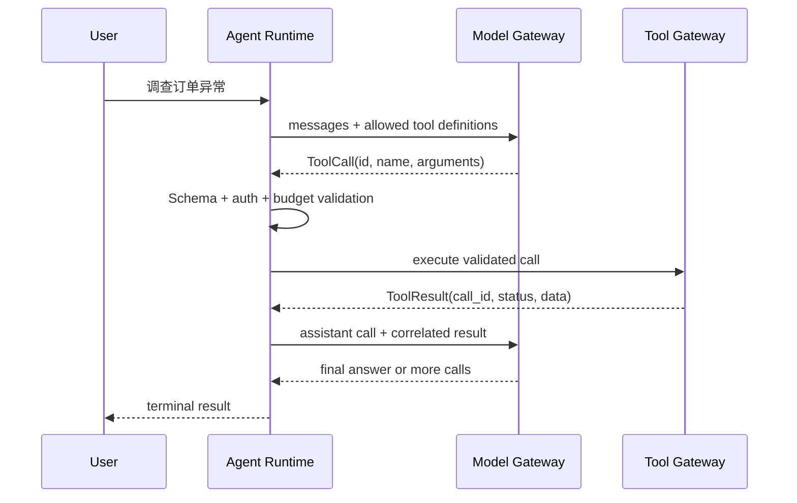
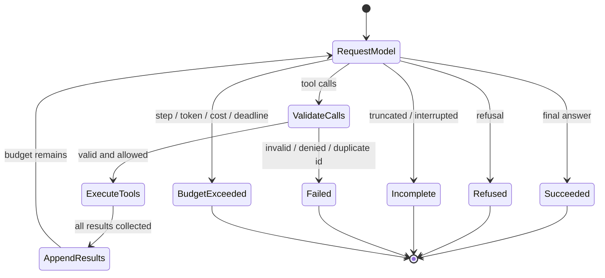
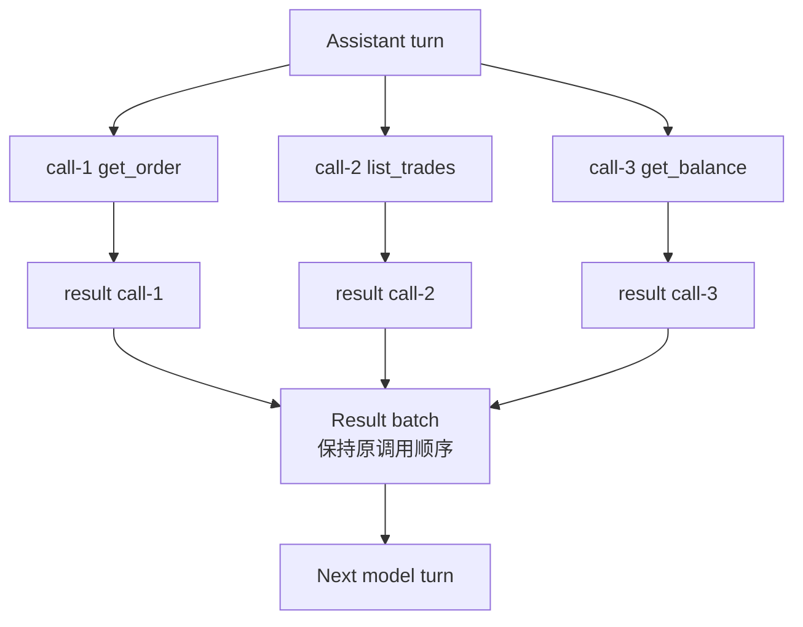
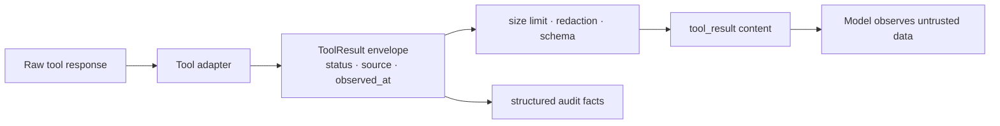
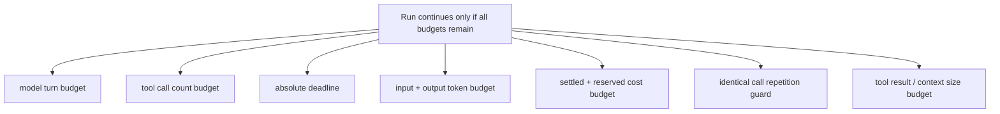
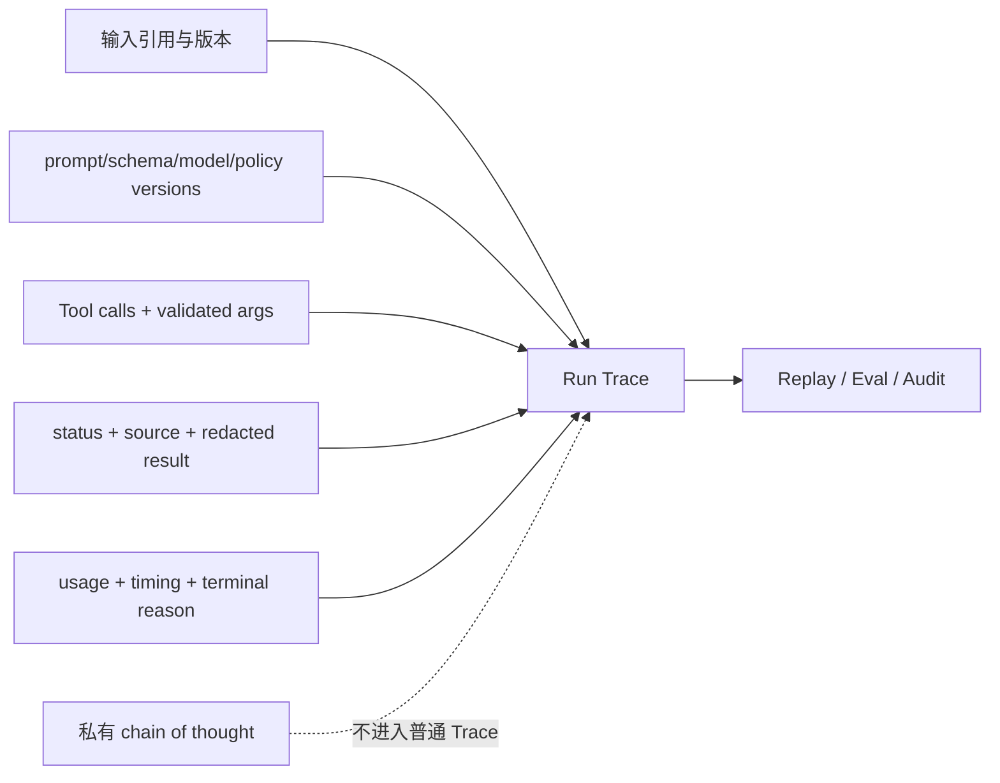

Tool Calling 经常被描述成“模型调用一个 Python 函数”。这句话省略了系统里最重要的事实：模型只生成一份结构化调用提案，真正选择可用工具、验证参数、执行代码、关联结果、控制重试并决定何时停止的，是应用 Runtime。

一个只写 `while response.tool_calls:` 的循环可以跑 Demo，却回答不了生产问题：同一轮有三个调用时怎样关联结果？一个失败后其他两个是否继续？模型反复请求同一个查询怎么办？客户端 Deadline 到期时谁取消工具？为什么不能把 Tool Call ID 直接当写操作幂等键？哪些轨迹能审计，哪些模型私有推理不应保存？

本文是“AI Agent 后端工程”专题的 Chapter 08。上一篇 [Prompt 不是接口：Structured Output、JSON Schema 与版本演进](/signal-grid-blog/posts/structured-outputs-json-schema-prompt-versioning/) 已经建立格式、Schema 与业务语义三层校验；本章把同一原则用于一次完整 Tool Loop。工具契约的错误、来源、分页和长期版本治理将在下一章单独展开，本章使用三个窄而只读的 TradeOps 查询工具。

协议资料核对于 **2026-08-28**：OpenAI Responses 以 function call item 和 `call_id` 关联 `function_call_output`；Anthropic Messages 以 `tool_use.id` 关联下一条消息中的 `tool_result.tool_use_id`；Gemini 当前函数调用同样要求应用执行自定义工具并返回对应结果。各家的消息角色、结果块和思维状态回传要求不同，因此代码依赖 Chapter 06 的供应商中立 `ModelPort`，不直接拼任何一家请求 JSON。

## Tool Call 是提案，Runtime 才拥有执行权

完整交互有五个阶段：模型看见当前上下文和可用工具；模型提出零个或多个调用；Runtime 验证并执行；Tool Result 作为观察返回模型；模型继续选择工具或给出最终答案。



模型看见 Tool Schema 不等于获得工具权限。Runtime 必须从已认证的执行上下文计算当前轮的 `allowed_tools`，再与注册表取交集：

\[
Available(run, step) = Registered \cap Authorized(identity, tenant, risk) \cap Enabled(release) \cap Relevant(step)
\]

模型返回的名称和参数全部是不可信输入。即使供应商提供 strict tool schema，本地仍要验证：一方面 Provider 支持的是 Schema 子集，另一方面租户、资源、额度和当前状态不属于静态 JSON Schema。

Server-side Tool 与自定义 Client Tool 也要分开。某些 Provider 能在自己一侧执行搜索或代码工具；本文只讨论**应用拥有执行权的 Client Tool**。只有这类工具的副作用、Deadline、身份和审计能由下文 Runtime 直接控制。

## 最小循环首先是一台有明确终态的状态机

循环不应把“没有 Tool Call”一律当成功。模型还可能拒绝、达到输出上限、被内容策略阻断、响应不完整或协议失败。Runtime 需要有限状态和互斥终态：



状态机至少维护以下权威状态：

- `model_turns`：已经完成多少次模型调用；
- `tool_calls`：已经接纳多少个工具调用，而不是只数循环轮次；
- `input/output tokens` 与已结算费用；
- 绝对 Deadline；
- 当前允许工具集合及其 Policy 版本；
- 已出现的 call ID 和规范化调用签名；
- 按顺序追加的 assistant turn 与 Tool Result batch。

模型不拥有这些计数器，也不能通过文字说“忽略 max steps”来重置它们。终止判定要在发模型请求前、接收 Usage 后和执行 Tool 前分别发生，因为不同预算在不同位置才变得可知。

## Call ID 只负责关联，顺序和幂等还需要独立语义

一次模型响应可能包含多个调用。每个调用必须有本轮唯一的 `call_id`，每个结果必须精确关联一个调用；既不能漏结果，也不能多返回陌生 ID。关联 ID 的内容保持 opaque，但 Adapter 必须在构造 Runtime 对象前验证它是非空字符串且不超过协议上限；类型注解本身不会在运行时拒绝空值或异常长度。



### Call ID 不是写操作幂等键

`call_id` 是模型协议里的相关 ID，重放同一业务动作时 Provider 可能生成新 ID，恢复一次 Run 时也可能重新读取历史 ID。幂等键必须由应用按业务 Operation 创建并持久化，例如 `run_id + logical_action_id`，并由目标系统执行去重。把临时 call ID 当幂等键，会让模型重试绕过去重保护。

本文工具全部只读，因此可以安全并行。若同一轮包含两个互相依赖的调用，模型本就不应把它们放在同一个并行 batch；Runtime 也不能猜测依赖关系。写操作默认串行，并在进入生产前具有独立幂等、审批和 Unknown Outcome 语义。

### 并行完成顺序不应改变对话顺序

网络完成次序可能是 `call-3, call-1, call-2`。为了回放稳定，Runtime 可以并发执行，却按模型原始调用顺序构造结果 batch。结果对象携带 `call_id`，因此关联不依赖数组位置；固定顺序则让 Trace、Fake 与缓存更容易比较。

Anthropic 当前协议还要求一次 assistant tool-use 后立即返回对应的 tool-result blocks，并对 block 顺序有明确约束；OpenAI、Gemini 的外层消息结构不同。这正是 Adapter 的职责：Runtime 保存语义化 batch，Provider Adapter 编译为目标 API 要求的消息/内容项。

## Tool Result 是不可信观察，不是新的系统指令

工具可能返回数据库里的用户文本、网页内容或第三方错误消息。这些内容即使来自成功 HTTP 响应，也可能含 Prompt Injection、过期事实或敏感字段。Runtime 应构造有边界的结果信封，而不是把原始字符串拼进高优先级 Prompt。



本章使用的结果类型包含：

```python
from dataclasses import dataclass, field
from typing import Literal


@dataclass(frozen=True, slots=True)
class ToolCall:
    call_id: str
    name: str
    arguments: dict[str, object]


@dataclass(frozen=True, slots=True)
class ToolResult:
    call_id: str
    name: str
    status: Literal[
        "OK", "INVALID_ARGUMENT", "DENIED", "NOT_FOUND", "TIMEOUT", "FAILED"
    ]
    content: dict[str, object]
    observed_at: str
    is_error: bool
    truncated: bool = False
```

Tool 的异常不能原样返回模型。堆栈、SQL、内部 URL 和凭证进入受控日志；模型只得到稳定错误码和安全说明。结果还要限制序列化字节数与列表项数。把一万条成交全部塞回上下文，既增加成本，也可能挤掉用户目标和早期证据。

本章暂时只定义最小状态。下一章会继续补齐来源版本、分页 cursor、新鲜度、部分结果和稳定错误分类。

## 用一份可运行代码把选择、执行、观察和终止连起来

下面的示例只依赖 Python 3.14 标准库。`ScriptedModel` 模拟第一轮请求三个只读工具、第二轮给出答案；真实 Provider Adapter 只需实现同一个 `ModelPort`。为了让完整程序保持紧凑，示例中的三项只读能力在整个 Run 内固定不变；生产 Runtime 应在**每一轮模型请求前**根据身份、观察结果和 Policy 版本重新计算允许集，并在执行前再次授权，不能把第一次计算的 `allowed_tools` 当永久能力。示例没有网络和外部凭证，可以保存为 `tool_loop.py` 直接运行。

```python
from __future__ import annotations

import asyncio
import hashlib
import json
from collections import Counter
from collections.abc import Awaitable, Callable, Mapping, Sequence
from dataclasses import dataclass, field
from datetime import UTC, datetime
from typing import Literal, Protocol


class LoopStopped(RuntimeError):
    pass


class ToolInputError(ValueError):
    pass


class ToolExecutionError(RuntimeError):
    """注册适配器已经分类过的、可安全返回模型的执行失败。"""


@dataclass(frozen=True, slots=True)
class Usage:
    input_tokens: int
    output_tokens: int
    cost_micros: int


@dataclass(frozen=True, slots=True)
class ToolSpec:
    name: str
    description: str
    input_schema: dict[str, object]


@dataclass(frozen=True, slots=True)
class ToolCall:
    call_id: str
    name: str
    arguments: dict[str, object]


@dataclass(frozen=True, slots=True)
class ToolResult:
    call_id: str
    name: str
    status: Literal[
        "OK", "INVALID_ARGUMENT", "DENIED", "NOT_FOUND", "TIMEOUT", "FAILED"
    ]
    content: dict[str, object]
    observed_at: str
    is_error: bool
    truncated: bool = False


@dataclass(frozen=True, slots=True)
class AssistantTurn:
    stop_reason: Literal["tool_calls", "end", "refusal", "incomplete"]
    text: str | None
    tool_calls: tuple[ToolCall, ...]
    usage: Usage
    # Provider 若要求回传不透明连续性状态，由 Adapter 保存并原样使用；审计器不记录它。
    provider_continuation: bytes | None = field(default=None, repr=False, compare=False)


@dataclass(frozen=True, slots=True)
class UserMessage:
    text: str


@dataclass(frozen=True, slots=True)
class ResultBatch:
    results: tuple[ToolResult, ...]


HistoryItem = UserMessage | AssistantTurn | ResultBatch


class ModelPort(Protocol):
    async def complete(
        self,
        history: Sequence[HistoryItem],
        tools: Sequence[ToolSpec],
        *,
        deadline: float,
    ) -> AssistantTurn: ...


ToolHandler = Callable[[Mapping[str, object]], Awaitable[dict[str, object]]]
ToolValidator = Callable[[Mapping[str, object]], dict[str, object]]


@dataclass(frozen=True, slots=True)
class RegisteredTool:
    spec: ToolSpec
    validate: ToolValidator
    execute: ToolHandler
    parallel_safe: bool = False


@dataclass(slots=True)
class RunBudget:
    deadline: float
    max_model_turns: int
    max_tool_calls: int
    max_total_tokens: int
    max_cost_micros: int
    model_turns: int = 0
    tool_calls: int = 0
    total_tokens: int = 0
    cost_micros: int = 0

    def before_model(self) -> None:
        if asyncio.get_running_loop().time() >= self.deadline:
            raise LoopStopped("DEADLINE_EXCEEDED")
        if self.model_turns >= self.max_model_turns:
            raise LoopStopped("MODEL_TURN_BUDGET_EXCEEDED")

    def record_model(self, usage: Usage) -> None:
        values = (usage.input_tokens, usage.output_tokens, usage.cost_micros)
        if any(type(value) is not int or value < 0 for value in values):
            raise LoopStopped("INVALID_MODEL_USAGE")
        self.model_turns += 1
        self.total_tokens += usage.input_tokens + usage.output_tokens
        self.cost_micros += usage.cost_micros
        if self.total_tokens > self.max_total_tokens:
            raise LoopStopped("TOKEN_BUDGET_EXCEEDED")
        if self.cost_micros > self.max_cost_micros:
            raise LoopStopped("COST_BUDGET_EXCEEDED")

    def reserve_tool_batch(self, size: int) -> None:
        if self.tool_calls + size > self.max_tool_calls:
            raise LoopStopped("TOOL_CALL_BUDGET_EXCEEDED")
        self.tool_calls += size


def require_id(arguments: Mapping[str, object], field_name: str) -> dict[str, object]:
    if set(arguments) != {field_name}:
        raise ToolInputError(f"expected only {field_name}")
    value = arguments[field_name]
    if not isinstance(value, str) or not value or len(value) > 64:
        raise ToolInputError(f"{field_name} must be a non-empty string <= 64 chars")
    return {field_name: value}


def call_signature(call: ToolCall) -> str:
    try:
        canonical = json.dumps(
            {"name": call.name, "arguments": call.arguments},
            ensure_ascii=False,
            sort_keys=True,
            separators=(",", ":"),
            allow_nan=False,
        )
    except (TypeError, ValueError) as error:
        raise LoopStopped("TOOL_ARGUMENTS_NOT_JSON") from error
    return hashlib.sha256(canonical.encode("utf-8")).hexdigest()


def now_iso() -> str:
    return datetime.now(UTC).isoformat()


async def execute_one(
    call: ToolCall,
    *,
    registry: Mapping[str, RegisteredTool],
    allowed_tools: frozenset[str],
    deadline: float,
    max_result_bytes: int,
) -> ToolResult:
    tool = registry.get(call.name)
    if tool is None or call.name not in allowed_tools:
        return ToolResult(
            call.call_id,
            call.name,
            "DENIED",
            {"code": "tool_not_allowed"},
            now_iso(),
            True,
        )
    try:
        validated = tool.validate(call.arguments)
    except ToolInputError as error:
        return ToolResult(
            call.call_id,
            call.name,
            "INVALID_ARGUMENT",
            {"code": "invalid_argument", "message": str(error)},
            now_iso(),
            True,
        )

    # timeout_at 通过下一次事件循环调度注入取消；无挂起点的 handler
    # 可能在“过去的 deadline”下跑完，所以执行前必须显式拒绝。
    if asyncio.get_running_loop().time() >= deadline:
        return ToolResult(
            call.call_id,
            call.name,
            "TIMEOUT",
            {"code": "tool_deadline_expired_before_execution"},
            now_iso(),
            True,
        )

    try:
        async with asyncio.timeout_at(deadline):
            content = await tool.execute(validated)
    except TimeoutError:
        return ToolResult(
            call.call_id,
            call.name,
            "TIMEOUT",
            {"code": "tool_timeout"},
            now_iso(),
            True,
        )
    except ToolExecutionError:
        # 适配器只把预期的依赖失败映射到这里；细节进入受控日志。
        return ToolResult(
            call.call_id,
            call.name,
            "FAILED",
            {"code": "tool_failed"},
            now_iso(),
            True,
        )

    # timeout_at 不能抢占不让出事件循环的代码；迟到结果不能冒充按时成功。
    if asyncio.get_running_loop().time() >= deadline:
        return ToolResult(
            call.call_id,
            call.name,
            "TIMEOUT",
            {"code": "tool_deadline_exceeded_after_execution"},
            now_iso(),
            True,
        )

    if not isinstance(content, dict):
        return ToolResult(
            call.call_id,
            call.name,
            "FAILED",
            {"code": "result_is_not_an_object"},
            now_iso(),
            True,
        )
    try:
        encoded = json.dumps(
            content,
            ensure_ascii=False,
            separators=(",", ":"),
            allow_nan=False,
        ).encode()
    except (TypeError, ValueError):
        return ToolResult(
            call.call_id,
            call.name,
            "FAILED",
            {"code": "result_is_not_json"},
            now_iso(),
            True,
        )
    if len(encoded) > max_result_bytes:
        return ToolResult(
            call.call_id,
            call.name,
            "FAILED",
            {"code": "result_too_large", "max_bytes": max_result_bytes},
            now_iso(),
            True,
            truncated=True,
        )
    return ToolResult(call.call_id, call.name, "OK", content, now_iso(), False)


@dataclass(frozen=True, slots=True)
class RunOutcome:
    answer: str
    history: tuple[HistoryItem, ...]
    model_turns: int
    tool_calls: int
    total_tokens: int
    cost_micros: int


async def run_tool_loop(
    *,
    user_text: str,
    model: ModelPort,
    registry: Mapping[str, RegisteredTool],
    allowed_tools: frozenset[str],
    budget: RunBudget,
    max_same_call: int = 2,
    max_result_bytes: int = 8_192,
) -> RunOutcome:
    unknown = allowed_tools - registry.keys()
    if unknown:
        raise ValueError(f"allowed tools are not registered: {sorted(unknown)}")

    history: list[HistoryItem] = [UserMessage(user_text)]
    seen_call_ids: set[str] = set()
    signature_counts: Counter[str] = Counter()
    specs = tuple(registry[name].spec for name in sorted(allowed_tools))

    while True:
        budget.before_model()
        try:
            async with asyncio.timeout_at(budget.deadline):
                turn = await model.complete(history, specs, deadline=budget.deadline)
        except TimeoutError as error:
            raise LoopStopped("DEADLINE_EXCEEDED") from error
        budget.record_model(turn.usage)
        if asyncio.get_running_loop().time() >= budget.deadline:
            raise LoopStopped("DEADLINE_EXCEEDED")
        history.append(turn)

        if turn.stop_reason == "end":
            if turn.tool_calls or not turn.text:
                raise LoopStopped("INVALID_FINAL_TURN")
            return RunOutcome(
                turn.text,
                tuple(history),
                budget.model_turns,
                budget.tool_calls,
                budget.total_tokens,
                budget.cost_micros,
            )
        if turn.stop_reason == "refusal":
            raise LoopStopped("MODEL_REFUSED")
        if turn.stop_reason == "incomplete":
            raise LoopStopped("MODEL_RESPONSE_INCOMPLETE")
        if turn.stop_reason != "tool_calls":
            raise LoopStopped("MODEL_PROTOCOL_ERROR")
        if not turn.tool_calls:
            raise LoopStopped("TOOL_STOP_WITHOUT_CALLS")

        ids = [call.call_id for call in turn.tool_calls]
        if any(
            type(call_id) is not str or not call_id or len(call_id) > 128
            for call_id in ids
        ):
            raise LoopStopped("INVALID_TOOL_CALL_ID")
        if any(
            type(call.name) is not str
            or not call.name
            or len(call.name) > 128
            or type(call.arguments) is not dict
            for call in turn.tool_calls
        ):
            raise LoopStopped("INVALID_TOOL_CALL_SHAPE")
        if len(ids) != len(set(ids)) or seen_call_ids.intersection(ids):
            raise LoopStopped("DUPLICATE_TOOL_CALL_ID")
        seen_call_ids.update(ids)
        budget.reserve_tool_batch(len(turn.tool_calls))

        for call in turn.tool_calls:
            signature = call_signature(call)
            signature_counts[signature] += 1
            if signature_counts[signature] > max_same_call:
                raise LoopStopped("REPEATED_IDENTICAL_TOOL_CALL")

        can_run_in_parallel = all(
            (tool := registry.get(call.name)) is not None and tool.parallel_safe
            for call in turn.tool_calls
        )
        if can_run_in_parallel:
            # TaskGroup 让内部缺陷发生时取消并等待兄弟任务；读取 task.result()
            # 的顺序仍按原始 Tool Call，而不是按网络完成顺序。
            async with asyncio.TaskGroup() as group:
                tasks = [
                    group.create_task(
                        execute_one(
                            call,
                            registry=registry,
                            allowed_tools=allowed_tools,
                            deadline=budget.deadline,
                            max_result_bytes=max_result_bytes,
                        ),
                        name=f"tool:{call.call_id}",
                    )
                    for call in turn.tool_calls
                ]
            results = [task.result() for task in tasks]
        else:
            # 写操作或有顺序依赖的工具不因同轮出现就自动并发。
            results = []
            for call in turn.tool_calls:
                results.append(
                    await execute_one(
                        call,
                        registry=registry,
                        allowed_tools=allowed_tools,
                        deadline=budget.deadline,
                        max_result_bytes=max_result_bytes,
                    )
                )
        if [result.call_id for result in results] != ids:
            raise AssertionError("tool result correlation changed")
        history.append(ResultBatch(tuple(results)))


class ScriptedModel:
    def __init__(self) -> None:
        self.turn = 0

    async def complete(
        self,
        history: Sequence[HistoryItem],
        tools: Sequence[ToolSpec],
        *,
        deadline: float,
    ) -> AssistantTurn:
        if asyncio.get_running_loop().time() >= deadline:
            raise TimeoutError
        self.turn += 1
        if self.turn == 1:
            assert {tool.name for tool in tools} == {
                "get_balance",
                "get_order",
                "list_trades",
            }
            return AssistantTurn(
                "tool_calls",
                None,
                (
                    ToolCall("call-1", "get_order", {"order_id": "ord-7"}),
                    ToolCall("call-2", "list_trades", {"order_id": "ord-7"}),
                    ToolCall("call-3", "get_balance", {"account_id": "acct-7"}),
                ),
                Usage(120, 32, 80),
            )
        batch = history[-1]
        assert isinstance(batch, ResultBatch)
        assert [item.call_id for item in batch.results] == ["call-1", "call-2", "call-3"]
        return AssistantTurn(
            "end",
            "订单已成交一次；成交数量与余额变化一致，当前证据未显示重复成交。",
            (),
            Usage(220, 45, 120),
        )


async def get_order(arguments: Mapping[str, object]) -> dict[str, object]:
    return {"order_id": arguments["order_id"], "status": "FILLED", "quantity": "0.10"}


async def list_trades(arguments: Mapping[str, object]) -> dict[str, object]:
    return {
        "order_id": arguments["order_id"],
        "complete": True,
        "trades": [{"trade_id": "tr-1", "quantity": "0.10"}],
    }


async def get_balance(arguments: Mapping[str, object]) -> dict[str, object]:
    return {"account_id": arguments["account_id"], "asset": "BTC", "delta": "0.10"}


def make_tool(name: str, argument_name: str, handler: ToolHandler) -> RegisteredTool:
    return RegisteredTool(
        ToolSpec(
            name,
            f"Read one TradeOps fact by {argument_name}",
            {
                "type": "object",
                "additionalProperties": False,
                "required": [argument_name],
                "properties": {argument_name: {"type": "string"}},
            },
        ),
        lambda arguments: require_id(arguments, argument_name),
        handler,
        parallel_safe=True,
    )


async def main() -> None:
    registry = {
        "get_order": make_tool("get_order", "order_id", get_order),
        "list_trades": make_tool("list_trades", "order_id", list_trades),
        "get_balance": make_tool("get_balance", "account_id", get_balance),
    }
    loop = asyncio.get_running_loop()
    outcome = await run_tool_loop(
        user_text="调查 ord-7 是否发生重复成交",
        model=ScriptedModel(),
        registry=registry,
        allowed_tools=frozenset(registry),
        budget=RunBudget(
            deadline=loop.time() + 2.0,
            max_model_turns=4,
            max_tool_calls=6,
            max_total_tokens=2_000,
            max_cost_micros=1_000,
        ),
    )
    assert outcome.model_turns == 2
    assert outcome.tool_calls == 3
    print(outcome.answer)


if __name__ == "__main__":
    asyncio.run(main())
```

预期输出：

```text
订单已成交一次；成交数量与余额变化一致，当前证据未显示重复成交。
```

这份代码有意选择“错误结果也返回模型”的策略：一个工具 `TIMEOUT` 不会自动取消已完成的其他独立查询，模型能根据带 `call_id` 的部分观察决定回答、再查或承认不足。但 Runtime 本身的 Deadline、模型协议错误和预算耗尽是终态，不由模型协商。`Literal` 只是静态提示，所以循环会显式拒绝未知 stop reason；模型或 Tool 即使阻塞事件循环后迟到返回，也不会被接受成成功。

真实系统还应把 `registry` 与 Policy Gateway 结合，给每个 Handler 注入不可由参数覆盖的 tenant/identity context。模型传入 `account_id` 不代表它能跨租户读取；Repository 查询必须同时带认证租户条件。每轮重新计算的允许集和 `policy_version` 都应进入 Trace，执行器收到调用后再用当前上下文判定一次，避免模型响应期间撤权或风险变化造成 TOCTOU。

`ModelPort.complete` 和 `RegisteredTool.execute` 的契约还必须要求协作式异步：阻塞 SDK 先移出事件循环，远端调用配置自己的绝对 Deadline。返回后的时间复查只能拒绝迟到结果，不能撤销同步段已经发生的副作用；写操作仍需要下游幂等、查询和 Unknown Outcome 协议。

`RegisteredTool.validate` 和 `RegisteredTool.execute` 都是协议适配边界。Pydantic `ValidationError`、JSON Schema validator error 等预期输入失败，应在注册时统一映射成这里的 `ToolInputError`；预期的网络或下游失败映射成不携带敏感细节的 `ToolExecutionError`。断言失败、类型错误等程序缺陷继续向外失败，让 `TaskGroup` 取消并等待同批兄弟任务，不能伪装成普通模型可修复错误。Tool Gateway 还要在真正产生副作用前再次检查 Deadline，因为 Python 进程内的检查不能替代下游执行边界。

## 终止不只看 max steps，还要同时约束时间、数量与经济成本

`max_steps=10` 很粗糙：一轮可能没有工具，也可能并行调用十个；某些工具毫秒完成，某些会阻塞外部系统；上下文增长会让后几轮远贵于前几轮。至少需要以下正交预算：



代码中的 Token 与费用在模型调用完成后结算；生产 Model Gateway 还应在发出调用前预留最大输出费用，避免多个并发 Run 一起透支。Tool Gateway 也需要自己的并发和下游配额，不能因为 Agent 总预算尚有余额便压垮数据库。

### 重复调用防护不是语义缓存

示例对 `name + canonical arguments` 做 hash，并限制同一 Run 内的完全相同调用次数。它用于打断明显循环，不表示第二次查询必然多余：可变数据在不同 `observed_at` 读取可能有意义。真正策略可以把 Tool 的 freshness、读写属性和调用间隔加入签名，或明确允许模型在收到 `STALE` 后重查。

以下情况应直接终止，而不是继续问模型：

| 条件 | 终态 | 原因 |
| --- | --- | --- |
| Deadline 到期 | `DEADLINE_EXCEEDED` | 后续结果已没有调用者时间预算 |
| 重复/复用 call ID | `PROTOCOL_ERROR` | 结果无法唯一关联 |
| Tool 名不在允许集 | 返回 `DENIED` 或按风险终止 | 模型提案没有执行权 |
| 模型拒绝 | `MODEL_REFUSED` | 拒绝不是空答案或 Schema 错误 |
| 输出被截断 | `MODEL_RESPONSE_INCOMPLETE` | 不能把半个调用或半个答案当成功 |
| Token/费用/调用数超限 | `BUDGET_EXCEEDED` | 确定性经济边界优先于模型意愿 |

对于写操作，“Tool 连接超时”不一定意味着没有成功；它可能是 Unknown Outcome。那时不能简单返回 `FAILED` 后允许模型重试，而要用业务 Operation ID 查询、对账和恢复。这个失败语义将在 Chapter 11 展开。

## 保存可观察轨迹，不保存或伪造私有思维链

为了审计和回放，Runtime 应记录能直接观察并影响系统的事实：



应记录的内容包括：模型路由与快照、Prompt/Schema hash、可用 Tool 集合、每轮公开文字、Tool Call/Result、Usage、延迟、Policy 决策、预算变化和最终状态。敏感参数与结果按字段策略脱敏或只存引用。

不要要求模型吐出“完整思维链”再拿它做审计。可见解释不是可靠的真实内部过程，也可能泄漏敏感上下文。需要解释时，保存面向用户或审核者的**简短理由、证据引用和决策摘要**，并用确定性规则检查真正的执行条件。

截至核对日期，一些 Provider 会返回不透明签名、加密推理状态或受控 summary，并要求在 Tool 多轮交互中原样回传。它们是 Provider 连续性协议，不是应用可解释的业务状态：

- 使用官方 SDK 时优先让 SDK 保持完整响应结构；
- 手写 Adapter 时按官方要求原样携带，不修改、不解析；
- 与模型路由绑定，切换 Provider/模型时不能假定兼容；
- 不把不透明内容写进普通日志、搜索索引或 Eval 文本；
- 业务恢复仍依靠 Run/Step/Tool Result 等可观察状态，不能依赖私有推理可读。

这一区分让系统既能满足某些 API 的连续性要求，又不会把“拿不到私有思维链”误认为无法审计。审计关注的是谁授权了什么、模型提出了什么、代码执行了什么以及产生了什么结果。

## 结论：循环的价值来自可证明的控制边界

一个完整 Tool Calling Loop 并不复杂，但每一条边界都不可省略：模型提出调用，Runtime 计算允许集并验证；`call_id` 关联一次提案与结果，幂等键保护业务动作；独立只读调用可以并发，却以稳定顺序返回；所有轮次共享 Deadline、Token、费用和调用预算；拒绝、截断、协议失败与预算耗尽都有明确终态。

这套循环保证控制流和执行权属于应用，不能保证工具本身设计良好，也还没有解决写操作幂等、权限审批和崩溃恢复。下一篇 [生产级 Tool 契约：Schema、错误模型、来源与版本](/signal-grid-blog/posts/production-tool-contracts-errors-provenance/) 将把示例里的三个查询工具扩展成长寿命协议，重点处理分页、部分结果、新鲜度、来源和错误语义。

## 参考资料

- [OpenAI Function Calling](https://developers.openai.com/api/docs/guides/function-calling)：函数调用生命周期、`call_id`、并行调用、严格参数和 Tool 结果返回。
- [Anthropic How Tool Use Works](https://platform.claude.com/docs/en/agents-and-tools/tool-use/how-tool-use-works) 与 [Handle Tool Calls](https://platform.claude.com/docs/en/agents-and-tools/tool-use/handle-tool-calls)：client/server tool 边界、`tool_use`/`tool_result` 关联与循环停止原因。
- [Gemini Function Calling](https://ai.google.dev/gemini-api/docs/function-calling)：自定义函数由应用执行、并行/连续函数调用与调用模式。
- [Anthropic Thinking](https://platform.claude.com/docs/en/about-claude/models/extended-thinking-models)：Tool 使用中的不透明签名、受控 summary 与原样回传边界。
- [Gemini Thought Signatures](https://ai.google.dev/gemini-api/docs/thought-signatures)：不同 API 下思维签名的位置与多轮函数调用回传要求。
- [Python `asyncio` Task](https://docs.python.org/3.14/library/asyncio-task.html)：`timeout_at`、取消与并发等待的标准库语义。
