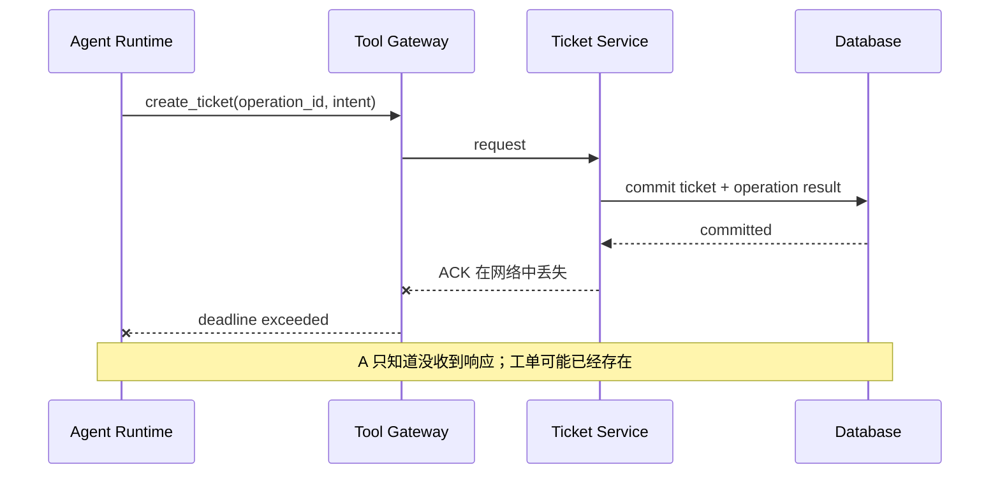
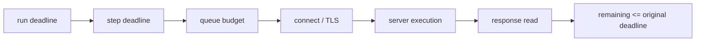
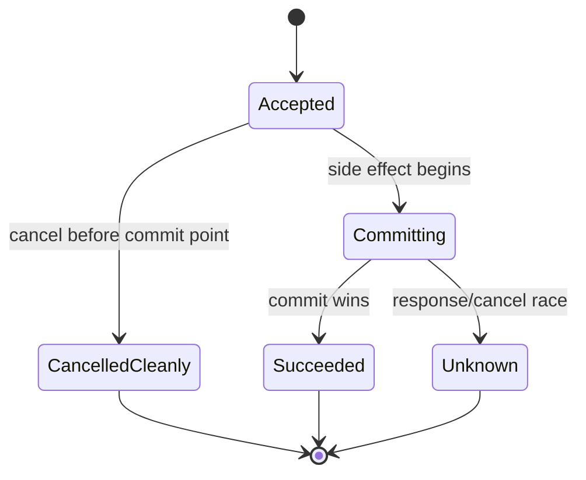
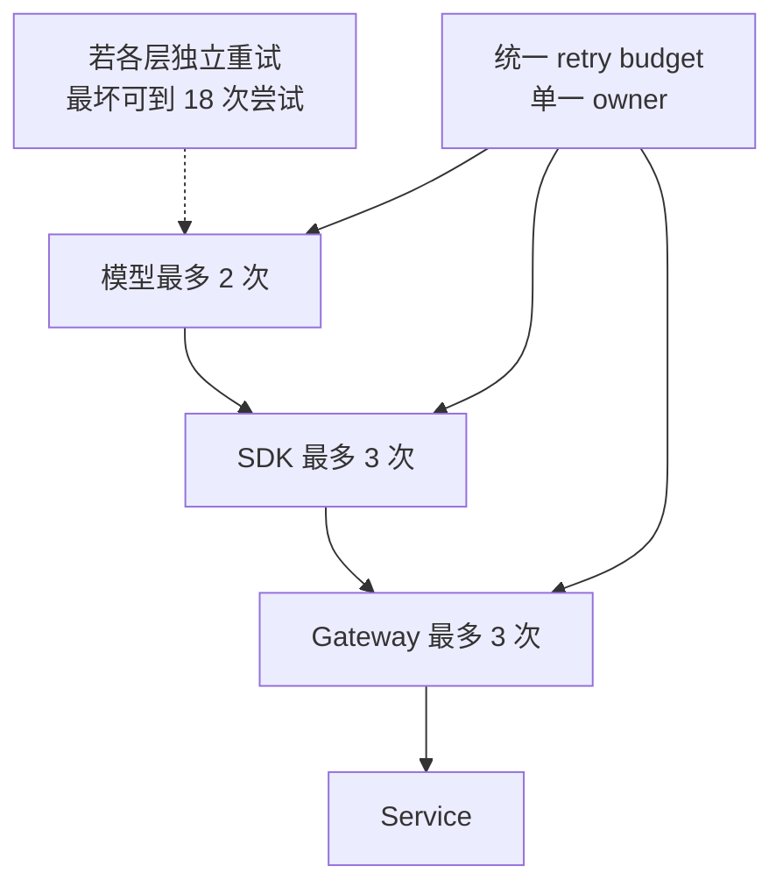
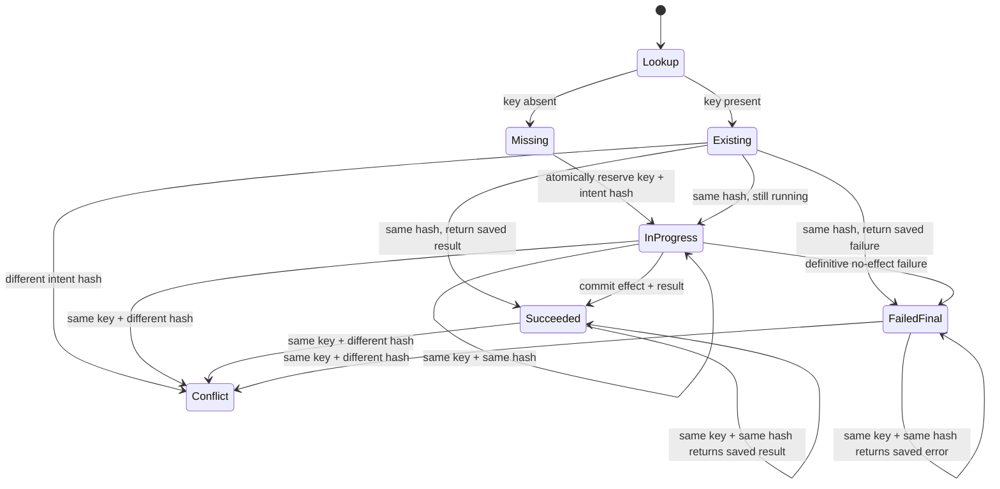
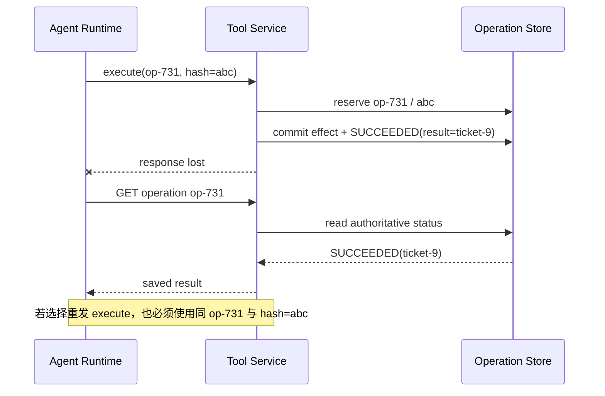
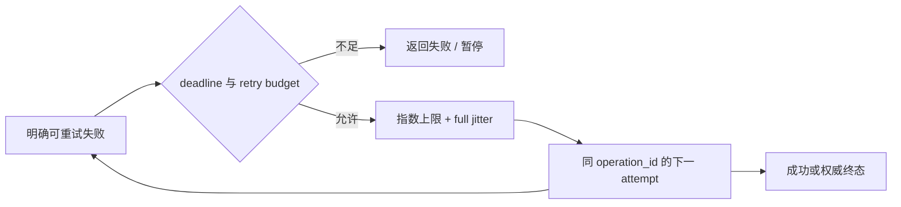
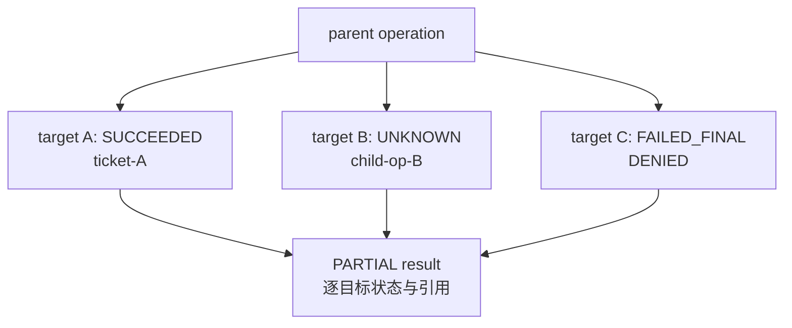

一次 `create_remediation_ticket` 调用在 800 毫秒后超时。Agent 应该重试吗？如果把 timeout 理解为“服务端没执行”，重试会创建两张工单；如果把 timeout 理解为“服务端一定执行了”，系统又可能永远漏掉一次本可安全恢复的失败。网络只告诉客户端没有及时收到完整响应，**它通常没有告诉客户端业务效果是否发生**。

因此，生产 Tool Runtime 必须把失败分成不同知识状态：明确未开始、明确失败、明确成功、仍在进行、部分成功，以及结果未知。Deadline 限制等待时间，取消表达调用者不再需要结果，重试重新发起尝试，幂等把多个尝试收敛到同一业务意图；四者互相关联，却没有任何一个能单独提供“正好一次”。

本文是“AI Agent 后端工程”专题的 Chapter 11。上一章 [Agent 权限模型：风险分级、最小权限与参数绑定审批](/signal-grid-blog/posts/agent-permissions-risk-approval-binding/) 让一个副作用在执行前获得精确授权；本章讨论执行边界失去响应以后如何保持安全。标准基线核对于 **2026-08-28**：HTTP 方法幂等语义以 RFC 9110 为准；`Idempotency-Key` 的 IETF `draft-ietf-httpapi-idempotency-key-header-07` 已于 2026-04-18 过期，只能作为历史 work in progress 阅读，不能称为现行 RFC。本文给出的业务 Operation 协议需要由服务自己明确发布和实现。

## 客户端看到的异常，不等于服务端发生的事实

一个远程调用至少经历接收、验证、提交业务事务和回传响应四个阶段。连接在任何两个阶段之间断开，客户端看到的都可能是同一个 `TimeoutError`，但真实状态完全不同。



失败语义应按“我们知道什么”分类，而不是按异常类名分类：

| Runtime 结果 | 已知事实 | 自动动作 |
| --- | --- | --- |
| `REJECTED` | Schema、授权或前置条件失败，业务执行未开始 | 改参数或停止，不原样重试 |
| `FAILED_FINAL` | 权威服务确认失败且没有业务效果 | 停止或走补偿策略 |
| `RETRYABLE_NOT_STARTED` | 权威服务确认未开始，或在发送前本地失败 | 可在预算内重试 |
| `IN_PROGRESS` | 同一 Operation 正在执行 | 查询/等待，不并发重复执行 |
| `SUCCEEDED` | 权威记录确认效果和结果 | 返回保存的结果 |
| `PARTIAL` | 一部分效果已发生 | 进入领域恢复，不能从头盲重试 |
| `UNKNOWN_OUTCOME` | 请求可能已到达并产生效果，响应边界丢失 | 用同 Operation 查询或恢复 |

`UNKNOWN_OUTCOME` 是一种必要状态，不是实现偷懒。它诚实表达了当前证据不足；强行映射成成功或失败，才会把网络不确定性变成业务错误。

## Deadline 只限制等待，取消不自动撤销副作用

Timeout 通常是某个局部等待上限；Deadline 是整个操作剩余时间的绝对边界。Agent 一轮调用跨越排队、连接、TLS、服务器排队、数据库和响应读取，如果每层都重新给 1 秒 timeout，总耗时可以远超上层预算。



有效 Deadline 应逐层收紧：

```text
effective_deadline = min(run_deadline, step_deadline, tool_contract_deadline)
remaining          = effective_deadline - monotonic_now
```

进程内计算 elapsed time 应使用 monotonic clock，不能用会被 NTP 或人工调整跳变的 wall clock；跨网络传 Deadline 时还要考虑双方时钟偏差，常见做法是传剩余 timeout 并由每跳扣减处理时间，或使用有明确时钟误差预算的绝对时间。

Timeout 设置还要覆盖连接、TLS、响应头和响应体读取，而不能只套一个 socket read timeout。AWS Builders' Library 对 timeout、重试和抖动的讨论特别强调：超时阈值要基于下游延迟分布和可接受的 false timeout 率，并考虑部署后新连接、DNS、TLS 等不在想象中的路径。

### Cancellation 是信号，不是时间机器

Runtime 取消协程，只表示调用者不再等待。数据库事务、消息发布或第三方 API 可能已经越过提交点；即使底层协议支持 cancellation，服务也可能在处理取消消息之前完成提交。



因此 Tool Contract 必须说明取消语义：是否仅停止等待，是否 best-effort 传递到下游，哪个状态以后不可撤销，以及取消后应查询哪个 Operation。对外部副作用，不要在 Python `CancelledError` 分支里直接写“已取消成功”。

## 三层重试解决不同问题，不能彼此叠乘

一次 Agent 任务中可能同时存在模型重试、传输重试和业务重试：

| 层次 | 重试的对象 | 允许的典型原因 | 不应做的事 |
| --- | --- | --- | --- |
| 模型级 | 重新生成 Tool Call 或答案 | 非法结构、需要修正参数、模型服务短暂失败 | 为同一副作用生成新 operation id |
| 传输级 | 同一序列化请求 | 连接失败、明确可重试状态 | 修改 payload 或丢掉原幂等键 |
| 业务级 | 同一业务 Operation 的恢复 | 已确认未开始、查询后允许继续 | 把 `UNKNOWN_OUTCOME` 当未执行 |



多层各自“重试三次”会形成乘法放大，还可能让上游在下游已拥塞时继续加压。一个调用链应明确单一重试所有者，其余层只做不会重复业务效果的连接恢复，或者消耗同一个可观察 retry budget。每次尝试保留同一个 `operation_id` 和 intent hash，同时分配不同 `attempt_id`，便于区分一个业务动作与多次网络尝试。

重试决策不能只看 HTTP 状态码。`503` 可能发生在提交前，也可能是提交后生成响应时失败；只有服务契约明确“此错误保证未开始”，才可标记 `RETRYABLE_NOT_STARTED`。相反，一个读取 Tool 可以按 RFC 9110 的幂等方法语义安全重试，但仍要受 Deadline、成本和服务压力限制。

## 幂等键要命名业务意图，而不是命名一次 HTTP 请求

RFC 9110 将幂等定义为：对服务器的预期效果，多次相同请求与一次相同请求相同。PUT、DELETE 和安全方法按规范是幂等的；POST 并不会因为带了随机 header 就自动获得业务幂等，服务端必须实现去重和结果复用协议。



一个可靠的去重键至少在服务端唯一约束以下作用域：

```text
(tenant_id, subject_or_client_id, tool_id, operation_id)
```

记录同时保存 `intent_hash`。处理规则必须是：

1. 新 key：原子创建 `IN_PROGRESS`，再开始业务动作；
2. 同 key、同 hash、已完成：返回保存的同一业务结果；
3. 同 key、同 hash、进行中：返回 `IN_PROGRESS` 或可查询位置，不再并发执行；
4. **同 key、不同 hash：无条件拒绝 `IDEMPOTENCY_CONFLICT`**；
5. key 已过保留期：契约必须说明是拒绝、查询归档，还是可能被当新请求；高风险 Operation 不应静默复用短期缓存语义。

Stripe 的公开 API 是一个具体生产实现例：它保存同一 idempotency key 第一次已开始执行的 status code 和 body，后续相同请求返回保存结果，并比较参数；同 key 不同参数会报错。它的 key 保留和哪些结果被保存是 Stripe 自己的协议，不能直接推定为所有 Tool 的标准。

截至本文，IETF Idempotency-Key 文档仍是已过期 Internet-Draft，而不是 RFC。它曾提出 key、fingerprint、并发请求和参数冲突等有用语义，可以作为设计历史材料，但生产 API 必须自己发布确切 header 格式、作用域、保留期、冲突行为和结果查询方式。

### 去重记录必须与业务提交建立原子关系

如果先创建工单、后写“幂等成功”，进程在两者之间崩溃会留下已生效但可再次执行的 key；如果先标成功、后创建工单，则可能返回一个从未发生的成功。理想情况是在同一数据库事务中写业务记录与 Operation 结果：

```text
BEGIN

claimed = INSERT tool_operation(
    tenant_id, subject_or_client_id, tool_id, operation_id,
    intent_hash, status='IN_PROGRESS'
) ON CONFLICT DO NOTHING
  RETURNING operation_id

IF claimed is empty:
    existing = SELECT tool_operation
               WHERE tenant_id=? AND subject_or_client_id=?
                 AND tool_id=? AND operation_id=?
               FOR UPDATE
    IF existing.intent_hash != requested_intent_hash:
        ROLLBACK; return IDEMPOTENCY_CONFLICT
    COMMIT; return existing.status + existing.saved_result

# 只有取得唯一 claim 的事务能到达这里。
ticket_id = INSERT remediation_ticket(...)
UPDATE tool_operation
SET status='SUCCEEDED', result_ref=ticket_id
WHERE tenant_id=? AND tool_id=? AND operation_id=?
  AND subject_or_client_id=?
  AND intent_hash=requested_intent_hash AND status='IN_PROGRESS'

COMMIT
```

这段是带数据库原语的事务伪代码，不是可直接复制的存储过程。关键不变量是：`RETURNING`/rowcount 明确谁取得唯一 claim；未取得者先锁定并比较 hash，只能读取保存状态，绝不能继续创建工单；取得者把本地业务效果与最终 Operation 结果放在同一事务。生产代码还要处理隔离级别、唯一约束和死亡 owner。若副作用在外部系统，Operation 与本地 Outbox 可以原子提交，再由 worker 使用相同下游幂等键投递；仍然要保留查询和对账，因为不能假设两个系统拥有一个原子事务。

## 结果未知时，查询 Operation 而不是创造新请求

把副作用建模成可查询资源，是从 Unknown Outcome 恢复的核心。创建请求立即获得或由客户端生成稳定 `operation_id`，后续无论重试还是查询都引用它。



Operation 状态机至少需要明确：

```text
PENDING -> IN_PROGRESS -> SUCCEEDED
                       -> FAILED_FINAL
                       -> PARTIAL
                       -> NEEDS_RECONCILIATION
```

`UNKNOWN_OUTCOME` 通常是客户端观察状态，不一定写进服务端；服务端可能已经是 `SUCCEEDED`，也可能没有记录。查询无记录也不能总推断未执行：如果 Operation reservation 与外部副作用不是原子关系，记录缺失仍可能已生效。此时必须按领域业务键对账，例如查询 `external_request_id=operation_id` 的工单，而不是换一个新 ID 再创建。

对 Agent 而言，恢复策略应由代码决定：

- `SUCCEEDED`：返回权威保存结果，不再让模型“判断是否重试”；
- `IN_PROGRESS`：在剩余 Deadline 内轮询或暂停 run；
- `FAILED_FINAL`：返回稳定错误，是否提出新意图由上层决定；
- `PARTIAL` / `NEEDS_RECONCILIATION`：转专用恢复流程或人工接管；
- 查不到且契约证明 reservation 先于效果：可以使用同 key 重发；
- 无法证明：保持 Unknown，告警与对账，不能猜测。

## 退避、抖动和 Retry Budget 是稳定性控制

立即重试会让许多客户端在同一时刻重新冲击已过载服务。指数退避拉开间隔，jitter 打散同步峰值，Retry Budget 限制重试流量占比；三者都不决定业务语义，只是在“已经允许重试”后控制负载。



一个常见 full-jitter 计算是：

```python
from random import Random


def retry_delay_seconds(
    attempt: int,
    *,
    base: float,
    cap: float,
    rng: Random,
) -> float:
    ceiling = min(cap, base * (2**attempt))
    return rng.uniform(0.0, ceiling)
```

测试应注入固定 `Random`；生产使用适当随机源。等待时间必须小于剩余 Deadline，并尊重契约化 `Retry-After`。重试预算可按时间窗口限制“重试请求不超过正常请求的某一比例”，也可用 token bucket；当预算耗尽，快速失败比把下游拖死更安全。

一次模型 run 还需要总预算：最大 Tool attempts、最大 wall time、最大费用、每个 Tool 的并发上限。模型重新生成相同调用时，Runtime 应识别同一规范化意图并复用 operation，而不是把它当新的创造性尝试。

## 部分成功必须暴露已完成的子效果

“给三个系统同时创建修复工单”不是一个原子数据库事务。A 成功、B 超时、C 被拒绝时，返回单一 `FAILED` 会诱使调用者从头重试并重复 A。



父 Operation 应返回逐子目标状态、各自 idempotency key、已创建资源引用和剩余恢复动作。补偿不是数据库 rollback 的同义词：关闭已经通知客户的工单可能产生第二个外部效果，也可能根本无法抹去邮件。Contract 必须说明补偿的业务含义，并让 Policy 单独授权。

故障矩阵应覆盖提交边界，而不只是 mock 一个 500：

| 故障注入位置 | 权威不变量 |
| --- | --- |
| 发送请求前本地取消 | 没有 Operation 和业务效果 |
| reserve 成功、业务写入前崩溃 | 恢复同 Operation；不会创建第二份效果 |
| 业务 commit 后、结果保存前崩溃 | 若不能原子提交，进入对账，不盲重试 |
| 结果保存后 ACK 丢失 | 查询或同 key 重发返回同一 result ref |
| 同 key 不同 payload 并发到达 | 最多一个 intent 被接受，另一个明确 conflict |
| 1000 客户端同时收到 retryable | jitter 与预算限制峰值，不发生 retry storm |
| 三个子效果一个超时 | `PARTIAL` 保存每个 child operation，不从头重放成功项 |
| key 保留期后迟到重放 | 按公开协议拒绝或查归档，不静默创建新动作 |

这里能够追求的是“相同业务意图收敛到一个权威 Operation，所有已知子效果可查询”，而不是用“exactly once”掩盖跨系统提交和网络丢包。

## 结论：安全恢复始于承认不知道

Deadline 能限制 Runtime 愿意等待多久，不能回滚服务端已经提交的事务；Cancellation 是 best-effort 信号，不是成功撤销证明；重试只有在错误语义允许且预算充足时才合理；幂等键必须绑定规范化业务意图，并在同 key 不同 payload 时失败关闭。

当响应丢失，系统应保留同一个 Operation，查询权威状态、复用保存结果或进入对账。它可以证明副作用不会因网络尝试被无意复制，却不能自动把多个外部系统变成一个原子事务。部分成功必须保留每个子效果，补偿也要作为新的、受授权的业务动作。

下一章 [RAG 的正确边界：语料、Chunk、元数据与评测问题集](/signal-grid-blog/posts/rag-boundaries-corpus-chunking-metadata/) 将从副作用边界转向知识边界：哪些事实必须调用权威 Tool，哪些知识适合被检索并作为带来源的上下文。

## 参考资料

- [RFC 9110: HTTP Semantics，9.2.2 Idempotent Methods](https://www.rfc-editor.org/rfc/rfc9110.html#section-9.2.2)：HTTP 方法的幂等定义与通信失败后的重试边界。
- [IETF Idempotency-Key Draft History](https://datatracker.ietf.org/doc/draft-ietf-httpapi-idempotency-key-header/history/) 与 [expired -07 draft](https://datatracker.ietf.org/doc/html/draft-ietf-httpapi-idempotency-key-header-07)：已于 2026-04-18 过期的 work in progress，本文不将其当作 RFC。
- [Stripe Idempotent Requests](https://docs.stripe.com/api/idempotent_requests)：保存首次已开始执行的结果、参数比较和 key 保留策略的具体生产 API 实现例。
- [Amazon Builders' Library: Timeouts, retries, and backoff with jitter](https://aws.amazon.com/builders-library/timeouts-retries-and-backoff-with-jitter/)：timeout 选择、多层重试放大、backoff、jitter 与 token bucket。
- [Google Cloud IAM: Retry failed requests](https://docs.cloud.google.com/iam/docs/retry-strategy)：truncated exponential backoff、jitter、可重试状态与重试上限的当前官方说明。
- [PostgreSQL `INSERT` and `ON CONFLICT`](https://www.postgresql.org/docs/current/sql-insert.html)：示例中 Operation 唯一占有的数据库原语；实际正确性仍取决于事务和约束设计。
