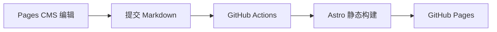

这是一篇**主题演示文章**。它不迁移旧博客内容，只负责确认新框架的阅读体验是否完整。正式开始写作后，可以直接在 Pages CMS 中删除或改写它。

## 新博客的工作流

内容始终保存在 GitHub 仓库里，Pages CMS 只是一个更顺手的编辑界面：



| 环节 | 负责什么 | 是否锁定平台 |
| --- | --- | --- |
| Pages CMS | 在线写作与图片上传 | 否 |
| GitHub | 保存 Markdown 和版本历史 | 否 |
| Astro | 生成静态 HTML | 否 |
| GitHub Pages | 托管网站 | 可替换 |

## 代码展示

代码块支持双主题高亮、横向滚动和移动端阅读：

```ts
import { getCollection } from "astro:content";

const posts = await getCollection("posts", ({ data }) => !data.draft);
const latest = posts.sort((a, b) => b.data.date.valueOf() - a.data.date.valueOf());
```

> 这套架构没有内容数据库。即使未来替换 CMS 或托管平台，文章仍然是普通 Markdown 文件。

## 接下来写什么

可以从一个最想长期维护的专题开始，先建立三到五篇文章的学习路径，再逐步增加标签、封面与系列导航。框架已经预留了搜索、RSS、站点地图、专题页和明暗主题。
