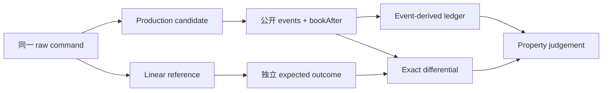

> 练习起点仍是 annotated [`course/m03-start`](https://github.com/lcha-reln/cex-matching/tree/course/m03-start)，peeled commit 为 `4bcf4e060e8bc596d3246f1b98cec346cc66221f`。本教程的固定完成坐标是 annotated [`course/m03-complete`](https://github.com/lcha-reln/cex-matching/tree/course/m03-complete)，完成 commit 为 `dab4a2a1dccf06d6b9769c979a6ae5af6d1d2bdc`；产品 tag `matching-0.1.0` peeled 到同一 commit。本文涉及的 reference 源码可从 [完成坐标下的 matching-reference](https://github.com/lcha-reln/cex-matching/tree/course/m03-complete/matching-reference) 复核。

M00～M02 已经把输入验证、价格时间优先、成交事件、可寻址撤单和不可逆终态做成了一个能运行的单交易对撮合 core。到这里继续增加几个手写案例，当然还能发现错误，但它们只能回答“我们想到的这些历史是否正确”，不能回答“在更大的命令空间里，生产实现是否仍服从同一套规则”。

最自然的下一步是差分测试：让生产撮合器和一个参考模型执行相同命令，再比较结果。真正困难的地方却不在 `assertEquals`，而在“参考模型凭什么可信”。如果 reference 复用了生产 validator、价格比较器、订单节点甚至整个撮合循环，那么两边会以完全相同的方式犯错；一万次相等只能证明复制得很一致。

本篇只证明一个命题：**可信的差分 oracle 必须在依赖、状态表示和推导路径上与生产实现分离，并由第三条只消费公开命令与候选公开结果的账本独立约束；三条路径相互交叉，任何一条都不能独自宣布正确。**

我们先冻结边界、写出线性参考模型，再用一条手算历史让 production、reference 与 event ledger 对齐。本篇结束时，参考模型测试和少量差分测试应当 GREEN，但完整 `m03Check` 仍应保持 RED：256×64 生成套件、shrink、persist、replay、六项 mutant 和发布证据都还没有完成。

在继续读代码前，先写下你的预测：如果 production 与 reference 共享同一个错误 Ask comparator，哪一条观察路径还可能最先揭穿它？如果你的答案仍是“再做一次 `assertEquals`”，下面的权力分离边界正是本篇要补上的部分。

## 先复现 M03 的唯一 RED，而不是从 main 猜起点

从干净 clone 建练习分支：

```bash
git clone https://github.com/lcha-reln/cex-matching.git
cd cex-matching
git switch -c unit/m03 course/m03-start

test "$(git cat-file -t course/m03-start)" = "tag"
test "$(git rev-parse HEAD)" \
  = "4bcf4e060e8bc596d3246f1b98cec346cc66221f"
```

然后分别运行累计构建与 M03 目标门禁：

```bash
./gradlew clean build --no-daemon
./gradlew m03Check --no-daemon
```

第一条必须保持 GREEN，证明 M00～M02 没有被“新测试架构”破坏。第二条在起点必须非零退出，并给出结构化 `GOAL_NOT_IMPLEMENTED`。它不是编译失败，也不是缺文件；起点已经能严格读取 `matching.m03.generator.v1`，校验冻结配置和六个负向 Schema probe，只是故意拒绝伪装成完整性质证明。

起点同时冻结了本单元不会改变的边界：生产命令仍然只有 `PLACE | CANCEL`，事件语法、价格时间优先、maker price、撤单和终态语义都继承 M02。M03 增加的是**证明能力**，不是交易功能。

## 参考模型首先是一项权力分离设计

把 reference 放进另一个 package 并不自动独立。判断独立性，要看错误能否跨边界一起传播。

假设生产实现把 Ask 价位误按降序排列。如果 reference 调用了同一个 `bestAskComparator()`，两边都会先选最差价格；差分仍然相等。再假设生产实现和 reference 都复用同一个 `PlaceLimitOrderValidator`，当验证优先级漂移时，两边也会一起返回相同的错误结果。这样的 reference 是镜子，不是 oracle。

M03 因此把三条观察路径的责任冻结为：

| 路径 | 它拥有的事实 | 它不得借用的事实 |
| --- | --- | --- |
| Production candidate | 调用公开生产 API，完整转换 ordered events 与 full-depth `bookAfter` | expected result、reference transition、mutant 专用断言 |
| Linear reference | 独立验证 raw input，以扁平历史和线性扫描推演语义 | 生产 validator、engine、book node、价格比较器、M01/M02 oracle |
| Event ledger / judge | 只从命令与 candidate 的公开事件重建数量、生命周期和 active identity；把公开 `bookAfter` 仅当作待核对的投影 | candidate/reference 私有 Map、对象引用、内部生命周期字段 |

这不是“三套完全不同的业务规则”。业务合同必须相同，否则无法比较；独立的是**如何得到结论**。严格 JSON、哈希函数、原始命令 record 和原子写报告这类非语义基础设施可以共享，状态迁移、验证决策、maker 选择和 expected outcome 不可以共享。



若 production 与 reference 相等，但 event ledger 发现 Trade 超过余量，结果仍是失败；若 ledger 认为结构合法，但 production 与 reference 的 maker 次序不同，结果也失败。三角约束比“双实现相等”多了一条真正不同的反证路径。

## 用 SAME_PRICE_FIFO 手算三条路径

先不用随机历史。对一个 fresh engine 执行三条命令：

```text
1. PLACE id=1 SELL 100 × 1
2. PLACE id=2 SELL 100 × 1
3. PLACE id=3 BUY  100 × 2
```

前两条分别获得 acceptance sequence 1、2，并按这个顺序停在 Ask 100。第三条是 taker，唯一合法事件序列是：

```text
Accepted(sequence=3, orderId=3, BUY, 100, 2)
Trade(makerSequence=1, makerOrderId=1,
      takerSequence=3, takerOrderId=3,
      price=100, quantity=1)
Trade(makerSequence=2, makerOrderId=2,
      takerSequence=3, takerOrderId=3,
      price=100, quantity=1)
bookAfter = empty
```

三条路径对此各自做不同的工作：

1. production candidate 把真实 `SingleInstrumentMatchingEngine` 返回的值无损转换出来；
2. linear reference 遍历全部 RESTING 订单，以 `(price, acceptanceSequence)` 选出优先级最高的 maker；
3. event ledger 从前两条 `Accepted/Rested` 事件得知 ID 1、2 的原量和 sequence，第三条 Trade 到来时自己计算“当前最佳 maker”和双方 remainder。

LIFO 错误会首先破坏 `PRICE_TIME_PRIORITY / WRONG_MAKER_ORDER`；成交数量写成 2 会首先破坏 `QUANTITY_PARTITION / TRADE_EXCEEDS_REMAINDER`；只把事件写对却返回未清空的盘口，会破坏 ledger 与 book 的 active identity 双射或最后的 full-depth differential。

这里的 fingerprint 由稳定的 `propertyId/divergenceKind` 构成，不依赖异常文案。后续 shrink 正是靠它判断“缩小后仍是同一个错误”，因此本篇就要把性质分类设计清楚。

## 实现 linear reference：故意选择更慢、更简单的结构

`matching-reference` 是独立的 test-only Gradle module。它的 main/runtime 代码只依赖 JDK，不依赖 `matching-core`、`matching-testkit` 或其他生产库；测试配置使用 JUnit。命令在模块边界上仍保留 raw `String` 与 `BigInteger`：

```java
public sealed interface ReferenceCommand {
  record Place(
      String instrumentId,
      BigInteger orderId,
      String side,
      BigInteger priceTicks,
      BigInteger quantityLots) implements ReferenceCommand {}

  record Cancel(
      String instrumentId,
      BigInteger orderId) implements ReferenceCommand {}
}
```

reference 必须自己按 M00 冻结的优先级验证这些字段。不能先把命令交给生产 validator 再接收一个“已经合法”的对象；否则恰好失去了验证差分。

状态只用一条扁平 `List<ReferenceOrder>` 保存。查 ID 线性扫描，找 maker 也扫描整条列表：

```java
private ReferenceOrder selectMaker(ReferenceOrder taker) {
  ReferenceOrder best = null;
  for (ReferenceOrder candidate : orders) {
    if (candidate.lifecycle != RESTING
        || candidate.side.equals(taker.side)
        || !crosses(taker, candidate)) {
      continue;
    }
    if (best == null || isHigherPriority(candidate, best, taker.side)) {
      best = candidate;
    }
  }
  return best;
}
```

这段实现故意不追求生产复杂度。生产侧用按价有序结构和价位内 FIFO，是为了快速定位最佳价与队首；reference 用全扫描把“最佳价，再最早 sequence”直接写进比较规则。两个实现若在同一结果上收敛，更有信息量。

盘口也不是 reference 的第二份权威状态。每条命令执行后，从扁平订单列表筛选 `RESTING`，再按公开盘口顺序派生 `SemanticBook`：Bid 价格从高到低，Ask 价格从低到高，同价订单按 acceptance sequence 从早到晚。因此生命周期错误与 book 派生错误不会被两张可分别修改的表互相掩盖。

## Production adapter 只做翻译，不能偷藏答案

M03 的候选边界应该很窄：

```java
interface M03Candidate {
  SemanticOutcome apply(ReferenceCommand command);

  interface Factory {
    M03Candidate create();
  }
}
```

`M03ProductionCandidate` 的职责只有三项：把 raw Place/Cancel 送入公开生产入口；把每种 `MatchingEvent` 全字段转换成中立 `SemanticEvent`；把完整 bids、asks、price levels 和队内订单顺序转换成 `SemanticBook`。

不要在 adapter 中排序事件或盘口来“方便比较”。如果生产侧错误地把同价 maker 顺序颠倒，adapter 的排序会销毁证据。也不要只转换最终最优一档：M03 比较的是 full-depth `bookAfter`，因为幽灵订单和错误中间价位可能不影响 top of book。

factory 同样不是语法装饰。每次 judge、shrink trial 和 strict replay 都必须调用 `create()` 得到 fresh candidate；复用已经执行过前缀的 engine，会把删除命令后的新历史运行在旧状态上，得出不可解释的反例。

## 第三事件账本先检查性质，再允许 exact differential

如果裁判先做 `expected.equals(actual)`，它虽然会发现不同，却很难说明哪条业务性质先被破坏。更重要的是，reference 自身若有同类缺陷，单纯相等仍会放过它。

`M03EventLedger` 因此只消费 command 与 candidate 的公开 outcome，并按固定顺序检查。它从 events 建立自己的账本状态，最后才把 outcome 中的 `bookAfter` 当作外部投影来核对，而不会用这份盘口反向填充账本：

1. 当前 PLACE/CANCEL 的 event batch grammar 是否封闭；
2. Trade quantity 是否为正，且每笔订单保持 `original = filled + remaining + canceled`；
3. 盘口价位、同价 sequence、非空价位、正余量和批末无交叉是否成立；
4. event-derived RESTING ID 集合与 `bookAfter` 中全部订单是否双向相等，FILLED/CANCELED 是否不入簿且不可复活；
5. 最后才逐字段比较 production/reference 的 ordered events 与 full-depth book。

这条账本不读取生产 `ordersById`，也不读取 reference 的 flat list。它只能根据 `Accepted` 建身份、根据 `Trade` 扣减双方余量、根据 `Rested` 进入活动态、根据 `Canceled` 进入终态。这正是外部审计流能够拥有的信息。

失败分类也在这里冻结：

| 观察 | 分类 | 是否可以算“杀死 mutant” |
| --- | --- | --- |
| 候选完整返回，但事件、数量、生命周期、盘口或差分不满足合同 | `STUDENT_FAILURE` | 可以 |
| candidate 抛异常、返回畸形值，或 parser/schema/filesystem/judge 自己失败 | `SYSTEM_ERROR` | 不可以，必须失败关闭 |
| 全部性质和差分都通过 | `PASS` | 生产 control 的预期 |

总是抛异常的候选不能因为“让测试红了”而获得六个 mutant 全杀的成绩。异常说明裁判没有得到业务结论。

## 证明结构独立，而不是靠代码评审印象

先运行 reference 自身测试和聚焦 judge 测试：

```bash
./gradlew :matching-reference:test --no-daemon

./gradlew :matching-testkit:test \
  --tests '*M03PropertyJudgeTest' \
  --no-daemon
```

reference 测试至少应覆盖：独立验证优先级、最佳价、同价 FIFO、maker price、部分成交、可寻址撤单与两个终态。judge 测试则应让正确 production control 通过，并用小型候选验证 ledger 能把业务差异分类成稳定 fingerprint，把故意抛异常的 control 分类成 `SYSTEM_ERROR`。

源码与依赖还要过机械门禁。这个门禁提供的是对冻结源码形状的可执行约束，不是对“两个程序永远不会共同犯错”的形式化证明。完成态的架构报告应能复核：

- `matching-reference` 的 main/runtime 依赖不含 core/testkit 或外部生产库，JUnit 只存在于测试配置；
- reference 源码没有 import 生产 engine、validator、命令或事件类型；
- reference 没有复制 `TreeMap + per-level queue` 布局，而是 flat list + full linear scan；
- `matching-core` 继续保持无 I/O、数据库、网络、线程、时钟、随机数和 Aeron。

这些事实已经由发布 bundle 中的 [`reference-model.json`](/signal-grid-blog/practice/high-availability-cex/m03/evidence/reports/reference-model.json) 与 [`architecture.json`](/signal-grid-blog/practice/high-availability-cex/m03/evidence/reports/architecture.json) 承载，并经同一份 M03 manifest 重新校验。最终报告记录 `matching-reference` 7 个 source file、`matching-core` 20 个 source file，边界 violation 为 0。

## 练习：做一个会共同犯错的伪 reference

先故意让 reference 调用生产侧的价格比较器，或把生产价位结构复制过去。然后在两边同时注入“Ask 从高价开始”的错误。你会看到 exact differential 可能继续相等，而第三 ledger 会在第一笔跨多价成交时给出 `PRICE_TIME_PRIORITY` 失败。

再做相反实验：保持 reference 独立，删除第三 ledger，只比较双方结果。让 production 与 reference 的某个共享 semantic record constructor 接受非正 Trade quantity；思考为什么差分相等仍不足以证明数量合法。

最后为 SAME_PRICE_FIFO 的三条命令逐步写出：candidate events、reference events、ledger 中每笔订单的 `original/filled/remaining/canceled/lifecycle` 和 `bookAfter`。如果任何一列需要读取 engine 私有字段，说明观察边界还没有设计完整。

## 停止点：我们得到可信 oracle，还没有得到广泛证明

到这里，生产候选、线性 reference 与第三事件账本已经形成三条可执行观察路径。它们共同保证少量手算历史能被独立推演，并让业务失败与系统失败有稳定分类；它们还没有证明 256 条历史、16,384 个命令边界，更没有产生最小反例或发布证据。

因此，**沿着本篇阶段性分支动手时**，完整 `m03Check` 仍应保持 RED。不要为了让这一阶段提前变绿而加入更多订单类型、第二交易对、账户、持久化、线程或 Aeron；完成 tag 和产品 tag 要等四篇实现全部收口后统一创建。

下一篇只增加一个复杂度维度：**用 repository-owned SplitMix64 和四个 coverage lane 生成恰好 256×64 条确定性命令，让三条观察路径在每一个命令边界对拍。**你现在阅读的是已经随 `course/m03-complete` 发布的正文；[M03 Matching Lab](/signal-grid-blog/practice/high-availability-cex/m03/lab/) 会复用这套公开语义做预测与反例回放，但网页模型不会编译 Java，也不会冒充课程裁判。
