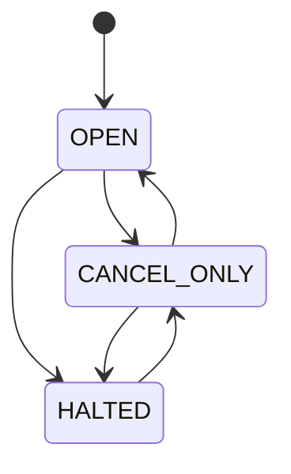

> 练习从 annotated [`course/m06-start`](https://github.com/lcha-reln/cex-matching/tree/course/m06-start) 开始，权威完成点是 annotated [`course/m06-complete`](https://github.com/lcha-reln/cex-matching/tree/course/m06-complete)，peeled commit 为 `854dcf470a9ea8a2765982861b21026be1416258`；完成 evidence 的 manifest SHA-256 为 `f4a6f90ea5b92eddd8444e7bbe0764fbca963e2c598cb04c04f7c33db5cdd44d`。

上一课定义了三种模式，但“能从哪里切到哪里”仍不能靠 `marketMode = target`。两个运维请求可能基于不同的观察值到达；失败请求也必须占据一个确定应用边界，否则后续重放会把同一条命令解释成另一个时刻。

本篇的核心结论是：**模式转换由 expected application sequence、expected current mode、独立 mode revision 和 transition fence 共同定义；业务拒绝推进应用序列，但不回退或重置任何领域状态。**

## 先冻结安全转换图

允许的五条边是：



对应决策表：

| 当前模式 | 目标模式 | 结果 |
| --- | --- | --- |
| `OPEN` | `CANCEL_ONLY` | 允许 |
| `OPEN` | `HALTED` | 允许 |
| `CANCEL_ONLY` | `OPEN` | 允许 |
| `CANCEL_ONLY` | `HALTED` | 允许 |
| `HALTED` | `CANCEL_ONLY` | 允许 |
| `HALTED` | `OPEN` | `INVALID_TRANSITION` |
| 任意模式 | 同模式 | `NO_MODE_CHANGE` |

禁止 `HALTED → OPEN` 不是为了增加仪式感。`HALTED` 可能刚完成全局 Mass Cancel，或仍保留需要人工检查的挂单；强制经过 `CANCEL_ONLY`，使系统至少存在一个显式“禁止新单、允许客户撤单”的恢复边界。M06 不提供定时自动开市，也不允许调用者用一个 flag 绕过这条边。

生产源码把图编码为穷尽 `switch`，新增 enum 值时编译器会要求重新作出决定：

```java
private static boolean isPermittedTransition(MarketMode current, MarketMode target) {
  return switch (current) {
    case OPEN -> target == MarketMode.CANCEL_ONLY || target == MarketMode.HALTED;
    case CANCEL_ONLY -> target == MarketMode.OPEN || target == MarketMode.HALTED;
    case HALTED -> target == MarketMode.CANCEL_ONLY;
  };
}
```

## 命令必须声明自己看见了什么

真实命令类型是：

```java
public record ChangeMarketMode(
    ApplicationSequence expectedApplicationSequence,
    MarketMode expectedMode,
    MarketMode targetMode,
    OperatorId operatorId) {
  public ChangeMarketMode {
    Objects.requireNonNull(expectedApplicationSequence, "expectedApplicationSequence");
    Objects.requireNonNull(expectedMode, "expectedMode");
    Objects.requireNonNull(targetMode, "targetMode");
    Objects.requireNonNull(operatorId, "operatorId");
  }
}
```

两个 expected 字段防的是不同错误：

- `expectedApplicationSequence`：调用者是否把请求提交到它以为的全局命令边界；
- `expectedMode`：调用者是否基于它以为的当前模式作决定。

例如运维 A 在 sequence 41 看见 `OPEN`，准备停市；运维 B 的规则激活先占用了 41。A 的命令到达 42 时，即使当前仍是 `OPEN`，也必须以 `APPLICATION_SEQUENCE_MISMATCH` 失败。自动“帮它更新 sequence”会把一个已过期决策变成新决策。

## 四道 guard 的顺序本身就是 API

Change Mode 固定按下列顺序判断：

```text
EXPECTED_APPLICATION_SEQUENCE
→ EXPECTED_MODE
→ NO_MODE_CHANGE
→ ALLOWED_TRANSITION
→ MODE_REVISION_CAPACITY
→ APPLY_TRANSITION
```

前四道业务拒绝与返回码一一对应：

| 第一处失败 | rejection code | `observedMode` |
| --- | --- | --- |
| expected application 不等于当前边界 | `APPLICATION_SEQUENCE_MISMATCH` | 当前实际模式 |
| expected mode 不等于当前模式 | `EXPECTED_MODE_MISMATCH` | 当前实际模式 |
| target 等于当前模式 | `NO_MODE_CHANGE` | 当前实际模式 |
| 转换图没有该边 | `INVALID_TRANSITION` | 当前实际模式 |

优先级不能随意交换。假设当前是 `HALTED`，请求同时携带 stale sequence、错误 expected mode，并要求直达 `OPEN`；合同必须先返回 `APPLICATION_SEQUENCE_MISMATCH`。否则不同实现会为同一输入产生三个都“看似合理”的错误码，差分重放失去唯一答案。

## 三个序列各自回答不同问题

M06 此时已经有三个容易混淆的数：

| 字段 | 何时推进 | 回答的问题 |
| --- | --- | --- |
| `ApplicationSequence` | 每个确定业务成功或拒绝 | 这是全局第几个已应用命令边界？ |
| `AcceptanceSequence` | Place 真正 Accepted | 订单在全局接受顺序中的位置是什么？ |
| `modeRevision` | Change Mode 成功 | 运行模式成功变化过几次？ |

一次模式拒绝只推进第一项；一次成功模式转换推进 application sequence 与 mode revision，但不推进 acceptance sequence。把 `modeRevision` 直接等同于 application sequence 会产生大量空洞，也无法表达“第 42 个命令完成了第 3 次模式变化”。

## 成功边界留下 `ModeTransitionFence`

成功转换先计算下一 revision，再构造不可变栅栏：

```java
public record ModeTransitionFence(
    ApplicationSequence appliedCommandSequence,
    long modeRevision,
    MarketMode previousMode,
    MarketMode activeMode,
    AcceptanceSequence nextAcceptanceSequence) {}
```

真实 apply 逻辑的关键部分如下：

```java
long nextModeRevision = Math.incrementExact(modeRevision);
MarketMode previousMode = marketMode;
ModeTransitionFence fence =
    new ModeTransitionFence(
        applied.current(),
        nextModeRevision,
        previousMode,
        command.targetMode(),
        new AcceptanceSequence(nextAcceptanceSequence));

marketMode = command.targetMode();
modeRevision = nextModeRevision;
lastModeTransitionFence = fence;
```

事件必须与 fence 对齐：

```java
new MarketControlEvent.ModeChanged(
    applied.current(),
    command.operatorId(),
    previousMode,
    command.targetMode(),
    fence)
```

`nextAcceptanceSequence` 是转换发生时订单接受域的切面。例如 fence 记录 `nextAcceptanceSequence=8`，说明 acceptance sequence `< 8` 的订单都来自该边界之前；它不意味着模式转换消耗了 8。

## 一条时间线读懂成功与拒绝

假设启动后先接受一张 BUY，其 `AcceptanceSequence=1`：

| 应用边界 | 命令 | 事件 | mode / revision | next acceptance |
| --- | --- | --- | --- | --- |
| 1 | Place(101) | `Accepted` + `Rested` | `OPEN / 0` | 2 |
| 2 | `OPEN → CANCEL_ONLY` | `ModeChanged` | `CANCEL_ONLY / 1` | 2 |
| 3 | stale expected sequence=2 | `ModeChangeRejected(APPLICATION_SEQUENCE_MISMATCH)` | `CANCEL_ONLY / 1` | 2 |
| 4 | `CANCEL_ONLY → HALTED` | `ModeChanged` | `HALTED / 2` | 2 |
| 5 | `HALTED → OPEN` | `ModeChangeRejected(INVALID_TRANSITION)` | `HALTED / 2` | 2 |
| 6 | `HALTED → CANCEL_ONLY` | `ModeChanged` | `CANCEL_ONLY / 3` | 2 |

注意边界 3 和 5 都“失败了”，但边界 4、6 仍必须使用递增后的 application sequence。业务拒绝是确定状态机已经应用的结果，不是“这条输入从未存在”。

## 失败原子性不是回到 `OPEN`

每次拒绝后，以下状态必须逐项等于拒绝前：

```text
marketMode
modeRevision
lastModeTransitionFence
active / prepared rule set
controlRevision / activation fence
order book
order registry + lifecycle
nextAcceptanceSequence
lastMassCancelFence
```

唯一变化是 `nextApplicationSequence` 前进一格。一个常见错误处理是：

```java
try {
  changeMode(command);
} catch (RuntimeException failure) {
  marketMode = MarketMode.OPEN; // 错误：失败不等于恢复默认值
}
```

这会让本来处于 `HALTED` 的市场因 stale 请求重新开市。M06 要求在任何可预见容量检查完成之前不修改状态；不可表示的 null/schema construction 与真正 `SYSTEM_ERROR` 不消费边界，但也不能被包装成业务拒绝后重置状态。

## Place 与 Cancel 在哪个位置看模式

模式 guard 必须嵌进既有决策链，而不是简单放到最前面。

对 Place：

```text
field → policy → duplicate → expected rule → price band
→ mode → FOK/Post-only precheck → acceptance → execute
```

对 Cancel：

```text
field → mode → lifecycle lookup → apply
```

这带来两组可复核反例：

| 场景 | 正确结果 | 错误实现会怎样 |
| --- | --- | --- |
| `CANCEL_ONLY` + price=0 | `Rejected(INVALID_PRICE)` | mode-first 返回 `MARKET_NOT_OPEN`，破坏 M00 |
| `CANCEL_ONLY` + duplicate id | `DUPLICATE_ORDER_ID` | mode-first 隐藏既有身份 |
| `HALTED` + unseen Cancel | `MARKET_NOT_CANCELABLE` | lookup-first 暴露 `ORDER_NOT_FOUND` |
| `CANCEL_ONLY` + crossing Post-only | `MARKET_NOT_OPEN` | policy-first 探测了对手盘 |

模式拒绝是 singleton，不能先产生 `Accepted` 再补一个拒绝，更不能执行一部分 Trade 后回滚。

## 规则控制为何在停市时仍开放

Prepare/Activate 使用同一 `ApplicationSequence` 域，却拥有独立的 `controlRevision`。允许它们在 `HALTED` 中运行，可以显式执行：先冻结客户，再 Prepare/Activate 新规则，再决定是否 Mass Cancel。反过来，模式转换不能消费 prepared slot，规则激活也不能改变 mode。

这不是说任何 operator 都能改规则；鉴权仍在上游。撮合核心只裁决已经进入有序命令流的业务边界。

## 本地验证转换合同

在完成参考坐标上可只跑这组真实测试：

```bash
git switch --detach course/m06-complete
./gradlew :matching-core:test \
  --tests io.github.lchareln.cex.matching.SingleInstrumentMarketModeTest \
  --no-daemon
```

完整累计回归仍应运行：

```bash
./gradlew clean build --no-daemon
./gradlew m06Check --no-daemon
```

动手时不要先复制 production `switch` 到测试里。先把上面的转换表写成参数化预期，再分别断言 event、control snapshot、book snapshot 和三个序列；否则测试只会重复实现，而不会约束它。

博客 Lab 只能读取已经发布的静态结果，帮助预测这四道 guard 和 fence 字段。它不执行任意 Java，也不能把几条页面交互当作本地测试或完成证据。

## 本篇停止点

现在三态拥有唯一转换图、稳定拒绝优先级、独立 revision 与可重放 fence；Place/Cancel 也在不破坏 M00～M05 的位置执行权限检查。

我们仍未解决“停市后如何一次终止所有挂单”。下一篇只处理确定性 Mass Cancel 顺序。当前结论不包含持久化 crash atomicity、并发 operator 协调、外部授权、自动恢复、复制或高可用。
