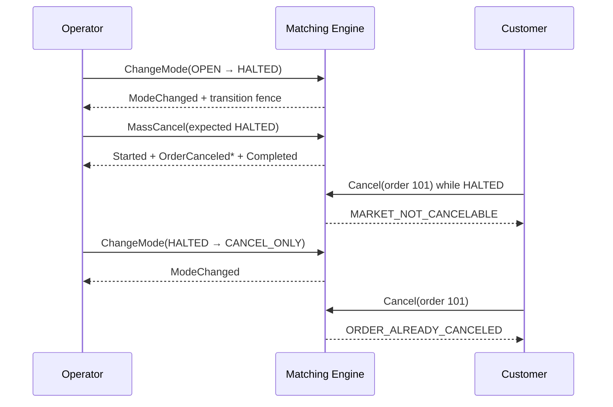

> 源码练习从 annotated [`course/m06-start`](https://github.com/lcha-reln/cex-matching/tree/course/m06-start) 进入，权威完成坐标是 annotated [`course/m06-complete`](https://github.com/lcha-reln/cex-matching/tree/course/m06-complete)。complete peeled 到 `854dcf470a9ea8a2765982861b21026be1416258`，完成 evidence 与该干净提交绑定，manifest SHA-256 为 `f4a6f90ea5b92eddd8444e7bbe0764fbca963e2c598cb04c04f7c33db5cdd44d`。

上一课已经得到唯一的撤单顺序，但确定排序并不自动等于原子性。若实现一边删 book、一边追加事件，第 37 张订单失败时就会留下“前 36 张已撤、后面仍挂着”的半完成状态；若清簿后删除 registry，旧 orderId 又可能被当成全新身份接受。

本篇冻结的结论是：**成功 Mass Cancel 必须在单一应用边界内形成完整事件 grammar 与完整终态；失败是 singleton 且零领域突变；被终止的订单保留不可逆 identity、取消来源和规则归因。** 同时必须诚实区分“内存方法原子性”和未来 M08 才会引入的持久化恢复。

## 先把成功与拒绝写成两种 grammar

合法结果只有两形态：

```text
Rejected
```

或：

```text
Started
OrderCanceled * N
Completed
```

拒绝事件的真实类型是：

```java
record Rejected(
    ApplicationSequence applicationSequence,
    OperatorId operatorId,
    MarketMode observedMode,
    MassCancelRejectionCode code)
    implements MassCancelEvent {}
```

成功的边界标记为：

```java
record Started(
    ApplicationSequence applicationSequence,
    OperatorId operatorId,
    MarketMode marketMode,
    long modeRevision,
    long restingOrderCount)
    implements MassCancelEvent {}

record Completed(
    ApplicationSequence applicationSequence,
    OperatorId operatorId,
    MarketMode marketMode,
    long modeRevision,
    long canceledOrderCount)
    implements MassCancelEvent {}
```

`Started` 与 `Completed` 都要求 `marketMode == HALTED`、`modeRevision > 0`、count 非负。它们必须共享 application sequence、operator、mode 与 revision；两个 count 必须相等，并且等于中间 `OrderCanceled` 数量。

这让消费者无需猜测“事件流是不是在中间断掉”。只有看到合法 `Completed`，整个 batch 才是一个完成的内存命令结果。

## 每张终止事件保存什么

中间事件不是简化的 `Canceled(orderId)`：

```java
record OrderCanceled(
    ApplicationSequence applicationSequence,
    OperatorId operatorId,
    AcceptanceSequence sequence,
    OrderId orderId,
    Side side,
    PriceTicks priceTicks,
    QuantityLots canceledQuantityLots,
    RuleSetIdentity admissionRuleSet,
    RuleSetIdentity executionRuleSet)
    implements MassCancelEvent {}
```

字段分成四类：

| 类别 | 字段 | 用途 |
| --- | --- | --- |
| 批次身份 | application sequence、operator | 证明属于同一次运维动作 |
| 订单身份 | acceptance sequence、orderId | 稳定定位与全局排序 |
| 撤销事实 | side、price、exact positive remainder | 重建被终止的活跃余量 |
| 规则归因 | admission rule、execution rule | 区分订单准入规则与终止时生效规则 |

不保存 `canceledQuantityLots`，下游只能看到“订单消失”，无法验证 `original = filled + canceled` 的数量守恒。不保存 acceptance sequence，则无法证明批次按全局接受顺序输出。

## 先完成所有可预见检查，再触碰状态

成功路径按三阶段组织：

```text
preflight guards
→ freeze targets + calculate capacities + construct complete result/fence
→ remove every target + mark every lifecycle + publish batch
```

生产实现先计算事件容量：

```java
int eventCapacity = Math.addExact(frozenOrders.size(), 2);
List<MassCancelEvent> events = new ArrayList<>(eventCapacity);
```

随后用仍未变化的订单状态构造全部 `Started`、`OrderCanceled*`、`Completed` 和 fence。只有这些对象都能合法表示，才进入突变循环：

```java
for (OrderState order : frozenOrders) {
  removeRestingOrder(order);
  order.markCanceled(
      CancellationOrigin.OPERATOR_MASS_CANCEL,
      applied.current());
}
lastMassCancelFence = fence;
```

这不是通用事务框架，而是利用 single-writer 与先验一致性，消除可预测的“中途才发现结果装不下”错误。`removeRestingOrder` 与 `markCanceled` 若在一致状态上仍抛异常，属于 `SYSTEM_ERROR`，不能伪装成业务拒绝或 semantic-mutant kill。

## 业务失败只能推进应用序列

preflight 拒绝后，以下领域状态全部不变：

```text
market mode / mode revision / transition fence
active + prepared rules / control revision / activation fence
order book / registry / lifecycle / quantities
next acceptance sequence
last Mass Cancel fence
```

唯一变化是 `nextApplicationSequence`。失败返回恰好一个 `Rejected`，其 `observedMode` 是实际模式，operator 原样保留。

这张表可以直接驱动测试：

| 场景 | event | mutation |
| --- | --- | --- |
| stale application fence | singleton `APPLICATION_SEQUENCE_MISMATCH` | 只推进 application |
| wrong expected mode | singleton `EXPECTED_MODE_MISMATCH` | 只推进 application |
| actual `OPEN` / `CANCEL_ONLY` | singleton `MARKET_NOT_HALTED` | 只推进 application |
| `HALTED`, empty book | `Started(0) → Completed(0)` | 写入 empty fence |
| `HALTED`, N resting | `Started(N) → N cancels → Completed(N)` | 全部终止或无成功 |

一个 `Started → 17 cancels → Rejected` 的混合 batch 永远非法；同样不存在 `Completed` count 小于 frozen count 的“部分成功”。

## `MassCancelFence` 证明最后一次成功边界

完成后 control snapshot 保留：

```java
public record MassCancelFence(
    ApplicationSequence appliedCommandSequence,
    long modeRevision,
    OperatorId operatorId,
    long canceledOrderCount,
    Optional<AcceptanceSequence> firstCanceledSequence,
    Optional<AcceptanceSequence> lastCanceledSequence) {}
```

非空批次的 first/last 是排序后第一张和最后一张订单；空成功的两个 bound 都为空。count 与 optional bounds 必须一致，不能出现 `count=0` 却携带 sequence，也不能出现首序列大于尾序列。

成功后仍保持：

```text
marketMode             = HALTED
modeRevision           = unchanged
nextAcceptanceSequence = unchanged
active/prepared rules  = unchanged
book                   = empty
```

Mass Cancel 不是 reopen 命令，也不是 rule activation。完成后 operator 必须显式走 `HALTED → CANCEL_ONLY`，再决定何时 `CANCEL_ONLY → OPEN`。

## 空 book 与空 registry 是两件不同的事

撤完以后，bids/asks 为空，但 `ordersById` 不能删除这些订单。每张 target 从 `RESTING` 进入不可逆 `CANCELED`，并记录取消来源为 `OPERATOR_MASS_CANCEL` 以及 applied application sequence。

因此在仍为 `HALTED` 时，客户 Cancel 首先被 mode guard 拒绝：

```text
Cancel(101) → MARKET_NOT_CANCELABLE
```

切到 `CANCEL_ONLY` 后，生命周期才可见：

```text
Cancel(101) → ORDER_ALREADY_CANCELED
Place(orderId=101) → DUPLICATE_ORDER_ID
```

若 Mass Cancel 为了节省内存直接 `ordersById.clear()`，第二条会把 101 当成新订单接受，破坏 M02 已冻结的身份不可复用合同。empty book 只表示没有活跃余量，不表示历史身份从未存在。

## admission 与 execution 规则必须同时存在

M05 允许 grandfathered order：订单按旧规则准入，规则激活后仍可继续 Rest。假设：

```text
seq=1, order 201 admitted under bootstrap rule
activate rule v1
seq=2, order 202 admitted under v1
HALTED
MassCancel under active v1
```

两个 `OrderCanceled` 的归因应是：

| order | admissionRuleSet | executionRuleSet |
| --- | --- | --- |
| 201 | bootstrap | v1 |
| 202 | v1 | v1 |

“准入规则”解释订单当初为何合法；“执行规则”解释本次 operator termination 发生在哪个活跃配置下。把所有事件的 admission 都重写成 v1，会抹掉历史；只保存 admission，则无法知道运维处置时的 active rule。

Mass Cancel 本身不激活规则、不增加 `controlRevision`，也不会改变 prepared slot。

## 一段时序看清终态可见性



注意第一次客户 Cancel 没有改变 101 的终态；它只是因为模式优先级暂时隐藏了生命周期。第二次才证明 registry 保留了 Mass Cancel 的不可逆结果。

## 必须诚实描述故障窗口

M06 的“atomic”成立范围是：一个 caller-serialized Java 方法从合法内存状态返回 `MassCancelBatch` 时，不会暴露业务上的部分成功。它**不**承诺：

- 进程在移除第 N 张订单后宕机能恢复；
- 事件已发给下游而内存状态未持久化时能 exactly-once；
- 多线程并发读者永远看不到中间状态；
- 多节点在 leader 崩溃后仍得到同一完成边界；
- 柜台数据库与撮合内存跨服务原子提交。

这些需要后续本地 WAL、恢复、复制日志、outbox/inbox 与 checkpoint 合同。M06 没有 fsync，也没有 snapshot，因此不能把方法内先构造后突变写成“crash-safe transaction”。

## 本地执行终态与规则归因测试

完成参考坐标上运行：

```bash
git switch --detach course/m06-complete
./gradlew :matching-core:test \
  --tests io.github.lchareln.cex.matching.SingleInstrumentMassCancelTest \
  --no-daemon
```

聚焦两条边界：

```bash
./gradlew :matching-core:test \
  --tests \
  io.github.lchareln.cex.matching.SingleInstrumentMassCancelTest.emptyBookMassCancelStillHasStartedCompletedAndRetainedFence \
  --tests \
  io.github.lchareln.cex.matching.SingleInstrumentMassCancelTest.massCancelCarriesHistoricalAdmissionAndCurrentExecutionRuleAttribution \
  --no-daemon
```

再运行累计 gate：

```bash
./gradlew clean build --no-daemon
./gradlew m06Check --no-daemon
```

网页 Lab 可让读者从静态 history 预测 grammar、count、fence 和终态错误码；它不上传或编译 Java，也不能模拟进程在任意指令处崩溃。Lab 答对不等于 crash recovery 通过。

## 本篇停止点

到这里，Mass Cancel 具备方法边界内的全有或全无结果、严格事件 grammar、空成功、持久的终态 identity、operator attribution 与 admission/execution 双规则归因。

尚未回答的是：我们如何证明实现不是只通过几个手写例子？最后一篇用独立模型、第三账本、生成 history 和 semantic mutants 收口，但仍只做有限、可反证的工程证据，不把它写成形式证明或生产认证。
