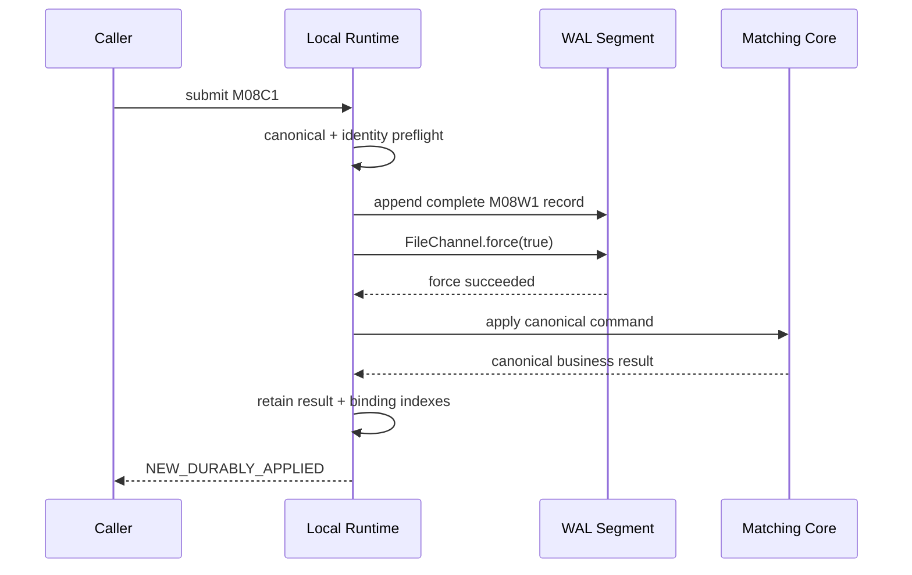

> 本篇按 annotated [`course/m08-start`](https://github.com/lcha-reln/cex-matching/tree/course/m08-start) 到 annotated [`course/m08-complete`](https://github.com/lcha-reln/cex-matching/tree/course/m08-complete) 的真实实现校准。ACK 时序、fail-closed 结果与 crash window 均由[完成 evidence](https://lcha-reln.github.io/signal-grid-blog/practice/high-availability-cex/m08/evidence/manifest.json)约束，但证据范围仍只是本地进程与代码级故障。
>
> 完成身份：`course/m08-complete` peeled commit `5c8d8f6a5356f6ebbdf87d83745d8e8bd0861199`；本站 manifest SHA-256 `19a5c93e618ef5d9430719b135ca95aa7db6513c7389e0cfb50eb80c430e2923`。

WAL 最危险的错误不是“忘了写”，而是过早告诉调用方成功。`write()` 返回只说明字节交给了操作系统路径；core apply 成功只说明当前进程内存变了。二者任一单独成立，都不足以让调用方丢掉重试所需的 identity。

M08 冻结一条不可交换的链：**新命令只有在完整 record append、`FileChannel.force(true)` 成功、matching-core apply 成功后才能 ACK；任何不确定窗口都不返回成功，并将 runtime fail closed。**

这里的 ACK 是本地 `submit` 返回 sealed `SubmissionResult.NewDurablyApplied`（exact retry 则为 `DuplicateReplayed`），不是 HTTP、WebSocket 或 Aeron 网络响应。M08 只冻结本地调用边界，外部协议怎样映射 UNKNOWN 留给后续 adapter。

## 正常路径只有一个 ACK 位置

完整顺序是：

```text
validate + canonicalize
→ identity / slot / epoch preflight
→ append complete M08W1 record
→ FileChannel.force(true)
→ apply command to private matching-core
→ cache canonical original result
→ ACK NEW_DURABLY_APPLIED
```

可以用一条时序图表示：



箭头顺序是业务合同，不是实现建议。ACK 之前不能把任务丢给后台线程“稍后 force”，也不能先 apply 再尝试 journal。

## 业务拒绝也是 durably applied

若 canonical Place 因 duplicate orderId、band、mode 或 STP 业务规则被 core 拒绝，正常路径仍是：

```text
append → force → core returns business Reject
→ cache that canonical Reject
→ NEW_DURABLY_APPLIED
```

`NEW_DURABLY_APPLIED` 表示“这个 command identity 已持久占用槽位并在 core 应用”，不是“撮合业务成功”。ACK 必须同时携带/引用 canonical business result，调用方才能看到 `MARKET_NOT_OPEN` 等拒绝。

若把业务 Reject 直接返回而不 journal，live process 的 application sequence 已推进，recovery 却没有该边界；之后的 activation/mode fence 会错位。

## 第一个 crash window：append 后、record force 前

状态可能是：

```text
file contains no bytes
or partial length/frame
or complete record still only in volatile caches
or complete record happened to reach durable storage
```

runtime 在这个窗口不能判断哪一种已经发生，因此：

```text
no ACK
result = DURABILITY_UNKNOWN
runtime = FAILED_CLOSED
```

不能在同一打开实例中简单重写相同 record：局部字节可能已经存在，再 append 会形成重复或 corruption。调用方也不能换一个新 commandId“重试业务”；它必须保留原 commandId/slot/payload，等待 runtime 重新打开并按 WAL 恢复判断。

恢复时，合法的最后 torn tail 可截断并 force；完整且校验通过的 record 要重放；完整但 CRC/hash/codec 不一致则 fail closed。第四篇会精确定义这三种情况。

## 第二个 crash window：record force 后、core apply 前

此时 WAL 已是权威前缀，内存 core 尚未包含命令：

```text
durable record = yes
live apply      = no
ACK             = no
```

进程重启必须从 genesis 重放该 record，并让 fresh core 产生原本应该得到的业务结果。调用方随后用相同 identity 重试时，得到 `DUPLICATE_REPLAYED` 与原始 WAL/application position、原始 canonical result，而不是第二次 apply。

如果 force 已成功但当前进程 apply 抛异常，runtime 同样不 ACK，而是返回 stage 为 `APPLY_OR_ACK` 的 `DurabilityUnknown` 并进入 `FAILED_CLOSED`。`SYSTEM_ERROR` 是课程裁判对自身/基础设施异常的分类，不是 runtime 的 `SubmissionResult`。这个 durable poison command 不能被跳过；在修复代码或数据前，它可能持续阻塞每次恢复。自动跳到下一条会把权威日志前缀撕开。

## 第三个 crash window：core apply 后、ACK 返回前

这是调用方最典型的 unknown outcome：

```text
durable record = yes
core applied    = yes
caller ACK      = unknown/no
```

调用方唯一安全动作是提交**相同** commandId、Slot 与 payload。runtime 在 live index 或 recovery-rebuilt index 中识别 exact binding，返回原始结果：

```text
status = DUPLICATE_REPLAYED
append count = 0
force count  = 0
apply count  = 0
result = exact original canonical result
```

若调用方换 commandId，runtime 没有依据知道它是重试还是新的同内容业务命令，可能合法地再次执行。因此 durable idempotency 是调用方和 runtime 共同遵守的 identity 协议，不是“payload 一样就自动去重”。

## 三个窗口的一张状态表

| crash point | record durable | core applied | ACK allowed | restart action |
| --- | --- | --- | --- | --- |
| append 后、force 前 | unknown | no | no | scan/validate tail，截断合法 torn 或 replay complete |
| force 后、apply 前 | yes | no | no | replay durable record to fresh core |
| apply 后、ACK 前 | yes | yes in lost process | no/unknown to caller | genesis replay 后 exact duplicate |
| apply + result cache 后 | yes | yes | yes | later exact duplicate returns original |

这里没有“超时就当失败”。超时只说明调用方没收到结果，不说明 record/apply 是否发生；错误的失败结论会诱导调用方换 identity 重复下单。

## I/O failure 后为何必须 fail closed

已成功打开的 runtime 在一次 `submit` 内执行 `write`、`force`、rollover move 或 directory force，任一步抛 I/O error 时都会返回 `DurabilityUnknown` 并拒绝后续新命令。原因是：

- file position 可能已经改变；
- partial frame 可能存在；
- force 抛错不能证明此前所有 bytes 都未持久；
- 继续 append 会把“不确定尾部”变成日志中段；
- 后续 ACK 会越过一个未知 durable prefix。

`FAILED_CLOSED` 不是永久数据结论，而是“必须关闭、重新取得目录锁、完整恢复后才能判断”。恢复也可能因 corruption 继续 fail closed，不能默认创建空 WAL。

另一类故障发生在 `LocalMatchingRuntime.open` 返回之前：缺失/符号链接目录、目录锁、header 创建/force/rename、orphan cleanup 或 recovery force/replay 失败会直接抛出打开异常，调用方根本拿不到一个 `OPEN` runtime，也不会收到某个 submit 结果。两类路径都禁止 ACK，但 API 表现不能混写。

## 新 segment 的 ACK 还有目录持久边界

rollover 第一条 record 的顺序更长：

```text
write temp header
→ force header file
→ atomic rename temp to final
→ force parent directory
→ append first record
→ force record
→ apply
→ ACK
```

只 force file 不保证 rename 后的目录项在 crash 后仍存在。若第一条 record ACK 早于 parent-directory force，调用方以为命令 durable，重启却可能找不到整个新 segment。

因此 `M08-ACK-BEFORE-DIRECTORY-FORCE` 与 `M08-ACK-BEFORE-RECORD-FORCE` 是两类独立错误。header force、directory force、record force 缺一不可；具体平台不支持所需 barrier 时应 fail closed，而不是降级成“可能安全”。

## duplicate 路径不能再写一遍 WAL

exact known binding 在 preflight 阶段命中，直接返回最初结果：

```text
lookup commandId and Slot
→ verify both bind same payloadHash
→ return original WAL/application position + canonical result
→ DUPLICATE_REPLAYED
```

它不 append “duplicate marker”，不 force，不 apply，也不推进 producer/application sequence。否则一次网络重试会不断增长 WAL，甚至让 core 再占应用边界。

result index 保存重建 ACK 所需的原始事件、context/position 与 digest，但不为每条命令复制整本 `bookAfter`。WAL 本身只持久 canonical command，不再双写 result 或业务状态；result 由 genesis replay 确定重建。

## force 的保证必须写得准确

`FileChannel.force(true)` 表示实现完成了 PLAN v0.10 指定的 JDK/OS durability barrier。它不自动证明：

- 任意文件系统都以相同方式实现；
- 磁盘控制器无易失写缓存；
- 虚拟化/云块存储兑现同样语义；
- 真实拔电后物理介质必然保留所有扇区；
- 跨目录 rename 或网络文件系统安全。

课程可以用 deterministic I/O seam 和 child JVM crash 验证程序顺序，不能把它扩大为硬件断电认证。部署选择的文件系统与硬件还需要单独资格验证。

## 已完成的可执行 gate

本地入口是：

```bash
./gradlew clean build --no-daemon
./gradlew m08Check --no-daemon
```

complete gate 已执行 7 组 `BEFORE_OPERATION` history 和 3 个 child JVM `Runtime.halt(86)` window，记录是否 ACK、runtime state、真实 WAL 文件摘要与 fresh restart 结果。故障 seam 只覆盖当前声明的 `FaultPoint`，并不声称穷举任意 OS/I/O 指令；命名的 ENOSPC/read-only 证据也明确标记 `actualFilesystem=false`。

网页只展示静态 crash timeline 和 frozen result；Java 文件 I/O、child JVM 与故障注入仍在读者本地运行，不接外部 Judge。

## 本篇停止点

M08 的 ACK 现在有了唯一位置：完整 record 和必要目录元数据先 force，core 再 apply，canonical result 被缓存后才能返回 `NEW_DURABLY_APPLIED`。三个 crash window 都不猜成功/失败，而是保留 identity、fail closed、通过恢复判定。

下一篇解决“相同 identity 到底是什么”：commandId、producer Slot 与 payload hash 必须双向绑定，epoch/gap 也不能被重试绕过。
