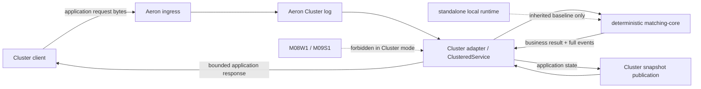

> 当前状态：M11 处于 `IN_PROGRESS`。annotated [`course/m11-start`](https://github.com/lcha-reln/cex-matching/tree/course/m11-start) 冻结了 [PLAN v0.14 合同](https://github.com/lcha-reln/cex-matching/blob/course/m11-start/docs/specs/m11.md)、结构化 RED、六份 application codec Golden 与五篇教程地址；当前没有 complete ref、公开 evidence、产品 release 或高可用结论。

M10 已经给出一个可恢复、有界准入且有环境绑定容量证据的单机撮合服务。最自然、也最危险的下一步，是把这个服务原封不动塞进 `ClusteredService`，继续写自己的 WAL，再让 Aeron Cluster 也记录一份日志。表面上看，这是“多一层保险”；实际上它让系统在崩溃后拥有两个都自称权威、却可能停在不同位置的恢复源。

M11 的论点很窄：**Aeron 只属于 Adapter 外层；业务状态仍只属于确定性 matching state machine；Cluster 模式只允许 Aeron log 与 Cluster snapshot 成为恢复真相。** 单节点尚不能容忍节点故障，但先把这条边界做对，M12 才有资格讨论三节点复制和切主。

## 先区分业务状态机与 Cluster 运行时

`matching-core` 已经积累了 M01～M07 的业务语义：价格时间优先、撤单、ExecutionPolicy、RuleSet、市场模式、Mass Cancel 和 STP。M08～M10 又证明了本地持久、Snapshot、有界恢复和准入测量。M11 不能借“接入 Aeron”重写这些规则，否则 Direct 与 Cluster 得到不同结果时，我们无法判断是 Adapter 错了，还是撮合算法被改了。

因此先按所有权拆成四层：

| 层                | 拥有什么                                                                    | 不得拥有                                    |
| ----------------- | --------------------------------------------------------------------------- | ------------------------------------------- |
| `matching-core`   | 订单簿、生命周期、规则、业务命令 apply、完整结果、semantic digest           | Aeron 类型、文件、网络、session、term、墙钟 |
| application codec | request、bounded response、Cluster snapshot 的 version 1/2 bytes            | Aeron 内部协议、业务决策、下游可续接事件流  |
| Cluster adapter   | ingress decode、log callback apply、响应关联、Snapshot 装载/发布            | 第二份 WAL、数据库、HTTP、Counter、Rest     |
| Aeron runtime     | Media Driver、Archive、Consensus Module、Service Container 的目录与生命周期 | 订单 ID、command identity、业务状态解释     |

这里的关键不是模块名，而是依赖方向：core 不知道自己运行在 Direct runner、本地 WAL 还是 Aeron Cluster 后面；Adapter 可以调用 core，但不能把 runtime metadata 反向写进业务模型。



虚线不是备用写入路径。它表示本地运行时仍作为已发布回归基线存在，但 Cluster adapter 不构造也不调用它。

## “复用已有 WAL”为什么会制造两个真相

假设 Cluster log 的位置 `L` 已经回调到 Service，而 Adapter 又准备把同一命令写入 standalone WAL。无论先写哪一边，都存在无法原子跨越的窗口。

### 先 Cluster apply，再写本地 WAL

```text
Cluster log contains C
→ ClusteredService applies C
→ business state now includes C
→ process stops before local WAL append/force
```

Cluster 恢复会包含 `C`，本地 WAL 恢复却看不到它。如果运维人员把本地 WAL 当“更熟悉的权威”，命令会消失。

### 先写本地 WAL，再等待 Cluster apply

```text
local WAL force(C)
→ process stops before Cluster log applies C
```

本地恢复会尝试 apply `C`，Cluster log 却未必包含它。若 Adapter 在重启时把本地 WAL 灌回 Cluster，还会重新引入提交身份、重复响应和顺序归属问题。

这不是多写一份文件就能解决的问题。两套日志之间没有共同原子提交点，也没有一个合法规则能在所有窗口中选择“较新的一份”。所以 M11 的架构事实必须是：

```text
Cluster mode durability authority = Aeron Cluster log + Cluster snapshot
standalone application WAL writes = 0
```

M08W1 与 M09S1 没有被废弃；它们继续证明 standalone runtime。只是进入 Cluster 模式后，恢复所有权已经转移，不能把两个时代的机制拼成一个未经证明的协议。

## 业务只能从 log callback 推进

客户端调用 `AeronCluster.offer` 时，Publication 接受 bytes 只说明 ingress 传输层暂时接纳了数据。它不证明消息已提交、不证明 Service 已 apply，更不证明撮合业务成功。

M11 固定唯一业务命令 transition 入口：

```text
ClusteredService.onSessionMessage
  → validate and decode application request
  → extract canonical M08C1 envelope
  → apply through the existing state-machine seam
  → bind complete business result
  → encode and offer correlated response
```

下列 callback 即使发生，也不能修改业务状态：

- session open / close；
- role change；
- timer event；
- Cluster timestamp 变化；
- member、term、log position 或其他 counter 变化。

原因很直接：这些事件可能随重启、拓扑和运行调度改变。若它们能创建订单、推进 ApplicationSequence 或清空市场，相同业务历史就不再有相同结果。

`onStart` 是另一个合法的状态安装边界，但它只能装入经过完整性、顺序和身份连续性校验的 Snapshot；它不是第二条命令 apply 路径。

## Adapter 需要的 seam 应该尽可能小

“core 不依赖 Aeron”不等于 Adapter 可以复制一套 core 内部逻辑。M11 只允许暴露复用已有 canonical command codec 与 core applier 所需的最小内部 seam。概念上，它应接近：

```java
interface MatchingStateMachine {
    AppliedResult applyCanonicalEnvelope(byte[] canonicalEnvelope);
    byte[] encodeSemanticSnapshot();
    void restoreSemanticSnapshot(byte[] snapshot);
    SemanticDigest semanticDigest();
}
```

这段代码只是边界示意，不冻结最终 Java API。真正冻结的是几条性质：

1. Direct 与 Cluster 调用同一业务 apply 入口；
2. Adapter 不重新实现价格优先、撤单、STP 或规则判定；
3. Snapshot 保存完整已 apply 业务状态和 identity/result table；
4. runtime metadata 不参与 semantic digest；
5. `matching-core` 相对 `course/m10-complete` 保持 byte-identical；Adapter 只能复用既有 M08C1 codec 与 core applier seam，不能借机修改 core 或重写算法。

这让失败定位变得可能：若相同 canonical input 的业务观察不同，差异就在 Adapter、codec、Snapshot 或观察归一化，而不是一片同时变化的代码海洋。

## 单节点必须是真 Cluster，不是模拟队列

M11 虽然只有一个 member，仍必须启动真实 localhost 组件：

```text
Media Driver
Archive
Consensus Module (member 0, appointed leader 0)
Clustered Service Container
Cluster client
```

依赖基线冻结为 Aeron `1.52.2`、Agrona `2.5.0` 和 Java 25。运行目录由测试独占，位于 `build/tmp/m11`；测试串行执行，使用有界 readiness/response deadline 并采集 Aeron error/counter，而不是依赖固定 `sleep` 猜测“应该启动好了”。

为什么不能用一个内存队列调用 `onSessionMessage`？因为那会绕过本单元真正要验证的边界：

- ingress bytes 是否真的进入 Cluster；
- Service 是否只从 log callback 获得命令；
- client/session/correlation 是否按真实 API 生命周期变化；
- Admin snapshot 请求的 `OK` 与真正完成是否被严格区分；
- Cluster 与 Archive 目录能否被保留并重新打开；
- application Snapshot 是否真的经 Publication/Image 路径写出和装载，且格式不依赖某次运行的 fragmentation 方式。

fake 可以服务快速单元测试，但不能充当 M11 的完成证据。

## 单一真相还要求外部副作用为零

一个真实交易系统最终要写行情、结算、通知和查询投影，但 M11 不能在 `ClusteredService` 中顺手调用数据库或 HTTP。否则 log replay 会再次执行外部副作用，Direct/Cluster 等价也会被外部环境污染。

M11 的 Service 只产生两类内部结果：

- 给当前调用方的 bounded application response；
- 供裁判读取、但不影响状态的完整业务 observation。

可续接的 Execution/Market output、sequence、cursor 和 publisher fencing 属于 M14。现在提前把 event list 推给外部消费者，会在还没有 outbox/replay 协议时制造一个无法恢复的半成品接口。

## 如何证明边界没有被注释掩盖

完成门禁不能只搜索代码中有没有一句“do not use local WAL”。至少需要三组可执行观察：

| 风险                | 必须出现的观察                                     | 反例                                |
| ------------------- | -------------------------------------------------- | ----------------------------------- |
| Aeron 泄入 core     | 依赖/class-tree 扫描为零违规                       | core import Aeron buffer/session    |
| offer 被当作成功    | response 只在 log apply 和 result bind 后出现      | publication position 直接映射成功   |
| 两份恢复真相        | Cluster 路径 standalone WAL write count 为 0       | Adapter 构造 `LocalMatchingRuntime` |
| session 成为身份    | 换 session、同 command identity 仍 replay 原结果   | session ID 参与 dedup key           |
| 外部 I/O 污染 apply | Service 的 DB/HTTP/application file-store 依赖为零 | replay 再次调用外部系统             |

起点已经为这些风险注册了固定场景与 candidate identity；当前阶段只冻结问题和 RED，不能把尚未生成的完成报告写成 PASS。

## 这一章把 M12 的地基压实了什么

M11 完成后能保证的只是：在一个真实单 member Cluster 中，Adapter 不改变业务语义，业务只从 log apply 推进，Cluster log/snapshot 是唯一恢复源。它没有冗余副本；唯一 member 停止，服务就停止。组件是否同进程部署不改变这个事实。

下一篇将把 application request、bounded response 与 Cluster snapshot 的版本合同拆开。只有 bytes 本身可重放、旧 Snapshot 不丢 identity、未知版本失败关闭，所谓“重启后等价”才不是同一套 Java 对象在内存里自我比较。
