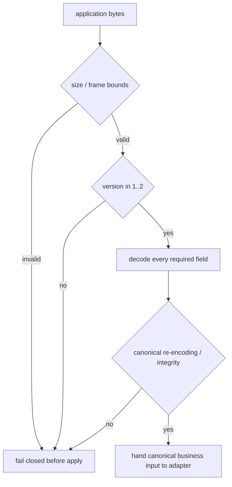

> 当前状态：M11 仍是 `IN_PROGRESS`。协议边界由 annotated [`course/m11-start`](https://github.com/lcha-reln/cex-matching/tree/course/m11-start) 中的 [M11 合同](https://github.com/lcha-reln/cex-matching/blob/course/m11-start/docs/specs/m11.md) 与 [`matching.m11.workload.v1` Schema](https://github.com/lcha-reln/cex-matching/blob/course/m11-start/schemas/matching.m11.workload.v1.schema.json) 冻结；没有完成实现、通过报告或公开 evidence。

“协议支持 N/N-1”很容易写成一句没有约束力的话：decoder 多接受一个数字，就算兼容。真正困难的是，旧 bytes 中的业务身份、原始结果和 Snapshot 状态能否无损进入当前模型；当前响应能否按调用方请求降级；损坏或越界输入能否在 apply 前失败关闭。

M11 不冻结下游 event stream。它只冻结三种 application artifact：**request、bounded response、Cluster snapshot**。三者都是 `currentVersion=2`、`minimumReadableVersion=1`，version 1/2 各一份不可变二进制 Golden，共六份。

## 先把“兼容”拆成三个方向

同一个版本号出现在不同数据方向，含义并不相同。

| Artifact             | 谁写           | 谁读                 | M11 的兼容责任                                       |
| -------------------- | -------------- | -------------------- | ---------------------------------------------------- |
| application request  | Cluster client | 当前 Service         | 当前 reader 接受 request v1/v2                       |
| application response | 当前 Service   | 本次调用方           | Service 能按 request 指定 down-encode response v1/v2 |
| Cluster snapshot     | 当前 Service   | 重启后的当前 Service | 当前 reader 接受 S1/S2，writer 只写 S2               |

因此 M11 的精确声明是：

```text
minimumReadableVersion = 1
currentWriterVersion   = 2
compatibilityClaim     = BACKWARD_READ_AND_RESPONSE_DOWN_ENCODE_ONLY
previousVersionStatus  = FIXTURE_ONLY_NEVER_PRODUCTION
```

它没有声明旧 v1 Server 能读取 v2，没有声明旧 binary 能装载 S2，也没有声明混合版本三节点能够 rolling upgrade。v1 Golden 是在 M11 起点创建的合同 fixture，从未作为生产版本部署；这点必须留在 limitation 中。

## Request 的版本差异只属于调用协议

Request v1 包含两层身份：

```text
request v1
├── correlationId              invocation identity
└── canonical M08C1 envelope   durable business identity
    ├── commandId
    ├── producer Slot
    ├── payload hash
    └── canonical business command
```

Request v2 在此基础上增加 `requestedResponseSchemaVersion`。这不会改变 command 的业务含义，也不会创建第二个 dedup key。

协商规则在起点就冻结：request v1 永远选择 response v1；request v2 的值只能是 `1` 或 `2`。其他值在 core apply 前作为协议失败关闭，业务状态零变更，也不伪造一条“业务拒绝”响应。

### correlation 与 command identity 不能合并

同一业务命令超时后重试，可以换一个 correlation：

```text
attempt A: correlation=71, commandId=C, Slot=S, payloadHash=H
attempt B: correlation=92, commandId=C, Slot=S, payloadHash=H
```

若 `C/S/H` 相同，状态机必须 replay original result；响应使用各自 correlation 回到当前 invocation。若把 correlation 纳入业务 identity，同一命令会被错误地 apply 两次。反过来，若只用 correlation 去重，进程重启后这个易失身份也无法保护业务。

v2 的 response version 请求同样只是表现层协商。它不能改变 core 的结果、ApplicationSequence、事件或 semantic digest。

## Response 为什么必须有界

Response v1 包含：

- correlation；
- outcome；
- application sequence；
- result digest，或稳定 rejection code。

Response v2 额外回显可选 `commandId` 和 semantic-state digest。它没有 Slot 或 payloadHash，所以这不是完整 command identity。当前 Service 可以根据 request v2 的请求编码 v1 或 v2 response；request v1 没有协商字段，固定返回 response v1。

但 response 不内联无界业务事件列表。考虑一次 Mass Cancel：事件数量随盘口中的订单数量增长，把完整列表放进同步 response 会让 frame 大小、响应时间和客户端内存都失去上界。

M11 把它定义为：

```text
boundedResponse = RESULT_COMMITMENT_WITHOUT_UNBOUNDED_EVENT_STREAM
```

状态机仍在 identity table 中保留完整 canonical result，裁判也能通过不影响业务的 observation seam 比较完整 events。只是这份观察不是对 Counter 或 Rest 发布的协议。当前候选地图把可续接 Execution/Market stream、sequence、cursor 与 gap recovery 暂列在 M14，最终范围仍要等该单元签约。

这一区分避免了一个常见偷换：能在测试里看到完整事件，不等于系统已经拥有可恢复的下游事件流。

## S1 必须已经足以恢复幂等

如果 S1 只保存订单簿，当前 reader 即使“成功解析”旧 Snapshot，也会丢失 command identity 和 original result。重启后的 duplicate 可能再次成交，或者返回一个重新计算的不同结果。这种兼容比直接拒绝更危险。

所以 S1 从一开始就必须包含完整业务状态与规范排序的 identity-result table：

```text
commandId
Slot(producerEpoch, producerSequence)
payloadHash
full canonical original result
next application position
complete matching state
```

这里的 `payloadHash` 精确定义为：

```text
payloadHash = SHA-256(canonical M08 command-payload bytes)
```

claimed hash 必须在 apply 前重算；外层 M11 request、correlation、requested response version 与整个 M08C1 envelope 都不进入这个 hash domain。否则只改变调用关联或响应版本的 retry 会被误判成业务冲突。

identity-result table 按 original `CanonicalResult.applicationSequence` 严格 `1..N` 排列。恢复还要拒绝重复 commandId、重复 Slot，以及 producer epoch/sequence 不连续。两份 Snapshot Golden 都含两条 binding，单条 fixture 无法抓住的顺序漂移因此会直接改变 bytes。

S2 不扩大业务状态覆盖，只新增：

- 显式 readable/writable protocol bounds；
- identity table 的完整性/校验字段；
- semantic state 的完整性/校验字段。

这让 `S1 → current reader` 成为真实兼容，而不是靠默认值填出一个能启动但已失去安全语义的状态。

## 六份 Golden 冻结的不是 JSON 长相

M11 起点生成且固定以下六份 binary fixture；精确目录、版本矩阵和生成规模由 fixed tag 下的 [`workload-v1.json`](https://github.com/lcha-reln/cex-matching/blob/course/m11-start/matching-testkit/src/test/resources/m11/workload-v1.json) 共同约束：

| Golden                                                                                                                                            | bytes | SHA-256                                                           | 主要证明                                                  |
| ------------------------------------------------------------------------------------------------------------------------------------------------- | ----: | ----------------------------------------------------------------- | --------------------------------------------------------- |
| [`request-v1.bin`](https://github.com/lcha-reln/cex-matching/blob/course/m11-start/matching-testkit/src/test/resources/m11/goldens/request-v1.bin)   |   203 | `30e8cde285dcbefcd3bf7a3ffafb2a6e2ec09b039db7d793a792d6ceb01fa609` | 当前 reader 能提取 correlation 与完整 M08C1 envelope      |
| [`request-v2.bin`](https://github.com/lcha-reln/cex-matching/blob/course/m11-start/matching-testkit/src/test/resources/m11/goldens/request-v2.bin)   |   207 | `4c109a796e18aa628ee95184497bd9dc819e48a3f11fb7411d2440b6442ee409` | response version request 不改变 durable command identity  |
| [`response-v1.bin`](https://github.com/lcha-reln/cex-matching/blob/course/m11-start/matching-testkit/src/test/resources/m11/goldens/response-v1.bin) |    72 | `64eca820223db940aa7499d727b351ac0df1dfdcbfe0aefea2f591ae194ccfec` | 有界结果承诺的旧布局可读取，并可被显式 down-encode        |
| [`response-v2.bin`](https://github.com/lcha-reln/cex-matching/blob/course/m11-start/matching-testkit/src/test/resources/m11/goldens/response-v2.bin) |   121 | `3956d17420c85f95842d913b8e923f4e376b6743369e6d055e164c5ced8eee4b` | 可选 commandId echo 与 semantic digest 的当前布局可复现   |
| [`snapshot-v1.bin`](https://github.com/lcha-reln/cex-matching/blob/course/m11-start/matching-testkit/src/test/resources/m11/goldens/snapshot-v1.bin) | 3,595 | `3bdd0490d0c0e8943eb67a573ff84c97eb6d2a93ab5438b2960011e49c5a6d67` | 两条有序 binding 证明旧格式完整携带 identity/result table |
| [`snapshot-v2.bin`](https://github.com/lcha-reln/cex-matching/blob/course/m11-start/matching-testkit/src/test/resources/m11/goldens/snapshot-v2.bin) | 3,667 | `1df85f21c8ea4bc1ff483d220e5794d2e770393d3252e2150426c169b769a044` | 两条有序 binding 与当前 bounds/integrity 字段 byte-exact  |

每份 Golden 至少要绑定：

```text
artifact kind
schema version
encoded length
exact bytes
sha256
decoded semantic observation
explicitly versioned re-encoding when that writer mode is supported
```

这里不能把“能读取 v1”偷换成“生产 writer 仍默认写 v1”。当前 request 与 Snapshot 的生产写入路径选择 v2；当前 reader 读取 v1 后必须恢复完整语义。测试 oracle 可以显式指定旧版本重编码来核对 v1 Golden，但这不构成生产默认、rollback 或旧 binary 写入承诺。response 是例外：它有显式协商路径，encoder 必须按请求逐字节复现 v1 或 v2，不能用“current writer 是 2”抹掉 down-encode 合同。

Golden 的意义是阻止“代码和期望一起改”。若测试每次运行都用当前 encoder 生成输入、再用当前 decoder 读取，错误的字段顺序、端序或默认值可以在两端同步漂移而仍然通过。不可变 bytes 把协议历史放在代码之外。

## 本篇实作：从 Golden 反推三套 Codec

完成实现的固定阅读坐标是：

```text
course/m11-complete:matching-cluster-runtime/src/main/java/io/github/lchareln/cex/matching/cluster/M11RequestCodec.java
course/m11-complete:matching-cluster-runtime/src/main/java/io/github/lchareln/cex/matching/cluster/M11ResponseCodec.java
course/m11-complete:matching-cluster-runtime/src/main/java/io/github/lchareln/cex/matching/cluster/M11SnapshotCodec.java
course/m11-complete:matching-cluster-runtime/src/test/java/io/github/lchareln/cex/matching/cluster/M11ProtocolCompatibilityTest.java
```

当前 `IN_PROGRESS` 页面只记录坐标；等 complete ref 在 `CODE_VERIFIED` 注册并推送后，发布步骤再转换成固定链接，不能假定远端现在已经存在该 tag。

在实现分支只运行协议门禁：

```bash
./gradlew :matching-cluster-runtime:test \
  --tests 'io.github.lchareln.cex.matching.cluster.M11ProtocolCompatibilityTest' \
  --no-daemon
```

不要只看 Gradle 是否退出零；逐项核对测试是否真的观察到：v2 request/Snapshot 写入与上表 bytes 完全一致，v1 request/response/Snapshot 可读且不丢 identity/original result，response v1/v2 都能按显式协商写出，非法 response version 和伪造 payload hash 在 apply 前保持零状态修改。任何一项缺失，都不能进入真实 Cluster 集成。

## Canonical 约束必须先于业务 apply

兼容 reader 不是宽松 reader。以下输入应在调用 core 前失败：

- version 为 0、负值或大于 2；
- header 声明长度与实际 bytes 不同；
- 必填字段缺失或重复；
- enum/code 不在冻结集合；
- 数值越界；
- payload 后存在 trailing bytes；
- M08C1 envelope 自身不是 canonical；
- Snapshot entry 顺序非 canonical、重复或不连续；
- Snapshot 的 CRC32C 或 SHA-256 不符。

失败优先级要稳定。一个同时“版本未知且 CRC 错误”的输入应得到冻结的第一条失败原因，不能依赖解析器偶然先碰到哪个字段。更重要的是，任何失败都必须发生在业务 apply 前，ApplicationSequence、identity table 和订单簿保持不变。



“忽略未知字段继续”适合某些非权威查询 DTO，却不适合决定订单、终态和恢复身份的 application codec。

## Response down-encode 也不能丢掉失败语义

当前 Service 返回 v1 时，v2 独有的 commandId echo 和 semantic digest 可以省略，因为 v1 从未承诺这些字段；但 outcome、application sequence、result digest 或稳定 rejection code 不能改变。

一个安全的 down-encode 检查应比较：

```text
v2 internal result
→ encode response v1
→ decode with current reader
→ normalize to fields promised by v1
→ compare with the same projection of v2 result
```

M11 已冻结所有有效业务 outcome 都能投影到 v1；降级只删除 v2 extension，不得把任何 outcome 映射成 `SUCCESS` 或 generic error。若未来新增 v1 无法表达的 outcome，必须在未来协议合同中显式升级，不能回写 M11。

## Snapshot transport 与 Snapshot format 是两件事

Aeron 可能把 Snapshot bytes 分成多个 publication frame。M11 的 application Snapshot format 具有自己的有界 framing、canonical ordering、CRC32C 和 SHA-256；它不依赖某次运行恰好怎样 fragment。

因此测试要分两层：

1. format Golden：对固定状态编码出完全相同的 S1/S2 bytes；
2. runtime transport：经真实 snapshot Publication 写出，在严格 Image loader 中重新组装并验证。

只测第一层证明不了真实 Cluster restart；只测第二层而没有 Golden，又无法证明 format 没随代码漂移。两者共同通过，才能说“当前 runtime 正确使用冻结 application snapshot”。

## 六份 Golden 能保证什么，仍不能保证什么

完成门禁需要证明当前程序读取 version 1/2 request、response、snapshot，并按冻结规则写 version 2 或 down-encode response；对应反例还必须杀死“拒绝 N-1”和“接受 unsupported version”这类候选。当前草稿只陈述这项责任，实际结论以后续 complete-tag evidence 为准。

它不能证明：

- 旧 version 1 binary 能读取 version 2；
- mixed-version Cluster 安全；
- rolling upgrade、rollback 或 N-2 migration 可用；
- Aeron 自身内部协议与 application version 相同；
- response 已经是可续接下游事件流。

下一篇进入真实命令路径：为什么 `AeronCluster.offer` 的正数返回仍不是成功，为什么 result 必须先绑定再尝试响应，以及 session/correlation/command identity 各自只能负责哪一段生命周期。
