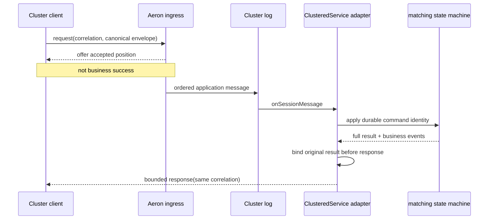

> 当前状态：M11 处于结构化 RED 之后的实施阶段。annotated [`course/m11-start`](https://github.com/lcha-reln/cex-matching/tree/course/m11-start) 冻结了 [ingress、identity、correlation 与 response 合同](https://github.com/lcha-reln/cex-matching/blob/course/m11-start/docs/specs/m11.md)；本文不声称尚未生成的完成 evidence 已通过。

客户端把 bytes 成功写入 Aeron ingress 后，最容易犯的错误是立刻返回“下单成功”。这个错误把传输层接受、Cluster 排序、Service apply、业务结果绑定和响应送达压成了一个布尔值。一旦进程在任意两步之间停止，客户端和状态机就会对同一命令得出不同结论。

M11 的核心命题是：**业务效果只发生在 Cluster log callback；结果必须先成为可恢复业务状态，响应才可以尝试发送；correlation 只关联一次调用，session 只描述一次连接，durable command identity 才决定重复或冲突。**

## 一条调用至少有四种不同事实

先给每个观察命名：

| 观察                                 | 它能证明什么                             | 它不能证明什么                             |
| ------------------------------------ | ---------------------------------------- | ------------------------------------------ |
| `AeronCluster.offer > 0`             | ingress Publication 接受了本次 bytes     | Cluster commit、Service apply、业务成功    |
| `onSessionMessage` 被调用            | 该消息已按 Cluster log 顺序交给 Service  | response 已被客户端看到                    |
| result 已绑定到 command identity     | duplicate 能恢复 original result         | 当前 response offer 一定成功               |
| 客户端收到同 correlation 的 response | 本次 invocation 得到一个解码后的结果承诺 | 三节点 failover 或外部 exactly-once 已完成 |

这四个事实不能用一个 `success=true` 替代。尤其是 publication position：它属于 transport/runtime，不是 ApplicationSequence，也不是订单号。



箭头表达的是必要先后，不是宣称每一步都有一个独立外部事务。

## Request 中有三类身份，职责不能串台

一次调用同时出现 correlation、session 和 canonical command identity。

### correlationId：只回答“这是哪次调用”

correlation 由 request 外层携带，response 必须原样返回。客户端用它把异步响应匹配到等待者。一次超时重试可以创建新 correlation，因为这是新的 invocation。

### clusterSessionId：只回答“当前通过哪条连接”

session 由 Aeron runtime 管理。重连会得到新 session；一个 session 可以提交多条命令。它不能成为 order ID、producer ID、dedup key 或 Snapshot 中的业务字段。

### commandId + Slot + payloadHash：回答“这是哪个业务命令”

嵌入的 canonical M08C1 envelope 保存：

- `commandId`；
- producer epoch/sequence 构成的 Slot；
- `payloadHash = SHA-256(canonical M08 command-payload bytes)`；
- 具体业务命令。

这组身份已经在 M08/M09 中进入可恢复状态。decoder 在 apply 前重算 payloadHash；外层 M11 request、correlation、requested response version 和完整 envelope 都不属于 hash domain。相同 identity 与 payload 是 duplicate，应返回 original result；identity 相同但 payload 不同是 conflict，必须零业务修改；sequence gap、epoch fence 等仍保持原语义。

用一个例子可以看清三者：

```text
first invocation:
  session=10, correlation=71, commandId=C, slot=S, hash=H

retry after reconnect:
  session=44, correlation=92, commandId=C, slot=S, hash=H
```

两次调用的传输身份都变了，业务身份没有变。第二次必须 replay 第一次的 exact original result，而不是创建第二个业务效果。

## Offer accepted 之后为什么还不能 ACK

`AeronCluster.offer` 的正数结果只说明 Publication 在当前时刻接收了 bytes。随后仍可能发生：

- 消息尚未交给 Service；
- request codec 拒绝格式；
- canonical envelope 业务校验失败；
- command identity 被判定为 duplicate 或 conflict；
- core 返回业务 rejection；
- Service 已 apply，但 response publication 暂时失败；
- 测试环境卡住并触发有界 deadline。

如果客户端把 offer position 当作业务成功，`M11-OFFER-AS-SUCCESS` candidate 就会在“请求被 transport 接受、但尚未 apply”的窗口产生虚假结果。

健康路径必须等待同 correlation 的 decoded application response。注意，这仍没有实现结果 `UNKNOWN` 协议；当前候选地图暂把它列入 M12，最终以 M12 签约合同为准。M11 只有单节点、受控本地环境；若健康场景在 deadline 内收不到响应，harness 报 `SYSTEM_ERROR`，不能凭空合成业务失败，也不能把超时算作 candidate kill。

## Result 必须先绑定，再尝试响应

消息进入 log callback 后，identity preflight 必须先把输入分成三个互斥分支；“bind before response”只对需要或已经拥有 binding 的分支成立，不能误写成所有 rejection 都创建新 binding：

1. **New**：调用 core 完成一次确定性 transition；即使 core 给出业务 rejection，它仍是这条新业务命令的 canonical original result，随后与 `commandId + Slot + payloadHash` 绑定。
2. **Duplicate**：不再调用 core，也不创建第二条 binding；直接读取既有 binding 中的 exact original result。
3. **Identity/producer rejected**：commandId/Slot conflict、epoch fence、sequence gap/stale 等保持零业务修改、零新增 binding，只形成稳定 rejection code。

application request 版本或 payload hash 等协议错误更早失败：它们发生在业务 apply 前，而且不能伪造 business response。上述三类合法 application 处理结果确定后，Adapter 才编码 bounded response 并调用 `ClientSession.offer`。New 分支的顺序尤其不能反过来：

```text
wrong:
  apply partial state
  → send response
  → bind original result

correct:
  apply deterministic transition
  → bind full original result
  → attempt response publication
```

如果 New 分支响应先发、结果后绑，进程在两者之间停止，客户端可能已经看到结果，但重启后的 identity table 不知道 original result。相同命令重试时，它可能再次执行或返回另一个结果。

相反，若 New 的结果已经绑定，或 Duplicate 已经找到原 binding，而 response publication 失败，业务状态都不能回滚、重复或因传输结果改变；稍后同 command identity 的重试仍能取回 original result。当前候选地图把跨 failover 的 `UNKNOWN` 收敛暂列为 M12，M11 只要求证明单节点 Adapter 的内部顺序。

## Bounded Response 为什么不返回完整事件列表

状态机 apply 后会产生完整业务 events。Direct/Cluster 等价裁判需要逐项比较它们，但同步 response 只提供有界结果承诺：correlation、outcome、ApplicationSequence、result digest 或 rejection code；version 2 还可回显可选 `commandId` 和 semantic-state digest。因为 response 没有 Slot/payloadHash，这个 UUID 不是完整 command identity。

它不携带无界 Mass Cancel event list。否则一次合法控制命令可能创建任意大的 response，破坏 frame 上界和 deadline。完整结果仍保存在 identity table，并通过非影响性 observation seam 供裁判读取。

```text
bounded response != resumable event stream
test observation != downstream publication contract
```

当前候选地图暂把 Execution/Market sequence、cursor、gap recovery 与 publisher fencing 放在 M14，具体协议仍须在该单元签约时冻结。M11 不能把一次请求响应冒充下游 changefeed。

## Runtime metadata 可以记录，但不能决定业务

为了诊断真实 Cluster，报告应记录：

- member ID 与 appointed leader；
- session ID；
- role；
- ingress/publication 与 log/apply position；
- response correlation；
- Aeron counter/error；
- readiness 与 response deadline 观察。

这些字段不能进入规范化业务 equality。两个等价执行可能拥有不同 session、目录、端口和位置；把它们混入 semantic digest 会让正确的 restart 永远不同。

但“排除 metadata”也不能成为删除业务差异的借口。必须保留：

- command disposition；
- exact original result；
- ApplicationSequence；
- 完整业务 event 类型、顺序和 attribution；
- 订单簿、lifecycle、RuleSet、mode、STP 与 identity table 的 semantic digest。

起点中的 `M11-INCLUDE-RUNTIME-METADATA-IN-DIGEST` 专门杀死前一种错误；Direct/Cluster event/digest fixed scenario 则防止后一种偷删。

## Fixed 场景怎样覆盖提交链

22 个固定场景中，与本章直接相关的至少包括：

```text
REAL_SINGLE_MEMBER_LEADER
OFFER_IS_NOT_SUCCESS
CORRELATION_ROUND_TRIP
SESSION_NOT_BUSINESS_IDENTITY
NEW_RESPONSE_AFTER_APPLY
DUPLICATE_REPLAYS_ORIGINAL
COMMAND_ID_CONFLICT_NO_MUTATION
SLOT_CONFLICT_NO_MUTATION
DIRECT_CLUSTER_EVENTS_EQUAL
DIRECT_CLUSTER_DIGEST_EQUAL
RUNTIME_METADATA_EXCLUDED
NO_STANDALONE_WAL_WRITE
```

它们不是十二个布尔断言的清单，而是一条因果链：真实 member 接收请求，offer 不代表成功，log callback 才允许处理业务；New 在 response 前绑定 original result，Duplicate 读取既有 binding，conflict 不修改状态或新增 binding；response 最后关联到 invocation。换 session/correlation 不改变 duplicate，Direct/Cluster 只在业务观察上相等。

生成 differential 又用 seed `6111` 产生一个连续的 32 segment×128=4,096 action corpus。四组 lane 各八段，并按下列 lane-major 顺序拼接：

- `CURRENT_NEW`；
- `PREVIOUS_NEW`；
- `DUPLICATE_REPLAY`；
- `IDENTITY_CONFLICT`。

segment 之间不重置 state、ApplicationSequence 或 producer cursor。两次 fresh generation 必须 byte-exact。同一 corpus 完整经过一个 uninterrupted Cluster 和另一个 snapshot/restart Cluster，各 4,096 条，合计 8,192 次真实 Cluster ingress；不能先用模型计算结果，再只抽几条真实 ingress 就宣称集成通过。

## 本篇实作：先把三类 Identity 结果跑通

完成实现的固定阅读坐标包括：

```text
course/m11-complete:matching-cluster-runtime/src/main/java/io/github/lchareln/cex/matching/cluster/M11IdentityTable.java
course/m11-complete:matching-cluster-runtime/src/main/java/io/github/lchareln/cex/matching/cluster/DirectM11MatchingRuntime.java
course/m11-complete:matching-cluster-runtime/src/main/java/io/github/lchareln/cex/matching/cluster/M11ClusteredMatchingService.java
course/m11-complete:matching-cluster-runtime/src/main/java/io/github/lchareln/cex/matching/cluster/M11MatchingClusterClient.java
course/m11-complete:matching-cluster-runtime/src/test/java/io/github/lchareln/cex/matching/cluster/M11ProtocolCompatibilityTest.java
```

这些坐标只有在 `CODE_VERIFIED` 登记并推送 complete ref 后才能转换为固定链接；当前不可把可访问性或结果当成既成事实。

先运行只聚焦 identity/correlation 的局部测试：

```bash
./gradlew :matching-cluster-runtime:test \
  --tests 'io.github.lchareln.cex.matching.cluster.M11ProtocolCompatibilityTest.identityConflictsAndCorrelationRetriesDoNotMutateBusinessState' \
  --no-daemon
```

核对同一组输入是否真的走出三条不同路径：New 只增加一条 binding，换 correlation 的 Duplicate 返回同一 ApplicationSequence/result digest，commandId 或 Slot conflict 保持 semantic digest 与 binding 数不变。这个局部测试不经过真实 Aeron log，因此只能证明 identity seam；真实 callback、response 和 session 观察必须由下一篇的 Cluster 集成与最终 `m11Check` 补齐。

## SYSTEM_ERROR 与业务 rejection 必须隔离

下列情况属于 harness/system failure：

- Aeron 组件没有在有界期限内 ready；
- 端口或目录所有权冲突；
- response deadline 超时；
- codec 自身抛出未分类异常；
- corrupt-harness control 没有按预期被隔离。

它们不能被转写成 `ORDER_REJECTED`、`UNKNOWN_COMMAND` 或其他业务 rejection。业务 rejection 必须来自已经进入 log apply 的 canonical command 和既有状态机规则；环境错误则说明本次试验没有产生可解释证据。

这也是为什么 M11 起点冻结三个 `SYSTEM_ERROR` control，并明确它们永不计 mutant kill。

## 这条提交链为重启留下了什么

只要 result 在 response 前绑定，Snapshot 又完整保存 identity/original-result table，重启后的 duplicate 就能返回与重启前完全相同的结果。只要 session/correlation 不进入业务状态，重连就不会改变 semantic digest。

下一篇把这两条前提放进真实 Cluster snapshot/restart：在全局第 2,048 个生成 action 后暂停新 ingress、请求 Admin snapshot，并在“请求已接受”之外等待可观测完成，再按所有权顺序关闭并重新打开同一 member、验证实际 loaded Snapshot、继续剩余 suffix，同时与另一个 fresh uninterrupted Cluster 和 Direct baseline 对账。
