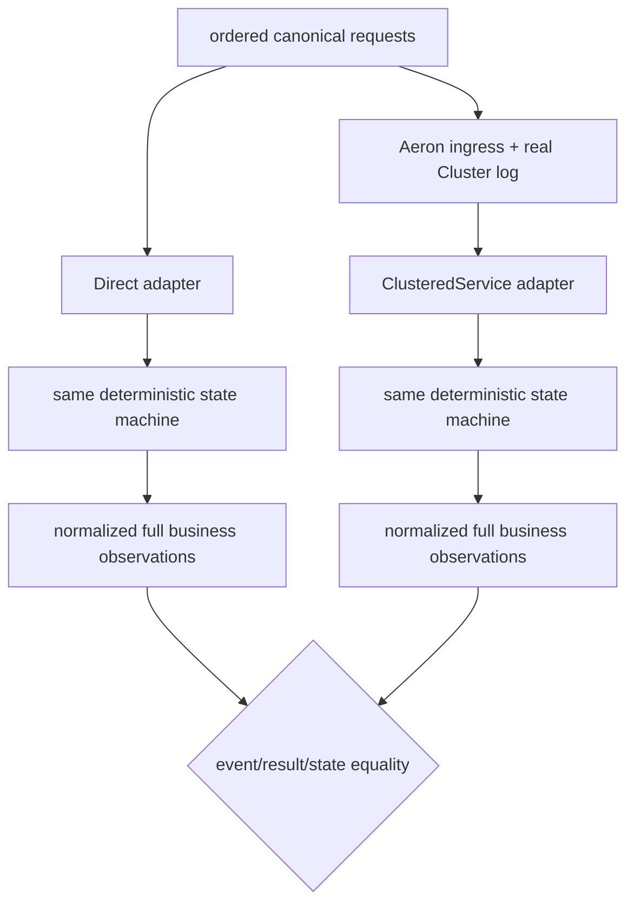

> 发布状态：annotated [`course/m11-start`](https://github.com/lcha-reln/cex-matching/tree/course/m11-start) 保留历史结构化 RED，并冻结 [Snapshot/restart 与差分合同](https://github.com/lcha-reln/cex-matching/blob/course/m11-start/docs/specs/m11.md)；annotated [`course/m11-complete`](https://github.com/lcha-reln/cex-matching/tree/course/m11-complete) 固定了通过实现与 PASS 报告。公开 evidence 路径为 `/practice/high-availability-cex/m11/evidence/manifest.json`，可在 [manifest](/signal-grid-blog/practice/high-availability-cex/m11/evidence/manifest.json) 逐项复核。

一个 Cluster adapter 可以在正常请求上看起来正确，却在第一次 Snapshot 后丢失幂等表、重置 ApplicationSequence，或者把 session/log position 写进业务状态。只测“重启后进程能启动”发现不了这些问题；只把 Snapshot decode 后的对象和自身比较，也证明不了 Cluster 路径与 Direct 业务语义相同。

M11 因此冻结三条执行路径：**Direct、连续单节点 Cluster、Snapshot/restart 单节点 Cluster。** 三者消费同一组 canonical request bytes，最后比较完整的规范化业务事件、结果和 semantic state。重启路径还必须证明 Snapshot 真实装载、suffix 连续且每条只 apply 一次。

## 等价命题必须先写出观察域

设同一 ordered history 为 `H`，三条执行路径分别为：

```text
D(H)  = direct adapter + deterministic matching state machine
C(H)  = real single-member Cluster, uninterrupted
R(H)  = real single-member Cluster, snapshot at cut K, restart, then suffix
```

M11 要证明的是：

```text
normalizeBusiness(D(H))
  = normalizeBusiness(C(H))
  = normalizeBusiness(R(H))
```

不是比较 Java 对象引用，也不是比较整个运行目录。`normalizeBusiness` 必须保留：

- 每条 command 的 disposition；
- new、duplicate、conflict、gap、fence 或业务 rejection 的完整结果；
- ApplicationSequence；
- 完整业务 event batch、顺序和 attribution；
- 订单簿、订单生命周期、terminal registry；
- active/prepared RuleSet、mode、transition fence、STP 状态；
- commandId↔Slot/payloadHash/original-result table；
- 最终 semantic digest。

允许排除的是：

- Aeron session/correlation；
- member、role、leadership term；
- ingress/log/apply position；
- runtime timestamp、端口和目录；
- JVM 对象布局和 transport fragmentation。

删除 runtime metadata 是归一化；删除业务 event 的价格、数量、maker/taker attribution 或 original result 则是掩盖差异。

## Direct runner 是业务基线，不是独立撮合模型

Direct path 直接把已验证的 canonical M08C1 envelope 交给同一 state-machine seam。Cluster path 先经过 application request codec 与真实 Aeron log，再在 `ClusteredService` callback 中调用这个 seam。



这不是第三套独立业务实现。Direct 与 Cluster 共用 core，因此它主要检验 Adapter、codec、顺序、identity、response 与 Snapshot 是否改变既有语义。M03 的独立线性参考模型和 M00～M10 累计门禁继续负责发现 core 自身业务错误。

证据必须诚实写明这个依赖关系，不能把 differential 称为“独立证明撮合算法正确”。

## Snapshot 必须覆盖完整已 apply 状态

Cluster snapshot 的 application payload 至少包含两类信息：

### Matching state

- 每个价格档与 FIFO 次序；
- resting order 的剩余量和 admission attribution；
- terminal identity；
- RuleSet 与 activation fence；
- market mode、revision 和 transition fence；
- STP 所需的可恢复状态；
- next acceptance/application sequence。

### Durable identity-result state

- command ID；
- producer Slot；
- payload hash；
- full canonical original result；
- next application position。

identity-result entry 按 original `CanonicalResult.applicationSequence` 严格 `1..N` 排列；commandId 与 Slot 必须唯一，producer epoch/sequence 必须连续。两份 S1/S2 Golden 都含两条 binding，才能让顺序漂移成为可观测的 bytes 差异。

它明确排除 standalone WAL position、Aeron session、term、member ID 和 runtime log position。Aeron 负责在 Snapshot 后给 Service 重放正确的 Cluster log suffix；application Snapshot 不应复制 runtime 的内部恢复账本。

若遗漏 identity-result table，订单簿仍可能看起来一致，但重启后的 duplicate 会被当成新命令。若遗漏 prepared RuleSet 或 `HALTED` mode，恢复后下一条命令的结果会与 Direct path 分叉。完整状态的标准不是“能继续撮合”，而是“同一 suffix 的所有可观察业务结果仍相同”。

## S1 与 S2 的差异不能改变业务覆盖

当前 reader 接受 S1/S2，writer 只输出 S2。S1 已经包含完整、canonical 排序的 identity/original-result table；S2 只增加协议上下界与 identity/semantic integrity 字段。

因此两个恢复命题都必须成立：

```text
load(S1) + suffix → same business result as Direct
load(S2) + suffix → same business result as Direct
```

如果 S1 缺字段，只在 decoder 中补空表，测试也许能启动，却必然在 duplicate/conflict/next-sequence 场景中失败。`CURRENT_READS_PREVIOUS_SNAPSHOT` 不是单纯的 decode smoke，而必须延伸到恢复后的业务行为。

## Snapshot transport 要有有界 framing

application Snapshot bytes 通过 Aeron 提供的 snapshot Publication 写出，并由 Image 读取。一次 Snapshot 可能跨多个 frame；application format 不能把 runtime fragmentation 当成记录边界。M11 完成门禁已经真实 Publication/Image 路径验证这些 bytes，并证明格式不依赖本次运行的 fragmentation；合同没有冻结 MTU，也不要求刻意触发某个特定碎片数量。

M11 冻结的格式要求包括：

- entry count、单 entry 与总大小上界；
- canonical ordering；
- 明确 frame/continuation 结构；
- CRC32C；
- SHA-256；
- strict loader，不接受重复、跳号或 trailing bytes。

概念恢复管线是：

```text
Image fragments
→ bounded reassembly
→ header/version/length validation
→ CRC32C + SHA-256 validation
→ canonical entry validation
→ construct candidate state off to the side
→ publish restored state only after full success
```

不能边 decode 边修改 live state。否则最后一个 frame 损坏时，系统已经恢复了一半订单簿，再抛异常也无法称为 fail closed。

## 损坏的“最新 Snapshot”不能退回 genesis

M11 对 present-but-invalid Snapshot 的策略很严格：truncated、corrupt、non-canonical、unsupported、duplicated 或 discontinuous 都让启动失败。它不会忽略坏 Snapshot、从 genesis 开始，也不会把剩余 Cluster log 当作一套自动修复工具。

原因与 M09 一致：存在 Snapshot 表明恢复历史已经把它作为 application state cut。静默回到 genesis 可能重复 apply 已包含的命令，也可能因为 Archive retention 已裁剪旧 log 而丢失历史。

```text
snapshot absent and genesis explicitly valid  ≠  snapshot present but invalid
```

前者可以有单独的启动合同；后者必须失败关闭。`M11-CORRUPT-SNAPSHOT-TO-GENESIS` candidate 专门检验这条边界。

## 受控 restart 在第 2,048 个 action 切开历史

生成 differential 的冻结规模是：

```text
algorithm          = splitmix64-v1
seed               = 6111
segments           = 32 (one continuous state)
actions/segment    = 128
cluster runs       = 2 × 4096 actual ingress = 8192
snapshot cut       = global boundary after action 2048
segment schedule   = CURRENT_NEW[0..7] → DUPLICATE_REPLAY[0..3]
                     → PREVIOUS_NEW[0..7] → DUPLICATE_REPLAY[4..7]
                     → IDENTITY_CONFLICT[0..7]
snapshot prefix    = 1536 NEW + 512 duplicate
snapshot sequence  = 1536; next = 1537
```

32 段按冻结的显式表连接，段间不重置 state、ApplicationSequence 或 producer cursor；NEW 另用连续 `newOrdinal=1..2048`。两次 fresh generation 产生 byte-exact ordered requests。uninterrupted 与 restart 使用不同 owned root 和不重叠的本地端口块，报告分别记录 4,096/4,096 条 action，合计 8,192 次真实 Cluster ingress。受控 restart 流程是：

1. 执行前 2,048 个真实 Cluster ingress action；
2. 暂停新 ingress，并等待已发送命令得到完整响应；
3. 发送 `sendAdminRequestToTakeASnapshot`；
4. 等待 `AdminResponseCode.OK`，但只把它解释为管理请求已接受；
5. 在有界期限内等待 snapshot counter 增量、control toggle 回到 `NEUTRAL`，并读取 Recording Log 中新出现的 consensus service `-1` 与 application service `0` Snapshot：两条必须有相同 leadership term/log position 和全新的 recording ID；
6. 记录 Service 实际写出的 application snapshot payload SHA-256 与 application sequence；
7. 只有上述完成屏障闭合后，才按 client → service/container → consensus → Archive → driver 的所有权顺序关闭；
8. 保留 Cluster 与 Archive 目录，重新打开同一 member 0，并等待有界 readiness；
9. 要求 `onStart` 消费 non-null snapshot Image，loaded payload digest 与 application sequence 精确等于步骤 6；
10. 在发送 suffix 前验证恢复后的 state、identity table、original result、`applicationSequence=1536` 与 `nextApplicationSequence=1537`；
11. 提交第一条 `PREVIOUS_NEW`，要求真实响应为 `NEW_APPLIED/applicationSequence=1537`，并观察 next sequence 变为 1538；
12. 继续剩余 suffix，逐条比较其后的 512 个跨 Snapshot duplicate 的完整 original result，以及 1,024 个 conflict 前后的 semantic state、identity table 与 producer cursor 零变化；最后与 Direct 和另一个 fresh uninterrupted Cluster 对账。

这是 controlled restart，不是 kill leader。关闭顺序本身属于 harness 所有权，不应进入业务 equality。最终状态相等也不能替代步骤 5、6、9：没有这些 witness，完整 log replay 可能掩盖 Snapshot 从未完成或从未装载。

## 如何证明连续 suffix 没有重复 apply

仅检查“suffix 收到了 2,048 条”不够。重复 apply 一条后又覆盖部分状态，最终数量甚至可能碰巧相等。M11 要同时核对：

- 每条 suffix request 的 command identity；
- ApplicationSequence 连续推进；
- duplicate 仍返回 Snapshot 中的 exact original result；
- conflict 仍零修改；
- next new command 从 Snapshot 保存的位置继续；
- 每条规范化 event batch 与 Direct 对应项一致；
- final semantic digest 相同。

裁判在运行中逐条比较 `D(H)`、`C(H)`、`R(H)`，但本次公开 PASS 报告只保存输入 `canonicalSha256`、comparison count、三路等价判定和切点事实，并不声称保存三份 transcript digest 或首个差异位置。报告确认两条 Cluster 路径分别完成 4,096 条 action，Snapshot 前缀为 1,536 个 NEW 加 512 个 duplicate，恢复后首条 NEW 的 sequence 为 1537，之后继续覆盖 512 个跨 Snapshot duplicate 和 1,024 个 conflict；若未来出现不一致，精确失败定位仍依赖本地重跑断言。

## 本篇实作：运行真实 Snapshot/Restart 切点

固定实现链是：

- [`M11SnapshotCodec.java`](https://github.com/lcha-reln/cex-matching/blob/course/m11-complete/matching-cluster-runtime/src/main/java/io/github/lchareln/cex/matching/cluster/M11SnapshotCodec.java)
- [`M11AeronSnapshotTransport.java`](https://github.com/lcha-reln/cex-matching/blob/course/m11-complete/matching-cluster-runtime/src/main/java/io/github/lchareln/cex/matching/cluster/M11AeronSnapshotTransport.java)
- [`M11ClusteredMatchingService.java`](https://github.com/lcha-reln/cex-matching/blob/course/m11-complete/matching-cluster-runtime/src/main/java/io/github/lchareln/cex/matching/cluster/M11ClusteredMatchingService.java)
- [`M11SingleNodeHarness.java`](https://github.com/lcha-reln/cex-matching/blob/course/m11-complete/matching-cluster-runtime/src/main/java/io/github/lchareln/cex/matching/cluster/M11SingleNodeHarness.java)
- [`M11AeronClusterIntegrationTest.java`](https://github.com/lcha-reln/cex-matching/blob/course/m11-complete/matching-cluster-runtime/src/test/java/io/github/lchareln/cex/matching/cluster/M11AeronClusterIntegrationTest.java)

这些固定教学链接都指向 annotated complete tag。

运行该篇最小真实 Cluster 试验：

```bash
./gradlew :matching-cluster-runtime:test \
  --tests 'io.github.lchareln.cex.matching.cluster.M11AeronClusterIntegrationTest.realSingleMemberSnapshotCompletesAndExactSnapshotIsLoadedOnRestart' \
  --no-daemon
```

这个命令在本机启动 Aeron 组件并写入仓库自有的 `build/tmp/m11`，不连接外部服务，也不要求 Docker。complete 报告已在 Aeron `1.52.2` / Agrona `2.5.0`、member 0 / `LEADER` 上闭合下列三个阶段：

1. **Acceptance**：Admin response 为 `OK`，仅表示 Snapshot 请求被接受；
2. **Completion**：counter 增量、toggle 回到 `NEUTRAL`、Recording Log 新的 `-1/0` 条目同 term/position 且 recording ID 更新，Service 同时记录 written payload digest/application sequence；
3. **Load**：重启 `onStart` 收到 non-null Image，loaded digest/application sequence 与已完成 Snapshot 完全一致。

任一阶段缺失都应让本篇停止；即使最终盘口相等，也不能用完整 log replay 掩盖 Snapshot 未完成或未装载。本次观察还记录了按所有权顺序 teardown 后无 component error，但这仍只是本次受控运行的证据。

## 真实 Cluster 环境失败不能归类成业务反例

restart 试验可能因为端口占用、目录未关闭、driver error 或 readiness deadline 失败。这些都是 `SYSTEM_ERROR`。正确处理是保存 runtime diagnostics、判整次试验无资格，而不是把最后一条命令标成 `REJECTED`。

同理，一个 corrupt-harness control 如果破坏了测试自身而不是 production Snapshot，也不能算杀死 candidate。M11 冻结的三个 `SYSTEM_ERROR` control 在完成裁判中全部保持该分类，没有为了全绿而吞掉环境错误。

## 单节点 restart 与三节点 failover 的界线

M11 restart 前停止唯一 member，期间没有服务；重启后仍是同一个 member 0。complete evidence 证明 application Snapshot、Archive/log suffix 和 Adapter 在这个受控恢复范围内兼容，但它不能证明：

- quorum 在 leader 丢失时如何决定 committed prefix；
- follower 如何 catch up；
- 旧 leader 如何被 fencing；
- 客户端超时后怎样表达 `UNKNOWN` 并使用同 identity 重试；
- Cluster Backup 如何恢复到另一组节点；
- failover under load 的吞吐和延迟。

当前候选地图暂把这些能力放在 M12，最终可以在签约评审时拆分或调整。把它们留在后续单元，不是降低商用目标，而是确保我们能先判断“Adapter 是否忠实”，再判断“复制故障是否安全”。

## 等价成立后，M11 仍只是一个普通停止点

M11 的三条路径已通过，证明真实单节点 Cluster 的健康 apply、application codec 与 Snapshot/restart 没有改变既有业务语义。它不发布 `matching-0.8.0`，也不继承 M10 的 QOP；它仍是单 member、非高可用、非性能证据、非生产就绪结论。

最后一篇会把 22/22 个固定场景、8,192 次真实 Cluster ingress、28/28 项 obligation、10/10 个 semantic candidate、3 个 `SYSTEM_ERROR` control、架构边界与 public bundle 放进同一套可复核证据链。
