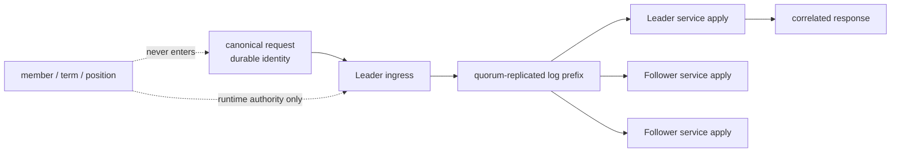

> 固定交付身份：本文对应 annotated [`course/m12-complete`](https://github.com/lcha-reln/cex-matching/tree/course/m12-complete) 与 annotated [`matching-0.8.0`](https://github.com/lcha-reln/cex-matching/tree/matching-0.8.0)；两者均 peeled 到 clean commit `d8b1b1fbb36323502495a8bc0a60042db1e9e040`。发布 evidence 的 [manifest](/signal-grid-blog/practice/high-availability-cex/m12/evidence/manifest.json) SHA-256 为 `e25ff7069a831a56cc42b1ebd7d5aaf0cde39b6158caf1e68b8725b0f8862983`。

单节点 M11 已经证明：客户端把 application request 送入真实 Aeron Cluster，业务只在 `ClusteredService` 的 log callback 中推进，响应只能在 apply 完成后产生。把 member 数量从 1 改成 3，并不会自动得到高可用；如果代码仍把一次成功 `offer` 当成下单成功，Leader 在最窄的故障窗口退出时，客户端就会把“可能已经提交”错误翻译成“失败”。

本篇的论点是：**三成员的价值来自多数派约束下的同一提交前缀，而客户端成功仍只能来自 client runtime 在当前 authority 观察下接纳、且与本次 correlation 对应的 application response。** 所以要先把进程、目录、端口、角色和位置变成可观察事实，再讨论故障；不能把客户端附带的 authority 观察误写成 response wire 携带的 apply term。

M12 的边界很窄：一台机器、一个 shard、三个 voting member，只注入进程 fail-stop。它不测网络分区、主机或磁盘丢失，不发布性能、RTO 或生产容量。

## 一条命令要跨越四道边界

先把“发送成功”拆开。对同一条 canonical command，运行路径至少有四个不同事实：

```text
client AeronCluster.offer returns position >= 0
  → ingress transport accepted this attempt
  → a quorum establishes a committed cluster-log prefix
  → each live ClusteredService applies that ordered message
  → current client observes a correlated application response
```

它们不能互相替代。

| 边界           | 能证明什么                                                      | 仍不能证明什么                           |
| -------------- | --------------------------------------------------------------- | ---------------------------------------- |
| offer 被接受   | bytes 进入本次 ingress 尝试，调用不再是“从未提交”               | 已复制、已提交、已 apply、业务接受       |
| quorum commit  | 多数派决定同一日志前缀                                          | 客户端已经看到结果、所有 follower 已追上 |
| service apply  | 确定性状态机已产生 disposition、event batch 与 identity binding | 调用方已经收到并接受 response            |
| correlated ACK | 当前 client generation 在当前 authority 上确认这次 invocation   | 外部数据库或下游系统已完成副作用         |

M12 的 `ACKNOWLEDGED` 是第四行，不是第一行。offer 之后、ACK 之前发生任何 deadline 或进程退出，客户端最多知道“可能提交”，因此只能进入 `UNKNOWN`。下一篇会把这个 invocation 状态机完整实现。

## 多数派约束的是复制历史，不是业务身份

三个 voting member 的 quorum 为 2。Leader 要让一条日志记录成为可提交前缀，必须得到多数派支持；孤立的单个 member 不能独自形成新提交。这条性质保护的是 Cluster log 的顺序。

业务去重依然由 M08/M11 已冻结的 durable identity 决定：

```text
commandId
+ producer Slot(epoch, sequence)
+ SHA-256(canonical command payload)
```

不要把 member ID、leadership term、cluster session 或 log position塞进这份身份。否则同一业务命令在切主后会因为 term 变化变成“新命令”，恰好破坏我们想要的只执行一次效果。



这里没有声明三份 service 在每个瞬间都位于同一 position。Follower 可以暂时落后；正确性要求它只沿同一 committed prefix 追赶，最终业务图像等价。

## 三个 member 必须是三个独立 child JVM

在一个测试进程里 new 三个 service 对象，无法证明父进程能观察并杀死其中一个真实成员，也无法隔离 PID、目录和组件生命周期。M12 因而给每个 member 一个完整运行单元：

```text
node-0/
├── aeron/
├── archive/
├── cluster/
└── diagnostics/member-status.json

node-1/ ...
node-2/ ...
client-aeron/ ...
```

`M12ThreeMemberConfig` 生成固定 localhost 拓扑。每个 member 获得一个相隔 10 的端口块，其中五个端点分别用于 Archive control、ingress、consensus、log 和 catch-up。间隔是地址规划，不能写成“每个 member 有十个监听端口”；真正冻结的是五个固定 UDP 端点不重叠。

`M12ClusterMemberMain` 是 child JVM 入口。父级 harness 应通过当前 Java executable 与测试 classpath 启动它，并保存：

- member ID 与 PID；
- `freshStart` 是首次启动还是保留状态重启；
- root、Aeron、Archive、Cluster 目录；
- 端口块；
- stdout/stderr 与退出码；
- 可强制终止的 `ProcessHandle`。

同机多进程能证明 process isolation，却不能证明 host isolation。一次内核崩溃、断电或磁盘损坏仍可能同时带走三个 member；这些属于后续 Backup/DR 资格，不在 `matching-0.8.0` 中。

## Member status 是观察面，不是控制面

父级故障控制器需要知道谁是 Leader，但不能调用 service 内部方法要求“请把 member 0 设成 Leader”。M12 通过只读状态文件导出实际观察：

```text
schema / statusSequence / processId
memberId / memberCount / quorumSize / appointedLeaderId
role / electionState / leadershipTermId
commitPosition / logPosition
nextApplicationSequence / identityResultCount
semanticStateDigest / identityResultDigest
owned directories / port base / componentErrors
diagnosticWarnings / droppedDiagnosticWarnings
```

`M12ObservedClusteredService` 只委托 M11 service 的 callback，并采集 role、term 与位置。状态文件永远不能被 `ClusteredService` 读回，也不能作为恢复源。否则测试观察值就会反向控制业务，形成一条 Aeron log 之外的隐蔽状态路径。

一个可接受的 readiness 谓词不是“进程存活两秒”，而是：

```text
three fresh status documents
+ three distinct live PIDs
+ exactly one LEADER
+ exactly two FOLLOWER
+ one shared non-negative leadership term
+ zero component errors
```

选主时间随机器调度变化，因此使用 deadline 内的有界 polling；固定 `sleep(3000)` 既可能过早，也会把快速失败拖成慢失败。

同一原则也适用于保留目录的重启。M12 不从强杀时刻起睡一个猜测的固定时长；每次 `freshStart=false` 前，父级 harness 都实时映射对应 member 的 Aeron 1.52.2 `ArchiveMarkFile`，读取 `activityTimestampVolatile()`，只有 `observedAtMillis - lastActivityTimestampMillis > 10000` 才允许启动新 PID。10,000 ms 是依赖固定的 mark-file liveness timeout，实际探测次数和等待耗时是运行观察；它们既不是选主 readiness，也不是 RTO。

稳定 status witness 还会原样保留 warning 列表和 dropped-warning 计数，但这里没有把 Aeron `WARN` 全部当作可忽略噪声。对裁判采集并写入证据的 pre-fault、pre-stop 与 final stable member-status snapshots，完成 gate 只允许三种完整 warning 形状：`leader heartbeat timeout`、`inactive follower quorum`，以及带十进制 `leaderCommitPosition`/`quorumPosition` 的 `quorum position went backwards`；它们都必须带 `io.aeron.cluster.client.ClusterEvent: WARN - ` 前缀。warning 数量是运行观察，不预先要求为零，但这些证据快照中任何未知 `WARN` 或 `droppedDiagnosticWarnings > 0` 都使完成 gate 以 `SYSTEM_ERROR` 失败关闭。这不是对 child stdout/stderr 整个生命周期的全文断言；正常 teardown 后出现的 `log recording stopped: eos=true` 不在发布证据快照内。

## 初始 Leader 也必须来自自动选举

结构化 RED 起点曾冻结 `appointedInitialLeaderId=0`，实现真实切主时才发现：若把它直接传给 Aeron 的 `appointedLeaderId(0)`，自动选举会被关闭；member 0 被强杀后，另外两个成员不会选出替代者。这不是调大 timeout 能解决的问题，而是合同与库语义冲突。

完成态保留 start tag 与 workload SHA，不悄悄改写历史；同时发布 `matching.m12.contract-correction.v1`。三个成员统一使用 `appointedLeaderId=-1`，初始 Leader 可以是 member 0/1/2 中任一个，替代 Leader 也由自动选举产生。证据记录本次实际 ID，但业务裁判只检查关系：

裁判应验证关系，而不是写死数值：

```text
initialLeader belongs to {0,1,2}
faultTargetLeaderId == initialLeaderId
faultTargetLeadershipTermId >= initialLeadershipTermId
replacementLeaderId != faultTargetLeaderId
replacementLeaderId belongs to live voting members
replacementLeadershipTermId > faultTargetLeadershipTermId
exactly one leader observed after stabilization
```

`initialLeaderId`/`initialLeadershipTermId` 是首次稳定拓扑，`faultTargetLeaderId`/`faultTargetLeadershipTermId` 则是强杀前重新采样的最新稳定 authority。即使同一 Leader 在故障前经历了 term 推进，replacement 也必须高于后者，不能只拿最初 term 作比较。

如果测试期待“member 1 必须当选”，它检验的是偶然调度，不是共识性质；换一台机器就会产生伪失败。相同原则也适用于选主毫秒数和绝对 log position：它们是 evidence observation，不是业务 oracle。

想继续建立心智模型，可以先读[《Aeron Cluster：架构与日志提交》](/signal-grid-blog/posts/aeron-cluster-architecture-and-log-commit/)和[《Aeron Cluster：选举、追赶与一致性》](/signal-grid-blog/posts/aeron-cluster-elections-catchup-and-consistency/)。理论文章解释协议部件；本单元负责把边界落成真实进程和可判定历史。

## 本篇实作：先让真实拓扑可复现

从固定完成身份运行，而不是从会移动的 `main` 运行教程：

```bash
git clone https://github.com/lcha-reln/cex-matching.git
cd cex-matching
git switch --detach course/m12-complete
test "$(git rev-parse HEAD)" = "$(git rev-parse 'course/m12-complete^{commit}')"
test "$(git rev-parse HEAD)" = "$(git rev-parse 'matching-0.8.0^{commit}')"
./gradlew :matching-cluster-runtime:test \
  --tests 'io.github.lchareln.cex.matching.cluster.M12ChildProcessClusterIntegrationTest' \
  --no-daemon --max-workers=1
```

两个 `git rev-parse ...^{commit}` 检查分别 peel annotated course tag 与 product tag；它们都必须等于当前 `HEAD`，不能用只返回一个名字的 `git describe` 代替双 tag 身份检查，也不要把 branch 名当作不可变证据。测试应实际启动三个 child JVM，观察唯一 Leader/两个 Follower，并有界清理所有进程。

阅读实现时按所有权顺序走：

1. `matching-cluster-runtime/src/main/java/io/github/lchareln/cex/matching/cluster/M12ThreeMemberConfig.java`：成员、目录、端点和 deadline；
2. `matching-cluster-runtime/src/main/java/io/github/lchareln/cex/matching/cluster/M12ClusterMemberMain.java`：单个 child JVM 的装配入口；
3. `matching-cluster-runtime/src/main/java/io/github/lchareln/cex/matching/cluster/M12MemberStatus.java` 与同目录的 `M12MemberStatusFile.java`：只读诊断合同；
4. `matching-cluster-runtime/src/main/java/io/github/lchareln/cex/matching/cluster/M12ObservedClusteredService.java`：委托 M11 apply、隔离 runtime metadata；
5. `matching-testkit/src/main/java/io/github/lchareln/cex/matching/testkit/M12ThreeMemberProcessHarness.java`：父进程所有权与终止能力。

如果局部测试失败，先查看 member stdout/stderr、状态文件、component error、完整 warning 列表和 dropped-warning 计数，而不是扩大 timeout。端口冲突、进程启动失败、Aeron 组件错误，以及裁判证据快照中的白名单外 warning 或任何被丢弃的 warning，都属于 `SYSTEM_ERROR`；它们不能被记录成“没有第二个 Leader，所以安全测试通过”。teardown 后日志仍可用于诊断，但不应倒灌成一项从未被 member-status evidence 捕获的发布断言。

## 这一边界怎样进入完整故障历史

到这里建立的是故障实验的可信底座：三个真实进程、一个可观察 Leader、两个 Follower、quorum=2、互不重叠的资源所有权，以及 offer/commit/apply/ACK 四层语义。它还没有证明 Leader 退出后客户端该怎样处理不确定结果。

下一篇把 `NOT_SUBMITTED / UNKNOWN / ACKNOWLEDGED` 建成显式 invocation state machine，并证明重试只能换 correlation，不能换 durable command identity。这条约束才把复制历史连接到交易 API 不撒谎的故障语义。
