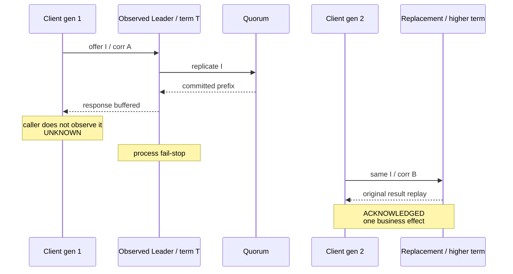

> 固定交付身份：本文对应 annotated [`course/m12-complete`](https://github.com/lcha-reln/cex-matching/tree/course/m12-complete) 与 annotated [`matching-0.8.0`](https://github.com/lcha-reln/cex-matching/tree/matching-0.8.0)；两者均 peeled 到 clean commit `d8b1b1fbb36323502495a8bc0a60042db1e9e040`。发布 evidence 的 [manifest](/signal-grid-blog/practice/high-availability-cex/m12/evidence/manifest.json) SHA-256 为 `e25ff7069a831a56cc42b1ebd7d5aaf0cde39b6158caf1e68b8725b0f8862983`。真实 Java、Aeron 和故障实验只在读者本地仓库运行，本站不提供远程执行。

交易 API 最危险的错误之一，是把 timeout 映射成一条看起来确定的业务失败。客户端在 `offer` 被接受后失去连接，命令可能没有提交，也可能已经提交、apply，甚至响应已经发出但调用方没有观察到。此时返回“下单失败”，调用方就可能换一个订单身份再次提交，最终得到两笔真实订单。

M12 的论点是：**结果未知是一种调用知识状态，不是一种业务拒绝；只有保持原 durable identity 的重试，才能把“第一次是否提交”收敛成同一个原始结果。** 新 correlation 用来关联新调用，新 command identity 会创建新业务事实，两者必须彻底分开。

## 先区分 invocation state 与 business outcome

一次客户端调用有三种终态：

| Invocation state | 到达的边界                                                    | 调用方可以做什么                                           |
| ---------------- | ------------------------------------------------------------- | ---------------------------------------------------------- |
| `NOT_SUBMITTED`  | 没有一次 offer 被 ingress 接受                                | 可以用同一请求重新发起；系统没有接纳本次 attempt 的证据    |
| `UNKNOWN`        | offer 已接受，但未向调用方交付可信关联响应                    | 只能以相同 durable identity、新 correlation 重试或继续查询 |
| `ACKNOWLEDGED`   | client runtime 在当前 authority 观察下校验并交付关联 response | 以 response 中的原始业务结果为准                           |

业务 response 仍沿用 M11 的 disposition，例如：

- `NEW_APPLIED`：这个 durable identity 第一次推进业务状态；
- `DUPLICATE_REPLAYED`：identity 已存在，返回第一次绑定的完整原结果；
- 业务拒绝：输入合法地进入状态机，但违反当前业务规则。

`UNKNOWN` 不会编码进 M11 response，也不是一个 rejection code。把它放进业务协议，会让每个副本必须把某个客户端是否看见响应写入复制状态，而这既不可知，也不属于撮合状态。

## Offer 前失败才是 NOT_SUBMITTED

`M12MatchingClusterClient.offer` 必须先在本次 client generation 内登记 fresh correlation，再循环尝试 Aeron `offer`。只有返回非负 publication position，attempt 才跨过 ingress acceptance 边界。

概念状态机如下：

```text
CREATED / OFFERING
  ├─ publication never accepted + deadline/closed/failure
  │    → NOT_SUBMITTED
  └─ offer position >= 0
       → ACCEPTED_AWAITING_RESPONSE
```

这意味着 `BACK_PRESSURED`、`ADMIN_ACTION` 或暂时 `NOT_CONNECTED` 仍可在 offer deadline 内继续 poll；若始终没有一次成功 offer，调用方拥有明确的未提交结论。相反，非负位置一旦出现，后续同样的 socket 关闭、deadline 或进程退出都不能把 attempt 倒退回 `NOT_SUBMITTED`。

实现时应保存 accepted position 与当时观察到的 `M12TransportAuthority`，而不是只保存一个 `boolean sent`。这些字段帮助复核时间线，但 publication position 不进入 durable identity。

## ACK 需要显式交付，而不是“响应可能到了”

M12 把 response 接收拆成两个动作：

```java
M12InvocationAttempt attempt = client.offer(request, ordinal, offerTimeout);
boolean buffered = client.awaitResponseBuffered(attempt, responseTimeout);

if (buffered) {
  M12InvocationOutcome outcome = client.acknowledge(attempt);
}
```

`awaitResponseBuffered` 只说明 client runtime 解码并校验了一条响应；`acknowledge` 才模拟调用边界把结果交付给上层。这个拆分不是普通业务 API 的推荐外观，而是一个故障实验 seam：它让我们能构造“服务已经 apply、响应甚至到达 client buffer，但调用方没有观察”的精确 UNKNOWN。

报告里的两个 authority 字段必须按观察层解释：attempt 上的 `responseAcceptedUnderCurrentClientAuthority=true` 表示这条响应通过了本次 client generation、offer 时 authority、当前 client authority 与 correlation/command identity 的验收；binding 上的 `observedResponseAuthorityTerm` 记录客户端观察响应时关联的 Aeron authority term。两者都不是 M11 response wire 携带的字段，也不能证明业务实际在哪一个 leadership term apply；apply 事实要由 application observer、状态与历史关系另行支持。

```java
M12InvocationAttempt attempt = client.offer(request, ordinal, offerTimeout);
client.awaitResponseBuffered(attempt, responseTimeout);
M12InvocationOutcome unknown = client.abandon(attempt);
```

即使 response 已缓存，`abandon` 之后也必须是 `UNKNOWN`。否则测试会偷偷用内部可见性替调用方作决定，掩盖真正的断线窗口。

## UNKNOWN 重试只能改变 invocation 身份

设第一次 attempt 为：

```text
clientGeneration = 1
correlationId     = 4001
attemptOrdinal    = 42

commandId         = C33
producerSlot      = (epoch=12, sequence=33)
payloadHash       = H33
canonicalPayload  = P33
```

切主后的 retry 可以改成：

```text
clientGeneration = 2
correlationId     = 9007
attemptOrdinal    = 43

commandId         = C33     unchanged
producerSlot      = (...)   unchanged
payloadHash       = H33     unchanged
canonicalPayload  = P33     byte-exact
```

`M12InvocationAttempt.retry(...)` 只允许从 UNKNOWN attempt 创建 retry，并复用原 request envelope。它应拒绝从 ACK 或 NOT_SUBMITTED 偷偷衍生“同业务重试”，也不接受调用方重新构造一个内容看似相同、实际 identity 不同的请求。

为什么四项都要保持？

| 漂移                               | 状态机看到的含义        | 风险                             |
| ---------------------------------- | ----------------------- | -------------------------------- |
| 新 `commandId`                     | 新命令                  | 第一次已提交时产生第二笔业务效果 |
| 新 producer Slot                   | producer 历史中的新位置 | 去重/连续性合同被绕过            |
| 同 ID/Slot、不同 payload           | 身份冲突                | 必须失败关闭，不能覆盖原绑定     |
| hash 未重算或 payload 非 canonical | 协议伪造                | 必须在 apply 前拒绝              |
| 只换 correlation/generation        | 同业务命令的新调用      | 正确的 UNKNOWN 恢复              |

这也是为什么“订单参数相同”不等于“同一个命令”。两个价格、数量完全相同的新订单，在业务上仍可以都是合法新订单；只有稳定 identity 才表达调用方希望重放第一次意图。

## 同身份重试有两个合法分支

UNKNOWN 之后，客户端不能从本地时间线推断第一次 attempt 是否提交。服务器的 durable identity/result table 才是权威。

### 第一次已经提交

```text
attempt A accepted
→ quorum commit
→ apply as NEW_APPLIED, applicationSequence = S
→ original result bound to identity I
→ response not observed
→ retry I
→ DUPLICATE_REPLAYED with original S/result digest
```

重试不能推进新的 `applicationSequence`，也不能重新生成 trade IDs、event batch 或规则归因。duplicate response 的价值不只是说“见过”；它要重放完整 original result，让调用方得到第一次真正发生的业务事实。

### 第一次没有提交

```text
attempt A accepted by transport
→ quorum lost before commit
→ no trusted response
→ retry I after quorum restore
→ NEW_APPLIED, applicationSequence = S
→ one result binding
```

这个分支同样正确。M12 的 oracle 不是“所有 UNKNOWN retry 都必须 DUP”，而是：

```text
final status ∈ {NEW_APPLIED, DUPLICATE_REPLAYED}
final binding(identity I) is unique
final result equals Direct baseline for I
business effect count for I == 1
```

把预期写死成 DUP，会迫使实现假造“第一次肯定提交”；写死成 NEW，则会允许已提交命令执行两次。

## 两个故障窗口承担不同证明责任

冻结日程故意包含两个 UNKNOWN。

第一个是 applied-but-unobserved：第 33 个 distinct command 已由三份 member application observation 证明 apply，client 只缓存 response 后主动放弃交付，再杀 Leader。这里的 apply 证明不来自 `observedResponseAuthorityTerm`。此处重试必须得到原结果 replay，专门杀死“切主后丢失 identity/result table”或“duplicate 重新 apply”的实现。

第二个是 no-quorum UNKNOWN：停止两个 Follower 后，offer 第 66 个 command。此处不预设是否进入最终提交前缀；恢复多数派后同 identity retry 可以 NEW 或 DUP，但最终只能有一个绑定。它专门检验“transport acceptance 被当作 ACK”和“少数派继续确认”。



## 本篇实作：验证状态迁移与真实 Cluster 路径

先在固定完成 tag 上运行纯状态机测试：

```bash
git switch --detach course/m12-complete
./gradlew :matching-cluster-runtime:test \
  --tests 'io.github.lchareln.cex.matching.cluster.M12InvocationAttemptTest' \
  --no-daemon --max-workers=1
```

再运行真实 Aeron client 集成测试：

```bash
./gradlew :matching-cluster-runtime:test \
  --tests 'io.github.lchareln.cex.matching.cluster.M12MatchingClusterClientIntegrationTest' \
  --no-daemon --max-workers=1
```

阅读坐标是：

- `M12InvocationState`：三种对外调用结论；
- `M12InvocationPhase`：offer、等待响应、缓存、终态的内部迁移；
- `M12InvocationAttempt`：冻结 request identity、accepted boundary 与 retry 约束；
- `M12InvocationOutcome`：把状态、authority、response 或 unknown reason 汇总；
- `M12MatchingClusterClient`：有界 offer/poll、response correlation、acknowledge/abandon 和进程退出处理。

局部测试只能证明状态机和单次真实 client seam。发布版 `m12Check` 已在三个 child JVM、真实 Leader kill、重新选主、旧 Leader catch-up 和 no-quorum 恢复里重放固定 85 个逻辑 attempt：1 个纯 `NOT_SUBMITTED`、84 个 accepted ingress，最终分类为 82 个 `ACKNOWLEDGED`、2 个 `UNKNOWN` 与 1 个 `NOT_SUBMITTED`。日程中的三次保留状态重启没有靠固定等待推进；每次 `freshStart=false` 前都实时读取 Aeron 1.52.2 `ArchiveMarkFile.activityTimestampVolatile()`，只在活动年龄严格大于 10,000 ms liveness timeout 后继续，并由发布 evidence 保存独立 witness。

## 这套语义保证什么

`matching-0.8.0` 的目标保证不是网络 exactly-once。客户端可以多次发送同一个 durable identity，网络也可以丢响应；保证来自复制状态机保存唯一 identity/result binding，并让每次合法重试回到原结果。

它仍没有解决 Counter 预占、数据库写入、WebSocket 通知或外部结算。那些系统需要自己的 Inbox/Outbox、游标和 fencing。M12 只把 Matching Cluster 的调用语义做诚实：未 offer 可以明确重试，已 offer 未见响应只能 UNKNOWN，ACK 的设计合同要求当前 generation/authority 上的关联响应。`responseAcceptedUnderCurrentClientAuthority` 是客户端验收结论，`observedResponseAuthorityTerm` 是客户端 authority 观察，不是 response wire 对 apply term 的证明。冻结真实日程只观察到切主后旧 authority ACK 为 0；它没有注入跨 generation delayed old-egress，该拒绝逻辑的证据层级是 unit/semantic model。

下一篇把“当前 authority”具体化：父进程如何在 kill 前重新采样实际 Leader/term、客户端怎样观察严格高于该 fault-target term 的 replacement authority，以及旧连接迟到 response 的设计禁令分别由哪一层证据支持。
