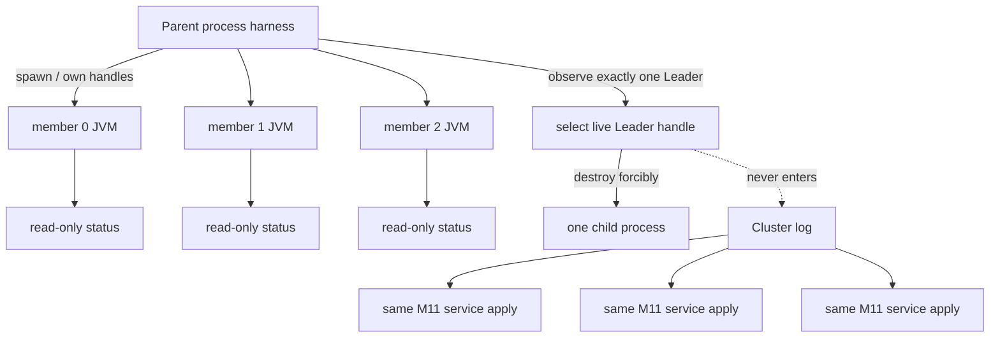
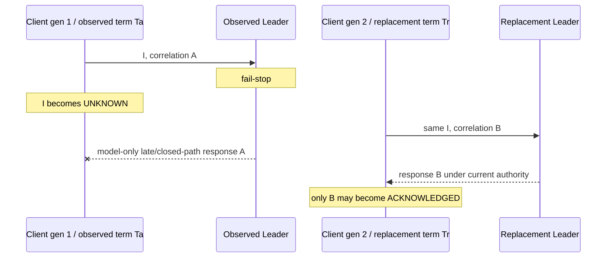

> 固定交付身份：annotated [`course/m12-complete`](https://github.com/lcha-reln/cex-matching/tree/course/m12-complete) 与 annotated [`matching-0.8.0`](https://github.com/lcha-reln/cex-matching/tree/matching-0.8.0) 均 peeled 到 clean commit `d8b1b1fbb36323502495a8bc0a60042db1e9e040`；发布 evidence 的 [manifest](/signal-grid-blog/practice/high-availability-cex/m12/evidence/manifest.json) SHA-256 为 `e25ff7069a831a56cc42b1ebd7d5aaf0cde39b6158caf1e68b8725b0f8862983`。本站不启动 Aeron 或远程杀进程；所有 Java 编译、三成员启动和故障注入均由读者在本地代码仓执行。

“测试切主”很容易被写成一段自证循环：Service 知道测试脚本，主动关闭某个预设 member；客户端等待固定秒数，再假定另一个 member 已是新 Leader。这样的测试即使通过，也没有证明故障目标来自运行时事实、替代 Leader 来自共识，更不会自动证明真实 delayed egress 已被跨 generation 拒绝。

本篇的论点是：**故障控制器必须在被测 Cluster 外部，根据实际 status 选择当前 Leader 并强制终止它；真实故障日程只能声明本次切主中没有观察到旧 authority ACK，而跨 generation 拒绝旧响应是独立的 unit/semantic-model 合同。** 运行时 authority 可以筛选响应，但不能改变业务 identity。

发布运行实际观察到 `initialLeaderId=2 / initialLeadershipTermId=0`，强杀前重新采样的 `faultTargetLeaderId=2 / faultTargetLeadershipTermId=0`，以及 `replacementLeaderId=0 / replacementLeadershipTermId=1`；关系检查证明杀死的是当时 Leader、替代者不同且 term 严格推进。本次冻结日程的 `staleLeaderAcknowledgements=0`，但它仍不等价于任意 delayed old-session egress 的通用证明。

## 故障目标必须来自观测，而不是配置

三个 member 统一使用 Aeron 自动选举；初始 Leader 本身也是运行观察。父级 harness 读取三个 member 的最新状态并验证：

```text
live members = {0, 1, 2}
roles        = exactly one LEADER + two FOLLOWER
leader.pid   = live child process owned by harness
all statuses = same cluster id / member count / quorum size
componentErrors = empty
```

然后 controller 把“当前观察到的 Leader member ID”解析到自己持有的 child `ProcessHandle`，从父进程调用强制终止。不能接受以下替代：

- 直接写死 `kill member 0` 或任何固定 member；
- 让 `ClusteredService` 在收到特殊命令后 `System.exit`；
- 杀一个 Follower，再把“Leader 还活着”当作 failover 通过；
- 只删除状态文件或断开 client，Cluster member 进程实际未退出；
- 收到任意退出码就当作命中 Leader。

故障证据至少要绑定强杀前重新采样的 `faultTargetLeaderId`、`faultTargetLeadershipTermId`、该状态的 sequence/PID、controller 选中的 handle、强杀动作和 child 最终退出。`initialLeaderId`/`initialLeadershipTermId` 只描述首次稳定观察，不能替代 kill 前最新 authority。“选择非 Leader”的 control 必须得到 `SYSTEM_ERROR`，不能因为“集群依然有 Leader”而算一次语义成功。若 control 只是直接抛出预设异常，它只是 classifier contract probe；只有真正经过 fault-target resolver/preflight seam 时，才能支持“实际选错路径被拒绝”的更强声明。

## Service 自己决定故障会污染状态机

如果在 application request 中加入 `KILL_SELF`，或者让 Service 根据 command ordinal 退出，故障调度就进入复制日志。三个副本会确定性执行同一个“自杀命令”，可能一起退出；即使只让 Leader 执行，role 也开始影响 application transition，Direct/Cluster 等价随之破裂。

正确结构是：



状态文件是观察；parent handle 是进程控制；Cluster log 才是业务 transition。三个边界互不回读。

## 替代 Leader 的正确判定是关系式

强杀完成后，剩下两个 member 构成 quorum。harness 使用有界 polling 等待稳定状态，但不等待某个硬编码的毫秒数。一个合格的 replacement observation 应满足：

```text
faultTargetLeaderId == initialLeaderId
faultTargetLeadershipTermId >= initialLeadershipTermId
replacementLeaderId != faultTargetLeaderId
replacementLeaderId belongs to surviving members
replacementLeadershipTermId > faultTargetLeadershipTermId
survivor roles contain exactly one LEADER and one FOLLOWER
survivor componentErrors are empty
```

具体是 member 1 还是 member 2 当选不重要；绝对 term 和 log position 也不应预写。故障前 Aeron 可能让同一 Leader 进入较新的 term，因此证据要记录强杀前重新采样的 fault-target authority，裁判比较 replacement term 是否严格高于这个最新值，而不是仅高于 initial term。

需要区分“瞬间读到一个 Leader”与“稳定到可以建立 client authority”。状态文件可能来自不同采样时刻，因此 harness 应要求状态足够新、sequence 推进，并连续观察到自洽拓扑，而不是把三个 JSON 文件当作一个原子 snapshot。若 deadline 到期或出现 component error，结果是环境/系统失败，不是“没有双 Leader”的安全通过。

## Authority 是响应信任边界

M12 的 `M12TransportAuthority` 可以包含：

```text
clientGeneration
clusterSessionId
leaderMemberId
leadershipTermId
```

它回答“当前连接把谁视作哪一 term 的 Leader”，不回答“业务命令是什么”。切主前后的关系是：

| 字段              | 首次调用         | failover retry   | 是否必须变化                         |
| ----------------- | ---------------- | ---------------- | ------------------------------------ |
| command ID        | `C33`            | `C33`            | 否                                   |
| producer Slot     | `(12,33)`        | `(12,33)`        | 否                                   |
| payload hash      | `H33`            | `H33`            | 否                                   |
| correlation       | `A`              | `B`              | 是，必须 fresh                       |
| client generation | `1`              | `2`              | 是                                   |
| cluster session   | 旧连接           | 新连接           | 通常变化，只作运行观察               |
| Leader member     | killed member    | surviving member | 是                                   |
| term              | client 观察 `Ta` | replacement `Tr` | `Tr > faultTargetTerm`，不假定只加 1 |

“replacement term 严格高于 `faultTargetLeadershipTermId`”与“同一 identity”同时成立，才表示调用方跨过了新的 authority 边界但没有创建新业务意图。

表中的 `Ta` 是调用时的 client authority observation，不等于 response wire 中的 apply term；`faultTargetTerm` 则来自 kill 前最新稳定 member status。二者在某次运行里可能相等，但裁判不能靠这个偶然关系省掉 fault-target 重采样。

## 旧 Authority 迟到响应的设计规则与证据层级

考虑一个容易被忽略的竞态：旧 client generation 的 egress listener 已解码 response，但上层已因 Leader 退出把 invocation 标记 UNKNOWN，并创建了 generation 2 的 retry。如果旧 response 随后到达业务回调，仅比较 command ID 就可能把它误交付给新 attempt。下面是必须满足的客户端设计规则，不是本次真实 fault schedule 已注入 delayed old-egress 的声明。

响应验收需要分层过滤：

1. codec 必须严格可读，无 trailing bytes 或非法字段；
2. correlation 必须存在于当前 generation 的 active attempt 表；
3. attempt 仍处于等待/缓存响应的合法 phase；
4. listener 观察到的 authority 与本次 client generation 相符；
5. response 中可用的 command echo、application sequence 与 result digest 必须与绑定一致；
6. 只有显式 `acknowledge` 才把 response 交付给调用方。

任何一层失败都不能把 UNKNOWN 升级成 ACK。history 的 `responseAcceptedUnderCurrentClientAuthority` 保存这个客户端验收结论；binding 的 `observedResponseAuthorityTerm` 只保存 client runtime 在观察该响应时关联的 authority term。这条跨 generation/authority 拒绝由 `M12InvocationAttemptTest` 和 `M12-ACCEPT-STALE-LEADER-AUTHORITY` semantic mutant 支持；它们属于 unit/semantic-model evidence。真实 child-process 日程没有主动注入旧连接 delayed egress，只记录本次日程 `staleLeaderAcknowledgements=0`。因此不能把后一个观察升级成真实 delayed-egress fencing 证明。



这不是说 term 必须写进 application response。M11 response codec 保持 byte-identical；authority 来自 Aeron client runtime 和本次连接的 observation，业务 response 仍只描述业务结果。`observedResponseAuthorityTerm` 不能被重命名或解读为“实际 apply term”：当前 response wire 没有提供这个证明。上图是敌对性语义轨迹，不是真实故障历史的时序摘录。

## Fencing 的保证止于 Cluster 边界

M12 的真实运行证据只支持：冻结 fail-stop 日程观察到 term 严格高于 kill 前 `faultTargetLeadershipTermId` 的替代 Leader，并且没有观察到旧 authority ACK。对人工注入的跨 generation 迟到响应的拒绝，只有 unit/semantic-model evidence；本单元不声称真实网络 delayed-egress fencing。它更不能证明旧 Leader 对数据库、Kafka、HTTP 或 Counter 的写入已被隔离，因为这些外部副作用在本单元根本不存在。

如果未来 M14 发布 Execution stream，或 Counter 建立 Inbox/Outbox，还要分别定义：

- publisher epoch/sequence 与旧 publisher fencing；
- consumer cursor 和 gap repair；
- external sink 的幂等键或条件写；
- UNKNOWN 跨系统 Saga 的保留与对账。

不要把一个系统内的 leadership term 随手传给所有下游并宣称“全链路 fencing 完成”。每个权威边界都需要自己的拒绝旧 owner 机制。

## 本篇实作：从 status 到强杀再到新 authority

固定完成身份后运行完整 M12 gate：

```bash
git switch --detach course/m12-complete
./gradlew m12Check --no-daemon --max-workers=1
```

这条命令会占用 localhost UDP 端口并启动多个 child JVM；不要与另一份 M12 Cluster 测试并发运行。若需要先定位拓扑问题，可运行成员侧局部测试：

```bash
./gradlew :matching-cluster-runtime:test \
  --tests 'io.github.lchareln.cex.matching.cluster.M12ThreeMemberConfigTest' \
  --tests 'io.github.lchareln.cex.matching.cluster.M12MemberStatusFileTest' \
  --no-daemon --max-workers=1
```

重点阅读：

- `M12ThreeMemberProcessHarness.awaitInitialTopology`：如何判定一个 Leader/两个 Follower；
- `forceStop(memberId)`：如何从 parent 所有的真实 handle 强杀，并等待退出；
- `awaitReplacementLeader`：如何验证不同 member 与严格高于 fault-target term 的新 term，而非固定 ID/耗时；
- `M12MatchingClusterClient.currentAuthority`：重连后的当前 authority；
- `M12InvocationAttempt`：为什么 retry 保留 envelope、换 correlation/generation。

故障排查也要保持证据分层：端口探测只能提前发现明显占用，真正能否 bind 由 child process 启动结果决定；进程退出、状态 stale、选主 deadline 与 component error 都是 `SYSTEM_ERROR`。裁判采集的 pre-fault、pre-stop 与 final stable member-status evidence 也不能任意忽略 Aeron warning：只允许完整匹配 `leader heartbeat timeout`、`inactive follower quorum` 或带数字 position 的 `quorum position went backwards` 三类 fail-stop warning；这些快照中的未知 warning 或任何 dropped warning 同样是 `SYSTEM_ERROR`，不能通过延长 sleep 或删掉 control 来“稳定”测试。正常 teardown 后的日志不属于这项快照断言。

## 切主完成只是恢复链的中点

完成本篇后，我们能解释并观察：`faultTargetLeaderId` 对应的实际 Leader 被外部强杀，剩余多数派选出不同 Leader，且 `replacementLeadershipTermId > faultTargetLeadershipTermId`；本次真实日程中旧 authority ACK 的观察值为 0，durable identity 保持不变。跨 generation 迟到响应的拒绝仍应标成 unit/semantic-model 证据，而不是这次 child-process 日程的故障注入结果。

但故障 member 仍然离线。一个商用系统不能永远靠两个副本运行，也不能只看“它重启成功”。下一篇会在保留 Aeron state 重启前实时读取 Aeron 1.52.2 `ArchiveMarkFile.activityTimestampVolatile()`；只有观察时刻与最后活动时间戳之差严格大于 10,000 ms liveness timeout，harness 才允许 `freshStart=false`。这不是从强杀时刻起固定睡眠，也不是选主耗时或 RTO；重启后仍要要求 former Leader 作为 Follower 追上 identity table、semantic state 与复制位置，并把三份状态同 Direct baseline 一起比较。
