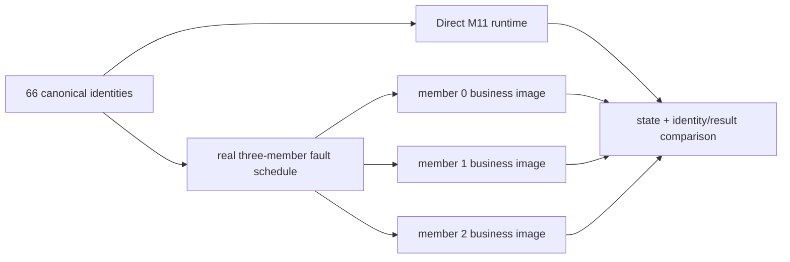

> 固定交付身份：annotated [`course/m12-complete`](https://github.com/lcha-reln/cex-matching/tree/course/m12-complete) 与 annotated [`matching-0.8.0`](https://github.com/lcha-reln/cex-matching/tree/matching-0.8.0) 均 peeled 到 clean commit `d8b1b1fbb36323502495a8bc0a60042db1e9e040`；发布 evidence 的 [manifest](/signal-grid-blog/practice/high-availability-cex/m12/evidence/manifest.json) SHA-256 为 `e25ff7069a831a56cc42b1ebd7d5aaf0cde39b6158caf1e68b8725b0f8862983`。本文展示本地实验方法，不提供远程 Java/Aeron 执行，也不把单机三进程写成跨主机灾备。

替代 Leader 能继续接单，只说明剩余多数派恢复了服务。被杀的原 Leader 若永久离线，副本数仍然降级；它若带着旧状态回来却被误当成权威，又可能暴露过期结果。只看到进程重启、端口监听或 role=FOLLOWER，都不足以证明它追上了正确业务历史。

本篇的论点是：**catch-up 要同时证明复制前缀追平、identity/result table 完整、业务 semantic state 等价，并与独立 Direct baseline 对齐；角色和 term 只用于解释恢复过程，不能进入业务等价键。** 随后再故意丢失多数派，验证“无法提交时不 ACK”而不是仅验证健康路径。

## 重启要保留 Cluster state，但更换进程身份

第一次启动 member 使用 `freshStart=true`，允许清理自己的目录并创建全新 Cluster 状态。原 Leader 被强杀后，重新加入必须使用 `freshStart=false`：

```text
same member ID
same owned Aeron / Archive / Cluster directories
new operating-system PID
freshStart = false
```

若重启时删除目录，测试得到的是一个空 member 的 bootstrap，不是落后副本追赶；若 PID 不变，原进程可能根本没有被杀死。两项都要进入证据。

目录只能由对应 member 和 Aeron 组件拥有，不能在 `ClusteredService` 中读取 archive 文件恢复业务。Service 仍只通过 Aeron 提供的 snapshot/log lifecycle 安装状态，这延续了 M11 的单一恢复真相。

强杀 Archive 所在进程后不能立刻以 `freshStart=false` 复用目录，但正确门禁也不是从 force-stop 时刻起睡一个固定时长。`M12ThreeMemberProcessHarness` 先确认保留目录里存在对应的常规 mark file，并把运行依赖钉在 Aeron 1.52.2；随后映射真实 `ArchiveMarkFile`，反复调用 `activityTimestampVolatile()`，用同一 epoch-clock 取得观察时刻并计算：

```text
ageMillis = observedAtMillis - lastActivityTimestampMillis
freshStart=false permitted iff ageMillis > 10000
```

这里的 10,000 ms 是 Aeron 1.52.2 Archive mark-file liveness timeout，不是“从强杀完成起至少睡到某个时刻”的固定宽限。最后一次 mark-file 活动可能与 force-stop 观察不重合，因此实际探测次数和耗时必须来自实时读数。轮询仍受 client-message deadline 约束；`waitElapsedNanos` 只记录单调等待耗时，不能替代上面的活动年龄谓词。deadline 内始终无法观察到严格 `>`，就以 `SYSTEM_ERROR` 失败关闭。

每次门禁成功都写入一条独立 restart-safety witness：

```text
ordinal / memberId / stoppedProcessId / archiveMarkFile
lastActivityTimestampMillis / observedAtMillis / ageMillis
livenessTimeoutMillis / probeCount / waitElapsedNanos
aeronVersion / predicate
activityTimestampPositive / ageStrictlyExceedsLivenessTimeout
```

固定日程先恢复 former Leader，再在 no-quorum 实验后依次恢复两个被停止的 Follower，所以 `topology.json` 必须给出 `archiveMarkFileLivenessTimeoutMillis=10000`、`restartSafetyPredicate=ARCHIVE_MARK_FILE_ACTIVITY_AGE_GT_LIVENESS_TIMEOUT`、`restartSafetyWitnessCount=3` 和三项 `restartSafetyWitnesses`。其中 `livenessTimeoutMillis=10000`、`aeronVersion=1.52.2`、同一 `predicate` 及两个布尔判定为合同事实；路径、PID、时间戳、年龄、探测次数与等待耗时只能由实际运行填入。`catchup.json` 再用 `firstReturnRestartSafetyWitnessOrdinal` 和完整 `firstReturnRestartSafetyWitness` 指回 former Leader 首次回归对应的那项 witness。通过重启安全门禁后，role、term、位置和业务摘要仍由下面的有界谓词独立判断。

## 原 Leader 必须以 Follower 身份回归

设本次自动初选得到 Leader `L`，强杀前再把最新稳定的 `faultTargetLeadershipTermId` 记为 `Tkill`，故障后 member `R` 必须在严格高于 `Tkill` 的 term 接任。不能只证明 replacement term 高于首次观察的 initial term。`L` 重启后，完成条件不是“最终谁都可以是 Leader”，而是在本次冻结窗口中观察：

```text
replacement member remains LEADER
former leader member is FOLLOWER
former leader term catches current term
frozen run staleLeaderAcknowledgements == 0
```

这个要求把追赶和第二次选主分开。如果重启 former Leader 会打断当前 authority、让它凭旧状态重新夺回领导权，测试很难判断后续 response 属于哪条权威时间线。M12 固定的是一次 Leader 故障和一次 former-Leader catch-up，不是无界选主风暴。

## 一个 digest 不足以证明恢复正确

状态等价至少需要四类观察：

| 观察                      | 它能发现的错误                                       | 它单独会漏掉什么                                   |
| ------------------------- | ---------------------------------------------------- | -------------------------------------------------- |
| `nextApplicationSequence` | 少 apply 或多 apply 一条 NEW                         | 同数量但业务结果不同                               |
| identity/result digest    | duplicate binding 丢失、原结果被改写                 | 订单簿或控制状态漂移                               |
| semantic state digest     | 订单簿、生命周期、规则、市场模式、STP 等业务图像漂移 | 若实现错误地把 identity table 排除，会漏掉重试状态 |
| commit/log position       | Follower 尚未追到稳定复制前缀                        | 三个副本可能一致地执行错误算法                     |

M12 因此要求联合谓词：

```text
all three nextApplicationSequence == Direct nextApplicationSequence == 67
all three identityResultCount == Direct identity count == 66
all three identityResultDigest == Direct identityResultDigest
all three semanticStateDigest == Direct semanticStateDigest
all three stable commit/log positions satisfy the convergence contract
all evidence-captured pre-fault/pre-stop/final stable component error lists are empty
all evidence-captured pre-fault/pre-stop/final stable droppedDiagnosticWarnings == 0
all evidence-captured pre-fault/pre-stop/final stable diagnosticWarnings match the exact fail-stop allowlist
```

同时，member 角色可以不同，PID 必须因重启而不同，term/position 不得写入 semantic digest。若把运行时 metadata 纳入业务 digest，正确的 Leader/Follower 会天然不相等；`M12-INCLUDE-TERM-IN-SEMANTIC-DIGEST` mutant 就是用来杀死这种污染。

warning 合同不是“只看 component errors 为空”。裁判采集并写入证据的 pre-fault、pre-stop 与 final stable member-status snapshots 中，每份 Aeron warning 必须完整匹配以下三类之一：

```text
io.aeron.cluster.client.ClusterEvent: WARN - leader heartbeat timeout
io.aeron.cluster.client.ClusterEvent: WARN - inactive follower quorum
io.aeron.cluster.client.ClusterEvent: WARN - quorum position went backwards: leaderCommitPosition=[0-9]+ quorumPosition=[0-9]+
```

这些快照里的计数可以是非零 observation，但其中出现未知 warning 或 `droppedDiagnosticWarnings != 0` 都使运行成为 `SYSTEM_ERROR`，不能把诊断丢失后的绿色状态当成收敛证据。这项规则不扫描正常 teardown 后的全部日志；例如 teardown 后的 `log recording stopped: eos=true` 不在发布证据快照内。

## Identity table 是恢复语义的一部分

仅恢复订单簿会产生一个隐蔽错误：盘口看起来正确，但切主前已经完成的命令不再可去重。客户端重试 UNKNOWN 时，新 Leader 会再次 apply，生成第二个 application sequence。

恢复图像必须保留每个 distinct command 的：

- command ID；
- producer Slot；
- canonical payload hash；
- original disposition；
- original application sequence；
- original result digest，以及重放响应需要的完整业务结果。

冻结语料最终有 66 个 distinct identity，因此完成 gate 要求每个 member 的 `identityResultCount=66`、`nextApplicationSequence=67`，并要求每个 member 的 `identityResultDigest` 与 Direct oracle 的 expected digest 相同。84 次 accepted ingress 大于 66，是因为 ACK duplicate 和 UNKNOWN retry 会再次进入 Cluster，但不会创建新 binding。clean tagged run 已在 `state-equivalence.json` 冻结三副本/Direct 的实际结果：`semanticStateDigest=a94bccba4baee2339ddaf525c4251c051f7ad3e48021fd50ceb2ed59f4ffe4df`，`identityResultDigest=139efc2b815dc044a71ad05d40fea12c071943e6955f1f1702b29b80aa40e73e`，最终 `commitPosition=logPosition=25056`；这些绝对位置只描述本次运行，不是跨环境常量。

`M12-DROP-IDENTITY-DURING-CATCH-UP` 是 deterministic semantic history model 中的 candidate：它在模拟的 catch-up 边界丢掉一条 binding。只比较盘口可能放过它；对 Direct oracle 的 identity count/digest 比较会把它定位成业务失败。冻结日程没有一条能独立发现该缺失的“后续 duplicate replay”，因此不用它扩大 kill 理由。

## Direct baseline 防止三个副本一致地犯错

复制一致不等于业务正确。三个 member 使用同一错误 adapter 或 codec 时，可能得到三份完全相同的错误状态。M12 继续复用 M11 的 Direct runtime 作为业务 oracle：同一批 canonical command 按合法的 NEW/DUP 收敛历史执行，得到 expected identity/result bindings 和 semantic digest。

最终比较分两层：

```text
replica equivalence:
  member 0 == member 1 == member 2

business equivalence:
  converged replica business image == Direct M11 runtime image
```

Direct 路径不模拟选主、term 或 log position，也不需要拥有三份副本。它只回答“这些业务命令按确定顺序执行后应该是什么结果”。Cluster 路径负责证明故障和重试仍收敛到这份结果。



比较时不能为了得到相同结果而删除 business event、规则归因或 identity binding。允许排除的只有 role、term、session、timestamp、目录、PID、端口和位置等 runtime metadata。

## 无 quorum 的实验验证负向能力

旧 Leader 追赶完成后，集群再次有三个健康 member。此时 harness 找到当前 Leader，强杀另外两个 Follower，只留下一个 voting member。多数派从 2 降到 1，但 quorum 要求仍是 2。

冻结行为是：

1. 新建第 66 个 distinct command；
2. 允许 client 尝试 offer，并要求它实际跨过 ingress acceptance 才构成 M12 的 no-quorum UNKNOWN witness；
3. 在 bounded response deadline 内不能收到可信 ACK；
4. 将 accepted invocation 结束为 UNKNOWN；
5. 恢复一个 Follower，重新形成多数派；
6. 新 client generation 以完全相同 identity 重试；
7. 接受 `NEW_APPLIED` 或 `DUPLICATE_REPLAYED`，但要求原结果、唯一 binding 和最终 Direct 等价；
8. 恢复最后一个 Follower，再做三 member 收敛。

为什么要求 no-quorum offer 被接受？因为本单元要检验“transport acceptance 仍不等于 ACK”。如果 offer 根本没成功，这次调用只是 NOT_SUBMITTED，无法覆盖最危险的 accepted-but-unconfirmed 窗口。若运行环境始终无法构造该窗口，测试必须以 `SYSTEM_ERROR` 失败关闭，而不是改写历史假称 UNKNOWN，也不能退化成 NOT_SUBMITTED 后继计 PASS。

## Convergence 必须有界、可诊断

等待追赶时不应写：

```java
while (!sameDigest()) {
  Thread.sleep(1000);
}
```

无限循环让 CI 卡死；固定 sleep 也无法说明等待的是哪个 readiness 条件。前文的 mark-file 门禁同样是 deadline 内轮询一个真实活动年龄谓词，而不是例外的固定等待。一个工程化 harness 应在 monotonic deadline 内轮询，并在每轮保留最新状态。失败时输出：

- 哪个 member 缺状态或状态过旧；
- 当前 role/election state/term；
- commit/log position 差距；
- next sequence、semantic digest、identity digest 哪项不一致；
- child 是否存活及退出码；
- component error 摘要、完整 diagnostic warning 列表和 dropped-warning 计数。

“扩大 timeout”只能在有证据表明环境启动慢、且安全谓词最终满足时使用。它不能修复永远不追赶、identity 丢失或错误 role。

如果想补足理论背景，可阅读[《状态所有权如何安全迁移》](/signal-grid-blog/posts/state-ownership-migration-shard-catchup-handoff-fencing/)和[《有状态系统可观测性》](/signal-grid-blog/posts/stateful-system-observability-epoch-commit-lag-cursor-recovery/)。M12 没有做 shard migration，但复用了“权威、追赶位置、业务摘要分层观察”的方法。

## 本篇实作：读懂最终三份状态

在固定完成身份运行：

```bash
git switch --detach course/m12-complete
./gradlew m12Check --no-daemon --max-workers=1
```

成功后，不要只读控制台最后一行。`m12Check` 的固定输出目录是 `build/reports/m12/`；至少检查这些实际文件：

- `topology.json` 与 `leadership.json`：自动选举纠偏、初始 Leader、强杀前重新采样的 `faultTargetLeaderId`/`faultTargetLeadershipTermId`、替代 Leader/term、PID 与 `replacementLeadershipTermId > faultTargetLeadershipTermId`；`topology.json` 还必须保存固定的 10,000 ms 活性阈值、严格大于谓词和三项完整 restart-safety witness；
- `catchup.json`：former Leader 的新 PID、Follower role 和追赶前后位置，以及 `firstReturnRestartSafetyWitnessOrdinal`/`firstReturnRestartSafetyWitness` 对 topology witness 的可复核引用；
- `quorum.json`：两个 Follower 停止期间没有 ACK、恢复后的同 identity 结果；
- `state-equivalence.json`：三 member 与 Direct 的 next sequence、identity count、identity/result digest 和 semantic digest；
- `m12-command-history.json`：每次 accepted offer、correlation、generation、UNKNOWN/ACK、`responseAcceptedUnderCurrentClientAuthority`、binding 的 `observedResponseAuthorityTerm` 与业务 disposition；后一个字段是客户端 authority 观察，不是 response wire 证明的 apply term；
- `check.json`：strict `matching.m12.check.v2` 顶层状态及其对上述 child report 的 hash binding。

本文不从开发期日志预写报告的最终 SHA、term、member 选择或耗时。当前公开 evidence 由 manifest 给 33 个 artifact 分别绑定 SHA-256，网站原样复制这份不可变 bundle，不从本地日志手工挑“好看的结果”；上述关键 child report 也分别通过自己的 strict JSON Schema。只有 `schemaVersion` 字符串或顶层 hash binding，都不能代替子报告字段集与取值约束。

## 从恢复正确到证据可审计

到这里，完整业务命题已经串起来：Leader fail-stop 后剩余 quorum 接管；UNKNOWN retry 保留身份；former Leader 从保留状态以 Follower 追赶；无 quorum 不 ACK；恢复 quorum 后同 identity 收敛；三 member 与 Direct 业务图像一致。

这些仍只是我们要证明的声明。最后一篇会把 14 个固定场景、从真实 Cluster trace 重算的 24 个 assertion fact、由三个 classifier probe 聚合的第 25 项 `SYSTEM_ERROR_NEVER_SEMANTIC`、8 个 semantic mutant、架构边界、环境和发布身份组织成 evidence 合同，说明哪些报告能支持哪些 claim，以及为什么有限故障语料不是完整分区证明。
