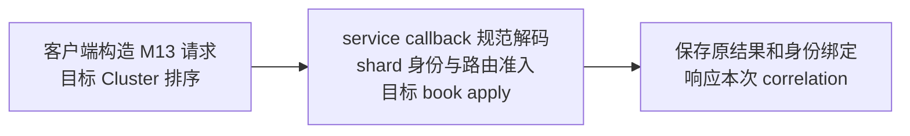

> 本地复验身份：annotated [`course/m13-complete`](https://github.com/lcha-reln/cex-matching/tree/course/m13-complete)，clean commit `eb1b65d2ea2159ba607e3271f0bfd209ea4906ea`。本文结论取自该身份的一次 fresh M13 qualification；[manifest 发布入口](https://lcha-reln.github.io/signal-grid-blog/practice/high-availability-cex/m13/evidence/manifest.json) 随本单元教程发布提供。

客户端认为 ETH-USDT 属于 shard 1，却把请求发给了 shard 2。后者可以临时创建一张 ETH 订单簿，然后继续撮合吗？先写下预测，再考虑另一种情况：两个成员拿到了键顺序不同、内容相同的路由文件，它们应当认为自己运行在同一份配置上吗？

这两个问题连在一起。**静态分片首先要确定哪份配置有权决定唯一归属，再让每次 apply 服从这份配置。** 客户端把消息送到哪个地址只是一次尝试，不能为目标组创造新的业务权限。M13 因而把 route artifact 作为权威状态的一部分；每个 shard 由自己的三成员 Aeron Cluster 排序，多个本地 book 共用该 shard 的路由与命令身份边界。

本单元只增加 instrument 静态路由这一项复杂度。M12 的提交、apply 和 ACK 边界继续成立；动态迁移、自动均衡、跨交易对事务和柜台都没有进入本单元。

## 唯一归属约束必须先于客户端选地址

M13 的初始分配固定如下：

| instrument | shard | 同组中的 book   |
| ---------- | ----- | --------------- |
| BTC-USDT   | 1     | 独立 BTC 订单簿 |
| ETH-USDT   | 1     | 独立 ETH 订单簿 |
| SOL-USDT   | 2     | 独立 SOL 订单簿 |

同一个 instrument 只有一个目标 shard。每组都读取完整路由，因此 shard 1 知道 SOL 的归属是 2，而不仅仅是“本机没有这张 book”。这使 `UNKNOWN_INSTRUMENT` 与 `WRONG_SHARD` 成为不同事实：前者不在配置中，后者已经有归属却到错了组。

这个模型并不要求不同 book 使用不同 orderId 空间。BTC 的 orderId 7 与 ETH 的 orderId 7 可以同时存在，因为订单属于各自的 book；真正不能分叉的是 ETH 这张 book 的权威归属。如果两个 shard 都在收到请求时自行创建 ETH，就会出现两条分别有 quorum、却没有共同业务顺序的 ETH 历史。

Aeron 官方区分了共享一条 Cluster log 的多个 service 与独立 Cluster group，也提醒按 symbol 分片仍可能碰到跨品种信用约束。M13 选择独立 group，但没有借此解决信用、余额或跨组原子性。[On Sharding](https://aeron.io/docs/aeron-cluster/on-sharding/)

## owner、version 与 hash 回答三个不同问题

`M13RouteArtifact` 保存四个字段：`version`、`owner`、排序后的 `assignments` 和 `contentHash`。它们不是可互换的标签。

`owner` 声明这份配置由哪个运营主体负责；`version` 标识演进次序；`contentHash` 绑定实际内容。只有版本号相同不足以证明两个节点使用相同映射，只有 hash 相同也不能说明提交者已经获得授权。M13 的 owner 是普通业务字段，hash 是完整性摘要；操作员认证仍是部署上游的前提。

下面是实际构造 API，完整用例位于 `M13ShardRuntimeTest`；此处节选的是同一份路由的建立过程：

```java
M13RouteArtifact route = M13RouteArtifact.create(
    1,
    "matching-ops",
    Map.of("BTC-USDT", 1L, "ETH-USDT", 1L, "SOL-USDT", 2L));
```

摘要并非对任意 JSON 字符串求 hash。`body(...)` 写入路由 magic、格式版本、路由版本、owner、绑定数量，再按 instrument 排序写入每个 instrument/shard 对。构造器重新计算摘要；解码器还会重新编码并比较字节，拒绝同义但不规范的表示、重复绑定和尾随字节。

因此开篇第二个预测的答案是：相同内容、不同 Map 插入顺序会得到相同 artifact。反过来，修改 owner 或任意已有绑定，再沿用旧 hash，构造就应失败。规范化让“同一份配置”成为可判定的字节合同，也为后续 snapshot 恢复提供了稳定身份。配置如何进入复制状态、如何保存到 snapshot，仍由应用负责；Aeron 不会自动赋予外部配置文件这些语义。[Reference Data](https://aeron.io/docs/aeron-cluster/reference-data/)

启动本身也要绑定同一个 artifact。`M13ClusterMember` 从 `routeArtifactPath` 规范读取文件，并与 `expectedRouteHash` 比较；不一致时在启动 Aeron 组件之前失败。新节点不能只接受“路径存在”，更不能把文件内容悄悄换成同版本的另一份配置。

源码定位：[M13RouteArtifact.java](https://github.com/lcha-reln/cex-matching/blob/course/m13-complete/matching-cluster-runtime/src/main/java/io/github/lchareln/cex/matching/cluster/M13RouteArtifact.java) 与 [M13RequestCodec.java](https://github.com/lcha-reln/cex-matching/blob/course/m13-complete/matching-cluster-runtime/src/main/java/io/github/lchareln/cex/matching/cluster/M13RequestCodec.java)。

## 路由身份必须随请求进入有序 apply

M13 请求包含 correlation、commandId、producer slot、route version/hash、目标 instrument，以及业务命令或路由后继两者之一。correlation 用于配对一次传输尝试；路由字段和 instrument 会进入 durable payload hash。

正常业务路径是：



`DirectM13ShardRuntime.submit` 先检查请求的规范表示以及 slot 的 shard，再处理已经绑定的身份。只有尚未绑定的新请求才验证当前 route version/hash、目标归属、内外 instrument 一致性、序号上限和 producer cursor。下一篇会解释为什么精确重试要在“路由是否仍然最新”之前处理。

外层 target 也不能成为绕过内层命令的别名。`Place`、`Cancel` 和 `PrepareRuleSet` 本身带有 instrument；它们必须与外层目标相同。例如 outer=ETH、Place.instrument=BTC，即使两者都属于 shard 1，也返回 `INSTRUMENT_MISMATCH`。否则执行位置、身份摘要和真正被修改的 book 会各指向不同对象。

已经排序的网络消息不等于已经准入的业务命令。即便一次错误路由请求进入了 Cluster log，M13 的业务 shard sequence 和 book sequence 仍应保持不变；不要把 Aeron log position 与这两种应用序号混用。

## 拒绝是否正确，要看完整状态是否保持不变

错误码只证明程序走到了某个分支。假如它返回 `WRONG_SHARD`，却先把 producer sequence 从 1 推到了 2，下一次真正合法的请求仍会失败；盘口没变也不能挽救这个错误。

M13 的 preflight 合同要求一起保持：所有 book、producer cursor、双向身份表和下一 shard sequence。实际测试先保存 `runtime.snapshot()`，提交错误请求，再对 snapshot 字节做相等断言。随后提交 producer sequence 1 的合法 BTC 请求，要求它得到 `NEW_APPLIED`，进一步证明前面的错误没有消耗 cursor。

| 输入                 | 当前实现的准入结果    | 需要守住的状态关系              |
| -------------------- | --------------------- | ------------------------------- |
| slot 属于另一 shard  | `WRONG_SHARD`         | 整个 runtime 不变               |
| SOL 发给 shard 1     | `WRONG_SHARD`         | 不能临时创建 SOL book           |
| 未配置的 XRP         | `UNKNOWN_INSTRUMENT`  | 不能增加路由或 book             |
| outer ETH、inner BTC | `INSTRUMENT_MISMATCH` | 两张 book 都不变                |
| 新身份使用旧 route   | `STALE_ROUTE`         | 不消耗 producer/shard/book 顺序 |

还要把解码失败单独看待。`M13ClusteredMatchingService.onSessionMessage` 对超长或无法规范解码的 bytes 直接返回，不调用 runtime，也不伪造一个能够可信配对的业务响应。Direct API 收到可构造但不能规范往返的请求时，可以返回 `MALFORMED_REQUEST`；这不意味着任意坏网络包都能得到同名 ACK。

反例 `IGNORE_SHARD_ROUTE` 试图跳过目标归属检查。裁判必须通过“错误路由产生了业务变化”杀死它，而不是因为它抛异常、进程没启动或连接超时。基础设施错误不承担这条业务证明。

## 在本地把两个预测变成可失败的断言

复验完成版时，从该固定身份运行现有测试：

```bash
git clone https://github.com/lcha-reln/cex-matching.git
cd cex-matching
git switch --detach course/m13-complete
./gradlew :matching-cluster-runtime:test \
  --tests '*M13ShardRuntimeTest.routeHashesCanonicalAssignmentsAndRequiresOwnerAndAppendOnlySuccessor' \
  --tests '*M13ShardRuntimeTest.everyPreflightRejectionPreservesAllStateIncludingProducerCursor' \
  --tests '*M13StartupRouteTest.changedStartupRouteFailsBeforeLaunchingAeronComponents' \
  --no-daemon --max-workers=1
```

前两个测试使用本地 Direct runtime，分别验证规范路由身份、拒绝前后完整状态以及 producer cursor；第三个验证启动配置被替换时在装配 Aeron 之前失败。它们都不启动真实 Cluster。需要查看的实现只有 `M13RouteArtifact`、`M13RequestCodec` 和 `DirectM13ShardRuntime`，不必先把网络装配代码读完。

独立练习可以调整现有错误路由用例：先把 SOL 送到 shard 1，再用同一个尚未消耗的 producer sequence 发合法 BTC。先预测第二次请求的状态，然后观察测试。若第二次请求被当成 stale/gap，错误边界已经污染了权威状态。

本次 fresh qualification 的 [fixed report](https://lcha-reln.github.io/signal-grid-blog/practice/high-availability-cex/m13/evidence/reports/check/fixed.json) 中，规范路由场景通过 6 个断言；错误目标与 instrument 场景执行 10 次提交，通过 22 个断言。[原始路由拒绝记录](https://lcha-reln.github.io/signal-grid-blog/practice/high-availability-cex/m13/evidence/reports/check/fixed-WRONG_SHARD_AND_INSTRUMENT_NO_MUTATION.jsonl) 连接了请求、拒绝结果与状态关系。`IGNORE_SHARD_ROUTE` candidate 把应为 `WRONG_SHARD` 的请求变成 `NEW_APPLIED`，被判为 `STUDENT_FAILURE`，production control 为 PASS。这些局部事实支持准入机制，六进程故障隔离则由另一组真实证据承担；完整交付身份由[本单元复验篇](/signal-grid-blog/practice/high-availability-cex/m13/static-shard-evidence-and-runbook/)统一绑定。

## 静态权威映射建立后，下一步才是 book 独立性

现在可以回答开篇第一个预测：错误目标组必须拒绝，不能通过创建一张 book 把误投递变成合法归属。这个结论依赖规范 artifact、请求中的 route identity 和无副作用的准入边界。

已有 instrument 的 owner shard 不能在此阶段移动，路由摘要也不提供认证。本篇固定了“哪一组有权执行”，下一篇继续拆开“组内哪一张 book 被执行”：订单与控制状态各自独立，命令身份却要跨越整组 book。
