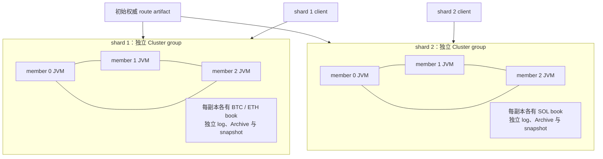

> 本地复验身份：annotated [`course/m13-complete`](https://github.com/lcha-reln/cex-matching/tree/course/m13-complete)，clean commit `eb1b65d2ea2159ba607e3271f0bfd209ea4906ea`。本文结论取自该身份的一次 fresh M13 qualification；[manifest 发布入口](https://lcha-reln.github.io/signal-grid-blog/practice/high-availability-cex/m13/evidence/manifest.json) 随本单元教程发布提供。

把 BTC 与 ETH 分别放进两个 Map，是否已经形成两个故障域？把两个 service 放进同一个三成员 Cluster 呢？如果先跑完 shard 1 的故障测试，再单独跑 shard 2 的正常请求，这两份 PASS 能否证明 shard 1 故障期间 shard 2 仍然工作？

本篇要建立的关系比“两个模块各自能运行”更具体：**两个独立 Cluster group 必须在同一观察窗口存活，受故障组停止一个真实 Leader 时，另一组仍实际提交、apply 并确认业务。** 之后再分别证明恢复后的副本、原结果与 Direct 历史等价。

M13 的故障注入是单机进程 fail-stop。以下实验不把六个 JVM 解释成六台主机，也不把另组一次业务进展解释成性能隔离、slow-shard 资格或吞吐 SLO。

## 独立 group 要有独立的运行资源所有权

每个 shard 使用三个 voting member，每组 quorum 为 2。`M13ThreeMemberConfig` 为组分配独立 clusterId、root directory 和固定 UDP 端口块；每个 member 拥有自己的 Media Driver、Archive、Consensus Module 与 M13 service。



两个组都可以有 member 0，因为 memberId 是组内身份。PID、目录、clusterId 和实际 UDP 端点则必须跨组区分。每成员预留相隔 10 的端口块，使用其中 Archive、ingress、consensus、log、catchup 五个固定端点；这不等于它监听十个端口。

同一 Cluster log 上的多个 service 可以是一种合理架构，但它们仍共享该组的共识顺序和可用性。本单元的独立 group 合同选择了不同故障边界；不要把命名空间拆分自动当成故障域拆分。[On Sharding](https://aeron.io/docs/aeron-cluster/on-sharding/)

源码定位：[M13ThreeMemberConfig.java](https://github.com/lcha-reln/cex-matching/blob/course/m13-complete/matching-cluster-runtime/src/main/java/io/github/lchareln/cex/matching/cluster/M13ThreeMemberConfig.java) 定义所有权，[M13ClusterFaultSuite.java](https://github.com/lcha-reln/cex-matching/blob/course/m13-complete/matching-testkit/src/main/java/io/github/lchareln/cex/matching/testkit/M13ClusterFaultSuite.java) 实际执行下述日程，[M13ClusteredMatchingService.java](https://github.com/lcha-reln/cex-matching/blob/course/m13-complete/matching-cluster-runtime/src/main/java/io/github/lchareln/cex/matching/cluster/M13ClusteredMatchingService.java) 连接业务 apply 与真实 snapshot callback。

## 故障目标必须来自强杀前的稳定 authority

`M13ClusterFaultSuite` 先启动两个 group，再检查同时存活的初始 member PID 恰好有六个、全部互不相同，且不包含测试 owner PID。随后两组都建立稳定拓扑，并实际对 BTC、ETH、SOL 应用业务请求。

这时还不能直接杀“约定的 member 0”。自动选举的 Leader 不固定，故障前也可能发生 term 变化。实验从 shard 1 最新的 convergence witness 找到唯一 Leader，再把该 memberId、PID、term 与状态一同交给 `forceStop`。替代 Leader 必须来自剩余存活成员，且 term 高于强杀目标的最新观察值。

diagnostics 的用途是观察事实，不是给 service 喂状态。`M13ObservedClusteredService` 采样生命周期、role 与 log position；业务 runtime 由 `M13ClusteredMatchingService` 在有序 callback 内推进。父进程读取状态文件，可以决定什么时候注入故障，却不能修改文件来指定某个成员当选或让 book 前进。

readiness 因而是一个有界观察谓词：当前 PID 对应的状态足够新、组内只有一个 Leader、其余成员为 Follower、term 一致、选举关闭、组件状态健康，并且应用状态收敛。等待固定几秒钟只能证明时间过去了，不能证明这些关系已经成立。

## 在另一个 Leader 死亡期间观察真实业务 ACK

实验在强杀前构造一个确定的 UNKNOWN 窗口：shard 1 client 的 offer 已被接受，完整响应已经缓冲，但调用方还没有越过 `acknowledge` 边界。Direct 对照已确认该响应对应实际应用结果。此时强杀当前 Leader，再使该 invocation 以 UNKNOWN 结束。

这个设计没有把 NOT_SUBMITTED 冒充 UNKNOWN，也没有依赖“也许恰好丢一包”的偶然调度。它明确区分 transport acceptance、已缓冲响应与客户端正式确认，保留“应用已经完成，调用方仍不能宣称成功”的窄窗口。

紧接着，实验向 shard 2 提交一条新的 SOL 命令。断言必须同时满足：

```text
被杀的 shard 1 member 仍不存活
shard 2 client 取得 ACKNOWLEDGED 的真实响应
该响应是 NEW_APPLIED
shard 2 的 nextShardSequence 恰好推进一次
完整响应与该组 Direct 执行相等
```

这些关系才能证明本次 fail-stop 期间另一组有业务进展。两个客户端依然共享主机调度、内核与存储；观察到的耗时只作为诊断数据，不应转写成故障恢复时间或跨主机隔离承诺。

shard 1 随后等待自动替代 Leader，建立新 client generation，以 fresh correlation 重试原 durable envelope。返回必须为 `DUPLICATE_REPLAYED`，并保留原 shard sequence 与完整原结果。入口和出口都可能背压，offer position 不能替代业务响应；Aeron counters 只能帮助区分停在哪个方向。[Cluster Clients](https://aeron.io/docs/aeron-cluster/cluster-clients/)

## 旧成员追赶与 snapshot 加载是两项不同证据

第一段恢复只重启被杀的旧 Leader，保留其 Archive/Cluster 状态，并要求它以新 PID 补齐缺失 suffix。复用目录之前，harness 继承 `M12ArchiveMarkFileLiveness` 的真实 mark-file 读取：只有当前 observation 与 `activityTimestampVolatile()` 的差严格大于 10000 ms，才允许新的 Archive 进程占用目录。这个 guard 保护目录所有权，不代表 catchup 已完成，也不是 RTO。

后续 snapshot 实验另有完整日程。两组分别有序激活同一个只追加的 route successor，再在新增 book 上应用命令；随后每组请求真实 Aeron snapshot。保存 `snapshot-written.bin` 只能证明应用 callback 写出了业务 bytes，因此 gate 还观察 snapshot counter 增加，以及 service/consensus RecordingLog 项的 recordingId、term 和 log position 配对。

得到 snapshot 后，实验继续向 BTC、ETH、SOL 写入 suffix，然后停止两组所有成员、保留状态重启。每个成员必须在 `onStart` 收到真实 snapshot Image，记录 `snapshot-loaded.bin`；加载 bytes 应与对应 written snapshot 相等，而恢复后的 nextShardSequence 必须高于 snapshot 内的 next 值，证明又继续重放了 suffix。

这里存在两层“重演”。M13 在业务恢复入口中，从 initialRoute 重演 snapshot 内全部保留身份，以验证完整原结果；Aeron 之后再投递 snapshot 位置之后的 committed log suffix。前者是镜像语义校验，后者是复制日志恢复，不能合并成一个“只回放快照后日志”的叙述。

每个组最终都要比较三份 replica 与其 Direct 状态：route、book 集合、逐本状态、两层序号、身份摘要和完整原结果。再发送 snapshot 之前、旧 route/旧 epoch 的精确请求，验证 duplicate；另发旧 epoch 的新身份，验证 producer fence 仍然有效。

## 运行现有资格入口，再沿原始 witness 检查实验

复验完成版时，使用已实现的 Gradle 入口，不手工拼六条 child JVM 命令：

```bash
git switch --detach course/m13-complete
./gradlew m13Check --no-daemon --max-workers=1
```

`m13Check` 还会运行本地语义资格和继承回归，因此它不是“只执行本篇一条命令”的小测试。双组实验入口类是 `M13ClusterFaultSuite`，父进程所有权在 `M13ThreeMemberProcessHarness`，child 入口为 `M13ClusterMemberMain`，而真正应用业务的类为 `M13ClusteredMatchingService`。

若执行环境是本次遇到的受限 macOS/JDK 环境，必须先按[复验篇的接收缓冲诊断](/signal-grid-blog/practice/high-availability-cex/m13/static-shard-evidence-and-runbook/)核实实际 socket，使用已验证的显式运行条件：

```bash
JAVA_TOOL_OPTIONS='-Daeron.socket.so_rcvbuf=0' \
  ./gradlew m13Check --no-daemon --max-workers=1
```

该参数保留本机足够大的 OS 默认接收缓冲，正常 Linux 无需照抄。它没有改变 MTU、选举超时或业务断言。

实验报告位于 `build/reports/m13/m13-cluster-faults.json`，原始记录在同目录 `raw/` 下；本单元的 [Cluster report 发布入口](https://lcha-reln.github.io/signal-grid-blog/practice/high-availability-cex/m13/evidence/reports/check/m13-cluster-faults.json) 绑定了以下实际观察：

| 关系                    | 本次 fresh run 的观察                                                                                                        | 怎样解释                                                              |
| ----------------------- | ---------------------------------------------------------------------------------------------------------------------------- | --------------------------------------------------------------------- |
| 两组同时运行            | 初始 PID 为 36577、36578、36579、36580、36581、36582，clusterId 为 131/132                                                   | 六个不同 child JVM 在同一主机重叠存活                                 |
| 故障与另一组进展        | shard 1 member 1 / PID 36578 被外部强停；shard 2 的 next sequence 从 3 到 4                                                  | 真实 SOL 新应用在目标仍停止的窗口得到 ACK                             |
| 替代 Leader             | shard 1 member 2 / PID 36579，term 由故障目标的 0 增至 1                                                                     | member 改变且新 term 严格增加                                         |
| UNKNOWN 恢复            | `unknownCount=1`、`resolvedUnknownCount=1`                                                                                   | 同一 durable request 取得原结果，未建立第二业务效果                   |
| 真实 snapshot 与 suffix | 六份 WRITTEN、六份 LOADED；shard 1 的 loaded next 为 10，恢复到 12；shard 2 为 5→6                                           | 加载字节与写出字节相等，并继续应用快照位置之后的日志                  |
| 最终等价与清理          | 12 个 checkpoint；最终两组 next 分别为 13/6，每组三副本的 semantic/identity digest 匹配 Direct；两组 `teardownComplete=true` | 恢复后旧身份、producer fence 与新增应用核验完毕，所有受控进程清理完成 |

这份报告包含 24 条命令/调用观察记录。shard 1 从恢复时的 next=12 到最终 13，是后续合法新命令的进展；不要把它与 snapshot/suffix 的 10→12 合并成同一个阶段。具体 PID、member、term 和位置属于这一次运行，下次运行应比较关系，而不是照抄这些数字作预期。复验时可从 `faultIsolation.stoppedLeader` 追到另一组 ACK，再检查 replacement、catchup、snapshot、最终 checkpoint 和 teardown。

反例推演可以先删掉一份 member snapshot completion，或把目标 PID 假设为父进程 PID，再检查当前 gate 的对应谓词能否拒绝这份材料。这里是对证据充分性的纸面推演；实际复验仍以上面的 `m13Check` 执行真实日程，不修改公开报告。更基础的反例是只启动五个 member 或把两组顺序运行，它们在任何业务正确性结论之前就违反了拓扑前提。

## 本次 fail-stop 证据不能扩张成主机或性能资格

本篇连接了六进程重叠存活、观测到的真实 Leader、另组故障窗口内的 ACK、旧成员追赶、真实 snapshot 加载和最终副本/Direct 等价。缺少其中某个关系，就无法用其余几张 PASS 表补齐。

它仍没有测主机掉电、任意网络分区、磁盘损坏、慢 shard、带宽争用或容量上限。M13 能交付的是这份有限静态分片正确性合同；下一篇把源码身份、输入、原始报告和发布 manifest 连起来，使读者能在固定版本上重新判断这些证据是否成立。
