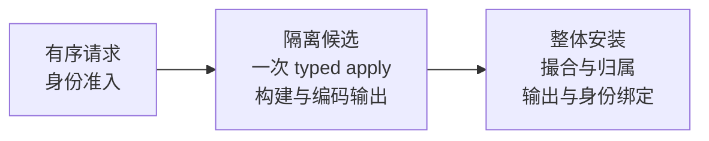

> 完成身份：[course/m14-complete](https://github.com/lcha-reln/cex-matching/tree/course/m14-complete)，完整提交 `56c4ec09ddf9fcf57f1cce763ae8b451ba7f394f`。本文结论绑定 clean 完成树重新执行的 M14 资格；[公开 manifest](https://lcha-reln.github.io/signal-grid-blog/practice/high-availability-cex/m14/evidence/manifest.json) 的 SHA-256 为 `7eb56335954e03a6792b8f9971b922e3bd45bf5dcbd60e47f1e5cedde3fb2081`。

撮合已经完成，订单簿里卖单减少了一手，进程却在把 Trade 放入发送队列之前退出。恢复后，订单簿能够说明成交发生过；柜台仍然不知道应处理哪一批结果。仅仅把网络发送移出 apply，并不能填上这段缺口。

M14 要保存的是一项联合承诺：**一个新业务转换进入权威状态时，它对应的完整 Execution、可选 Market 和原始身份绑定必须同时成立。** 发送可以晚一点，重试也可以发生很多次，但输出内容不能靠恢复后重新猜测。本篇解释当前有限容量模型怎样实现这个边界。

## Outbox 必须属于复制状态，而不能只是发送队列

网络队列说明“这个进程准备发送哪些字节”；复制 Outbox 说明“这个 shard 已经承诺哪些业务输出”。两者寿命不同。进程队列可以在退出时丢失，而未确认的 Execution 必须随运行态 snapshot 和有序历史恢复。

`M14RuntimeState` 因而同时保存 source M13 状态、订单归属、原始业务与控制操作、两条流的保留窗口、确认位置、publisher grant 以及公开 Market snapshot。Execution 的 batch identity 会进入原始业务响应。调用者随后精确重试同一请求，仍能找到最初被分配的输出身份。

真正的 TCP 发送由外部 publisher 执行。成员对外暴露已经安装完成的 `M14AppliedView`，纯函数 `M14OutputReader.read(view, request)` 只读取这个不可变视图。网络缓慢不会使读线程进入活的撮合对象，也不会把一次未完成的安装暴露成“新订单簿配旧 Outbox”。

## 先在可信候选中执行，再整体安装

最直接的容量检查是“发送队列还有一个空位吗”。它不足以决定一条订单能否进入：一条大买单可能扫过多个 maker，每个成交与价位删除都会增加实际输出；同样一个请求，在不同订单簿状态下可能产生完全不同的字节数。

`DirectM14ShardRuntime.submit` 因此取得内部 `copyForM14Candidate()`，在候选 source 上调用一次 `submitTyped`，获得同一次执行产生的规范响应与 typed events。随后基于原状态、候选状态和 typed 结果构建账户归属、Execution、Market 与公开 snapshot，按冻结编码真实生成字节。所有候选值都完整后，单个状态拥有者才替换 live fields。



这里的“一次”限定一次新业务尝试对候选核心的执行。读取、编码和验证不再次撮合；恢复阶段则会有意重放已保存的历史。候选 API 不接受任意外部 snapshot 参数，它只复制当前内部可信状态，避免把省略外部恢复验证的快速路径开放给不可信输入。

如果候选失败，丢弃它就能保留 live state。相比先修改 live book 再逐项回滚，这个边界更容易同时覆盖订单状态、producer cursor、业务序号、归属表与输出身份。其成本是复制和编码，不能据此声称吞吐或内存分配已经达到生产目标。

## 容量要按实际 batch 和公开投影共同计算

Q1 给待确认 Execution 规定两个同时成立的上限：最多 32 个 batch，完整编码总计最多 262144 字节。单个输出 batch 最多 65536 字节、256 条记录。Market 另有 16 个 batch、524288 字节的保留环，以及 1 MiB 的完整公开 snapshot 上限。

Execution 未确认窗口满时返回 `OUTPUT_BACKPRESSURED`。拒绝不能消耗 commandId、producer slot、任何业务或输出序号。确认释放容量后，同一请求能够作为第一次准入继续执行，而不是被误判为历史重复。这也是为什么错误码之外还必须比较完整状态。

公开投影自身也可能无法表示一个核心允许的候选。例如同侧同价已有 `Long.MAX_VALUE` 手，再放入一手，两个单独订单的数量都合法，聚合价位却超过 signed i64。M14 将这个可预测的输出表达能力不足判为 `OUTPUT_PROFILE_LIMIT`，丢弃候选；不能让整数回绕，也不能把它归为偶发系统错误。

记录数同样不能仅按输入长度估计。扫过 128 个不同价位的 maker 并留下一个新价位，Market 可能包含 128 条 Trade、128 条价位删除以及一条新增 LevelSet，总计 257 条。这是实际候选触达的记录上限。较大的 snapshot、legacy ingress 或 decoder 防护上限则是另一类安全边界；没有构造相应实物输入时，不应声称所有上限都已被测试触达。

## 精确重试必须先找到已经成立的承诺

假设 Execution 已满，客户端因响应丢失重发上一条成功请求。若先检查容量再查身份，服务器会把一个已经完成的业务错误地回答为背压。M14 先识别原始身份；精确匹配时直接返回原结果及原 batch identities，不需要再次预留空间。

更进一步，原 batch 已经被 ACK 淘汰后，业务身份仍必须保留。重复请求返回最初的输出引用，不重新生成一批字节，也不把同一 Trade 分配到新序号。Outbox 的传输保留期与命令去重记录的保留期因此不能混为一谈。

当前响应还区分两层事实：M14 外层状态为 `DUPLICATE_REPLAYED`，内嵌 source 保留最初 `NEW_APPLIED` 的业务内容，并按本次尝试更新 correlation。导入的 M13 历史重试则继续使用原 M13 的 duplicate 响应语义，外层为 `LEGACY_REPLAYED`，且没有 M14 输出引用。这种分层避免重试包装覆盖最初输出身份。

`exactCapacityRefusalPreservesIdentityThenCumulativeAckUnblocksSameRequest` 覆盖满载拒绝、状态不变、释放容量和原请求继续准入。ACK 可以累计确认已经生成且末尾摘要匹配的连续前缀，并非每个 batch 都必须单独确认；接收端是否实际连续持久化，仍须由接收端证据证明。

## Snapshot 恢复要检查原承诺，而不只是文件摘要

Snapshot 带有正确 hash，只能说明它的字节与该 hash 相符。修改订单归属、重新计算所有摘要，可以得到结构合法的文件，却不能使“maker 从甲变成乙”成为合法历史。

`M14SnapshotCodec.decodeCanonical` 负责结构、长度、枚举、规范编码和内部摘要检查；`DirectM14ShardRuntime.restore` 再绑定预期 genesis 与 profile，从原 M13 导入状态重放保存的 M14 业务和控制前缀。每一步都比较原始响应和输出承诺，最后比较完整 source、归属、保留窗口与确认状态。

因此，删掉一项 BUSINESS 操作，再保留原 final state 并重算文件 hash，不会通过语义恢复。`snapshotSemanticValidationRejectsRehashedOwnershipAndMissingOriginalBinding` 专门构造这类结构合法但历史不成立的状态。测试把“解析失败”与“业务承诺被破坏”分开，才能知道恢复验证究竟守住了哪一层。

Profile 也是恢复身份的一部分。Q1 使用冻结规范 JSON 文件的确切字节作为身份输入，各项 count、byte、frame 和 decoder 上限都参与摘要。恢复时不能偷偷换成更小的窗口再丢弃数据，也不能通过随意放宽配置让原本不合法的状态获得资格。当前方案保留并重放有限历史，恢复成本随历史增长，长期压缩与无界留存不在本单元结论中。

## 用状态相等检验拒绝，用历史重放检验恢复

完成身份绑定的本地资格中，L06 容量拒绝、L10 snapshot 切点和 L11 重算摘要后的语义损坏检查均已通过。阅读 `M14ShardRuntimeTest` 时，可以围绕两个预测复验：背压拒绝前后，完整 runtime 是否字节相同；伪造一个能规范解码的 snapshot 后，恢复是否仍能识别被改写的原始承诺。

```bash
./gradlew :matching-cluster-runtime:test \
  --tests '*M14ShardRuntimeTest.exactCapacityRefusalPreservesIdentityThenCumulativeAckUnblocksSameRequest' \
  --tests '*M14ShardRuntimeTest.snapshotSemanticValidationRejectsRehashedOwnershipAndMissingOriginalBinding' \
  --no-daemon --max-workers=1
```

生产转换入口位于 [DirectM14ShardRuntime.java](https://github.com/lcha-reln/cex-matching/blob/course/m14-complete/matching-cluster-runtime/src/main/java/io/github/lchareln/cex/matching/cluster/DirectM14ShardRuntime.java)；重算摘要的损坏程序位于 [M14SnapshotNegatives.java](https://github.com/lcha-reln/cex-matching/blob/course/m14-complete/matching-testkit/src/main/java/io/github/lchareln/cex/matching/testkit/M14SnapshotNegatives.java)。复验使用页首 `course/m14-complete` 对应的完整提交，原始文件由同一 manifest 绑定。

`M14-SNAPSHOT-DROPS-OUTPUT-BINDING` 反例也已被杀死：候选实际产出的 snapshot 仍可结构解码，独立检查却发现原请求的输出承诺缺失。这里记录的是业务不一致；若只有解析器抛异常，分类应为 `SYSTEM_ERROR`。L06 则保存拒绝前后的完整图像，自包含 gzip 中的内容字典可还原两份原始 bytes，便于检查“完全未变”究竟覆盖了哪些状态。

真实 C01 另行验证 apply 后、发布前杀掉 Leader，新 Leader 仍可读取原 batch；C06 验证六个成员实际加载 snapshot 并续接后缀，两项完成身份绑定的进程资格均已通过。它们分别补上纯状态测试没有经历的进程退出和恢复路径，本次发布将两项结果与同一 clean 完成提交的新鲜资格证据一起绑定。

同一次 apply 的价值由三个关系共同定义：输出来自实际业务结果，拒绝保留整个原状态，恢复重建原来的输出承诺。这样，发布延迟只会留下待发送或待确认的工作，不会留下需要猜测的成交事实。下一步才能讨论外部接收者何时有资格推进 ACK，以及旧 publisher 为什么不能凭缓存中的 batch 继续行使发布权限。
