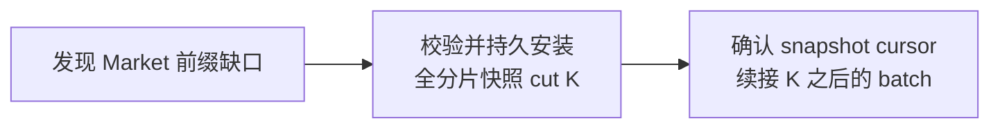

> 完成身份：[course/m14-complete](https://github.com/lcha-reln/cex-matching/tree/course/m14-complete)，完整提交 `56c4ec09ddf9fcf57f1cce763ae8b451ba7f394f`。本文结论绑定 clean 完成树重新执行的 M14 资格；[公开 manifest](https://lcha-reln.github.io/signal-grid-blog/practice/high-availability-cex/m14/evidence/manifest.json) 的 SHA-256 为 `7eb56335954e03a6792b8f9971b922e3bd45bf5dcbd60e47f1e5cedde3fb2081`。

消费者上次保存的位置是 20，服务端最早只剩下 25。给消费者一份最新盘口，它就能接着工作了吗？如果消费者维护的是当前买卖盘，答案可能是可以；如果它需要逐条处理已经发生的成交和订单终态，答案就是不可以。先写下这个差别，再看下面的恢复协议。

**快照能够替换某种状态，并不意味着它能够替换产生状态的全部业务历史。** M14 把这条界限写进了两条独立输出流：Execution 保存带归属的业务事实，Market 提供公共成交和盘口变化。二者都有自己的序号与消费者位置，但缺口的含义不同。

本文接续同一次 apply 形成 outbox 的实现。讨论范围是 Q1 保留窗口内的续接，以及丢失 Market 增量后的全分片状态重建；历史成交归档、柜台结算和跨 shard 原子视图都没有因此出现。

## 位置必须先说明属于哪一条历史

单独的 `sequence=21` 不是一个完整恢复位置。M14 的流身份由 `genesisId`、`shardId` 和 `kind` 组成。genesis 绑定导入状态及输出起点，shard 划定排序域，kind 区分 Execution 与 Market。完整 batch 身份还要加上序号和 `contentHash`。

因此同一 shard 的 Execution 21 与 Market 21 不能互相替代；两个 shard 各自的 Market 21 也没有共同原子时刻。publisher 切换时，epoch 变化的是发送权限，不能把已经发生的 batch 改成另一条业务事实。

每个成功准入的新业务命令都有一个 Execution batch；Market 只有在产生公共成交或公开盘口、规则、模式变化时才前进。一次缺失订单的 Cancel 可能产生 Execution 拒绝事实，却没有 Market 变化。由此可以推导：Market 的 tip 不能拿来当 Execution 已消费的位置。

两个序号域还都覆盖整个 shard。BTC 与 ETH 同属 shard 1 时，消费者应先连续接收该 shard 的流，再按 instrument 分发。如果只接收 BTC 的 batch，却把看到的最大序号当成全流 ACK，就会把中间 ETH 的事实一并确认掉。

## 读取返回完整 batch，读取本身不确认消费

纯读取入口使用一个完整的不可变 applied view：

```java
M14OutputReadResponse page = M14OutputReader.read(
    view,
    new M14OutputRead(
        stream,
        consumerId,
        currentGrant,
        afterSequence,
        4,
        262144));
```

这里的 `view` 是 service 在一次完整 apply 或 restore 后发布的引用。外部适配器只取一次引用再读取，不能分别读取旧的 grant、新的 outbox 和另一时刻的 snapshot。读请求也不直接访问可变订单簿。

`floor` 是当前最早保留的 batch 序号，`tip` 是已经生成的最高序号。消费者提供 `afterSequence`，含义是请求它之后的连续前缀。读取不会增加业务序号、移动 durable ACK 或清理 Execution；网络收到了数据仍可能在落盘前崩溃。

Q1 每页最多 4 个 batch、262144 bytes，但每个 batch 都必须完整。如果下一个 batch 是 10000 bytes，而调用者只给出 9000 bytes，服务端返回 `BATCH_EXCEEDS_READ_BUDGET`。它既不能拆出半个业务 batch 当作成功页面，也不能跳过去返回后面的较小 batch。应用层分片属于传输协议，不能改变业务 batch 的完整性。

## 同样的缺口，两个流返回不同结论

设 `floor=25`、`tip=40`。消费者从 24 之后读取，可以得到仍在窗口内的 25；从 20 之后读取，21—24 已经不存在。判断的是 `afterSequence < floor - 1`，不是简单比较 cursor 是否小于 floor。

| 读取关系 | Execution | Market |
| --- | --- | --- |
| after 等于 tip | 正常空页面 | 正常空页面 |
| after 大于 tip | 拒绝未来 cursor | 拒绝未来 cursor |
| 所需前缀仍在窗口 | 返回连续完整 batch | 返回连续完整 batch |
| 所需前缀已经丢失 | `EXECUTION_GAP_UNRECOVERABLE` | `MARKET_SNAPSHOT_REQUIRED` |

Execution 的缺口不能用“现在没有挂单”来修复。订单可能成交完，也可能被取消；两种历史都能留下同一份空盘口，却对应不同业务事实。直接跳到 tip 会把这个不可辨认的问题隐藏掉。

Market 的目标中有一部分是维护当前盘口。全量盘口可以恢复这部分状态，但仍不能补回缺失区间中的逐笔 Trade。`MARKET_SNAPSHOT_REQUIRED` 因而提供的是状态重建入口，不是历史补齐成功的声明。对逐笔成交有完整性要求的下游，需要另外具备归档或回放来源。

## 全分片 snapshot cut 才能与全分片增量对齐

Market snapshot 保存该 shard 的全部 book、各自模式和 active rule，以及按 side、price 排序的聚合剩余数量。它绑定 profile，并给出一个共同 cut。它不包含账户、订单身份或 producer 信息。

不能分别取得 BTC 在 cut 30 的快照和 ETH 在 cut 34 的快照，再把整个 shard 的 cursor 写成 34。这样 BTC 的 31—34 就可能既不在其快照里，也不会再被增量读取。全分片快照让所有 book 在同一个流位置交接：



安装 snapshot cursor 是一条独立复制控制命令。它必须携带当前 grant、指定 consumer、cut 和 snapshot digest；运行时要求 cut 与摘要仍等于当前权威快照。假如获取快照后又发生新 Market apply，安装旧 cut 可能得到 `SNAPSHOT_CUT_CHANGED`，消费者应重新获取一致图像，而不是调整 cut 数字来绕过检查。

Execution 不允许使用这个控制。两条流虽然复用了部分编码和控制结构，但恢复能力仍由 kind 明确约束。

## 分片传输不能让部分图像变成已消费状态

Q1 的应用传输帧最多 4096 bytes，完整业务 batch 可以达到 65536 bytes，Market snapshot 上限是 1048576 bytes。因此“大于一个帧”是正常情况，不能要求所有业务对象塞进一次网络读取。

重组器把多帧还原成一个完整对象之后，先核对总长、分片位置和全 payload hash，再校验业务对象的规范编码及摘要。传输 hash 覆盖包括摘要尾部在内的整个对象；业务 `contentHash` 则是对摘要尾部之前的规范 bytes 求值。两者含义不同，ACK 引用的是业务摘要。

只收到前半份 snapshot 时，消费者不能更新 book，也不能移动 cursor。后半段丢失时，失败的是这次运输尝试；重试仍围绕同一个稳定对象。snapshot 使用独立的受限图像空间，不占用普通 batch 发布队列，避免“为了恢复行情而填满回报队列”的资源相互影响。

## 先验证恢复语义，再观察真实运输故障

本地 `M14ShardRuntimeTest.marketGapUsesWholeShardSnapshotAndIndependentCursor` 验证两条流独立、Market 保留窗口缺口、全分片图像与 snapshot cursor。可以先运行这个已有入口：

```bash
./gradlew :matching-cluster-runtime:test \
  --tests '*M14ShardRuntimeTest.marketGapUsesWholeShardSnapshotAndIndependentCursor' \
  --no-daemon --max-workers=1
```

当前固定 L07/L08 分别完成 Execution replay/gap 与 Market snapshot/suffix 检查，L12 的编码与工作预算检查也已通过。生产读取逻辑位于 [M14OutputReader.java](https://github.com/lcha-reln/cex-matching/blob/course/m14-complete/matching-cluster-runtime/src/main/java/io/github/lchareln/cex/matching/cluster/M14OutputReader.java)。独立接收模型位于 [M14PublicReplica.java](https://github.com/lcha-reln/cex-matching/blob/course/m14-complete/matching-testkit/src/main/java/io/github/lchareln/cex/matching/testkit/M14PublicReplica.java)：它安装整份公共图像，再依序应用绝对数量增量，并把最终状态与线性参考模型比较。

独立练习是把 runtime snapshot 内 Market 图像的 cut 改大 1，重新计算内外摘要，再交给 `DirectM14ShardRuntime.restore`：恢复仍应被语义校验拒绝。单独公共 snapshot 解码只检查结构与规范表示，不能证明图像属于那个业务位置；完整 runtime 恢复还必须将它与原始操作前缀核对。

真实 C07 已通过不同的运输义务：先通过实际 apply 产生大于 4096 bytes 的 Execution batch 和全分片 Market snapshot，观察多个应用片段，验证重组后的 bytes 与源对象一致，并在部分消息处确认 cursor 未推进。它还覆盖 Market 缺口后的图像安装与增量后缀；本地数组切片测试不能替代这些进程观测。

完整复验运行 `./gradlew m14Check`，然后对应检查 `build/reports/m14/fixed.json` 中的 L07/L08/L12，以及 `m14-cluster-faults.json` 中的 C07。报告关联原始 gzip 文件，因而可以回到实际页面、图像和帧字节，而不只读到一个 PASS。上述结果由页首 `course/m14-complete`、完整提交和 manifest 固定，子报告及其原始 gzip 均可按摘要复核。

恢复协议最终依赖三个配合的条件：完整流身份防止串流，完整 batch 防止半次业务事实被确认，全分片 cut 让快照与增量在同一位置交接。下一篇将把“可以读取到哪里”与“接收方已经持久化到哪里”分开，并处理旧 publisher 仍然存活的情况。
