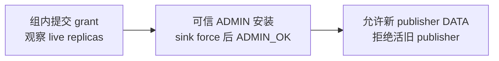

> 完成身份：[course/m14-complete](https://github.com/lcha-reln/cex-matching/tree/course/m14-complete)，完整提交 `56c4ec09ddf9fcf57f1cce763ae8b451ba7f394f`。本文结论绑定 clean 完成树重新执行的 M14 资格；[公开 manifest](https://lcha-reln.github.io/signal-grid-blog/practice/high-availability-cex/m14/evidence/manifest.json) 的 SHA-256 为 `7eb56335954e03a6792b8f9971b922e3bd45bf5dcbd60e47f1e5cedde3fb2081`。

sink 已经把 batch 8 写入磁盘，并返回了 ACK；publisher 随后崩溃。新 publisher 应该从 8 还是 9 开始？这个问题缺少一条关键事实：撮合组有没有提交消费者的确认位置。先分别预测“ACK 在途中丢失”与“publisher 收到 ACK、尚未提交控制命令就退出”两种情况。

**可续接消费允许重复运输，并用稳定事实身份与持久化接收状态判定重复。** M14 不把一次网络 ACK 解释成跨进程事务。撮合组生成事实、sink 持久接收、撮合组确认清理，是三个可以分别失败的边界。

同样，Leader 变化也不能自动撤销一个仍然存活的外部 publisher。本文把消费 cursor 与发布 authority 放在同一条恢复路径里解释，使用独立 JVM 的协议测试 sink；余额、订单资金冻结和实际结算不在这个消费者中实现。

## sink 必须先留下可恢复事实，再发出 ACK

sink 收到完整对象后，先检查 stream 身份、当前可信 grant、序号和内容。新的 Execution batch 必须正好接在已保存的 frontier 后面；未来序号不能跳过前缀，同序号但不同内容也不能被解释成重传。

接收日志的一条事务包含完整 payload、旧位置、新位置、当前 grant 和记录摘要。实现使用固定 512-byte header、规范 payload、32-byte record hash 与 8-byte commit marker；完整记录写入并 `force` 后，才安装可返回的持久化 receipt。内存里的最大已见序号不承担这条证明。

这条顺序允许一个安全的不确定窗口：force 成功后、ACK 发出前进程退出。重启会扫描日志，恢复已经接收的 batch 8；publisher 再发同一份 8 时，sink 可判断它是重复，而不是再次应用一份新事实。

如果写入或 `force` 抛出 I/O 异常，当前 journal 实例会停止返回持久化确认，包括旧 batch 的精确重试。它不能在可能只写了一半的记录后继续追加并发送 ACK；重新打开日志、完成恢复后，才能继续接收。

恢复时也不能把所有损坏都当作“上次没写完”。只有末尾不完整事务允许作为 torn tail 丢弃；已经完整的错误记录或中间损坏必须失败关闭。否则某个本来已经 ACK 的事实可能在恢复时被悄悄删掉。

## 接收方 frontier 与撮合组 ACK cursor 可以暂时不同

sink 的持久 frontier 说明接收端承诺了什么。撮合组保存的 ACK cursor 说明它已经看到哪份可信确认，并允许释放哪段 Execution outbox。两者在正常处理中可能短暂相差一个或多个 batch。

| 进程退出位置 | 已经成立的事实 | 恢复动作 |
| --- | --- | --- |
| sink force 之前 | 不能确认持久接收 | 重新投递同一 batch |
| sink force 之后、ACK 到达之前 | sink 已接收，publisher 不确定 | 重启 sink，重复验收原 bytes |
| publisher 收到 ACK、提交 Cluster 控制之前 | sink 已接收，组内 cursor 未前进 | 读取持久 frontier，补交组内确认，再续读 |
| Cluster ACK 控制提交之后 | 组内已确认相应前缀 | 从当前 cursor 之后继续 |

第三行的注入点必须说清楚：C03 在 publisher 收到 durable ACK、**尚未调用 Cluster ACK 提交**时杀进程。它不证明一个已经 offer 但尚未 committed 的控制请求会怎样。后一种窗口属于另一种实验设计，不能用相似日志冒充。

恢复不能依赖下一笔订单。假设 sink 的 frontier 已经是 8，撮合组只确认到 7，而 batch 9 尚未出现，新 publisher 仍须把可信的 durable receipt 补交给撮合组。只从 8 之后读取、遇到空页就结束，会让 batch 8 永远留在 outbox；C03 特意在没有新业务后缀时检查它被正确回收。

即使第三行触发了重复投递，batch 的 genesis、shard、kind、sequence 和 contentHash 也不会变化。重复的是一次发送尝试，不是新成交。

## 累计确认可以跳过 ACK 数字，不能跳过接收事实

复制控制通过独立 `controlId` 与 `expectedControlRevision` 排序和去重，正常 ACK 不消耗业务 shard sequence、book application sequence 或输出序号。例如：

```java
M14ControlRequest request = new M14ControlRequest(
    controlId,
    view.controlRevision(),
    stream,
    new M14ControlOperation.Acknowledge(
        consumerId,
        currentGrant.publisherId(),
        currentGrant.epoch(),
        receivedSequence,
        receivedBatchDigest));
```

累计 ACK 从 0 直接到 2 可以合法，前提是生成的 batch 1、2 连续存在，并且实际消费者已经先持久接收它们。运行时校验当前 consumer、grant、位置与目标 batch 摘要，不能远程证明一个任意调用者真的执行过 `fsync`。真实 sink 和故障证据承担后一部分承诺。

future cursor、错误摘要、另一条流、旧 grant 和 cursor 回退都应拒绝，而且拒绝后不能移动 cursor 或清理 outbox。精确控制重试则返回原响应，不重复修改状态。精确成功控制重试返回保存的原 `APPLIED` 响应，不能靠要求重试改成另一个状态名称来判断幂等；应比较它的完整承诺和前后状态。

ACK 与 grant 不占 Execution pending quota。否则 outbox 已满时，唯一能够释放它的 ACK 自己也会被满队列挡住，形成协议死锁。业务与控制的序号和容量分离，是排空恢复能成立的条件。

它们仍受独立的成功操作历史上限约束。M14 最多保留 2,000,000 条成功业务／控制操作，达到这个 guard 后，新的 ACK 也会返回 `HISTORY_LIMIT`；满 outbox 可排空的保证以历史 guard 尚有余量为条件，不能解释成无限运行能力。

## 新 grant 提交不等于远端已经拒绝旧 publisher

设旧 publisher P1 的 epoch 为 3，新 publisher P2 获得 epoch 4。撮合组提交 grant 后，远端 sink 仍可能只知道 epoch 3。此时宣称“旧 publisher 已经失效”会遗漏一个真实网络边界。

M14 的接管流程先提交新 grant，观察它在所有仍然存活的副本上可见，再通过控制器独占的子进程 stdin ADMIN 通道安装同一份身份与提交 receipt。sink 持久化这份 authority 后返回 `ADMIN_OK`，新 publisher 才开始发送 DATA。



**本单元的外部 fence 从 durable ADMIN_OK 开始。** 它不从 Leader 死亡、选举完成或 Cluster grant commit 自动开始。接管期间仍需可信控制器协调，这一窗口没有跨系统原子性。

更高的 epoch 放在 DATA 包里也不能自我授权。否则任何发送者都可以通过递增数字抢占发布权。sink 的 authority 只由可信 ADMIN 安装；receipt hash 绑定观测内容，但不是数字签名，继承的本机管道也不是生产 IAM 或 TLS。

## 旧发送者必须真的存活并尝试，才能证明 fence

只有“新 publisher 成功发送”还没有验证旧发送者被拒绝。C04 要保留旧 publisher 进程及其缓存的旧 DATA，在新 authority 已持久安装后实际发送，并检查 sink 拒绝。

旧 authority 检查还必须发生在重复判断之前。假如旧 P1 发送的恰好是已接收 batch 8，先走“内容相同所以是重复”的分支，可能让已经撤销的权限继续拿到成功响应。幂等与授权是不同问题：识别重复不能恢复失效的发送权。

控制端同样要区分精确重试与新的旧权操作。已经提交的旧 controlId 精确重试可以返回原承诺；用新 controlId 携带旧 publisher/epoch 发 ACK，则必须拒绝，且 cursor 与保留集合不变。C04 同时观察迟到 DATA 和这条新的 stale ACK，避免只覆盖其中一条路径。

本地 L09 已通过，语义反例 `M14-STALE-PUBLISHER-ACCEPTED` 也在正常实现对照通过后，被实际旧 grant 的 DATA 接受行为触发的业务差异杀死。C02/C03/C04 的独立 sink/publisher 进程资格均已通过，分别承担 durable-before-ACK、ACK-before-submit 与 live stale sender 的时序证据。异常、超时或进程没启动都不算成功杀死语义反例。

接收日志与授权判断分别位于 [M14SinkJournal.java](https://github.com/lcha-reln/cex-matching/blob/course/m14-complete/matching-cluster-runtime/src/main/java/io/github/lchareln/cex/matching/cluster/M14SinkJournal.java) 和同目录的 `M14SinkAdmission.java`。先用下面两个定点测试检查日志恢复边界，尤其观察 I/O 失败后旧 receipt 是否也停止返回：

```bash
./gradlew :matching-cluster-runtime:test \
  --tests '*M14TransportBoundaryTest.journalRepairsOnlyAnIncompleteTailAndRejectsInflatedCompleteOrMiddleLengths' \
  --tests '*M14TransportBoundaryTest.journalAppendIoFailureBlocksEvenOldReceiptsUntilRecovery' \
  --no-daemon --max-workers=1
```

真实窗口由 [M14ClusterFaultSuite.java](https://github.com/lcha-reln/cex-matching/blob/course/m14-complete/matching-testkit/src/main/java/io/github/lchareln/cex/matching/testkit/M14ClusterFaultSuite.java) 打开，完整入口是 `./gradlew m14Check`。复验 C03 时要找无新业务时的 frontier 补交与 outbox 回收；复验 C04 时要找 `ADMIN_OK` 之后旧 PID 的真实 DATA 和新 controlId 的 stale ACK，不能只凭新 publisher 成功发送作结论。正式复验使用页首 `course/m14-complete` 对应的完整提交，并沿同一 manifest 检查这三个真实窗口的原始证据。

## 重试闭环成立后，剩下的问题是积压能容纳多久

读到某个 batch、sink force 成功、撮合组提交 ACK，三个事实需要各自的观测。稳定身份与 durable frontier 让重复运输可判定，独立控制通道让消费确认可重试，ADMIN_OK 则给远端 fence 一个具体生效时刻。

它们仍未回答消费者离线一小时是否安全。Execution 保留有数量与字节上限，Market 使用有限环形历史。下一篇把这两种资源边界与故障恢复证据放在一起，检查积压到达上限后哪些请求应当停止、哪些控制必须仍能继续。
