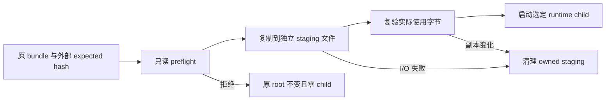

> 完成身份：[course/m15.1-complete](https://github.com/lcha-reln/cex-matching/tree/course/m15.1-complete) 与 [matching-1.0.1](https://github.com/lcha-reln/cex-matching/tree/matching-1.0.1) 同指干净提交 `73cbc6524bb14adeb5639f97cb4dc1358f893961`。本文结论来自该身份重新执行的累计资格；[公开 manifest](https://lcha-reln.github.io/signal-grid-blog/practice/high-availability-cex/m15/evidence/manifest.json) 的 SHA-256 为 `42e1c2d65bd8e11eb8f47a89c4ca01ad92e50b3bbb6821cd5c1b3e1ab40f8aab`。

运维目录里有两个都叫 `matching-core-0.8.0.jar` 的文件。它们大小相同，启动后也都能撮合一笔订单。现在选择其中一个，去读取另一个版本刚写下的快照与日志，凭什么判断这次切换受支持？

文件名说明不了实际字节，能启动也说明不了恢复兼容。**M15 先把“正在运行哪个版本”变成可复验的制品身份，再讨论这个制品能读取什么数据。** 本单元保持 M14 的业务、状态与输出语义，新增外部 operations 应用和运行资格；它不通过修改撮合规则制造一个版本差异。

## 发布身份必须覆盖整个运行组合

只计算核心 jar 的 hash，会漏掉改变解析、传输或启动行为的依赖。只列出所有 jar 又不够：Java classpath 有顺序，同名 class 的加载来源可能因此改变。M15 的 bundle manifest 同时绑定源码身份、每个文件的路径、长度、SHA-256、完整有序 classpath 和角色入口。

这里的 N−1 有确切含义：它是 M14 完成点 `56c4ec09ddf9fcf57f1cce763ae8b451ba7f394f` 对应的原始 11 个 jar，共 6,350,332 bytes。验收逐项比较位置、顺序、长度与 hash；“恰好 11 个文件”只是一条数量约束。jar 名称里的 `0.8.0` 也不能把这套 M14 制品重新解释成 M12 发布过的 `matching-0.8.0` 产品。

N 则来自当前干净源码生成的 `matching-operations` 安装包。它应包含真实可执行的 `bin/matching-operations` 与 [M15OperationsMain](https://github.com/lcha-reln/cex-matching/blob/course/m15.1-complete/matching-operations/src/main/java/io/github/lchareln/cex/matching/operations/M15OperationsMain.java)，并绑定最终构建得到的原始文件。四个既有 production tree 与 M14 完成点保持相同字节：`matching-core`、`matching-local-runtime`、`matching-cluster-runtime`、`matching-reference`。新产品组合增加操作能力，业务组件不必为此改写。

从这些条件可以预测一个负例：把任一 jar 改一个字节，即使文件名和长度不变，也应在启动业务角色前被拒绝。若修改者又重算了包内 manifest，外部提供的原 manifest hash 仍应阻止它获得受信任身份。

## manifest 的信任锚不能由待验包自己提供

manifest 里的文件 hash 能发现内容变化，却不能单独证明“这就是操作者选择的那一包”。一个被完整替换的目录，可以同时带着自洽的新 manifest。M15 因此要求 `--expected-sha256` 从已批准的发布记录单独传入。

验证顺序随之确定：先比较 manifest 的原始 hash，再检查 canonical JSON、Schema、路径与 inventory，随后校验每个原始文件，最后核对支持的角色和组件组合。canonical JSON 固定键顺序、紧凑编码与末尾 LF；拒绝重复或未知字段。比较的是实际收到的 bytes，不能先解析再重写一份“等价 JSON”来掩盖原输入差异。

下面是命令形状；变量必须先由操作者从本次批准的制品记录赋值，包路径为绝对路径：

```bash
"$m15_bundle/bin/matching-operations" verify-bundle \
  --bundle "$m15_bundle" \
  --expected-sha256 "$m15_bundle_manifest_sha256"
```

`verify-bundle` 是只读操作。它不创建 runtime root、锁文件或 journal，也不启动角色。成功应返回结构化 `VERIFIED / OK` 与 exit 0；原 bytes 不符合合同则返回明确的 `REJECTED` code。磁盘读取失败仍是 `SYSTEM_ERROR / IO_FAILURE`，不能为了让负例通过而当作“正确拒绝了坏格式”。

## 验过一次，还要保证实际使用的是那些字节

预检和使用之间存在时间间隔。预检刚读完一个文件，另一个进程就可能改写它；硬链接也可能让两个看似独立的目录共享同一 inode。直接用原目录启动，无法把刚才的验证结果延伸到稍后的 class 加载。

M15 的角色入口先完成只读 preflight，再把选定 bundle 和独立 observer 复制到自己拥有的隔离目录。复制使用新的 regular file，不保留源硬链接关系。实际使用前重新核对隔离副本的 inventory、manifest 和文件 hash，子进程只使用这一份完整有序 classpath。



这条顺序产生两种不同预测。源硬链接在隔离复制完成后被改写，已经复制的副本应保持原字节；实际 staged jar 被改写，启动前复验应拒绝它。两者不能都用“我触发过一个异常”来验收：前者需要真实子进程加载原副本并正常退出，后者需要保留改坏的 staged bytes 和零 child 的证据。

B05 的成功探针还要遵守启动顺序：控制端持有 stdin，读到完整 READY，并核对 runId、launchId、实际 PID 与 startInstant 后，才发送 EOF。缺失、半行或其他进程的 READY 均不能放行。随后仍需真实正常关闭与 exit 0；立即 EOF 导致的组件失败继续算 SYSTEM_ERROR。

等待器只用于这个 B05 成功探针：R06 前一步 restore 成功，并不意味着后一步故意制造的启动失败也应等待 READY；否则等待器自身的输入异常会掩盖实际组件失败分类。

## 观察器只能证明生命周期，不能替旧版本补业务

旧版本是否完成资源关闭，也需要真实证据。M15 使用一个单独绑定路径和 hash 的 lifecycle observer jar，调用选定版本的 `M14ClusterMember` 公共 API，或选定 publisher、sink 的原始 main。它记录实际 PID、startInstant、关键类的 code source、启动和关闭回执。

这个 observer 只允许自己的主类、嵌套类与受限 manifest。它不能包含当前业务类、Aeron/Jackson 替身或额外 provider。N−1 的 11 个 runtime jar 在 classpath 前面，observer 在后面；旧进程也不能继承宿主的 `CLASSPATH`、`JAVA_TOOL_OPTIONS` 等变量，把当前 class 偷带进去。

因此，父 CLI 启动成功只证明一个 TOOL 进程存在。真正的角色启动记录必须指向 runtime child，并将实际加载来源与选定 bundle 对上。正常停止还要看到组件 close 返回、没有 component error、进程 exit 0 且没有强制终止；某个 shutdown hook 曾经执行过，并不满足这个条件。

## 兼容矩阵需要写出数据来自哪一边

版本号相等不是恢复实验，N 能读旧数据也不能推出旧版本能读 N 的新增数据。M15 把这两个方向分开，并要求同一套原始制品真实执行：

| 读者与数据                     | 本单元要求检查什么                         | 不能据此推断什么               |
| ------------------------------ | ------------------------------------------ | ------------------------------ |
| N 读取 N−1 停机后的当前数据    | 完整状态、身份、原响应、输出与 cursor 相同 | 任意历史版本都兼容             |
| 原 N−1 读取 N 已写入的当前数据 | N 的新成交、snapshot 及其日志后缀仍在      | 恢复旧备份也算保留新增成交     |
| N 从完整冷备恢复到新根         | 原根不可用仍能恢复所命名的 cut             | 跨主机、改端口或断电恢复已通过 |

M15 保持 `appVersion=0x040000` 和 M14 wire/state 语义，这解释了为什么当前方向可以成为验收目标。结论仍须由实际制品、实际数据和实际加载来源共同支持，不能用“没有设计迁移”替代恢复验证。

验收合同本身也要有明确身份。[mark 终止判据勘误 1](https://github.com/lcha-reln/cex-matching/blob/course/m15-errata-1/docs/operations/m15-mark-termination-errata-1.md) 单独冻结在 `course/m15-errata-1`，完整提交为 `808ffb8bf016007187a7f0918cb3877813209b26`。它根据原 Aeron 制品与真实 header 修正正常终止时 `activityTimestamp=-1` 的解释；原起点的 31 个冻结文件、RED 和 N−1 jar 均保持不变。最终完成门禁要同时核对原合同与勘误的 inventory，不能把勘误起点或其 CI 通过当作 M15 运行资格通过。

`matching-1.0.0` 的同提交候选 CI 和本地导出曾通过，随后三次发布 CI 分别在继承重启、B05 启停和容量目录采样中失败，网站没有发布这一版。[发布修订契约](https://github.com/lcha-reln/cex-matching/blob/course/m15-errata-2/docs/operations/m15-publication-revision-1.md)单独冻结在 `course/m15-errata-2`，提交为 `02e083a31953aa983d893af2222f4fde1197ea96`。修订只调整资格工具，五个生产模块的源码树保持不变。原失败标签和 SYSTEM_ERROR 分类保留；本次 manifest 中的精选失败原件用于解释修订，不是旧运行的完整归档或本次通过结果。

## 从原 bytes 检查这份身份承诺

完成源码的实现入口位于 `matching-operations/src/main/java/io/github/lchareln/cex/matching/operations/`：[M15BundleVerifier](https://github.com/lcha-reln/cex-matching/blob/course/m15.1-complete/matching-operations/src/main/java/io/github/lchareln/cex/matching/operations/M15BundleVerifier.java) 负责原包验证，[M15BundleStager](https://github.com/lcha-reln/cex-matching/blob/course/m15.1-complete/matching-operations/src/main/java/io/github/lchareln/cex/matching/operations/M15BundleStager.java) 负责隔离复制和复验，[M15RoleLauncher](https://github.com/lcha-reln/cex-matching/blob/course/m15.1-complete/matching-operations/src/main/java/io/github/lchareln/cex/matching/operations/M15RoleLauncher.java) 负责显式 classpath 与真实角色生命周期。冻结依据见 [bundle 与备份协议](https://github.com/lcha-reln/cex-matching/blob/course/m15-start/docs/specs/m15-bundle-backup-protocol.md)。下列实现链接固定到页首完成身份；原起点继续保留合同与预期 RED。

对应的 [M15OperationsNegativeSuite](https://github.com/lcha-reln/cex-matching/blob/course/m15.1-complete/matching-testkit/src/main/java/io/github/lchareln/cex/matching/testkit/M15OperationsNegativeSuite.java) 在 B01–B06 中实际修改输入，保存 before/after inventory、原始坏 bytes、CLI 输出以及生产入口的 `CHILD_STARTED` 回执。[M15OperationsNegativeSuiteTest](https://github.com/lcha-reln/cex-matching/blob/course/m15.1-complete/matching-testkit/src/test/java/io/github/lchareln/cex/matching/testkit/M15OperationsNegativeSuiteTest.java) 直接检查同长度 jar 变更、独立 manifest 信任锚和真实 staging channel 关闭。这里保留的是可还原原内容的 raw evidence；gzip 分块、重复内容引用必须闭合到原 bytes，只有 hash 的目录清单不足以重放负例。

完成候选的本地复验入口是 `./gradlew m15Check --no-daemon --max-workers=1`。本次 B 系列结果与原件由[负向报告](https://lcha-reln.github.io/signal-grid-blog/practice/high-availability-cex/m15/evidence/reports/check/operations-negatives.json)及页首 manifest 绑定。只有包身份、实际加载与对应的读写方向都能复验，下一篇的“回滚保留成交”才有确定的读者和数据对象。
