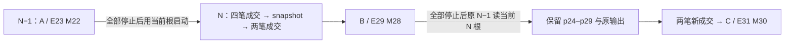

> 完成身份：[course/m15.1-complete](https://github.com/lcha-reln/cex-matching/tree/course/m15.1-complete) 与 [matching-1.0.1](https://github.com/lcha-reln/cex-matching/tree/matching-1.0.1) 同指干净提交 `73cbc6524bb14adeb5639f97cb4dc1358f893961`。本文结论来自该身份重新执行的累计资格；[公开 manifest](https://lcha-reln.github.io/signal-grid-blog/practice/high-availability-cex/m15/evidence/manifest.json) 的 SHA-256 为 `42e1c2d65bd8e11eb8f47a89c4ca01ad92e50b3bbb6821cd5c1b3e1ab40f8aab`。

新版本已经撮合了六笔交易，随后需要退回旧版本。若直接恢复升级前的备份，订单簿可能重新出现已经成交的挂单，客户端也可能再次提交那些“丢失”的请求。页面恢复服务，并不表示新增成交被保留。

**M15 的回滚让原 M14 制品打开 N 刚刚使用的当前数据目录，完整保留 N 写下的业务、控制和输出后缀。** 升级前的冷备保留另一份明确的旧切点，下一篇才讨论它的恢复。这里限定同一主机、同一端口和身份、所有角色停止后切换，业务与持久格式沿用 M14。

## 切换前先证明所有写者确实停止

拓扑含两个独立的三投票成员组、两个 publisher JVM 和一个 durable sink JVM。只停止六个成员并不够：publisher 仍可能发送旧数据，sink 仍可能写 journal。只观察父启动脚本退出也不够：它的 runtime child 可能还活着。

控制端分别记录九个角色的 runId、launchId、实际 PID 与 startInstant。正常停止由输入 EOF 驱动。观察器必须等实际组件 close 返回、确认没有 component error，再输出 `CLOSE_COMPLETED`；控制端还要取得 exit 0 与 no-force 证据。每个角色有 30 秒正常停止界限，整个全停服屏障为 90 秒。超时后可以清理自己拥有的进程，但该次正常停机资格已经失败。

文件层面仍需独立观察。六个成员各有 archive、consensus、service0 三个 mark，总计 18 个。实际原制品检查纠正了最初对 close 的理解：Aeron 1.52.2 的上层终止路径会调用 `signalTerminated()`，把 activity timestamp 写成 `-1` 并 force；只看 mark 对象的 `close()` 会漏掉这个调用。原开发运行仍保留失败分类，修正依据另行冻结为 [mark 终止判据勘误 1](https://github.com/lcha-reln/cex-matching/blob/course/m15-errata-1/docs/operations/m15-mark-termination-errata-1.md)，没有回写原 31 个合同文件。

修正后的 stop receipt 使用 `matching.m15.stop-receipt.v2`，每项 mark 增加 `lastLiveActivityTimestamp` 与 `inactiveReason`。live header 必须来自实际当前 PID，时间戳仍为正值；停止后的两种合法表示分别核验：

| inactiveReason        | 两次 stopped header                    | 最终 wall clock 的时间条件                                     |
| --------------------- | -------------------------------------- | -------------------------------------------------------------- |
| `EXPIRED_HEARTBEAT`   | 保留正值，且不早于已绑定的 live 时间戳 | 比 stopped 时间戳晚严格超过 10,000ms                           |
| `TERMINATED_SENTINEL` | 两次都恰好为 `-1`                      | 比已绑定的正值 `lastLiveActivityTimestamp` 晚严格超过 10,000ms |

两次完整 stopped header 的原 bytes 必须相同，控制端实际读取时间至少相隔 100ms；组件、成员与 PID 身份也必须保持一致。零、其他负值、失败启动版本或身份变化均不合法。不能拿 wall clock 减 `-1` 证明过期，也不能改写 mark 来通过检查。

等待十秒或看到 `-1` 都不能单独证明正常停止。九角色 EOF/close/exit/no-force、18 项真实读取、完整 durable tree 双 inventory 和 90 秒全停服界限继续共同约束切换。

## cut 描述整个可恢复事实，不能只存最后盘口

两份状态可以有相同盘口，却对旧 commandId 给出不同响应，或让同一成交重新生成一个输出身份。只比较订单簿摘要，会漏掉这些回滚错误。

M15 的 cut 同时绑定各成员真实状态、独立预期状态、原请求与响应身份、账户归属、Execution/Market 的 retained bytes、序号、grant、cursor 以及 sink journal/receipt。六个成员各自有真实读取证据；即使内容相同、原始 bytes 可以复用，也不能把六次读取伪装成一次读取复制六份。

这里的 `controlRevision` 来自实际控制命令记录。DRAIN、grant、ACK 等操作会改变控制状态，用一条静态公式硬算 revision，容易把资格工具本身新增的动作漏掉。业务序号与双流序号则由固定业务程序给出可反驳的预测。

## 切点 A 故意留下接收端领先的一批数据

每个 shard 先挂一张 1,000 lots 的 maker SELL，随后准备并激活价格范围 `[90,110]` 的规则，再用不同账户的 IOC BUY 逐笔成交。A 在每 shard 的第 23 个业务输入后停止。

| A 的对象     | 预期状态                                               | 要暴露的问题                       |
| ------------ | ------------------------------------------------------ | ---------------------------------- |
| 业务与输出   | business 23，Execution 23，Market 22                   | 两条流的序号不能混用               |
| 成交与剩余量 | 20 条 Trade，maker 剩余 980                            | 恢复真实非空订单簿                 |
| Execution    | 复制 ACK 15，sink 已持久接收 16，pending 16–23 共 8 批 | 接收成功而 ACK 尚未复制的重放      |
| Market       | ACK 2，retention floor 7                               | 旧 cursor 必须走完整 snapshot 恢复 |

固定程序在业务 19 后取得 snapshot，再留下四条业务日志后缀。因此“只会读 snapshot”与“真的恢复 snapshot 后缀”能被区分。旧请求 p1、p4、p23 也保留，后续通过精确重试检查原响应和原输出身份。

N 首次打开 A 数据时，先比较完整 cut，再进行新的 ADMIN 或控制操作。若先补 ACK、安装新 grant，再拿改变后的状态与 A 比较，就失去了“读取旧数据时到底恢复了什么”的观测位置。

## N 的新增成交必须越过自己的 snapshot

N 读取 A 并完成输出对账后，每 shard 再提交 p24–p27 四笔真实成交，取得 N 自己的 snapshot，再提交 p28–p29 两笔后缀成交。切点 B 预期 business 29、Execution 29、Market 28，maker 剩余 974；两条输出分别确认到 29 和 28。

这个安排把两个恢复责任分开：四笔新增成交应保存在 N snapshot 中，两笔新增成交必须从它后面的日志恢复。如果全部新业务都写在 snapshot 之前，旧版本只要读 snapshot 就可能通过；如果只在旧 snapshot 后追加业务，又没有验证 N 写出的 snapshot 是否可读。

随后再全停服，选择第一篇绑定的原始 N−1 bundle，以 `fresh-start=false` 打开这些 CURRENT N roots。不能替换成 A 的旧备份，不能混入当前业务 jar，也不能清空 archive/cluster 目录后重建一份看起来相似的簿。

## 回滚成功还要继续处理旧重试和新输入

原 N−1 恢复 B 后，先验证完整状态与输出，再精确重试 p1、p4、p23、p24、p29。旧身份应返回原语义结果与原 output identity，不能因为版本切换而再次成交或分配新的 batch。

最后每 shard 新提交 p30、p31 两笔真实成交，形成 C：business 31、Execution 31、Market 30，maker 剩余 972，输出分别确认到 31、30。新输入能够继续推进，才说明恢复后的状态还能作为合法前缀使用。

这份实验支持的方向很具体：选定的原 N−1 制品能够读取这套 N 产生的持久数据，并继续沿用 M14 业务语义。它不推出任意未来版本、滚动混版本、跨主机、任意协议迁移都安全。某次切换失败后，控制端应保留当前根与失败证据，不能通过恢复 A 把“保留新增成交”的失败改写成成功。

## 用真实制品和原始切点复验回滚

冻结操作顺序见 [M15 进程协议](https://github.com/lcha-reln/cex-matching/blob/course/m15-start/docs/specs/m15-process-protocol.md)。完成源码中，[M15BundleProcessHarness](https://github.com/lcha-reln/cex-matching/blob/course/m15.1-complete/matching-testkit/src/main/java/io/github/lchareln/cex/matching/testkit/M15BundleProcessHarness.java)、[M15RoleProcess](https://github.com/lcha-reln/cex-matching/blob/course/m15.1-complete/matching-testkit/src/main/java/io/github/lchareln/cex/matching/testkit/M15RoleProcess.java) 负责选定 bundle 的真实角色执行；[M15RoleLauncher](https://github.com/lcha-reln/cex-matching/blob/course/m15.1-complete/matching-operations/src/main/java/io/github/lchareln/cex/matching/operations/M15RoleLauncher.java) 与独立 [M15RoleObserverMain](https://github.com/lcha-reln/cex-matching/blob/course/m15.1-complete/matching-operations/src/observer/java/io/github/lchareln/cex/matching/operations/observer/M15RoleObserverMain.java) 提供实际加载、EOF 和 close 观察。实现入口链接到页首不可移动完成身份。

V/R 报告应提供 A/B/C 的实际 cut、每次选择的 bundle manifest、九个角色的生命周期和所有旧重试/新成交原响应。完整原 bytes 进入自包含的 raw gzip 分块；重复内容引用必须能还原原字节，不能只留下“digest 相等”的最终结论。备份 A 与回滚 B 的数据来源也须在报告中分别标识。

完成候选可从 `./gradlew m15Check --no-daemon --max-workers=1` 复验；本次 V/R 正向结果见[操作报告](https://lcha-reln.github.io/signal-grid-blog/practice/high-availability-cex/m15/evidence/reports/check/operations.json)，A/B/C 原切点与停止回执均由同一 manifest 绑定。判断回滚时，先问原 N−1 打开的究竟是哪份数据，再看 N 的新成交与原输出身份是否还在。下一篇从有意保存的旧切点 A 出发，检验原目录已经不可用时，冷备本身能否完成恢复。
